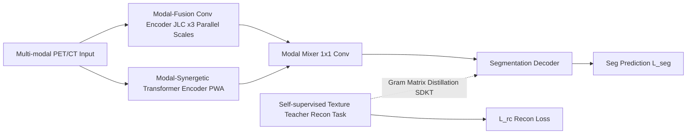

# Johnson-Lindenstrauss Lemma Guided Network for Efficient 3D Medical Segmentation

**Conference**: ICLR 2026  
**OpenReview**: [https://openreview.net/forum?id=fmWlDfCFMR](https://openreview.net/forum?id=fmWlDfCFMR)  
**Code**: [https://github.com/JinPLu/VeloxSeg](https://github.com/JinPLu/VeloxSeg)  
**Area**: Medical Image Segmentation / Lightweight Networks / multi-modal  
**Keywords**: 3D Medical Segmentation, Lightweight, Johnson-Lindenstrauss Lemma, Window Attention, Knowledge Transfer, PET/CT  

## TL;DR
VeloxSeg utilizes a trio of "Paired Window Attention + JL Lemma-constrained lightweight convolution + Gram matrix-based texture knowledge distillation" to simultaneously achieve high accuracy (Dice +26%) and efficiency (11× GPU throughput, 48× CPU, 1/20 VRAM usage) in 3D medical segmentation, resolving the "efficiency/robustness" trade-off in lightweight models.

## Background & Motivation
**Background**: 3D medical segmentation is a cornerstone of clinical workflows. Recent sequence models, from CNN-Transformers to Mamba/RWKV, have continuously improved accuracy. however, deployment in real hospital environments (limited hardware, low latency, multi-organ generalization, heterogeneous PET/CT) necessitates lightweighting, leading to models with <5M parameters.

**Limitations of Prior Work**: The authors identify the fundamental contradiction as the "**efficiency/robustness conflict**"—performance collapses on heterogeneous data and complex lesions when parameters and compute are compressed. Specifically: ① Insufficient consideration of 3D complexity. Mamba/RWKV lack efficient 3D scanning strategies; window attention relies on redundant cascading for cross-window interaction; depthwise separable convolutions "break geometric adjacency between tokens due to aggressive channel decoupling," leading to fragmented information and difficulty in distinguishing adjacent tissues. ② Insufficient data synergy. Lightweight methods often ignore complementary multi-modal information to save compute; transferring knowledge from reconstruction/super-resolution to segmentation often causes **negative transfer** due to large ROI discrepancies.

**Goal**: Systematically alleviate the efficiency/robustness conflict without sacrificing inference speed, enabling lightweight models to robustly handle heterogeneous modalities and complex lesions.

**Core Idea**: **(1) Glance-and-focus dual-stream architecture**—PWA quickly "glances" to retrieve multi-scale global clues, while JLC "focuses" on robust local feature extraction with minimal parameters; **(2) Theory-guided lightweighting**—utilizing the Johnson-Lindenstrauss Lemma to derive the "minimum channels per group" to maintain geometric adjacency, replacing expensive data-dependent pruning; **(3) Zero-inference-overhead texture distillation**—injecting detail priors from a self-supervised texture teacher into the segmentation network via Gram matrices.

## Method

### Overall Architecture
VeloxSeg adopts an encoder-decoder structure. The left side features two parallel 4-stage encoders: a **Modal-Fusion Convolutional Encoder** (centered on JLC) and a **Modal-Synergetic Transformer Encoder** (centered on PWA), with $1 \times 1$ convolutions acting as modal mixers. The right side is a segmentation decoder. During training, a self-supervised texture teacher is attached to distill texture priors via SDKT; the teacher is discarded during inference, resulting in zero overhead. separating the convolutional and attention streams avoids parameter explosion as the number of modalities increases while maximizing parallelism.

### Key Designs

**1. Paired Window Attention (PWA): Capturing multi-scale global context using logarithmic window pairs.** While self-attention can theoretically model arbitrary dependencies, it is constrained by compute/memory. PWA avoids redundant cascading by: (i) partitioning features into large windows and selecting one salient token per small window; (ii) synchronously expanding paired windows to obtain multi-modal sequences $X_{m,i}^k$ of different scales but equal length; (iii) computing cross-scale and cross-modal attention $A_m^k=\text{PWA}(E_m^k\mid E_1^k,\cdots,E_M^k)$ **in one go**; (iv) fusing multi-scale features with a lightweight mixer. The key is that global context is covered with only $\log(\text{size})$ paired windows, while the smallest window ensures local details are preserved, achieving near-linear complexity—the linear coefficient is approximately **7.87%** of Swin Transformer.

**2. JL Lemma Guided Convolution (JLC): Inverting the "isometry embedding" to determine the minimum channels per group.** Depthwise separable convolutions (1 channel per group) destroy adjacency relationships in feature space, causing tumor and normal tissue patches to overlap in low-dimensional projections ($d_1'\approx d_2'$). Invoking the Johnson-Lindenstrauss Lemma, which states that $O(\log N)$ dimensions are required for isometry embedding of $N$ high-dimensional points, the authors propose a lower bound for group channels. Given the volume ratio $v$ between input and features, and approximating the manifold coverage $N(\mathcal{M},v)$ as $\hat N(M,v)=(M\cdot v)^\alpha$, the lower bound is:

$$C_{\mathrm{group}}=d'\geq c_{\text{JL}}\,\varepsilon^{-2}\log N(\mathcal{M},v).$$

This ensures robust capture of fine-grained details by maintaining "isometry," **bypassing the need for dataset-dependent importance metrics or manual sparsity tuning in pruning.**

**3. Spatially Decoupled Knowledge Transfer (SDKT): Distilling "style" from the texture teacher to the segmentation network via Gram matrices to avoid negative transfer.** Standard upsampling suggests that the texture teacher should transfer **inter-channel relationships** rather than spatial layouts. The Gram matrix captures these relationships in a spatially invariant manner. For $X\in\mathbb{R}^{C\times HWD}$, $\mathrm{GM}(X)=\frac{1}{CHWD}XX^\top\in\mathbb{R}^{C\times C}$. By enforcing Gram consistency between the teacher and the segmentation network (mathematically equivalent to minimizing MMD with a second-order polynomial kernel), positive transfer is established regardless of ROI differences. The total loss is:

$$\mathcal{L}=(\mathcal{L}_{dice}+\mathcal{L}_{ce})+\lambda_{rc}\mathcal{L}_{rc}+\lambda_{sdkt}\sum_{m=1}^{M}\left\|\mathrm{GM}(D_T^m)-\mathrm{GM}(D_{seg})\right\|^2.$$

### Key Experimental Results

Experiments were conducted on four public datasets: AutoPET-II, Hecktor2022 (PET/CT), BraTS2021, and BraTS2016 (MRI). Comparisons included 8 baseline, 3 multi-modal, and 5 lightweight models across CNN, Transformer, KAN, Mamba, and RWKV paradigms, alongside SAM-Med3D (Zero-shot) and DINOv3 (Linear probing).

### Main Results (PET/CT Segmentation, Dice %)

| Method | Paradigm | AutoPET-II Dice ↑ | Hecktor2022 Dice ↑ |
|------|------|------|------|
| Swin UNETR (MICCAI'21) | CNN-Trans | 62.24 | 44.56 |
| VSmTrans (MIA'24) | Best Baseline | 62.46 | 52.91 |
| U-KAN (AAAI'25) | CNN-KAN | 60.67 | 55.89 |
| H-DenseFormer (MICCAI'23) | Multi-modal | 61.50 | 46.79 |
| U-RWKV (MICCAI'25) | Lightweight | 57.18 | 45.97 |
| SuperLightNet (CVPR'25) | Lightweight | 48.35 | 50.03 |
| SAM-Med3D (Zero-shot) | Foundation | 26.59 | 31.94 |
| **VeloxSeg (Ours)** | — | **62.51** | **56.48** |

- Compared to the best baseline (VSmTrans): Superior accuracy using only **13.30% parameters** and **1.96% GFLOPs**.
- Compared to lightweight models: Dice leads by **>5%** on both datasets with only 1.66 MParams.
- Memory: Training saves up to **20×** VRAM compared to standard CNNs/Transformers.
- Under nnUNet framework: Dice +14.2% while using only 1.87% of nnUNet's parameters.

### Ablation Study (AutoPET-II, Dice %)

| Config | Params(M) | FLOPs(G) | Dice |
|------|------|------|------|
| Conv Only, Width ⟨16,32,64,128⟩ | 0.73 | 2.41 | 50.10 |
| + Multi-scale kernel ⟨1,3,5⟩ | 0.66 | 2.30 | 53.65 |
| + JL Group Size ⟨4,8,8,16⟩ | 1.18 | 2.66 | 55.84 |
| + Transformer (PWA) | 1.88 | 2.90 | 61.03 |
| + Unified Upsampling | 1.66 | 1.79 | 59.71 |
| **+ Gram Supervision (Full)** | **1.66** | **1.79** | **62.51** |

### Key Findings
- **JL Group Size is not "the larger the better"**: Increasing group size from ⟨1,1,1,1⟩ to ⟨4,8,8,16⟩ improves Dice significantly, but further increasing to ⟨8,16,16,32⟩ leads to a drop (55.14). This confirms the Lemma provides a "minimum necessary" bound.
- **Gram Supervision is the final touch**: Adding the texture teacher alone (using only $\mathcal{L}_{rc}$) caused negative transfer (Dice 59.64). The Gram constraint was essential to reach 62.51, proving that transferring inter-channel relationships is key.

## Highlights & Insights
- **Theoretical Parameter Scaling**: Applying the classic "isometry embedding" conclusion from the JL Lemma to convolutional grouping provides an interpretable lower bound for channels, which is more principled than empirical pruning and dataset-independent.
- **Unified Attention for Scale and Modality**: PWA achieves near-linear complexity (7.87% of Swin) while simultaneously handling multi-modal interaction at no extra cost.
- **Negative Transfer as "Style Transfer"**: By recognizing that `Conv+PixelShuffle` expands inter-channel relationships, the authors use Gram matrices for spatially invariant distillation, bypassing ROI mismatches.
- Efficiency gains are order-of-magnitude (11×/48× throughput, 1/20 memory), truly breaking the efficiency/robustness trade-off.

## Limitations & Future Work
- The approximation $\hat N(M,v)=(M\cdot v)^\alpha$ is empirical and requires ablation on challenging datasets; no theoretical method currently estimates $N$ automatically from data.
- Validation is focused on PET/CT and MRI; generalizability to CT-only or ultrasound remains to be seen.
- SDKT requires training a self-supervised teacher, increasing the complexity of the training pipeline.

## Related Work & Insights
- **Lightweight 3D Segmentation**: While Slim UNETR and U-RWKV explore windows or sequence models, VeloxSeg highlights that these often weaken local dependencies or destroy geometric adjacency.
- **Window Attention Lineage**: PWA offers an optimal compromise between global coverage (Swin) and local preservation (Axial/Downsampled attention).
- **Knowledge Distillation**: The use of Gram matrices (from Gatys et al.) for cross-task distillation provides a generalizable strategy for "Reconstruction → Segmentation" transfer where ROIs do not match.

## Rating
- **Novelty**: ⭐⭐⭐⭐ The application of the JL Lemma to group convolution and the use of Gram matrices for spatially decoupled distillation are highly creative.
- **Experimental Thoroughness**: ⭐⭐⭐⭐ Extensive testing across four datasets and five architectural paradigms, including comprehensive ablation studies.
- **Writing Quality**: ⭐⭐⭐⭐ Clear terminology ("Efficiency/Robustness Conflict", "Glance-and-focus") and logically organized theoretical derivations.
- **Value**: ⭐⭐⭐⭐ Significant efficiency gains with improved accuracy provide direct clinical utility (CPU-capable, low VRAM).

<!-- RELATED:START -->

## Related Papers

- [\[CVPR 2026\] PGR-Net: Prior-Guided ROI Reasoning Network for Brain Tumor MRI Segmentation](../../CVPR2026/medical_imaging/pgr-net_prior-guided_roi_reasoning_network_for_brain_tumor_mri_segmentation.md)
- [\[CVPR 2026\] Virtual Nodes Guided Dynamic Graph Neural Network for Brain Tumor Segmentation with Missing Modalities](../../CVPR2026/medical_imaging/virtual_nodes_guided_dynamic_graph_neural_network_for_brain_tumor_segmentation_w.md)
- [\[AAAI 2026\] FunKAN: Functional Kolmogorov-Arnold Network for Medical Image Enhancement and Segmentation](../../AAAI2026/medical_imaging/funkan_functional_kolmogorov-arnold_network_for_medical_image_enhancement_and_se.md)
- [\[ICLR 2026\] K-Prism: A Knowledge-Guided and Prompt Integrated Universal Medical Image Segmentation Model](k-prism_a_knowledge-guided_and_prompt_integrated_universal_medical_image_segment.md)
- [\[CVPR 2026\] Learning Generalizable 3D Medical Image Representations from Mask-Guided Self-Supervision](../../CVPR2026/medical_imaging/learning_generalizable_3d_medical_image_representations_from_mask-guided_self-su.md)

<!-- RELATED:END -->
