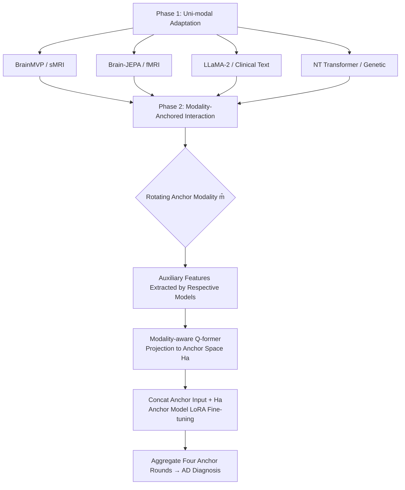

# Joint Adaptation of Uni-modal Foundation Models for Multi-modal Alzheimer's Disease Diagnosis

**Conference**: ICLR 2026  
**OpenReview**: [https://openreview.net/forum?id=gPTjQxC74G](https://openreview.net/forum?id=gPTjQxC74G)  
**Code**: To be confirmed  
**Area**: Medical Imaging / Multi-modal Alzheimer's Disease Diagnosis  
**Keywords**: Alzheimer's Disease Diagnosis, Multi-modal Fusion, Foundation Model Adaptation, Q-former, Modality-Anchored Interaction, LoRA  

## TL;DR
This paper proposes a "modality-anchored interaction" framework that combines uni-modal foundation models from four domains—sMRI, fMRI, clinical text, and genetics—for Alzheimer's disease diagnosis. By rotating each modality as an anchor and freezing most of its parameters, a modality-aware Q-former selectively projects features from auxiliary modalities into the anchor's feature space. This achieves deep cross-modal interaction without destroying the integrity of the individual pre-trained representations.

## Background & Motivation
- **Background**: Alzheimer's Disease (AD) is a complex neurodegenerative disorder. NIA-AA guidelines emphasize that diagnosis requires integrating multi-modal biomarkers: sMRI reflects brain atrophy, fMRI captures neural activity, clinical records reflect global status, and genetic data reveal hereditary risks. Simultaneously, powerful uni-modal foundation models (BrainMVP, Brain-JEPA, NT Transformer, clinical LLMs) have emerged in the neurobiological and medical fields, performing excellently in their respective domains.
- **Limitations of Prior Work**: Conventional multi-modal AD methods are mostly trained from scratch, resulting in low data efficiency and poor robustness in label-scarce medical scenarios. Combining multiple uni-modal foundation models faces a core challenge: the feature spaces of large-scale pre-trained models are heterogeneous and highly structured. **Naively aligning or merging these feature spaces destroys their integrity and weakens the original representation capabilities.**
- **Key Challenge**: There is a natural conflict between enabling sufficient interaction among foundation models to utilize complementary information and protecting the integrity of each model's pre-trained feature space.
- **Goal**: Construct a unified framework that implements effective multi-modal interaction while preserving the feature spaces of various foundation models, covering the four most common AD modalities: sMRI, fMRI, clinical text, and genetics.
- **Core Idea**: **[Asymmetric Anchoring]** Instead of equal interaction between all modalities, the framework rotates the designation of one modality and its foundation model as the "anchor," freezing its main body. Other modalities are treated as auxiliary information sources, projected into the anchor space via a specialized Q-former, and processed jointly by the anchor model. Finally, predictions from all anchor rounds are aggregated.

## Method

### Overall Architecture
The workflow consists of two phases: **Phase 1 (Uni-modal Adaptation)** uses limited labeled data from each modality to add a linear classification head and fine-tune each foundation model individually with cross-entropy, obtaining modality-specific AD diagnosis models. **Phase 2 (Modality-Anchored Interaction)** sequentially designates each uni-modal model as an anchor. A modality-aware Q-former aligns features from the three auxiliary modalities to the anchor space. These are concatenated with the anchor input and fed back into the anchor model for lightweight LoRA fine-tuning. The final diagnosis is obtained by aggregating outputs from the four anchor rounds.

### Key Designs
**1. Modality-Anchored Interaction: Using "Master-Slave Asymmetry" instead of "Equal Fusion" to preserve feature spaces.** This is the core mechanism. Given an anchor modality $\hat{m}$, the set of auxiliary modalities is $M'=\{m\in M\,|\,m\neq\hat{m}\}$. Auxiliary features are extracted using the Phase 1 models and aligned via the Q-former to obtain aggregated auxiliary representations $H_a=\text{Qformer}(\text{Concat}(\{F_m(X_m)\}_{m\in M'}))$. These are concatenated with anchor inputs and fed back into the anchor model $F_{\hat{m}}$, which is fine-tuned using cross-entropy $L_{\hat{m}}=\frac{1}{N_{\hat{m}}}\sum_i L_{CE}(F_{\hat{m}}(\text{Concat}(X_{\hat{m}}, H_a)))$. The key insight is that auxiliary features are "fed into" the anchor model rather than symmetrically merged. The anchor model processes external information within its familiar feature space, preventing the pre-trained representations from collapsing. Rotating all modalities as anchors allows each model to contribute its strengths and absorb complementary information.

**2. Input-level Interaction + LoRA Freezing: Modifying the anchor model interior minimally instead of external fusion layers.** Unlike methods like M4Survive or Late Fusion that perform symmetric late fusion at the output, this work feeds auxiliary tokens directly into the **input stage** of the anchor transformer's self-attention, achieving deeper inter-modal interaction. To interact without destruction, the anchor model only updates a tiny subset of parameters via LoRA, while the main body is frozen to preserve the pre-trained feature space. Table 5 confirms this: output-level fusions like Feature Concatenation, Linear Fusion, and Self-Attention achieve ACC scores around 0.83–0.90 on NC vs AD, whereas the proposed input-level anchored interaction reaches 0.945, highlighting the importance of the interaction level for heterogeneous foundation models.

**3. Modality-aware Q-former: Refining auxiliary features into the anchor space via "Uni-modal + Cross-modal Queries."** The Q-former models two types of information. In the **uni-modal path**, a set of learnable queries $X_{uq}$ is set for each auxiliary modality $m$. Auxiliary features are linearly projected to the anchor dimension $Z_m=\text{Linear}(F_m(X_m))$, and cross-attention $\hat{X}_m=\text{CrossAttn}(Q=X_{uq}, K=Z_m, V=Z_m)$ extracts anchor-relevant info. In the **cross-modal path**, another set of queries $X_{cq}$ performs cross-attention $\hat{X}_c=\text{CrossAttn}(Q=X_{cq},K=Z_a,V=Z_a)$ on the concatenated uni-modal outputs $Z_a=\text{Concat}(\{\hat{X}_m\})$ to capture correlations between auxiliary modalities. The final output is $H_a=\text{Concat}(\{\hat{X}_m\}_{m\in M'}, \hat{X}_c)\in\mathbb{R}^{4N_q\times C}$. Unlike Q-formers in BLIP-2/InstructBLIP that only project images into LLM text space, this Q-former is designed to project into any of the four modality spaces designated as the anchor.

## Key Experimental Results

### Main Results (ADNI, Modality-Complete Setting, ACC)

| Modality | Method | NC vs MCI | NC vs AD | sMCI vs pMCI |
|------|------|-----------|----------|--------------|
| C | LLaMA-2 (Strongest Uni-modal) | 0.793 | 0.814 | 0.721 |
| F | Brain-JEPA | 0.777 | 0.807 | 0.714 |
| S | BrainMVP | 0.724 | 0.730 | 0.703 |
| G | NT-Human | 0.694 | 0.751 | 0.652 |
| C+G+F+S | M4Survive | 0.827 | 0.804 | 0.746 |
| C+G+F+S | Late Fusion | 0.818 | 0.798 | 0.714 |
| C+G+F+S | **Ours** | **0.871** | **0.846** | **0.763** |

Improvements are more significant in modality-incomplete settings (closer to clinical reality): NC vs MCI reaches 0.979, NC vs AD reaches 0.945, and sMCI vs pMCI reaches 0.846, outperforming all uni-modal and multi-modal baselines.

### Ablation Study

| Ablation Dimension | Setting | Conclusion |
|----------|------|------|
| Fusion Method (Table 5, NC vs AD ACC) | Feature Concat 0.833 / Linear 0.899 / Self-Attn 0.901 → **Ours 0.945** | Input-level anchored interaction is significantly better than output-level fusion. |
| Foundation Model Choice (Table 6) | Swapping to SamMed3D / DNA-Bert2 / BrainLM / MedGemma | Scores are 0.4%–3.3% lower than current selection (BrainMVP/NT/Brain-JEPA/LLaMA-2), but the framework is robust to model changes. |
| Query Count | 0 (Degenerates to Late Fusion) → 16 | ACC increases with query count; cross-modal interaction is sufficient at 16 queries. |

### Key Findings
- **Cross-disease Generalization**: When trained on PPMI for Parkinson's Disease (PD) diagnosis, the model achieves NC vs PD ACC 0.967 / AUC 0.969, exceeding all baselines and proving the framework is not limited to AD.
- **Cross-dataset OOD**: Models trained on ADNI and transferred to OASIS-3 (which lacks genetic data) for NC vs AD still achieve a SOTA AUC of 0.699.
- **Complementarity**: Performance increases as modalities are added (Uni $\rightarrow$ Bi $\rightarrow$ Quad). Clinical records and fMRI provide the largest gains. Optimal performance with all four modalities confirms information complementarity and the framework's ability to facilitate interaction.

## Highlights & Insights
- **"Anchoring" is an elegant engineering solution**: It transforms the conflict between "interaction" and "protecting feature space" into an asymmetric master-slave structure. Foreign features adapt to the "home field" of the main model rather than forcing alignment of heterogeneous spaces.
- **The first foundation model framework to cover all three major AD data categories**: Genetics, neuroimaging, and clinical records. Its modality breadth exceeds previous works using only subsets.
- **Comparison of input-level vs. output-level interaction is compelling**: Table 5 quantifies the impact of the layer where interaction occurs, providing methodological value for future multi-foundation model fusion research.
- **Strong evidence chain for generalization**: SOTA results across modality complete/incomplete settings, cross-disease (PD), and cross-dataset (OASIS) scenarios demonstrate that preserving pre-trained spaces ensures robustness.

## Limitations & Future Work
- **Computational overhead of rotating anchors**: Inference requires running four foundation models (including LLaMA2-13B) per sample. The paper lacks a detailed discussion on efficiency and deployability.
- **Small sample sizes**: In the modality-complete setting, pMCI only includes 44 cases (ADNI). Progression prediction and external validation (OASIS AD 42 cases) have limited samples, questioning statistical robustness.
- **Simple aggregation strategy**: Final predictions result from aggregating outputs of the four anchor rounds. Uncertainty-aware or weighted aggregation might further improve performance.
- **Handling of missing modalities**: Detailed procedures for missing auxiliary modalities (e.g., zero-padding or skipping) require clearer explanation.

## Related Work & Insights
- **Multi-modal AD Fusion**: Early methods relied on shared representations, GCNs, or 3D network combinations of neuroimaging, later introducing clinical/cognitive scores. This work is the first to integrate genetics, neuroimaging, and clinical categories simultaneously.
- **Foundation Model Adaptation**: M4Survive uses symmetric late fusion to integrate medical foundation models, but deep cross-modal interaction is limited. This work provides an input-level anchoring solution for heterogeneous models.
- **Multi-modal Q-former**: BLIP-2 and others use query transformers to project non-text modalities into LLM space. This Q-former is more general, projecting into any designated anchor space.
- **Insight**: When combining multiple powerful pre-trained expert models, "Asymmetric Anchoring + Lightweight Adaptation (LoRA) + Selective Projection (Q-former)" is a paradigm worth transferring to other multi-modal scenarios over forced symmetric fusion.

## Rating
- **Novelty**: ⭐⭐⭐⭐ Modality-anchored interaction is a clear solution to the interaction vs. preservation dilemma, with first-time coverage of three major AD data types.
- **Experimental Thoroughness**: ⭐⭐⭐⭐ Includes two modality settings, cross-disease, cross-dataset, and multiple ablations. Deducted for small sample sizes in specific tasks and missing efficiency analysis.
- **Writing Quality**: ⭐⭐⭐⭐ Logical chain from motivation to challenge to method is clear. Formulas and diagrams are well-placed.
- **Value**: ⭐⭐⭐⭐ Provides a transferable paradigm for combining uni-modal medical foundation models with practical significance for clinical multi-modal diagnosis.

<!-- RELATED:START -->

## Related Papers

- [\[CVPR 2026\] EMAD: Evidence-Centric Grounded Multimodal Diagnosis for Alzheimer's Disease](../../CVPR2026/medical_imaging/emad_evidence-centric_grounded_multimodal_diagnosis_for_alzheimers_disease.md)
- [\[AAAI 2026\] PulseMind: A Multi-Modal Medical Model for Real-World Clinical Diagnosis](../../AAAI2026/medical_imaging/pulsemind_a_multi-modal_medical_model_for_real-world_clinical_diagnosis.md)
- [\[ICLR 2026\] Bridging Radiology and Pathology Foundation Models via Concept-Based Multimodal Co-Adaptation](bridging_radiology_and_pathology_foundation_models_via_concept-based_multimodal_.md)
- [\[ICLR 2026\] Histopathology-Genomics Multi-modal Structural Representation Learning for Data-Efficient Precision Oncology](histopathology-genomics_multi-modal_structural_representation_learning_for_data-.md)
- [\[ICLR 2026\] CARE: Towards Clinical Accountability in Multi-Modal Medical Reasoning with an Evidence-Grounded Agentic Framework](care_towards_clinical_accountability_in_multi-modal_medical_reasoning_with_an_ev.md)

<!-- RELATED:END -->
