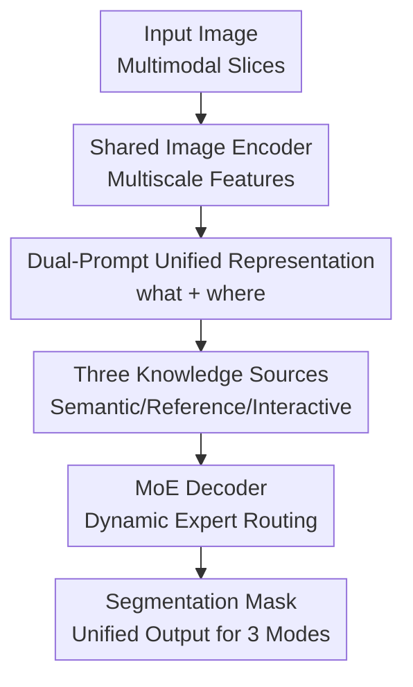

# K-Prism: A Knowledge-Guided and Prompt Integrated Universal Medical Image Segmentation Model

**Conference**: ICLR2026  
**OpenReview**: [https://openreview.net/forum?id=gvRf95K4im](https://openreview.net/forum?id=gvRf95K4im)  
**Code**: https://github.com/bangwayne/K-Prism  
**Area**: Medical Image  
**Keywords**: Medical image segmentation, Universal segmentation, In-context learning, Interactive segmentation, Mixture-of-Experts

## TL;DR
K-Prism unifies semantic priors, few-shot reference examples, and user interactive feedback into 1-D sparse and 2-D dense prompts, dynamically routed by a Mixture-of-Experts (MoE) decoder. It establishes new benchmarks across 18 medical image datasets for semantic, in-context, and interactive segmentation.

## Background & Motivation
**Background**: Medical image segmentation is a foundational capability in clinical workflows, used for tumor contouring, organ quantification, and vessel or lesion segmentation. Over recent years, methods like nnU-Net, UNETR, MedSAM, UniverSeg, and Hermes have achieved significant success in fully supervised semantic segmentation, few-shot reference segmentation, or interactive segmentation, respectively. However, most are optimized for a fixed application scenario.

**Limitations of Prior Work**: Real-world clinical environments are not ideal laboratories where a model faces only one knowledge source. Common organs may rely on semantic priors learned from large-scale annotations; rare diseases or new scanning protocols might have only one or two reference cases; and cases with ambiguous boundaries require iterative refinement via clicks or scribbles from clinicians. Existing models typically process only one or at most two of these modalities, forcing hospitals to maintain multiple task-specific models and switch between different tools during inference.

**Key Challenge**: The three types of knowledge have completely different forms. Semantic priors act as category queries (what to segment); reference image-mask pairs contain both target appearance and spatial correspondence; and interactive feedback consists of click locations and previous masks. Directly feeding these into the same decoder makes it difficult for the model to distinguish modes or share transferable representations across different prompt granularities.

**Goal**: The objective is to construct a truly unified medical image segmentation framework where a single model supports three modes without architectural changes: regular segmentation based on semantic priors, one-shot or few-shot in-context segmentation based on reference pairs, and interactive refinement based on positive/negative clicks and previous masks. Additionally, this model must generalize across CT, MRI, X-ray, Pathology, Ultrasound, Dermoscopy, and Endoscopy.

**Key Insight**: A critical observation is that although the three types of knowledge differ in source, they can be decomposed into two complementary questions: "what to segment" and "where to attend." The former is suitable for 1-D query representations, while the latter is suited for 2-D feature maps. By projecting different knowledge sources into these two prompt types and using an MoE decoder to route them dynamically, a single model can cover diverse clinical workflows.

**Core Idea**: K-Prism represents semantics, reference examples, and interactive feedback through "1-D sparse prompts + 2-D dense prompts" and applies an MoE cross-attention decoder for dynamic routing based on the knowledge mode.

## Method
The methodology of K-Prism follows the pipeline of "Unified Input Language + Specialized Decoding." The input image is processed by a shared image encoder to extract multi-scale features; various knowledge sources are then converted into 1-D sparse prompts and/or 2-D dense prompts; finally, the MoE decoder performs bidirectional cross-attention between queries and feature maps to output the target mask.

### Overall Architecture
K-Prism utilizes a UNet-style image encoder to extract multiscale features $F=Encoder(I)$. For semantic segmentation, the model uses category-related 1-D learnable queries. For in-context segmentation, it generates foreground/background queries and reference-aligned dense features from the reference pairs. For interactive segmentation, it encodes clicks and previous masks into a 2-D click map while converting each click into a 1-D click query. All prompts enter the MoE decoder, where specific experts are activated via gating weights.

The difference between the three modes lies in prompt construction. Mode-1 (Semantic) uses a learnable class embedding matrix $P \in R^{N_{cls}\times(p\times C)}$, where class $n$ is represented by query $p_n$. Mode-2 (In-context) reads a reference set $S=\{I_{ref},M_{ref}\}$, constructing 1-D object queries and mapping reference mask semantics to the query image space via query-reference affinity. Mode-3 (Interactive) concatenates positive/negative clicks and the previous mask into a three-channel dense prompt, while generating 1-D click queries via local feature pooling.

### Key Designs
**1. Dual-Prompt Unified Representation: Decoupling "What" from "Where"**

The core abstraction of K-Prism is the dual-prompt representation. 1-D sparse prompts represent the target semantics or instance-level intent (what to segment), while 2-D dense prompts inject localization, reference correspondence, or interactive feedback into the spatial feature maps (where to attend). Semantic segmentation requires only the former, while in-context and interactive modes require both.

In in-context mode, query and reference images share an encoder to obtain $F_q$ and $F_k$; the reference pair yields value features $V^{ref}$ via a mask encoder. The model computes affinity $A_{i,j}=c(K^{ref}_{:,i},K^q_{:,j})$ using negative squared Euclidean distance, applies softmax to obtain weights $W$, and generates $F_{fused}=V^{ref}W$. This transfers the "look and location" of the reference target to the query image's spatial coordinates.

**2. Three-Mode Prompt Access: Single Model for All Clinical Workflows**

K-Prism defines specific entry points for each clinical knowledge type. Mode-1's semantic prior uses learnable queries for known organs. Mode-2's in-context knowledge handles rare diseases or new protocols with few-shot examples. Mode-3's interactive feedback manages step-by-step corrections.

Interactive mode specifically avoids "flattening" differences. Clicks are encoded as a three-channel dense prompt (positive, negative, previous mask) which is added to image features. Simultaneously, each click is mapped to a localized feature pool with SAM-style positional encoding to form a click query $q_c$. Thus, clicks act as both spatial signals and query-level positive/negative intent.

**3. MoE Decoder: Dynamic Specialized Routing**

To avoid negative transfer between heterogeneous prompt types, K-Prism introduces Mixture-of-Experts in cross-attention and FFN layers. Each MoE cross-attention layer uses $M$ experts with a query-specific gating network $G(Q)$ determining weights $\alpha=softmax(G(Q))$, resulting in $O_{moe}=\sum_m \alpha_m O_m$.

The decoder uses bidirectional cross-attention: first, 1-D sparse prompts act as queries to absorb evidence from 2-D dense features; then, 2-D features act as queries to be modulated by target intent. Expert weight analysis shows that Mode-1, Mode-2, and Mode-3 favor different expert combinations, proving the MoE learns task-specific strategies rather than a single average policy.

**4. Joint Training and Multi-scale Details**

K-Prism is trained in a single loop where operational modes are randomly sampled (probabilities: 0.3 for Mode-1, 0.3 for Mode-2, 0.4 for Mode-3). The total loss is $L=L_{ce}+L_{dice}$. The UNet encoder extracts features at $1/16, 1/8, 1/4$ scales. The 6-layer decoder performs round-robin interaction across scales. Masked attention is used to focus queries on predicted foreground/background regions, ensuring refinement at multiscale boundaries.

### Loss & Training
K-Prism is trained for 75 epochs with a batch size of 16 on 8 Quadro RTX 8000 GPUs using AdamW (LR $1\times10^{-4}$, cosine annealing, 10 warm-up epochs). Images are resized to $512\times512$ with augmentations (flips, affine, contrast, etc.). Interactive clicks are simulated by placing a point at the centroid of the largest error region between the prediction and ground truth.

## Key Experimental Results

### Main Results
Evaluation was conducted on 18 datasets, including 12 in-distribution, 4 external, and 2 unseen-class datasets across varied modalities (CT, MRI, X-ray, etc.).

| Setting | Metric | K-Prism | Prev. SOTA | Gain |
|------|------|---------|--------------|------|
| Semantic (12 ID) | Avg Dice | 86.21 | 85.02 (Hermes) | +1.19 |
| Semantic (4 External) | Avg Dice | 83.45 | 81.81 (Hermes) | +1.64 |
| In-context (12 ID) | Avg Dice | 84.82 | 81.76 (Iris) | +3.06 |
| In-context (4 External) | Avg Dice | 82.49 | 78.52 (Iris) | +3.97 |
| In-context (2 Unseen) | Avg Dice | 31.91 | 26.07 (Iris) | +5.84 |

In the interactive setting, K-Prism showed superior click efficiency:

| Interactive Setting | Metric | K-Prism | Prev. SOTA |
|----------------|------|---------|--------------|
| ID | NoC90 ↓ | 1.95 | 2.50 (SegNext) |
| ID | Dice(5) ↑ | 95.50 | 93.80 (SegNext) |
| External | NoC90 ↓ | 2.01 | 2.63 (SegNext) |
| Unseen-class | Dice(5) ↑ | 90.67 | 87.93 (MultiverSeg) |

### Ablation Study
| Configuration | Semantic Dice | In-context Dice | NoC90 ↓ | Dice(5) |
|------|---------------|-----------------|---------|---------|
| Full model | 81.28 | 79.21 | 2.31 | 93.79 |
| w/o MoE CA | 77.38 | 77.11 | 2.47 | 93.23 |
| w/o MoE FFN | 78.57 | 78.37 | 2.37 | 93.67 |
| w/o MoE FFN & CA | 76.77 | 75.10 | 2.62 | 92.22 |

Removing MoE significantly degrades performance, especially for semantic and in-context tasks.

### Key Findings
- K-Prism achieves near-best or best performance across all three paradigms using a single model.
- 2-D dense prompts are critical; removing 2-D fusion causes in-context Dice to drop from 80.84 to 54.65.
- Increasing experts from 2 to 5 improves overall performance at the cost of slight increases in parameters (31.43M to 43.29M).
- Inference speed remains practical (3.63 FPS on A100 for 5 experts).

## Highlights & Insights
- K-Prism unifies segmentation by knowledge source rather than just category labels.
- The dual-prompt abstraction (1-D query for "what", 2-D map for "where") is highly effective for medical structures.
- Affinity-based spatial alignment provides stronger local constraints than global tokens for domain shifts.
- Interactive clicks are treated as both spatial maps and intent queries, resulting in a steeper convergence curve.

## Limitations & Future Work
- Currently slice-based (2D), potentially leading to 3D inconsistency. Future work may explore 2D-to-3D propagation.
- Performance still struggles on some unseen tasks (e.g., BraTS) due to severe domain shift.
- The MoE decoder increases latency compared to plain decoders, requiring optimization for edge devices.

## Related Work & Insights
- **vs nnU-Net/UNETR**: Moves beyond single-task optimization to cross-scenario unified tools.
- **vs Hermes/UniSeg**: Adds in-context and interactive capabilities missing in purely semantic universal models.
- **vs MedSAM/SAM2**: Higher click efficiency and better utilization of learned clinical priors compared to generalist promptable models.

## Rating
- Novelty: ⭐⭐⭐⭐⭐
- Experimental Thoroughness: ⭐⭐⭐⭐⭐
- Writing Quality: ⭐⭐⭐⭐☆
- Value: ⭐⭐⭐⭐⭐

<!-- RELATED:START -->

<!-- Papers will be listed here -->

<!-- RELATED:END -->

## Related Papers

- [\[AAAI 2026\] ProPL: Universal Semi-Supervised Ultrasound Image Segmentation via Prompt-Guided Pseudo-Labeling](../../AAAI2026/medical_imaging/propl_universal_semi-supervised_ultrasound_image_segmentation_via_prompt-guided_.md)
- [\[CVPR 2025\] Show and Segment: Universal Medical Image Segmentation via In-Context Learning](../../CVPR2025/medical_imaging/show_and_segment_universal_medical_image_segmentation_via_in-context_learning.md)
- [\[ICLR 2026\] Rethinking Model Calibration through Spectral Entropy Regularization in Medical Image Segmentation](rethinking_model_calibration_through_spectral_entropy_regularization_in_medical_.md)
- [\[CVPR 2026\] Universal-to-Specific: Dynamic Knowledge-Guided Multiple Instance Learning for Few-Shot Whole Slide Image Classification](../../CVPR2026/medical_imaging/universal-to-specific_dynamic_knowledge-guided_multiple_instance_learning_for_fe.md)
- [\[CVPR 2026\] VoxTell: Free-Text Promptable Universal 3D Medical Image Segmentation](../../CVPR2026/medical_imaging/voxtell_free-text_promptable_universal_3d_medical_image_segmentation.md)

<!-- RELATED:END -->
