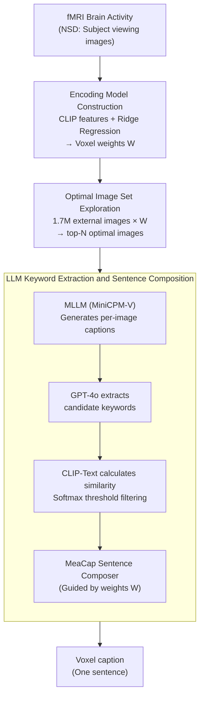

# LaVCa: LLM-assisted Visual Cortex Captioning

**Conference**: ICLR 2026  
**arXiv**: [2502.13606](https://arxiv.org/abs/2502.13606)  
**Code**: [https://github.com/suyamat/LaVCa](https://github.com/suyamat/LaVCa)  
**Area**: 3D Vision / Neuroscience  
**Keywords**: Visual cortex, voxel selectivity, LLM, fMRI encoding model, brain activity prediction

## TL;DR

The LaVCa method is proposed to generate natural language descriptions (captions) for each voxel in the human visual cortex using LLMs. Through a four-step pipeline consisting of "encoding model → optimal image selection → MLLM caption generation → LLM keyword refinement + sentence composition," it reveals voxel-level visual selectivity more accurately and diversely than existing methods like BrainSCUBA.

## Background & Motivation

**Background**: fMRI encoding models are standard tools for studying visual representations in the brain. Early methods used handcrafted features or one-hot semantic labels, which were interpretable but coarse. Modern methods use DNN features (such as CLIP) to significantly improve prediction accuracy, but DNNs themselves are black boxes, making it difficult to explain "why a single voxel is activated."

**Limitations of Prior Work**: Existing data-driven description methods like BrainSCUBA use image captioning models directly to generate voxel captions but rely on a single model (ClipCap), resulting in limited vocabulary and semantic diversity. SASC uses short n-gram fragments, but the phrases are too brief. Both lack sufficient semantic richness to precisely characterize voxel selectivity.

**Key Challenge**: How to maintain interpretability (short captions) without losing the rich information present in the optimal image set?

**Goal**: To generate precise, concise, and semantically rich natural language descriptions for each voxel, which can both accurately predict brain activity and reveal inter-voxel and intra-voxel diversity.

**Key Insight**: Decouple the pipeline into four interpretable steps—separating "image selection" from "description"—and utilize the open-vocabulary capabilities of LLMs for keyword extraction and sentence composition.

**Core Idea**: Use an LLM to first extract common keywords from the set of optimal images for a voxel, then combine them into a caption to achieve high-precision and high-diversity descriptions of the visual cortex at the voxel level.

## Method

### Overall Architecture

LaVCa addresses the problem: given a voxel in the human visual cortex, use a concise natural language sentence to describe "what visual content it is sensitive to," such that this sentence is accurate enough to conversely predict the brain activity of that voxel. It decomposes this task into a four-step pipeline, with the key being **separating the "image selection" and "description" tasks** and then performing refinement and composition on the text side using an LLM.

The input consists of fMRI brain activity recorded while subjects viewed images in the NSD dataset. Step 1 fits a linear "image $\to$ brain activity" encoding model $\mathbf{y}_i = \mathbf{W}\mathbf{x}_i + \boldsymbol{\varepsilon}_i$ for each voxel. Step 2 uses this model to score 1.7 million external images and selects the top-N optimal images that most strongly activate the voxel. Step 3 uses an MLLM (MiniCPM-V) to write a description for each optimal image. Step 4 uses an LLM (GPT-4o) to extract common keywords from these descriptions and, after filtering, combines them into a final caption using the MeaCap Sentence Composer. The final output is one sentence per voxel.

### Key Designs

**1. Encoding Model Construction: Connecting abstract brain activity to a text-evaluable CLIP space**

To assign text to voxels, a bridge must first connect "what was seen" to "which voxel was activated." LaVCa extracts CLIP-Vision projection layer embeddings (L2 normalized) and uses ridge regression to fit encoding weights $\mathbf{W} \in \mathbb{R}^{v \times d}$ for each voxel. A linear model is chosen for its inherent simplicity and interpretability, while CLIP features are selected because their visual-language space is naturally aligned, eliminating the need for another cross-modal alignment when measuring voxel responses with text keywords.

**2. Optimal Image Set Exploration: Profiling voxel "preferences" using large-scale external images**

With encoding weights, one can ask "what kind of image best activates this voxel." LaVCa computes the dot product between encoding weights and the CLIP embeddings of 1.7 million external images, taking the top-N images with the highest response as the optimal image set for that voxel. Using large-scale data like OpenImages-v6 ensures broad coverage and avoids overfitting to training images or mistaking noise for selectivity.

**3. LLM Keyword Extraction and Sentence Composition: Refinement on the text side guided by brain signals**

Descriptions of multiple optimal images contain many individual details; what truly reflects voxel selectivity is their **commonalities**. LaVCa uses GPT-4o with in-context learning to extract candidate keywords from these descriptions. It then calculates the cosine similarity between each keyword and the encoding weights using CLIP-Text, filtering out irrelevant words via a softmax threshold. Finally, the MeaCap Sentence Composer organizes the remaining keywords into a coherent sentence. A key innovation here is **using encoding weights instead of original image features** to guide generation during the sentence composition stage, effectively allowing "neuroscience signals" to participate directly in sentence construction.

### Evaluation Methods

To quantify caption accuracy, LaVCa uses two complementary methods. **Sentence-level prediction** calculates the cosine similarity between the voxel caption and the NSD image caption using Sentence-BERT to predict voxel activity, measuring the correlation with actual brain activity via Spearman coefficients. **Image-level prediction** reconstructs the caption into an image using FLUX.1-schnell and compares its CLIP-Vision embedding with the NSD image, bypassing pure text comparison to eliminate interference from linguistic variations.

## Key Experimental Results

### Main Results

Sentence-level brain activity prediction accuracy (top-5000 voxels, mean accuracy ± SD for 4 subjects):

| Method | # Keywords | Sentence Composer | subj01 | subj02 | subj05 | subj07 |
|------|---------|-------------------|--------|--------|--------|--------|
| Shuffled | - | - | 0.007±0.199 | 0.058±0.223 | 0.068±0.243 | 0.009±0.175 |
| BrainSCUBA | - | - | 0.207±0.062 | 0.251±0.071 | 0.264±0.084 | 0.182±0.065 |
| Ours (LaVCa) | 1 | ✗ | 0.205±0.068 | 0.250±0.075 | 0.272±0.086 | 0.186±0.072 |
| **Ours (LaVCa)** | **5** | **✓** | **0.246±0.066** | **0.287±0.075** | **0.306±0.084** | **0.218±0.073** |

Image-level prediction accuracy also indicates that LaVCa (5 keywords + SC) consistently outperforms BrainSCUBA (e.g., subj01: 0.213 vs 0.188).

### Ablation Study

| Configuration | Vocabulary (inter-voxel) | Semantic Variance | PCA 90% Dim |
|------|----------------------|----------|-------------|
| BrainSCUBA | 3,193 | 0.0588 | 127 |
| Top-1 MLLM caption | 13,959 | 0.0638 | 210 |
| **Ours (LaVCa)** | **16,922** | **0.0642** | **219** |

Intra-ROI shuffle test (validating inter-voxel diversity):

| ROI | Original | Shuffled | Gain |
|-----|----------|----------|------|
| OFA (Face area) | 0.095 | 0.028 | 3.3× |
| PPA (Scene area) | 0.213 | 0.151 | 1.4× |
| EBA (Body area) | 0.157 | 0.018 | 8.7× |

### Key Findings

- The combination of 5 keywords and Sentence Composer significantly outperforms BrainSCUBA and the single-keyword version across all subjects.
- LaVCa's vocabulary is 5.3 times larger than BrainSCUBA's (16,922 vs 3,193), with higher semantic diversity.
- Even in ROIs previously thought to be selective only for "faces" or "scenes" (e.g., OFA, PPA), LaVCa discovered rich multi-concept encoding—single voxels can encode multiple distinct concepts simultaneously.
- Cross-subject analysis suggests that this intra-ROI diversity is reproducible.

## Highlights & Insights

- **Clever Decoupled Design**: Splitting voxel description into "image selection $\to$ captioning $\to$ keyword extraction $\to$ sentence composition" makes each step independently replaceable (with any VLM/LLM), offering more flexibility and interpretability than end-to-end methods.
- **Encoding Weights Replace Image Features**: Using encoding weights instead of image features to guide sentence generation in the MeaCap Sentence Composer elegantly integrates "neuroscience signals" directly into the NLP pipeline.
- **Revealing Diversity in Traditional ROIs**: While OFA was previously thought to only encode "faces," LaVCa found voxels encoding "tongues," "smiles," or "animals"—a cognitive breakthrough enabled by methodological advancement.

## Limitations & Future Work

- **Reliance on CLIP Feature Space**: Both the encoding model and keyword filtering rely on CLIP. If CLIP represents certain visual concepts poorly (e.g., fine textures, abstract concepts), LaVCa will be limited accordingly.
- **Linear Encoding Assumption**: Ridge regression assumes a linear relationship between voxel responses and CLIP features, which may be oversimplified for high-level visual areas.
- **LLM Hallucination Risk**: GPT-4o may introduce hallucinations during keyword extraction; although CLIP filtering is used, it cannot be entirely eliminated.
- **Limited to Visual Cortex**: The method has not yet been extended to other brain regions (e.g., auditory or language areas). Similar logic could be applied to study language encoding.

## Related Work & Insights

- **vs BrainSCUBA**: BrainSCUBA uses ClipCap end-to-end to generate captions, limited by ClipCap's training data. LaVCa leverages the open vocabulary of LLMs after decoupling, increasing vocabulary size by 5× and improving accuracy.
- **vs SASC**: SASC uses n-gram phrase concatenation, which provides insufficient information. LaVCa retains richer semantic information through multi-image keyword extraction.
- **vs Brain Decoding**: Brain decoding asks "what did the subject see," whereas encoding models ask "what does this voxel represent"—they are complementary directions.

## Rating

- Novelty: ⭐⭐⭐⭐ The method is a clever combination of existing components, but the decoupled design and introduction of LLMs to neuroscience are novel.
- Experimental Thoroughness: ⭐⭐⭐⭐⭐ Comprehensive evaluation across sentence-level and image-level metrics, diversity analysis, ROI shuffle analysis, and cross-subject validation.
- Writing Quality: ⭐⭐⭐⭐⭐ Clear logic, well-designed figures, and distinct methodological steps.
- Value: ⭐⭐⭐⭐ Significant contribution to understanding visual cortex representations, though applicability is currently specialized (neuroscience).

<!-- RELATED:START -->

## Related Papers

- [\[NeurIPS 2025\] Meta-Learning an In-Context Transformer Model of Human Higher Visual Cortex](../../NeurIPS2025/medical_imaging/meta-learning_an_in-context_transformer_model_of_human_higher_visual_cortex.md)
- [\[ICCV 2025\] NEURONS: Emulating the Human Visual Cortex Improves Fidelity and Interpretability in fMRI-to-Video Reconstruction](../../ICCV2025/medical_imaging/neurons_emulating_the_human_visual_cortex_improves_fidelity_and_interpretability.md)
- [\[ICLR 2026\] Autoregressive Visual Decoding from EEG Signals](autoregressive_visual_decoding_from_eeg_signals.md)
- [\[ICLR 2026\] Towards Interpretable Visual Decoding with Attention to Brain Representations](towards_interpretable_visual_decoding_with_attention_to_brain_representations.md)
- [\[ICLR 2026\] Boosting Medical Visual Understanding From Multi-Granular Language Learning](boosting_medical_visual_understanding_from_multi-granular_language_learning.md)

<!-- RELATED:END -->
