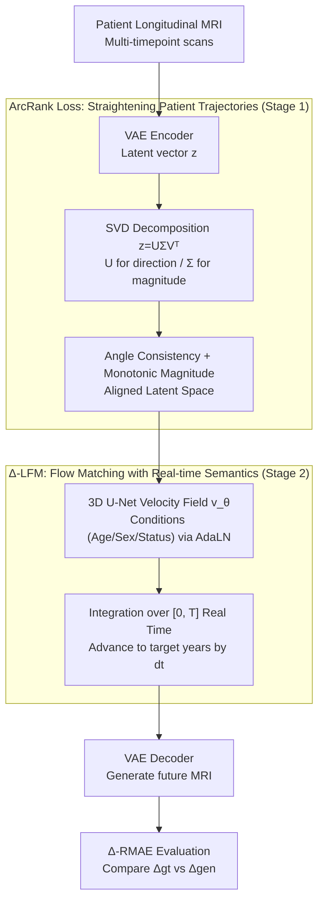

# Learning Patient-Specific Disease Dynamics with Latent Flow Matching for Longitudinal Imaging Generation

**Conference**: ICLR 2026  
**arXiv**: [2512.09185](https://arxiv.org/abs/2512.09185)  
**Code**: None  
**Area**: Medical Imaging / Disease Progression Modeling  
**Keywords**: disease progression, flow matching, patient-specific, longitudinal MRI, ArcRank loss

## TL;DR
The study proposes the Δ-LFM framework: utilizing ArcRank loss to construct patient-specific temporally aligned trajectories in latent space (consistent angle + monotonically increasing magnitude), extending the flow matching time range from $[0, 1]$ to $[0, T]$ actual time intervals for arbitrary time-point prediction. It outperforms 8 baseline methods across three Alzheimer's longitudinal MRI benchmarks and introduces a progression-specific metric, Δ-RMAE.

## Background & Motivation

**Background**: Modeling disease progression is critical for early diagnosis and personalized treatment. The evolution from GANs to diffusion models has achieved higher fidelity in longitudinal medical image generation, but most methods only capture population-level trends.

**Limitations of Prior Work**: 1) Most models ignore individual heterogeneity—progression rates vary significantly among patients with the same disease; 2) The stochastic denoising process of diffusion models disrupts temporal continuity; 3) Latent spaces in autoencoders are misaligned across patients and decoupled from clinical severity indices; 4) Traditional image quality metrics (PSNR/SSIM) are artificially inflated in longitudinal scenarios—different time points of the same patient possess high natural similarity, causing subtle disease changes to be overwhelmed by normal anatomy.

**Key Challenge**: Longitudinal image generation must satisfy both high fidelity (image quality) and high accuracy (correct progression direction), whereas existing methods favor the former and neglect the latter.

**Goal**: Construct a patient-specific generation framework ensuring meaningful latent semantics + arbitrary time-point predictability + correct progression direction.

**Key Insight**: Disease progression can be modeled as a velocity field in latent space. Flow Matching naturally learns velocity fields from source to target, aligning perfectly with the concept of disease dynamics.

**Core Idea**: ArcRank constraints ensure each patient's latent trajectory follows a "straight line to the end" (constant direction, increasing magnitude), with Δ-LFM advancing along this line using real-world time steps.

## Method

### Overall Architecture
Δ-LFM aims to solve the following: given a patient's MRI at a specific time point, predict personalized future scans at real time intervals ("years later") with the correct direction. The challenge is that latent spaces learned by autoencoders are typically disordered across patients and lack clinical relevance; direct generation in such spaces is neither controllable nor interpretable. The paper decomposes the process into two stages: "ordering" the latent space first, then learning dynamics within that ordered space.

Stage 1 trains a VAE with an additional ArcRank loss, forcing latent representations of different time points for the same patient into a "straight line"—consistent direction, with magnitude increasing over time. Thus, "advancing along a trajectory" in latent space becomes equivalent to "disease aggravation." Stage 2 trains a 3D U-Net in this aligned latent space using Flow Matching to learn patient-specific velocity fields, injecting conditional signals (age, sex, clinical status) via AdaLN. During inference, starting from the current latent vector, the model integrates along the velocity field to the target time and decodes back to an image. Finally, the progression-specific metric Δ-RMAE evaluates whether the generated "change" matches the ground truth.

### Key Designs

**1. ArcRank Loss: Straightening Patient Trajectories in Latent Space**

This design addresses the misalignment of latent space across patients and its lack of correlation with severity. The approach performs SVD on the latent vector $\mathbf{z}$: $U\Sigma V^\top = \text{SVD}(\mathbf{z})$, where $U$ captures "direction (angle)" and $\Sigma$ captures "magnitude (severity)." The ArcRank loss constrains both:

$$\mathcal{L}_{\text{ArcRank}} = \lambda_{\text{arc}} \sum_{i<j} |U_i - U_j| + \lambda_{\text{rank}} \sum_{i<j} \max(0, m - (\Sigma_j - \Sigma_i)), \quad t_i < t_j$$

The first term (arc) minimizes the angular difference between time points of the same patient to maintain a consistent direction; the second term (rank) is a hinge loss with margin $m$ that enforces larger magnitudes for later scans. Thus, $\Sigma$ increases monotonically over time, naturally corresponding to severity. To prevent adjacent time points from being pushed too far apart by the ranking term, a pull term $\mathcal{L}_{\text{Pull}} = |\Sigma_j - \Sigma_i|$ is added. Using SVD to handle direction and magnitude together is more stable than separate metrics like "cosine for angle + absolute value for magnitude," and stop-gradient is utilized during training to stabilize gradients.

**2. Δ-LFM: Semantic Real-world Time for Flow Matching**

Standard Flow Matching normalizes time to $[0, 1]$, which is a drawback for disease progression—"0.5" could represent six months or five years, erasing actual temporal semantics. Δ-LFM extends the time range to $[0, T]$, where $T = t_j - t_i$ is the actual number of years between scans. The target velocity is defined as $v^*(i, j) = (\mathbf{z}_j - \mathbf{z}_i)/(t_j - t_i)$, representing "distance in latent space per unit of time." At inference, integration proceeds along the velocity field with step size $\text{d}t = 0.01$ as $\mathbf{z}_{i+\text{d}t} = \mathbf{z}_i + \text{d}t \cdot v_\theta(\mathbf{z}_i, t_i)$. Predicting an MRI three years later simply means "walking 3 time units" along the velocity field. This enables arbitrary future prediction and preserves temporal continuity through deterministic integration rather than stochastic denoising.

**3. Δ-RMAE: Measuring "Progression Direction" instead of "Image Similarity"**

PSNR/SSIM are inflated in longitudinal contexts because identical patient scans are baseline-heavy; even "copying the baseline" yields high scores while missing subtle disease-driven changes. Δ-RMAE shifts the evaluation from absolute images to "amount of change": first calculating the residual $\Delta = \mathbf{x}_T - \mathbf{x}_0$, then comparing the relative error between ground truth and generated change:

$$\Delta\text{-RMAE} = \frac{|\Delta_{\text{gt}} - \Delta_{\text{gen}}|}{\frac{1}{2}(|\Delta_{\text{gt}}| + |\Delta_{\text{gen}}|)} \in [0, 2]$$

The denominator normalizes by the mean of absolute changes to avoid bias from the magnitude of change itself. A lower index indicates the model has correctly captured the direction of disease progression, rather than gaining points by "remaining static."

### Loss & Training
Stage 1 (AE) uses reconstruction loss combined with ArcRank loss, with weights $\lambda_{\text{arc}}=0.005$ and $\lambda_{\text{rank}}=0.01$; optimizer AdamW, lr=$10^{-3}$, batch=2, for 300 epochs. Stage 2 (FM) employs the flow matching objective $\mathcal{L}_{\text{LFM}} = \sum_{i<j} |v_\theta(i,j) - v^*(i,j)|^2$, with a 3D U-Net backbone, AdamW, lr=$3 \times 10^{-5}$, batch=4, for 200 epochs; conditions are injected via AdaLN.

## Key Experimental Results

### Main Results—Image Quality (3 Longitudinal MRI Benchmarks, mean±std)

| Method | ADNI PSNR↑ | ADNI SSIM↑ | AIBL PSNR↑ | OASIS PSNR↑ |
|------|:---:|:---:|:---:|:---:|
| CardiacAging | 27.78±1.49 | 92.04 | 28.41 | 26.23 |
| DiffuseMorph | 29.56±1.63 | 93.57 | 29.17 | 28.13 |
| SADM | 26.94±2.28 | 85.15 | 27.97 | 26.74 |
| BrLP | 28.51±1.77 | 91.52 | 28.96 | 27.98 |
| MambaControl | 29.72±1.04 | 93.60 | 29.86 | 28.24 |
| **Ours (Δ-LFM)**| **30.59±0.89** | **94.62** | **30.52** | **29.01** |

### Main Results—Progression Accuracy (Region MAE + Δ-RMAE)

| Method | ADNI Δ-RMAE↓ | AIBL Δ-RMAE↓ | OASIS Δ-RMAE↓ |
|------|:---:|:---:|:---:|
| DiffuseMorph | 0.516 | 0.482 | 0.503 |
| BrLP | 0.630 | 0.594 | 0.622 |
| MambaControl | 0.554 | 0.525 | 0.561 |
| **Ours (Δ-LFM)**| **0.436** | **0.417** | **0.473** |

Δ-RMAE shows a reduction in relative error by ~21%/21%/16% compared to MambaControl.

### Ablation Study (Mean across 3 datasets)

| Configuration | PSNR↑ | Δ-RMAE↓ | Description |
|------|:---:|:---:|------|
| LFM Baseline (No Cond, [0,1]) | 27.59 | 0.552 | Baseline performance |
| + Conditional Info | 28.46 | 0.486 | Impact of conditions |
| + [0,T] Time Sampling | 28.78 | 0.472 | Semantic time helps |
| + Arc Loss only | 29.52 | 0.457 | Direction constraint is key |
| + Rank Loss only | 28.36 | 0.474 | Magnitude ranking effect |
| + ArcRank + [0,T] (Full) | **30.04** | **0.442** | Synergistic effect |

### Key Findings
- t-SNE visualization of ArcRank latent space: (1) Scans of the same patient cluster together; (2) Diagnostic states (CN/MCI/AD) naturally group—**despite no diagnostic labels used during training**.
- Long-term prediction performance decays but remains reasonable: PSNR 31-32dB for 1-5 years, ~28.6dB for 10 years, and ~27dB for 13 years.
- ArcRank introduces a ~40% overhead in training time due to SVD, but using `full_matrices=False` yields a 6x speedup (0.055s to 0.009s per step).

## Highlights & Insights
- **"Disease = Velocity Field" Perspective**: Instead of generating future snapshots, the model learns the continuous dynamics of the change process—Flow Matching's velocity field concept aligns perfectly with disease progression.
- **Dual Design of ArcRank**: SVD unifies patient identity (direction) and disease severity (magnitude), two fundamentally different axes, in a concise and elegant manner.
- **Δ-RMAE Fills Evaluation Gaps**: Conventional metrics fail in longitudinal settings (as "copying the baseline" scores high); Δ-RMAE forces the model to capture actual changes rather than remaining static.
- **Unsupervised Emergence of Diagnostic States**: ArcRank only constrains temporal order and directional consistency, yet it naturally learns gravity gradients of CN→MCI→AD—a testament to the power of correct inductive biases.

## Limitations & Future Work
- Validation limited to Alzheimer's disease—fast-progressing diseases like brain tumors or those involving therapeutic interventions may require different modeling assumptions.
- The linear trajectory assumption in latent space may fail to capture non-linear patterns such as sudden deterioration or stable plateaus.
- Non-uniform scan intervals are partially addressed by conditional signals but progression rate changes are not explicitly modeled.
- Dataset heterogeneity (scanner/protocol differences) relies on preprocessing rather than explicit harmonization techniques.
- AE capacity is constrained by GPU memory (48GB A6000); larger crops or deeper architectures might further improve results.

## Related Work & Insights
- **vs. BrLP (Puglisi et al. 2024)**: BrLP uses ControlNet with volume ratio conditions for partial personalization, but the conditions are coarse; Δ-LFM achieves finer individual trajectory modeling via ArcRank.
- **vs. TADM (Litrico et al. 2024)**: TADM predicts residual images with diffusion denoising, which disrupts temporal continuity; Δ-LFM maintains continuity via Flow Matching.
- **vs. ImageFlowNet (Liu et al. 2025)**: ImageFlowNet operates Flow Matching in image space; Δ-LFM is more efficient in latent space and supports ArcRank trajectory alignment.

## Rating
- Novelty: ⭐⭐⭐⭐⭐ Flow Matching for disease progression + ArcRank alignment + Δ-RMAE metric.
- Experimental Thoroughness: ⭐⭐⭐⭐ Three benchmarks + 8 baselines + detailed ablation + long-term analysis.
- Writing Quality: ⭐⭐⭐⭐ Clear motivation, concise formulas, and persuasive visualizations.
- Value: ⭐⭐⭐⭐⭐ Significant contribution to medical image generation; Δ-RMAE could become a standard metric in the field.

<!-- RELATED:START -->

## Related Papers

- [\[ICLR 2026\] Functional MRI Time Series Generation via Wavelet-Based Image Transform and Spectral Flow Matching for Brain Disorder Identification](functional_mri_time_series_generation_via_wavelet-based_image_transform_and_spec.md)
- [\[CVPR 2026\] MicroFM: Physics-guided Flow Matching for Isotropic Microscopy Reconstruction](../../CVPR2026/medical_imaging/microfm_physics-guided_flow_matching_for_isotropic_microscopy_reconstruction.md)
- [\[AAAI 2026\] Ambiguity-aware Truncated Flow Matching for Ambiguous Medical Image Segmentation](../../AAAI2026/medical_imaging/ambiguity-aware_truncated_flow_matching_for_ambiguous_medica.md)
- [\[ICLR 2026\] Rethinking Radiology Report Generation: From Narrative Flow to Topic-Guided Findings](rethinking_radiology_report_generation_from_narrative_flow_to_topic-guided_findi.md)
- [\[ICLR 2026\] MnemoDyn: Learning Resting State Dynamics from 40K fMRI Sequences](mnemodyn_learning_resting_state_dynamics_from_40k_fmri_sequences.md)

<!-- RELATED:END -->
