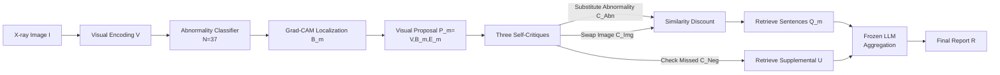

# Learning Self-Critiquing Mechanisms for Region-Guided Chest X-Ray Report Generation

**Conference**: ICLR 2026  
**OpenReview**: [https://openreview.net/forum?id=6sOSwgCmpH](https://openreview.net/forum?id=6sOSwgCmpH)  
**Code**: TBD  
**Area**: Medical Imaging / Radiology Report Generation  
**Keywords**: Chest X-ray Report Generation, Self-Critiquing, Abnormality Grounding, Retrieval-based Generation, Weakly-supervised Localization

## TL;DR
RadSCR encodes the "repeated self-questioning" diagnostic process of radiologists into the model architecture. By employing three self-critiquing mechanisms—substituting abnormality classes, swapping patient images, and checking for missed findings—it enables end-to-end learning. This significantly improves clinical accuracy and the reliability of abnormality grounding in chest X-ray reports without requiring LLM inference at test time.

## Background & Motivation
**Background**: The core requirement for automated radiology report generation is to be "clinically accurate" and "interpretable"—generated findings must be reliably grounded to corresponding regions in the image, mimicking the actual workflow of radiologists. Most recent works follow an anatomy-aware path, which first detects anatomical structures (lungs, heart, etc.) and then generates reports, improving accuracy and interpretability.

**Limitations of Prior Work**: Anatomy-level localization is not fine-grained enough to meet the needs of detailed grounding. More critically, mainstream models are essentially trained on "region-sentence" statistical correlations and lack a hypothesis-verification step, making them prone to hallucinations.

**Key Challenge**: Radiologists rely on "self-critiquing" to reduce misdiagnosis—verifying suspicious regions repeatedly before reaching a conclusion. The most direct way to introduce this mechanism into models is via Chain-of-Thought (CoT) reasoning with LLMs during test time. However, this generates a large number of "thought" tokens, leading to high test-time costs and deployment difficulties in low-resource clinical environments.

**Goal**: To internalize multi-faceted self-critiquing mechanisms directly into the model architecture through end-to-end learning during the training phase. This aims to achieve reliable fine-grained abnormality grounding and high clinical accuracy in report generation without relying on test-time LLM inference or test-time scaling.

**Core Idea**: **[Transforming "repeated questioning" into a learnable contrastive structure]** — First, use Grad-CAM to treat each predicted abnormality as a visual proposal consisting of "region + label + visual features." Then, apply three types of critiques ("change abnormality," "change image," "check missed findings") to discount each proposal. Only proposals that withstand these challenges and remain distinct and relevant are used to retrieve sentences for generating the final report.

## Method

### Overall Architecture
Given an X-ray image $I$, RadSCR first encodes visual features $V$, predicts the presence of $N=37$ abnormalities using a classifier, and localizes regions $B_m$ for each positive abnormality using Grad-CAM. These are combined with learnable concept representations $E_m$ to form visual proposals $P_m = \text{PropEncoder}(V, B_m, E_m)$. Subsequently, three self-critiquing mechanisms generate "alternative proposals" to discount similarities. The filtered proposals retrieve relevant sentences from a report library, which are then aggregated into a report by a frozen LLM decoder.

### Key Designs

**1. Region-level Visual Proposal Construction: Packaging "what is where" into comparable triplets.** RadSCR does NOT rely on scarce abnormality bounding box annotations. Instead, for each abnormality predicted as positive ($p_m=\text{Sigmoid}(\text{FCN}(\text{AvgPool}(V)))>0.5$), it calculates pixel-level saliency maps $W_m$ via CAM. These are clustered into patch-level masks using an objectness estimation algorithm to obtain the region $B_m=\text{Map}(\text{MaxPool}(\{b_{m,1},b_{m,2},...\}))$. The corresponding concept representation $E_m$ from $(N{+}1)$ global concepts $E$ (N abnormalities + 1 background padding) is embedded with regional positions to form a spatial-aware representation $F_m$, concatenated with patch-level visual features $V$, and passed through an FFN to obtain $P_m=\text{FFN}(V\oplus F_m)$. This step transforms abstract "abnormality hypotheses" into a unified vector that can be compared with sentences and other proposals.

**2. Three-faceted Self-Critique: Discounting suspicious proposals with "counter-examples".** This is the core of the paper, mimicking how doctors review a case from three perspectives: ① **Substitute Abnormality** $C_m^{(Abn)}=\text{PropEncoder}(V,B_m,E'_m)$—replaces the concept with another (negative or not covered by the region) abnormality concept $E'_m$ in the same region $B_m$, testing if the features are truly "exclusive" to the current abnormality. ② **Swap Image** $C_m^{(Img)}=\text{PropEncoder}(V',B_m,E_m)$—replaces visual features with a random patient's image $V'$, testing if the proposal is specific to the abnormality rather than a general finding. ③ **Check Missed Findings (False Negatives)** $C^{(Neg)}=\text{PropEncoder}(V,B_0,E_0)$—since fine-grained localization might miss "holistic" abnormalities, it pools concepts of all predicted negative abnormalities $E_0$ and pairs them with a region $B_0$ aggregated from major anatomical parts to recover potential missed findings. During retrieval, $C^{(Abn)}$ and $C^{(Img)}$ are used to suppress the similarity of original proposals: $\tilde\sigma(P_m,s_{(m)})=\sigma(P_m,s_{(m)})-\alpha_2(\sigma(C_m^{(Abn)},s_{(m)})+\sigma(C_m^{(Img)},s_{(m)}))$. Only sentences that withstand these critiques are ranked higher.

**3. Prototype-Augmented Retrieval-based Generation: Robust and fine-grained retrieval.** Each abnormality hypothesis has $K=5$ "prototypes" (higher-level clinical concepts), obtained by K-means clustering TF-IDF representations of sentences in the report library (e.g., 4 types of positive mentions + 1 type of negative mention). Sentence representations $s_{(m)}$ encoded by ClinicalBERT are processed via cross-attention with concept $E_m$ followed by self-attention pooling. Retrieval similarity considers both the sentence and its prototype: $\sigma(P_m,s_{(m)})=P_m\odot s_{(m)}+\alpha_1 P_m\odot o_{pt(s_{(m)})}$. This allows sentences for the same abnormality in different contexts to be organized more finely. Finally, the top-$M$ discounted sentences $\{Q_m\}$ and the supplemental missed-finding set $\{U_n\}$ are fed into a frozen Phi(4B) decoder. The prompt is designed to retain all sentences in $Q$ while using $U$ only if they do not contradict $Q$.

**4. Multi-loss End-to-End Learning: Embedding critique signals into the objective.** The training objective is $L^{(Prop)}+\beta_1 L^{(Alt)}+\beta_2 L^{(Neg)}$: $L^{(Prop)}$ is a symmetric contrastive loss that pulls $P_m$ closer to ground-truth sentences/prototypes and pushes away other abnormality sentences and prototypes. Due to end-to-end training, abnormality localization is learned weakly. $L^{(Alt)}$ uses a triplet loss to pull $P_m$ closer to $s_{(m)}$ and push away $C^{(Abn)}$ and $C^{(Img)}$. $L^{(Neg)}$ uses contrastive loss to guide $C^{(Neg)}$ toward positive mentions that exist but were not hypothesized. This mechanism operates during training and adds no LLM inference overhead during testing.

## Key Experimental Results

Datasets: MIMIC-CXR (train+test), ReXGradient, IU X-Ray (generation/retrieval/detection), and VinDR-CXR (localization). Visual backbone: Swin Transformer; LLM: Frozen Phi(4B). Uses 37 Chest ImaGenome abnormalities with $K=5$ prototypes each.

### Main Results (MIMIC-CXR Report Generation)

| Method | CheXbert F1 | CE-Abn | CE-Organ | RadGraph-C | RadNLI-F1 |
|------|-------------|--------|----------|------------|-----------|
| RGRG (Regional) | 0.489 | 0.251 | 0.669 | 0.248 | 0.317 |
| LLaVA-Rad (7B) | 0.512 | 0.399 | 0.661 | 0.220 | 0.286 |
| CXR-RePaiR (Retrieval) | 0.423 | 0.380 | 0.630 | 0.191 | 0.264 |
| X-REM (Retrieval) | 0.402 | 0.382 | 0.615 | 0.186 | 0.280 |
| **RadSCR** | **0.610** | **0.572** | **0.744** | **0.367** | **0.408** |

RadSCR significantly outperforms all VLM/LLM/retrieval baselines across clinical accuracy metrics. Compared to recent models with larger decoders (Table 2), MAIRA-2(7B) reaches CheXbert-F1=0.621 and RadFM=0.635. RadSCR (using a 4B decoder) **achieves comparable performance with a smaller model**, even surpassing them in CE-Organ (0.744) and RadNLI metrics.

### Ablation Study (MIMIC-CXR)

| Removal | CheXbert F1 | CE-Abn | CE-Organ | RadGraph-C | RadNLI-F1 |
|--------|-------------|--------|----------|------------|-----------|
| Full RadSCR | 0.610 | 0.572 | 0.744 | 0.367 | 0.408 |
| (i) Remove $C^{(*)}$ (Train & Test) | 0.561 | 0.535 | 0.689 | 0.289 | 0.359 |
| (ii) Remove $C^{(*)}$ (Test Only) | 0.545↓ | 0.379↓ | 0.653↓ | 0.231↓ | 0.343 |
| (ii) Remove $C^{(Neg)}$ (Test Only) | 0.491↓↓ | 0.545 | 0.668 | 0.354 | 0.398 |
| (iii) Remove LLM decoder | 0.611 | 0.554 | 0.724 | 0.351 | 0.326↓ |
| (iv) Remove Prototypes $\{O_k\}$ | 0.591 | 0.377↓↓ | 0.751 | 0.210↓↓ | 0.357 |

### Key Findings
- **Self-Critiquing is the Main Contributor**: Removing critiques during both training and testing significantly drops nearly all metrics. Retaining critiques at inference time further enhances report quality, proving the mechanism's validity.
- **$C^{(Neg)}$ Targets Missed Findings**: Removing it causes the sharpest drop in CheXbert-F1 (0.610→0.491), confirming that global features effectively recover abnormalities missed by fine-grained localization.
- **Prototypes Manage Fine-grained Organization**: Removing prototypes causes CE-Abn and RadGraph to plummet; prototypes help organize retrieved sentences across different contexts for the same abnormality.
- **Benefits of Sampling More Alternatives**: Performance peaks when sampling $N_p=2$ for $C^{(Abn)}$/$C^{(Img)}$. A mixed sampling strategy (Random+hard+easy) further improves some metrics (e.g., RadGraph-P 0.422→0.446).
- **Retrieval Ranking Quality**: RadSCR outperforms retrieval baselines in Acc@5/Acc@10 and preference ranking (PO-1/2/3), placing correct diagnostic sentences higher in the list.

## Highlights & Insights
- **Shifting "Test-time Reasoning" to "Training-time Structure"**: By encoding the radiologist's critiquing process into the architecture via contrastive/triplet losses, the model avoids the high test-time costs of CoT. This is specialized for low-resource clinical deployment and is the fundamental difference from CoT-based paths like MedCoT or ChestX-Reasoner.
- **Elegant Multi-critique Design**: "Changing abnormalities," "swapping images," and "checking missed findings" correspond respectively to "feature exclusivity," "over-generalization," and "missed cases." Reusing the same PropEncoder makes it an engineering-elegant solution.
- **Weakly-supervised Localization as a Byproduct**: Abnormality localization requires no box annotations; it is learned through end-to-end vision-language alignment, mitigating the shortage of large-scale region labels.
- **Small Model Beating Large Models**: A frozen 4B decoder matches 7B models like MAIRA-2, suggesting that the bottleneck in clinical accuracy lies more in grounding reliability than decoder scale.

## Limitations & Future Work
- **Alternative Proposal Sampling Strategy**: The authors acknowledge that the "optimal sampling method remains open." Current explorations of hard/easy/mixed strategies are preliminary.
- **Dependence on Grad-CAM Quality**: Regions $B_m$ are derived from CAM + objectness estimation; noise in localization propagates to proposals and retrieval. While CAM is more stable on OOD abnormalities than detectors, its precision ceiling is limited.
- **Retrieval Library Constraints**: The final sentences are limited by the coverage of the report library; rare expressions not present in the library cannot be generated.
- **$C^{(Neg)}$ Region Limitation**: The region $B_0$ for missed-finding proposals uses an aggregation of major anatomical bounding boxes rather than precise localization, resulting in coarse granularity.
- **Generalization**: While effective across ReXGradient/IU X-Ray, real-world generalization across different institutions and equipment needs further validation.

## Related Work & Insights
- **Grounded Report Generation**: Unlike RGRG, MAIRA-2, and others focusing on anatomical detection, RadSCR argues anatomy-level is insufficient and shifts to fine-grained abnormality regions + critiquing.
- **Radiology Reasoning (CoT in VQA)**: Represents the LLM reasoning path (e.g., MedCoT, MedRAX). RadSCR replaces this with "architectural internalization."
- **"What-if" Verification**: Shares a "questioning" philosophy with PGFC (fact-checking) and CoFE (counterfactuals), but RadSCR simultaneously considers alternative abnormalities, images, and missed findings while directly serving retrieval reliability.
- **Insight**: Distilling expensive test-time reasoning into training-time contrastive structures is a paradigm transferable to other high-risk, low-resource domains like pathology or ultrasound.

## Rating
- **Novelty**: ⭐⭐⭐⭐ Abstracting self-critiquing into learnable contrastive structures with the specific intent of replacing test-time LLM reasoning is highly original.
- **Experimental Thoroughness**: ⭐⭐⭐⭐ Covers four datasets across multiple tasks (generation, retrieval, detection, localization). Ablations analyze every critique branch and both training/testing stages.
- **Writing Quality**: ⭐⭐⭐⭐ Logic from motivation to method and loss is clear; formulas are self-consistent.
- **Value**: ⭐⭐⭐⭐ Significant leads in clinical accuracy with small models make it practical for mitigating hallucinations in clinical settings.

<!-- RELATED:START -->

## Related Papers

- [\[CVPR 2026\] Phrase-grounded APO for Improving Chest X-ray Report Generation](../../CVPR2026/medical_imaging/phrase-grounded_apo_for_improving_chest_x-ray_report_generation.md)
- [\[AAAI 2026\] PriorRG: Prior-Guided Contrastive Pre-training and Coarse-to-Fine Decoding for Chest X-ray Report Generation](../../AAAI2026/medical_imaging/priorrg_prior-guided_contrastive_pre-training_and_coarse-to-fine_decoding_for_ch.md)
- [\[AAAI 2026\] A Disease-Aware Dual-Stage Framework for Chest X-ray Report Generation](../../AAAI2026/medical_imaging/a_disease-aware_dual-stage_framework_for_chest_x-ray_report_.md)
- [\[ICLR 2026\] Rethinking Radiology Report Generation: From Narrative Flow to Topic-Guided Findings](rethinking_radiology_report_generation_from_narrative_flow_to_topic-guided_findi.md)
- [\[CVPR 2025\] Enhanced Contrastive Learning with Multi-view Longitudinal Data for Chest X-ray Report Generation](../../CVPR2025/medical_imaging/enhanced_contrastive_learning_with_multi-view_longitudinal_data_for_chest_x-ray_.md)

<!-- RELATED:END -->
