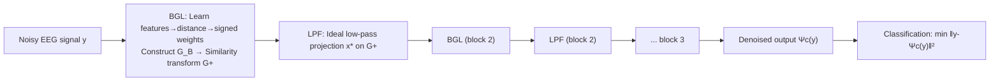

# Lightweight Transformer for EEG Classification via Balanced Signed Graph Algorithm Unrolling

**Conference**: ICLR 2026  
**OpenReview**: [https://openreview.net/forum?id=zxsLio384j](https://openreview.net/forum?id=zxsLio384j)  
**Code**: To be confirmed  
**Area**: medical_imaging (EEG / Graph Signal Processing)  
**Keywords**: EEG classification, algorithm unrolling, balanced signed graphs, graph signal denoising, white-box Transformer, lightweight model  

## TL;DR
The paper unrolls a "spectral denoising algorithm on balanced signed graphs" into an interpretable Transformer-like network. It utilizes the reconstruction errors of two class-specific denoisers for binary epilepsy EEG classification, achieving an accuracy improvement from 85% to 97.6% while using less than 1% of the parameters compared to standard Transformers.

## Background & Motivation
- **Background**: In epilepsy EEG classification, deep learning models (CNNs, Transformers) have pushed accuracy beyond 90%, surpassing traditional model-driven methods like kNN+DTW or time-frequency feature extraction.
- **Limitations of Prior Work**: Transformer-based models often have millions of parameters (e.g., 1.84 million in Lih et al. 2023), acting as non-interpretable black boxes that are difficult to deploy on memory-constrained portable EEG devices.
- **Key Challenge**: Multi-sensor EEG sampling naturally exhibits **pairwise anti-correlations**, which are best modeled using **negative edges** in a graph. However, the "frequency" of general signed graphs (containing both positive and negative edges) is not mathematically well-defined, making it impossible to directly apply mature graph spectral filtering tools.
- **Goal**: Construct an EEG classifier that is both lightweight and 100% mathematically interpretable, while capable of handling anti-correlations.
- **Core Idea**: **[Algorithm Unrolling + Balanced Signed Graphs]** Leveraging findings from Dinesh et al. (2025)—where the Laplacian of a *balanced* signed graph (no cycles with an odd number of negative edges) is related to a positive graph Laplacian via a similarity transformation and shares the same eigenvalues—the authors transform the frequency problem of negative edges back into the mature positive graph spectral domain. The graph signal denoising iterations are then unrolled into neural layers. **[Generative for Discriminative]** Two class-specific denoisers are trained to implicitly learn the posterior probabilities of both classes, using reconstruction error for classification.

## Method

### Overall Architecture
The model essentially stacks and unrolls "low-pass filtering + graph learning" operations into a feed-forward network. Each block first uses a Balanced Graph Learning (BGL) module to compute features, distances, and signed edge weights from the current signal, constructing a balanced signed graph $G_B$ and transforming it into a positive graph $G^+$. Subsequently, a Low-Pass Filtering (LPF) module performs spectral denoising on $G^+$ to obtain a smoother signal for the next block. Training involves two denoisers, $\Psi_0$ and $\Psi_1$, which learn the signal statistics for healthy individuals and epilepsy patients, respectively. During inference, classification is determined by which denoiser yields the smaller reconstruction error.

### Key Designs

**1. Balanced Signed Graph Construction: Utilizing negative edges while ensuring well-defined frequency.** EEG sensors exhibit both positive and negative correlations. The authors model anti-correlations with negative edges. To ensure meaningful graph frequencies, the graph must be "balanced"—lacking cycles with an odd number of negative edges. By the Cartwright-Harary Theorem, balance is equivalent to each node having a polarity $\beta_i \in \{1, -1\}$ such that $\beta_i \beta_j = \mathrm{sign}(w_{i,j})$. Polarities are initialized via empirical covariance and updated in each graph learning module by flipping polarities to minimize the graph Laplacian regularizer $\sum_q (x_q)^\top L_B(\beta_i) x_q$, aligning the graph with the smoothness of the training signals. Edge weights are mapped from the Mahalanobis distance of node features $d_{i,j}=(f_i-f_j)^\top M (f_i-f_j)$: $w_{i,j}=\exp(-d_{i,j}) \ge 0$ for identical polarities and $w_{i,j}=\exp(-d_{i,j})-1 \le 0$ for opposite polarities, automatically satisfying the balance condition. This is the first instance of mapping learned non-negative feature distances to signed edge weights in a balanced graph. Finally, the Gershgorin disc theorem is used to add a self-loop $\delta=\max(-\lambda^-_{\min},0)$, shifting the Laplacian to be positive semi-definite without altering the eigenvectors (preserving spectral content).

**2. Ideal Low-pass Denoising on Positive Graph Spectrum + Lanczos Linear Approximation.** Given the balanced graph $L_B$, it is mapped to a positive graph via a similarity transformation $L^+ = TL_B T^{-1}$ (where $T=\mathrm{diag}(\beta)$), with the signal pre-processed as $y^+ = Ty_B$. Denoising is formulated as projecting the observation onto a low-frequency subspace $S_\omega(L^+)$—the space spanned by eigenvectors corresponding to the $\omega$ smallest eigenvalues: $\min_{x \in S_\omega(L^+)} \|y^+ - x\|_2^2$. The closed-form solution is an ideal low-pass filter $x^*=g_\omega(L^+)y^+$. To avoid the $O(N^3)$ cost of direct eigendecomposition, the authors use Lanczos approximation on a tridiagonal matrix $H_m$ in an $m \ll N$ dimensional Krylov subspace, reducing complexity to $O(N)$. The hard-threshold cutoff frequency $\omega$ is smoothed via a sigmoid function, becoming the **only filtering parameter learned from data for each block**.

**3. Graph Learning Module as Self-Attention: Where parameters are saved.** Comparing the normalized edge weights $\bar{w}_{i,j}$ from Eq. (8) with classic self-attention $a_{i,j} = \mathrm{softmax}(e_{i,j})$: if negative distance $-d_{i,j}$ is treated as affinity, the normalized signed edge weights act as attention weights. Thus, the graph learning module is inherently a form of self-attention. However, while Transformers learn dense matrices $K, Q, V \in \mathbb{R}^{E \times E}$, this method only learns a shallow CNN (to compute features $f_i$) and a low-dimensional metric matrix $M$ as a replacement for $K$ and $Q$. A single cutoff frequency $\omega$ replaces the entire value matrix $V$, causing the parameter count to drop precipitously to approximately 15,000.

**4. Dual Denoisers + Contrastive Loss: Using generative reconstruction error for discrimination.** Training $\Psi_c$ with squared error is equivalent to approximating the posterior mean $E[x \mid y, c]$ (MMSE estimation), implicitly learning the posterior probability of the class. During inference, $c^* = \arg\min_c \|y - \Psi_c(y)\|_2^2$—the signal is classified based on which denoiser yields the smaller reconstruction error. To enhance discriminability, a contrastive MSE is used: $\sum_i \|x_{0,i} - \Psi_0(y_{0,i})\|_2^2 + \max(\rho - \|x_{1,i} - \Psi_0(y_{1,i})\|_2^2, 0)$. This ensures high-quality reconstruction for its own class while deliberately increasing the reconstruction error for the opposite class (with margin $\rho$), forcing the denoisers to capture class-discriminative structures.

## Key Experimental Results

Dataset: Turkish Epilepsy EEG (10,356 records, 121 subjects, 35 channels, 500Hz, 15s), with a default 8:1:1 split and a Leave-One-Subject-Out (LOSO) setting.

### Main Results

| Setting | Method | Parameter Count | Accuracy | F1 |
|------|------|--------|----------|-----|
| Default (Non-graph) | MDTW+kNN | - | 87.78 | 85.16 |
| Default (Non-graph) | mAtt | 46,542 | 92.00 | 90.22 |
| Default (Non-graph) | CWT+DCNN | 143,297 | 95.91 | 95.30 |
| Default | **Ours** | **14,787** | **97.57** | **98.01** |
| Default (Large Model) | Transformer (Lih 2023) | 1,849,771 | 85.12 | 82.00 |
| Default (Large Model) | STFT+CNN | 11,533,928 | 99.20 | 99.30 |
| LOSO (Graph) | DGCNN | 149,466 | 76.74 | 65.97 |
| LOSO (Graph) | EEGNet | 9,170 | 78.78 | 64.34 |
| LOSO | **Ours** | **14,787** | **90.06** | **92.59** |

### Ablation Study

| Ablation Dimension | Setting | Accuracy | F1 |
|----------|------|----------|-----|
| Graph Type (LOSO) | Positive Graph | 84.30 | 87.23 |
| Graph Type (LOSO) | Unbalanced Signed Graph | 78.87 | 82.52 |
| Graph Type (LOSO) | **Balanced Signed Graph** | **93.68** | **94.94** |
| Loss Function | Single MSE | 81.44 | — |
| Loss Function | **Contrastive MSE** | **Higher (All metrics improved)** | — |

### Key Findings
- With only 15k parameters, the model outperforms the 1.84M parameter Transformer (97.6% vs 85.1%) and approaches the performance of the 11M parameter STFT+CNN (99.2%), using less than 0.13% of the latter's parameters.
- Ablation on graph types is compelling: Unbalanced signed graphs (78.9%) performed worse than positive graphs (84.3%), indicating that negative edges are only beneficial when frequencies are well-defined under the "balanced" assumption. Balanced signed graphs (93.7%) lead significantly, proving that both "signed edges" and "balance" are essential.
- Contrastive MSE loss consistently outperforms single MSE across all metrics, as the margin penalty helps the denoiser preserve class-discriminative structures.

## Highlights & Insights
- **Bypassing negative edge issues via positive spectral domains**: The similarity transformation is the fulcrum of the paper, turning anti-correlation modeling into a manageable problem by allowing reuse of existing graph signal processing tools for low-pass filtering.
- **Generative denoisers utilized as discriminators**: Instead of learning a classification boundary directly, the model trains an MMSE denoiser for each class. Classification is based on reconstruction error, making the decision process itself interpretable.
- **Interpretability via "Layer = Optimization Iteration"**: Each layer corresponds to one iteration of a denoising objective function. This is true interpretability, not post-hoc attribution, which is vital for medical device certification.
- **Efficiency through architecture, not pruning**: The parameter savings come from replacing $K, Q, V$ with a shallow CNN, a metric matrix, and a single cutoff frequency. This is a design-level reduction rather than compression.

## Limitations & Future Work
- Validated only on a single epilepsy dataset (Turkish Epilepsy); generalization across datasets or different diseases remains unknown.
- Currently limited to binary classification (Healthy vs. Epilepsy). The scalability and cost of a "one-denoiser-per-class" strategy for multi-class or multi-disease scenarios need further investigation.
- Reliance on the balanced signed graph assumption; whether real-world EEG anti-correlation structures can always be well-balanced and how unbalanced residuals affect performance requires deeper analysis.
- Still slightly outperformed in absolute accuracy by the far larger STFT+CNN (97.6% vs 99.2%); the upper bound of the accuracy-parameter trade-off is yet to be fully explored.

## Related Work & Insights
- **Algorithm Unrolling (Monga et al. 2021)**: The paradigm of unrolling iterative optimization into neural layers forms the backbone; the "White-box Transformer" (Yu et al. 2023) is a direct inspiration.
- **Graph Learning as Self-Attention (Thuc et al. 2024)**: Proof that normalized graph weights act as self-attention; this paper extends the concept from positive to balanced signed graphs.
- **Balanced Signed Graph Spectral Theory (Dinesh et al. 2025)**: Similarity transforms and shared eigenvalues provide the theoretical foundation for using negative edges.
- **Insight**: In fields where "interpretability + lightweight" are hard constraints (medical, edge devices), it is better to unroll a network from a mathematical objective than to compress a black box. Generative reconstruction error can serve as a universal interpretable discriminative signal.

## Rating
- **Novelty**: ⭐⭐⭐⭐ First to unroll balanced signed graph spectral denoising into a Transformer for EEG anti-correlation, using dual denoiser reconstruction error for classification.
- **Experimental Thoroughness**: ⭐⭐⭐ Main results, LOSO, and graph/loss ablations are sound, but limited to binary classification on a single dataset.
- **Writing Quality**: ⭐⭐⭐⭐ Theoretical derivations (similarity transform, Lanczos, posterior/contrastive loss) are clear and self-consistent; Figures 1 and 2 aid understanding.
- **Value**: ⭐⭐⭐⭐ Achieves high accuracy, interpretability, and extreme lightweight performance simultaneously for resource-constrained EEG devices.

<!-- RELATED:START -->

## Related Papers

- [\[ICLR 2026\] ODEBRAIN: Continuous-Time EEG Graph for Modeling Dynamic Brain Networks](odebrain_continuous-time_eeg_graph_for_modeling_dynamic_brain_networks.md)
- [\[CVPR 2026\] MedFG-VQA: Low-Frequency Memory and Graph Attention for Lightweight Medical VQA](../../CVPR2026/medical_imaging/medfg-vqa_low-frequency_memory_and_graph_attention_for_lightweight_medical_vqa.md)
- [\[ICLR 2026\] Frequency-Balanced Retinal Representation Learning with Mutual Information Regularization](frequency-balanced_retinal_representation_learning_with_mutual_information_regul.md)
- [\[CVPR 2026\] GraPHFormer: A Multimodal Graph Persistent Homology Transformer for the Analysis of Neuroscience Morphologies](../../CVPR2026/medical_imaging/graphformer_a_multimodal_graph_persistent_homology_transformer_for_the_analysis_.md)
- [\[ICLR 2026\] Brain-IT: Image Reconstruction from fMRI via Brain-Interaction Transformer](brain-it_image_reconstruction_from_fmri_via_brain-interaction_transformer.md)

<!-- RELATED:END -->
