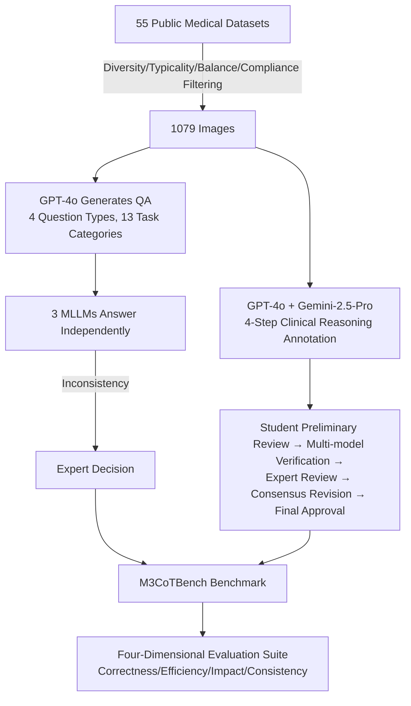

# M3CoTBench: Benchmark Chain-of-Thought of MLLMs in Medical Image Understanding

**Conference**: ICLR 2026  
**OpenReview**: [https://openreview.net/forum?id=S7KyLgHqJf](https://openreview.net/forum?id=S7KyLgHqJf)  
**Code/Homepage**: [https://juntaojianggavin.github.io/projects/M3CoTBench/](https://juntaojianggavin.github.io/projects/M3CoTBench/)  
**Area**: Medical Image Understanding / Multimodal Large Language Models / CoT Evaluation Benchmark  
**Keywords**: Medical MLLM, Chain-of-Thought, Benchmark, Medical VQA, Reasoning Evaluation  

## TL;DR
M3CoTBench is the first benchmark specifically designed to evaluate the quality of Chain-of-Thought (CoT) in MLLMs for medical image understanding. It goes beyond final answer accuracy by quantifying the reasoning paths across four dimensions: correctness, efficiency, impact, and consistency. The study reveals that current MLLMs are neither reliable nor interpretable in clinical reasoning, and accuracy often decreases when CoT is applied.

## Background & Motivation

**Background**: CoT reasoning has been proven to enhance problem-solving capabilities in LLMs through step-by-step intermediate reasoning and has been extended to Multimodal Large Language Models (MLLMs). In medicine, diagnostic decisions rely on incremental observation and verification of subtle visual cues. CoT naturally aligns with the clinical workflow of "identifying modality → capturing key features → reaching a conclusion → supplementary analysis," leading to high expectations for medical MLLMs.

**Limitations of Prior Work**: Existing medical image understanding benchmarks (VQA-RAD, SLAKE, OmniMedVQA, GMAI-MMBench, etc.) only evaluate **final answer accuracy**, completely ignoring the quality of the intermediate reasoning path. This presents a risk: two models may provide the same answer, but one might follow a completely incorrect or incomparable reasoning path. In high-stakes medical scenarios, this "black-box" reasoning—correct results with incorrect processes—cannot provide trustworthy justification for clinicians and may amplify undetected errors, misdiagnoses, and overconfidence.

**Key Challenge**: Medical diagnosis requires **interpretable, reproducible, and trustworthy step-by-step reasoning**, yet existing evaluation systems only reward correct answers without any tools to measure the quality of the reasoning process itself.

**Goal**: To construct a benchmark capable of systematically evaluating the quality of medical image CoT reasoning, covering multiple modalities, difficulty levels, and tasks, accompanied by multi-dimensional metrics specifically oriented toward clinical reasoning.

**Core Idea**: **[Treating the reasoning path as a first-class citizen for evaluation]**—Design a medical VQA dataset covering 24 examination types, 13 task categories, and 4 question types. Each sample is annotated with a clinical workflow-aligned gold-standard reasoning chain. A specialized suite of four metrics (Correctness, Efficiency, Impact, and Consistency) is proposed to perform fine-grained diagnosis of both general-purpose and medical-specific MLLMs.

## Method

### Overall Architecture
The construction of M3CoTBench follows a three-stage pipeline: **Image Collection → QA Annotation & Calibration → CoT Key Step Annotation & Calibration**, resulting in a high-quality benchmark of 1,079 images and 1,079 QA pairs with a four-dimensional evaluation suite. The core of the pipeline is a human-AI collaborative verification process involving "LLM automatic generation + Multi-MLLM cross-checking + Medical expert final review" to ensure clinical reliability.

### Key Designs

**1. Clinically Aligned 4-Step CoT Annotation: Explicitizing Clinical Cognition.** Reasoning steps were derived from interviews with clinicians and specialists from five hospitals. Grounded in medical cognitive theories (hypothetico-deductive reasoning, pattern recognition, and dual-process theory), a four-step structure was distilled: (1) Identify image properties (modality/exam type); (2) Identify key visual features; (3) Derive diagnostic conclusions (disease/organ/tissue); (4) Provide supplementary analysis based on medical knowledge (treatment strategies, associated symptoms). Critically, steps are **conditioned on task type**—modality recognition omits steps 3 and 4, and pure diagnosis omits step 4, avoiding redundant reasoning for simple perceptual tasks.

**2. Human-AI Collaborative Multi-stage Calibration: Ensuring Reliability via Cross-checking.** QA pairs were generated by GPT-4o (converting existing VQA/classification/segmentation/detection datasets into multiple-choice, boolean, and short-answer formats). Subsequently, three different MLLMs answered independently; **if any model's answer diverged from the initial label, a senior physician made the final call**. CoT annotation underwent a five-level process: student review for factual/spelling/format errors; GPT-4o automated checking; expert manual review for any steps flagged as "potentially erroneous" by any model; consensus meetings; and final expert approval. This distinguishes the benchmark's quality from purely auto-generated ones.

**3. Four-Dimensional CoT-Specific Metrics: Upgrading from Result to Process Evaluation.** This is the methodological contribution. **Correctness** is calculated by the overlap between the model reasoning set $R$ and the expert gold paths $\{A_k\}$. Since multiple valid paths may exist, the one with maximum overlap $A_{k^*}$ is selected to calculate $\text{Precision}=\frac{1}{N}\sum_i |R^{(i)}\cap A_{k^*}^{(i)}|/|R^{(i)}|$ and Recall (denominator $|A_{k^*}^{(i)}|$), combined via F1. **Efficiency** is measured by the number of correct reasoning steps per unit time $E=\sum_i |R^{(i)}\cap A_{k^*}^{(i)}|/T_{\text{CoT}}$, while Latency $L=T_{\text{CoT}}/T_{\text{direct}}$ measures the overhead. **Impact** is defined as binary accuracy difference $I=\text{Acc}_{\text{step}}-\text{Acc}_{\text{direct}}$, where positive values indicate CoT utility. **Consistency** focuses on structural stability. Reasoning paths are represented as sequences of step categories; similarity is measured via Longest Common Subsequence (LCS): $\text{sim}(P,P_i^{(t)})=|\text{LCS}(P,P_i^{(t)})|/\max(|P|,|P_i^{(t)}|)$. The task-level consistency $C_{\text{path}}^{(t)}=\frac{1}{N}\sum_i \text{sim}(P^{(t)},P_i^{(t)})$ is the average across all samples. These dimensions collectively describe if reasoning is right, fast, beneficial, and stable.

## Key Experimental Results

### Main Results

| Dataset | #Img/#QA | Exam Types | Tasks | Q-Types | CoT Label | Dimensions (Corr/Imp/Eff/Cons) |
|--------|----------|----------|--------|------|---------|------------------------------|
| VQA-RAD | 315/3515 | 3 | 8 | 2 | ✗ | ✗✗✗✗ |
| SLAKE | 642/14028 | 3 | 10 | 2 | ✗ | ✗✗✗✗ |
| OmniMedVQA | 118010/127995 | 12 | 5 | 3 | ✗ | ✗✗✗✗ |
| GMAI-MMBench | -/25831 | 38 | 6 | 2 | ✗ | ✗✗✗✗ |
| **M3CoTBench** | **1079/1079** | **24** | **13** | **4** | **✓** | **✓✓✓✓** |

M3CoTBench is the only medical benchmark providing step-by-step CoT annotations and a complete four-dimensional reasoning evaluation suite.

### Performance of Representative Models

| Model | F1(↑) | Acc_direct | Acc_step | I(↑) | E(↑) | L(↓) | C_path(↑) |
|------|-------|-----------|----------|------|------|------|-----------|
| Gemini 2.5 Pro | **66.07** | 60.24 | 60.10 | -0.14 | 0.10 | 1.52 | 82.00 |
| Qwen3-VL-Thinking-30B | 62.15 | 51.95 | 55.47 | **+3.52** | 0.02 | 1.15 | 76.02 |
| GPT-4.1 | 60.76 | 56.77 | 58.11 | +1.34 | 0.17 | 5.08 | 81.31 |
| Qwen3-VL-Instruct-8B | 55.17 | 51.30 | 46.62 | -4.68 | 0.04 | **93.94** | 82.65 |
| GPT-5 | 55.13 | 58.76 | 58.29 | -0.47 | 0.06 | 1.10 | 65.39 |
| Lingshu-32B (Med) | 59.16 | 51.81 | 44.95 | -6.86 | 0.21 | 10.87 | 71.47 |
| LLaVA-Med (Med) | 30.51 | 29.38 | 29.29 | -0.09 | 0.35 | 3.22 | 72.68 |

### Key Findings
- **CoT often hinders performance in medical imaging**: For most models, Impact $I$ is negative (e.g., -7.92 for Lingshu-7B, -6.95 for HuatuoGPT-Vision), meaning accuracy drops with reasoning. Medical diagnosis relies more on visual cues than logical inference; CoT can introduce irrelevant steps, exacerbate hallucinations, or distract from key features. Only the Qwen3-VL-Thinking series (internalized reasoning) showed positive gains.
- **Closed-source does not imply better reasoning**: Closed-source models showed no consistent advantage in CoT-gold alignment. GPT-5 had high precision but low recall because it often ignored CoT instructions; GPT-4.1 and Gemini 2.5 Pro were more balanced. **Instruction following** is a stronger determinant of CoT quality than the open/closed-source nature.
- **Thinking > Instruct, Large > Small**: Qwen3-VL-Thinking consistently outperformed Instruct variants. Larger models in the same series achieved higher F1 and were less prone to step-skipping or reasoning collapse.
- **Extreme Latency Variance**: Instruct models suffered massive latency spikes with CoT (Qwen3-VL-Instruct-8B exceeded 90×), whereas Thinking and closed-source models had moderate increases.
- **Medical specialized models are not necessarily superior**: Medical MLLMs did not consistently outperform general-purpose models in CoT alignment; domain specialization does not equate to high-quality reasoning.
- **Errors originate in intermediate steps**: Qualitative analysis shows systemic errors in reasoning rather than final prediction: "insufficient verification of diagnostic features," "verbalization weakening vision-language alignment," and "error amplification along the reasoning chain."

## Highlights & Insights
- **Paradigm Shift**: Transitioning from "result-only" to "process-oriented" evaluation. This study provides the first quantifiable metrics for reasoning paths in medical imaging.
- **Counter-intuitive Insights**: Empirically revealing that CoT can be harmful in medical image understanding due to visual evidence distortion during verbalization serves as a warning for research blindly prioritizing CoT.
- **Solid Annotation Quality**: The four-step reasoning structure is backed by clinical interviews and cognitive theories, and the five-level calibration ensures the reliability of the gold standard.
- **Ingenious Consistency Metric**: Using LCS to treat reasoning steps as an ordered sequence captures structural stability better than unordered set-based approaches, aligning with the requirements for reproducible clinical reasoning.

## Limitations & Future Work
- **Scale**: 1,079 images/QA is limited compared to benchmarks like OmniMedVQA (128k QA). Statistical power and long-tail coverage are restricted.
- **Reliance on LLM Judges**: Correctness and consistency rely on GPT-4o, LLaMA-3.3-70B, and Gemini 2.5 Pro; biases of the evaluators may propagate to the scores.
- **Uniqueness of Gold Path**: While multiple paths are allowed, real clinical reasoning can be divergent. LCS matching might penalize valid alternative paths too heavily.
- **Diagnosis without Prescription**: The benchmark identifies issues with CoT in medical imaging but does not yet propose solutions to maintain visual information integrity during verbalization.

## Related Work & Insights
- **Medical Multimodal Benchmarks** (VQA-RAD, SLAKE, OmniMedVQA, GMAI-MMBench, Med-CMR): These focus on accuracy but lack intermediate reasoning labels, which **Ours** provides.
- **Multimodal CoT Benchmarks** (Visual-CoT, M3CoT, MME-CoT, CoMT): These advanced CoT evaluation in natural images. MME-CoT similarly found CoT performance drops in perception tasks; this study deepens that finding in high-risk medical contexts.
- **Insight**: CoT is not a "free lunch." In domains where visual evidence dominates and logical chaining is secondary, forced verbalization can degrade performance. Evaluation systems must scrutinize both process and result.

## Rating
- **Novelty**: ⭐⭐⭐⭐ First benchmark for medical image CoT quality. Methodology (LCS for consistency) and the finding of "CoT harm" are valuable.
- **Experimental Thoroughness**: ⭐⭐⭐⭐ Covers 20+ MLLMs across open/closed/medical categories. Includes quantitative 4D analysis and qualitative error attribution. Deducted for scale and LLM-judge reliance.
- **Writing Quality**: ⭐⭐⭐⭐ Clear motivation, rigorous definitions, and well-organized findings.
- **Value**: ⭐⭐⭐⭐ Provides tools and insights for trustworthy clinical AI, directly impacting medical MLLM and multimodal CoT research.

<!-- RELATED:START -->

## Related Papers

- [\[CVPR 2026\] SurgCoT: Advancing Spatiotemporal Reasoning in Surgical Videos through a Chain-of-Thought Benchmark](../../CVPR2026/medical_imaging/surgcot_advancing_spatiotemporal_reasoning_in_surgical_videos_through_a_chain-of.md)
- [\[ICLR 2026\] Boosting Medical Visual Understanding From Multi-Granular Language Learning](boosting_medical_visual_understanding_from_multi-granular_language_learning.md)
- [\[NeurIPS 2025\] THUNDER: Tile-level Histopathology image UNDERstanding benchmark](../../NeurIPS2025/medical_imaging/thunder_tile-level_histopathology_image_understanding_benchmark.md)
- [\[ICLR 2026\] U2-BENCH: Benchmarking Large Vision-Language Models on Ultrasound Understanding](u2-bench_benchmarking_large_vision-language_models_on_ultrasound_understanding.md)
- [\[ICLR 2026\] Towards Text–Mask Consistency in Medical Image Segmentation](towards_text-mask_consistency_in_medical_image_segmentation.md)

<!-- RELATED:END -->
