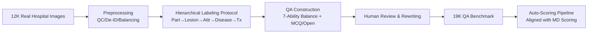

# MedLesionVQA: A Multimodal Benchmark Emulating Clinical Visual Diagnosis for Body Surface Health

**Conference**: ICLR 2026  
**OpenReview**: [https://openreview.net/forum?id=BYtqk6AVuL](https://openreview.net/forum?id=BYtqk6AVuL)  
**Code**: [https://github.com/bytedance/MedLesionVQA](https://github.com/bytedance/MedLesionVQA)  
**Area**: Medical Imaging / Multimodal Evaluation Benchmark  
**Keywords**: Body Surface Health, Visual Diagnosis, Medical MLLM, VQA Benchmark, Skin Lesions, Clinical Evaluation  

## TL;DR
MedLesionVQA, developed by the ByteDance Xiaohe team in collaboration with Peking Union Medical College Hospital (Tsinghua Changgung Hospital), is the first multimodal benchmark for body surface health aligned with the "step-by-step visual diagnosis workflow" of physicians. It comprises 12K unreleased real-world hospital patient images and 19K expert-reviewed QAs, covering 94 lesion types, 110 body parts, and 96 diseases. Evaluations of 20+ mainstream MLLMs show a top accuracy of only 56.2%, significantly lower than junior doctors (61.4%) and senior experts (73.2%).

## Background & Motivation
**Background**: Using smartphone photography for MLLMs to assess body surface health issues (skin, nails, oral cavity, hair) is one of the most frequent application scenarios for medical multimodality. General MLLMs like GPT-4V, Gemini, and Qwen-VL, as well as medical-specific models like HuatuoGPT and MedGemma, claim to possess "physician-level" assistive capabilities.

**Limitations of Prior Work**: Existing medical benchmarks suffer from two major flaws. One type is the "broad-spectrum" category (e.g., GMAI-MMBench, OmniMedVQA), which aggregates open-source website data into dozens of modalities; while large in scale, they often contain outdated content and lack expert annotations, failing to support lesion interpretation and treatment suggestions. The other type is the "specialized" category (e.g., SkinCon, DDI), which has expert annotations but single tasks (only disease classification or binary benign/malignant classification) and extremely small scales (SkinCon has only 3700 images, DDI only 656 cases), which neither reflects real clinical complexity nor allows for robust evaluation.

**Key Challenge**: Real physician diagnosis is a **step-by-step visual workflow**—proceeding from fine-grained recognition (lesion type, location, attributes, spatial relationships) to reasoning, diagnosis, and providing treatment suggestions across dermatology, stomatology, and surgery departments. However, existing benchmarks compress this into a "one image $\rightarrow$ one disease label" classification problem, failing to verify whether models can truly diagnose step-by-step like a physician.

**Goal**: To construct the first large-scale benchmark explicitly aligned with the visual diagnosis workflow of body surface health, testing whether MLLMs can replicate the step-by-step diagnostic process of physicians in real clinical scenarios and exposing the gap through direct comparison with human doctors.

**Core Idea**: **[Process Alignment]** Deconstruct the clinical diagnostic workflow into 7 core abilities for testing; **[Real Hospital Data]** 12K images sourced entirely from real patient visits with zero leakage to the web, eliminating data contamination; **[Expert Oversight]** Senior chief physicians with 20+ years of experience designed the annotation protocol based on authoritative textbooks and audited every entry.

## Method

### Overall Architecture
The construction of MedLesionVQA involves four sequential steps: **Image collection and preprocessing** (quality filtering, content review, de-identification, distribution balancing); followed by a **hierarchical labeling protocol** executed by dozens of doctors (body part $\rightarrow$ lesion $\rightarrow$ attribute $\rightarrow$ disease diagnosis $\rightarrow$ suggested treatment, layer-by-layer annotation with senior expert review, entity-level precision/recall $>95\%$); then **QA construction** based on real clinical questions (balanced across the 7 abilities, generating both multiple-choice and open-ended questions, followed by manual review and rewriting); finally, an **automated scoring pipeline** aligned with physician scoring. The core of the entire process is translating "how a doctor diagnoses" into "how a model answers."

### Key Designs

**1. Seven Step-by-Step Visual Diagnosis Abilities: Deconstructing Clinical Workflow into Evaluable Dimensions.** Referencing authoritative dermatology textbooks, the authors split the diagnostic process into seven core abilities: Lesion Recognition, Location Recognition, Attribute Recognition, Spatial Relation, Lesion Reasoning, Disease Diagnosis, and Suggestion & Treatment. The question distribution mirrors real clinical proportions: fine-grained recognition (lesion + attribute + location) accounts for 61%, as these form the foundation of subsequent diagnosis. Each lesion type is sampled with equal weight according to real-world distribution to ensure comprehensive coverage rather than long-tail imbalance.

**2. Tree-like Fine-grained Annotation System: Precision from "Web of Thumb to Fingertip."** Annotations cover 94 lesion types, 110 body parts/sub-parts, and 96 diseases. Body parts are organized in a "lexical tree" and annotated at the second-level node—for instance, a hand is subdivided into 9 areas from the web of the thumb to the fingertips. Each lesion is annotated with six attributes (size, color, shape, quantity, distribution, boundary), all as multiple-choice options (rather than binary yes/no), with at least 7 text descriptions per item, distinguishing between primary/secondary lesions and their co-occurrence. For disease labels, two doctors each provide up to 3 differential diagnoses ranked by plausibility, using the reciprocal of the rank for weighted fusion $w_i = 1/\text{rank}_i$ to obtain the final sequence, accompanied by diagnostic reasoning logic.

**3. Real Question Templates + Dual Question Types: Clinically Relevant and Machine-Scorable.** QAs are not fabricated out of thin air but are automatically generated using real clinical question templates and refined by doctor review. Question types include multiple-choice (MCQ) and open-ended, the latter including judgment, fill-in-the-blank, and short answer. MCQs use similar distractors based on the correct answer and randomized option positions to prevent positional bias; open-ended answers are kept concise to reduce ambiguity in automated scoring. The final 19,843 QAs are divided into a validation set of 1,499 (7.55%) and a test set of 18,344 (92.45%).

**4. Physician-Aligned Auto-Scoring Pipeline: MCQ by Proportion, Open-ended by Critic Model.** For MCQs, an extraction prompt pulls options from the raw output, followed by rule-based scoring: 0 points if an incorrect option is included, and proportional scoring for hits if options are missing: $s = |\text{pred} \cap \text{gold}| / |\text{gold}|$. For open-ended questions, GPT-4 acts as the judge with a three-tier score (0 / 0.5 / 1.0). The authors found that critic models were overly strict on attributes like color ("pink" vs. "skin tone") or size ("pinpoint" vs. "millimeter") due to a lack of medical common sense; thus, they supplemented the prompt with evaluation criteria for color/size, achieving high alignment between model and manual physician scores.

## Key Experimental Results

### Main Results (Average Accuracy on Test/Val Sets, Excerpt)

| Model | AVG_val | AVG_test | Lesion Recog | Location Recog | Disease Diag |
|---|---|---|---|---|---|
| **Senior Expert** | **0.7321** | - | 0.6826 | 0.7583 | 0.7313 |
| **Junior Doctor** | **0.6144** | - | 0.5932 | 0.6218 | 0.6258 |
| Gemini-2.5-pro | 0.5624 | - | 0.4902 | 0.5166 | 0.6048 |
| GPT-5 | 0.5252 | - | 0.4741 | 0.5109 | 0.4444 |
| Claude4-opus | 0.5139 | - | 0.3906 | 0.4513 | 0.5744 |
| GPT-4V | 0.4938 | 0.4915 | 0.4071 | 0.4780 | 0.5132 |
| Qwen2.5-VL-72B | 0.4904 | 0.4904 | 0.3735 | 0.4636 | 0.5272 |
| GLM-4V-9B | 0.4654 | 0.4474 | 0.3472 | 0.4528 | 0.4929 |
| LLaVA-med-v1.5-7B | 0.0885 | 0.0791 | 0.0372 | 0.0715 | 0.0535 |

The best MLLM (Gemini-2.5-pro) at 56.2% is still 5 points behind junior doctors and 17 points behind senior experts; for pure visual tasks like lesion recognition, the top model score is only 49%.

### Ablation Study (Multimodal vs. Text-only Input, Excerpt)

| Model | Image+Text Suggestion | Text-only Suggestion | Image+Text AVG_val | Text-only AVG_val |
|---|---|---|---|---|
| Qwen2.5-VL-72B | 0.8246 | 0.8124 | 0.4904 | 0.3478 |
| InternVL2.5-78B | 0.7963 | 0.8014 | 0.4790 | 0.3636 |
| GPT-4V | 0.8216 | 0.8140 | 0.4938 | 0.3089 |

Accuracy for the "Suggestion & Treatment" task remains nearly identical after removing the image (82.4% $\rightarrow$ 81.2%), proving these scores rely primarily on linguistic priors rather than actual visual analysis.

### Key Findings
- **Insight 1: MLLMs cannot yet serve as body surface health physicians.** Representative models all scored $<57\%$, primarily due to identification errors in lesion type, location, attributes, and relationships—precisely the areas where human physicians are most stable.
- **Insight 2: Textual capabilities make models "appear" more competent.** High scores in treatment suggestions, whether images are present or not, indicate that MLLMs create an illusion of expertise through fluent text generation, failing as soon as purely visual recognition is required.
- **Insight 3: Larger models are better, but with diminishing returns and exceptions.** Models $<1$B essentially failed ($<0.2$); GLM-4V-9B (0.465) surpassed InternVL2.5-38B (0.309); InternVL2.5-78B even underperformed against smaller models in disease diagnosis.
- **Insight 4: Re-evaluating medical-specific models.** LLaVA-med-v1.5-7B performed 18% worse than the general LLaVA-v1.5-7B, and MedGemma-4b was inferior to InternVL2.5-4B—SFT for domain adaptation often overfits to patterns like radiology reports, harming generalization and reasoning.
- **Error Analysis**: 94.2% of GPT-4V errors were "knowledge-based," essentially failing to ground general medical knowledge to specific anatomical locations in images (e.g., discussing textbook features of folliculitis/acne without analyzing the actual lesions in the photo).

## Highlights & Insights
- **"Zero leakage" of data is the true moat**: All 12K images were collected in-hospital and never uploaded, completely avoiding the common issue of benchmark contamination by training data, which substantially improves evaluation credibility.
- **Evaluating the "workflow" rather than "labels"**: Dimensional results across seven abilities directly pinpoint model weaknesses—weak visual recognition vs. strong text generation—providing a clear direction for iterative medical MLLM training.
- **Text-only ablation is a masterstroke**: A simple comparison (removing the image) exposed the inflated "treatment suggestion" scores, reminding the community that medical models must be evaluated across the full clinical process to avoid being misled by single-point high scores.
- **Deep expert involvement**: Chief physicians with 20+ years of experience designed the protocol and audited every item; entity-level precision/recall $>95\%$ and judge-model alignment with physician scoring place the annotation quality in the top tier of medical benchmarks.

## Limitations & Future Work
- **Evaluation only, no training**: The paper provides a benchmark and diagnostic analysis but offers no methods or baseline training schemes to close the gap between MLLMs and physicians; "how to improve" is left for future work.
- **Limited to visible surface lesions**: Focuses on photographable surface health (skin/oral/nails), excluding internal imaging like X-ray, CT, or MRI; cross-modal medical diagnosis still requires supplementary benchmarks.
- **Critic model bias**: Open-ended questions rely on GPT-4 for scoring; although calibrated via prompts, judgments on fine-grained attributes like color or size still rely on manual patches, and the robustness of large-scale auto-scoring requires further validation.
- **Limited human baseline scale**: The human baseline was only conducted on the 1,499-item validation set by $15+15$ doctors, a relatively small sample size compared to the model test set.

## Related Work & Insights
- **Differences from general medical VQA benchmarks**: Compared to the "broad and general" approach of OmniMedVQA (119K public images) or GMAI-MMBench (26K public images), MedLesionVQA wins on "real clinical data + expert annotation + workflow alignment," reflecting the trend of medical evaluation moving from "scale competitions" to "clinical authenticity."
- **Differences from specialized dermatology datasets**: SkinCon (lesion concepts), DDI (malignancy binary), and Fitzpatrick17K (disease classification) are all single-task labels; this work is the first to chain recognition $\rightarrow$ reasoning $\rightarrow$ diagnosis $\rightarrow$ treatment into end-to-end VQA.
- **Insights for medical MLLM training**: The finding in Insight 4 regarding "SFT domain adaptation harming generalization" echoes discussions in the general LLM community about "over-specialization damaging reasoning," suggesting that medical models might require lighter domain injection or retrieval-augmented generation (RAG) rather than crude SFT.
- **Methodological insight**: The simple design of text-only control is worth adopting by all multimodal medical benchmarks to decouple linguistic priors and measure true visual contribution.

## Rating
- **Novelty**: ⭐⭐⭐⭐ First surface health benchmark aligned with physician step-by-step visual diagnosis; the combination of 7 ability dimensions and unreleased hospital data is clearly original, though it falls under "high-quality benchmark" rather than methodological breakthrough.
- **Experimental Thoroughness**: ⭐⭐⭐⭐⭐ Evaluated 20+ mainstream open/closed-source MLLMs, established a two-tier physician baseline, and conducted text-only ablation and per-ability error analysis; excellent breadth and depth.
- **Writing Quality**: ⭐⭐⭐⭐ The logic from motivation to construction to evaluation to insight is clear, and the four insights are well-extracted; minor discrepancies (e.g., body part count 110 vs. 119) exist.
- **Value**: ⭐⭐⭐⭐⭐ Provides a high-quality, contamination-resistant yardstick for trustworthy medical AI, empirically debunking "physician-level MLLM" marketing, with direct reference value for both academia and industry deployment.

<!-- RELATED:START -->

## Related Papers

- [\[CVPR 2026\] Med-CMR: A Fine-Grained Benchmark Integrating Visual Evidence and Clinical Logic for Medical Complex Multimodal Reasoning](../../CVPR2026/medical_imaging/med-cmr_a_fine-grained_benchmark_integrating_visual_evidence_and_clinical_logic_.md)
- [\[CVPR 2026\] X-PCR: A Benchmark for Cross-modality Progressive Clinical Reasoning in Ophthalmic Diagnosis](../../CVPR2026/medical_imaging/x-pcr_a_benchmark_for_cross-modality_progressive_clinical_reasoning_in_ophthalmi.md)
- [\[ICLR 2026\] Unified Brain Surface and Volume Registration](unified_brain_surface_and_volume_registration.md)
- [\[ICML 2026\] DIYHealth Suite: Dataset, Model, and Benchmark for Health Management at Home](../../ICML2026/medical_imaging/diyhealth_suite_dataset_model_and_benchmark_for_health_management_at_home.md)
- [\[NeurIPS 2025\] MTBBench: A Multimodal Sequential Clinical Decision-Making Benchmark in Oncology](../../NeurIPS2025/medical_imaging/mtbbench_a_multimodal_sequential_clinical_decision-making_benchmark_in_oncology.md)

<!-- RELATED:END -->
