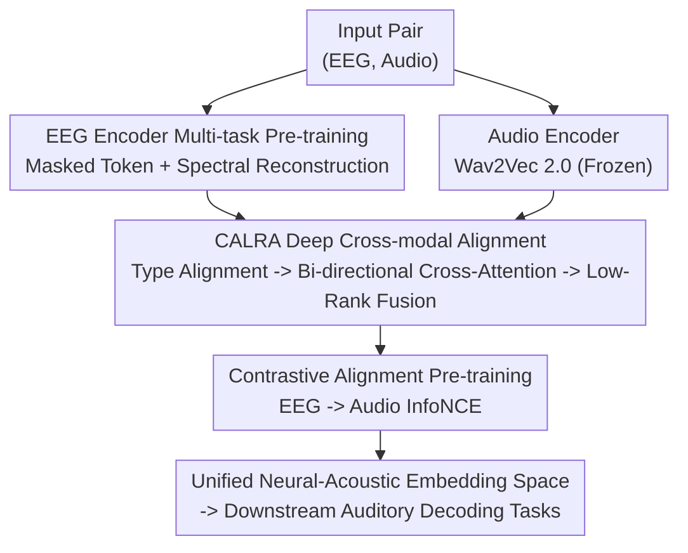

# MindMix: A Multimodal Foundation Model for Auditory Perception Decoding via Deep Neural-Acoustic Alignment

**Conference**: ICLR 2026  
**OpenReview**: [https://openreview.net/forum?id=1ifQzlETeG](https://openreview.net/forum?id=1ifQzlETeG)  
**Code**: https://github.com/CookieMikeLiu/MindMix  
**Area**: Medical Imaging / Brain-Computer Interface / Multimodal Alignment  
**Keywords**: EEG Decoding, Auditory Perception, Neural-Acoustic Alignment, Foundation Model, Contrastive Learning

## TL;DR
MindMix utilizes a two-stage strategy: first, a high-capacity EEG encoder is pre-trained on 3500+ hours of unlabeled EEG; second, a multimodal foundation model for auditory perception decoding is constructed by performing contrastive learning on 100+ hours of EEG-audio paired data via the CALRA cross-modal alignment module. It significantly outperforms existing single-modal EEG foundation models and task-specific SOTAs across three categories of tasks: auditory attention decoding, emotion recognition, and music retrieval (achievable 99.82% accuracy on KUL).

## Background & Motivation
**Background**: Decoding human auditory experiences (speaker identity, emotion, music segments) from non-invasive EEG is a core objective of cognitive neuroscience and Brain-Computer Interfaces (BCI). A recent wave of EEG foundation models (EEGPT, LaBraM, HEAR, CBraMod) has aimed to learn universal neural representations transferable across tasks and subjects through self-supervised pre-training on massive unlabeled EEG data.

**Limitations of Prior Work**: These foundation models are almost exclusively "single-modal"—pre-trained only on EEG signals without ever seeing the corresponding acoustic stimuli. Consequently, the learned representations are not optimized to align with the intrinsic structure of sound. Empirical tests reveal an awkward phenomenon: powerful models like LaBraM and CBraMod achieve only 63.30% and 68.42% accuracy on Auditory Attention Decoding (KUL), lagging far behind the task-specific DARNet (94.81%). This stems from the fact that most foundation models are pre-trained on non-auditory tasks (motor imagery, seizure detection, sleep staging), making their general representations ill-suited for auditory decoding and extremely sensitive to data formats/preprocessing.

**Key Challenge**: The representation space of single-modal EEG foundation models is decoupled from the structure of acoustic information. Meanwhile, the few task-specific multimodal methods (MusicAAD, AADNet) introduce audio but show limited improvement because they rely on shallow projection-based alignment (CLIP-style linear dot products). These fail to characterize the low signal-to-noise ratio (SNR) and highly non-linear mapping between EEG and audio, nor do they distinguish the distinct neural response patterns under heterogeneous stimuli like speech vs. music.

**Goal**: (1) Build a high-capacity EEG encoder that has truly "seen" sound; (2) Design an alignment module capable of fine-grained, deep cross-modal interaction rather than shallow projection; (3) Align both end-to-end on paired data to obtain a unified representation space transferable to multiple auditory decoding tasks.

**Key Insight**: The authors observe that "simply concatenating two modalities is insufficient; the key lies in deep alignment." To pull corresponding EEG-audio pairs closer and push non-pairs apart in a shared embedding space, the two modalities must interact thoroughly before the contrastive loss is applied.

**Core Idea**: By integrating a "high-capacity EEG encoder + CALRA deep cross-modal alignment + contrastive learning," the bridge between single-modal EEG foundation models and task-specific decoders is closed, learning a deeply aligned neural-acoustic representation.

## Method

### Overall Architecture
MindMix is a dual-stream multimodal foundation model. Given an input pair $(S_{EEG}, S_{Audio})$, two modality-specific encoders produce initial embeddings $(E_{proj}, A_{proj})$. These embeddings are fed into the core innovation module **CALRA**, which performs deep interaction conditioned on the auditory type (speech/music) to output final aligned embeddings $(E_{aligned}, A_{aligned})$. The entire framework is optimized end-to-end using a contrastive loss $L_{CL}$, pulling true pairs together and pushing non-pairs within the batch apart.

Training proceeds in three stages: ① Single-modal pre-training—the EEG encoder is trained from scratch on 3564 hours of general EEG using multi-task self-supervision; ② Multimodal alignment—neural-acoustic mapping is learned via CALRA on 109 hours of EEG-audio paired data; ③ Downstream fine-tuning—evaluation is performed on held-out auditory task datasets. For the audio side, the pre-trained Wav2Vec 2.0 is reused (acting as a scaffold, not an innovation of this paper).

### Key Designs

**1. High-capacity EEG Encoder and Multi-task Self-supervised Pre-training: Learning Robust Neural Dynamics from Scratch**

EEG signals face two major difficulties: large inter-subject variability and inconsistent electrode channel counts across datasets (ranging from 8 to 255 channels in the paper). To address this, the encoder employs **channel-independent patching**—cutting $S_{EEG} \in \mathbb{R}^{C \times T}$ into $K$ fixed-length time segments independently for each channel. These segments pass through a 1D temporal convolution to get initial embeddings $\tilde{X}$, which are then quantized into discrete neural tokens $v \in V$ using a shared codebook. The final input embedding consists of three summed terms:

$$E_{patch} = v + T + E$$

where $T$ is a learnable temporal position embedding (marking relative positions 1 to $K$), and $E$ is a spatial embedding—a lookup table mapping standard 10-20 electrode names (e.g., 'Cz', 'Pz') to vectors, allowing the model to distinguish the anatomical source of each patch regardless of channel configuration.

The true innovation in this stage is **two parallel self-supervised tasks**. The main branch performs **masked token prediction**: randomly masking patches and using a main Transformer to predict original neural tokens from visible patches:

$$L_M = -\sum_{j \in M} \log p(v_j \mid \tilde{X}_{visible})$$

The auxiliary branch performs **spectral reconstruction**: using a smaller Transformer to reconstruct the Fourier spectrum (magnitude $A$, phase $\psi$) of original patches:

$$L_S = \mathbb{E}_j\left[\|\tilde{A}_j - A_j\|^2 + \|\tilde{\psi}_j - \psi_j\|\right]$$

The total pre-training loss is a weighted sum of these (plus a quantization loss $L_Q$). The main Transformer serves as the $f_{EEG}$ backbone, projecting mean-pooled output sequences to generate the initial EEG embedding $E_{proj}$. Spectral reconstruction forces the retention of time-frequency details, while mask prediction forces contextual semantics, making the representation more robust against noisy, cross-subject EEG.

**2. CALRA: Deep Cross-modal Alignment via Refine-then-Contrast**

CALRA (Cross-Attention Low-Rank Alignment) addresses the limitation where standard CLIP-style shallow projections are insufficient for low SNR, strong non-linearity, and heterogeneous speech/music stimuli. CALRA's strategy is "refine then contrast"—injecting context-aware deep interactions into embeddings before calculating contrastive loss. it consists of three协同 components:

- **Type-specific Aligner**: Neural responses differ significantly between speech and music. A learnable transformation $f_k$ is used to route initial projections based on auditory type $k$: $(E'_{proj}, A'_{proj}) = f_k(E_{proj}, A_{proj})$.
- **Bi-directional Cross-Attention**: Modalities retrieve supplementary information from each other over global projection vectors. $E'_{interacted} = \text{MHA}(Q_E, K_A, V_A)$ and $A'_{interacted} = \text{MHA}(Q_A, K_E, V_E)$ occur simultaneously with residuals and LayerNorm to produce $h_E, h_A$. It performs global alignment rather than local token matching.
- **Shared Low-Rank Alignment**: $h_E, h_A$ are projected to a shared bottleneck, using element-wise multiplication $\odot$ to force **bilinear interaction**:

$$E_{feedback} = W_{D,eeg}\big(H_{shared}(W_{U,eeg}(h_E) \odot W_{U,audio}(h_A))\big)$$

The final aligned embedding is integrated via residuals: $E_{aligned} = \text{LayerNorm}(h_E + E_{feedback})$ (symmetric for audio). This low-rank structure efficiently approximates expensive tensor fusion, capturing multiplicative feature interactions missed by simple linear combinations. The authors clarify that unlike LoRA's additive weight adaptation, CALRA uses low-rank to model the joint distribution of multimodal features.

**3. EEG→Audio Directional Contrastive Alignment: Single-way InfoNCE for Stable One-to-Many Mapping**

Final aligned embeddings are optimized using a CLIP-style contrastive objective. for every EEG embedding, the model identifies the correct acoustic counterpart from a mini-batch:

$$L_{CL} = -\frac{1}{N}\sum_{i=1}^{N} \log \frac{\exp(\text{sim}(E_{aligned,i}, A_{aligned,i})/\tau)}{\sum_{j=1}^{N}\exp(\text{sim}(E_{aligned,i}, A_{aligned,j})/\tau)}$$

where $\text{sim}$ is cosine similarity and $\tau$ is a learnable temperature. The authors intentionally chose the **EEG→Audio** direction because it directly corresponds to the direction of downstream decoding and avoids the instability of one-to-many alignment where one audio stimulus corresponds to many possible neural responses.

### Loss & Training
Total pre-training loss = weight sum of $L_M$ + $L_S$ + $L_Q$ (Stage 1). The multimodal alignment stage uses InfoNCE loss $L_{CL}$ for end-to-end optimization (Stage 2). All downstream datasets are strictly held-out from the first two stages. Evaluation uses within-subject 5-fold cross-validation (70%/10%/20%), adopting conservative window-level metrics (e.g., accuracy per 2s segment) rather than aggregated trial-level metrics. For speech AAD, a "cross-trial" protocol is introduced where train/test segments come from disjoint trials to exclude data leakage via temporal correlation.

## Key Experimental Results

### Main Results
Covering three types of auditory decoding tasks across six datasets, MindMix is compared against task-specific SOTAs (DBPNet, DARNet, MusicAAD, AADNet) and single-modal EEG foundation models (EEGPT, LaBraM, CBraMod, BIOT, BENDR).

| Task | Dataset | Metric | MindMix | Prev. SOTA | Gain |
|------|---------|--------|---------|------------|------|
| Speech AAD | KUL | Balanced Acc. | 0.9982 | 0.9481 (DARNet) | +5.0pt |
| Speech AAD | DTU | Balanced Acc. | 0.9993 | 0.8456 (MusicAAD) | +15.4pt |
| Speech AAD | ESAA | Balanced Acc. | 1.0000 | 0.9089 (DARNet) | +9.1pt |
| Emotion | PME4 | Balanced Acc. | 0.7256 | 0.6142 (MusicAAD) | +11.1pt |
| Emotion | HR-EEG4EMO| Balanced Acc. | 0.8878 | 0.8274 (DBPNet) | +6.0pt |
| Music Retrieval| MAD-EEG | Duo Acc. | 0.9475 | 0.9425 (MusicAAD) | +0.5pt |

Key observations: ① Single-modal EEG foundation models (e.g., LaBraM 63.30% on KUL) generally fail to beat task-specific models (DARNet 94.81%), exposing the flaw of pre-training on non-auditory tasks. ② Multimodal peers like MusicAAD show limited gains, highlighting that MindMix's 99.82% leap stems from **deep alignment** rather than simple modality addition.

### Ablation Study
Systematic ablation on HR-EEG4EMO (Emotion) and KUL (AAD).

| Configuration | Emotion Acc. | AAD Acc. | Description |
|---------------|--------------|----------|-------------|
| MindMix (Full)| 0.8878       | 0.9982   | Full model |
| w/ Co-Attention| 0.8629      | 0.9785   | CALRA replaced with co-attention |
| w/ Concat-MLP | 0.8574       | 0.9593   | Replaced with concat fusion |
| w/o Alignment (CLIP)| 0.8483 | 0.9535   | Reverted to CLIP-style shallow projection |
| w/ LaBraM Backbone| 0.8588   | 0.9744   | EEG encoder replaced with LaBraM |
| w/ CBraMod Backbone| 0.8642  | 0.9637   | EEG encoder replaced with CBraMod |
| w/ EEGNet Backbone| 0.8555   | 0.9442   | EEG encoder replaced with EEGNet |
| w/ Mel-spectrogram| 0.8432   | 0.9448   | Audio replaced with Mel (dropped 5.45pt AAD) |
| w/o Cross-Attention| 0.8482  | 0.9435   | Removed bi-directional attention |
| w/o Shared Low-Rank| 0.8557  | 0.9742   | Removed shared low-rank fusion |
| w/o Type-specific| 0.8675    | 0.9853   | Removed type-specific routing |

### Key Findings
- **Bi-directional Cross-Attention is the most critical component of CALRA**: Removing it dropped AAD by 5.58pt.
- **Deep Alignment >> Simple Fusion**: Shallow projections, Concat-MLP, and Co-Attention are significantly inferior to CALRA's multiplicative bilinear fusion.
- **Custom EEG Encoder is Irreplaceable**: Even using a powerful CBraMod backbone with CALRA only yields 96.37% on KUL, proving the necessity of task-relevant pre-training on both sides.
- **Robustness**: Performance remains dominant under the stricter "cross-trial" protocol, suggesting gains come from genuine neural-acoustic alignment rather than trial-specific artifacts.

## Highlights & Insights
- **"Refine-then-contrast" paradigm**: By refining embeddings before the loss function, the model maintains CLIP's stability while injecting deep cross-modal interactions. This can be transferred to any dual-stream retrieval-based alignment task.
- **Dual-task EEG self-supervision**: Combining spectral reconstruction (retaining time-frequency info) with mask prediction (learning context) is the right combination for low-SNR EEG.
- **Unidirectional contrastive argument**: Choosing EEG→Audio avoids the instability of one-to-many mappings and aligns with the downstream task direction.
- **Engineering flexibility**: Channel-independent patching and 10-20 lookup tables elegantly handle inconsistent electrode counts (8 to 255 channels).

## Limitations & Future Work
- **Saturated accuracy**: 99.82% on KUL and nearly 100% on DTU/ESAA suggest the datasets might be reaching a ceiling under within-subject window-level evaluation.
- **Evaluation limited to within-subject 5-fold**: The true challenge for BCI is zero-shot cross-subject/cross-device transfer, which the main results do not fully address.
- **Type-specific dependency**: Requires stimulus type labels (speech/music) beforehand; how the mechanism degrades in open or mixed scenarios is not fully discussed.

## Related Work & Insights
- **vs. Single-modal EEG Foundation Models**: These models lack acoustic exposure, leading to decoupled representations and poor auditory decoding. MindMix's paired pre-training is the driver of its performance.
- **vs. Task-specific Multimodal Methods**: MusicAAD/AADNet use shallow fusion; CALRA's deep interaction via cross-attention and low-rank fusion significantly widens the performance gap.
- **vs. Standard CLIP**: CLIP relies on linear dot products that fail to capture the noisy non-linear mapping between EEG and audio.

## Rating
- Novelty: ⭐⭐⭐⭐⭐ First multimodal foundation model for auditory perception; CALRA's refine-then-contrast design is inventive.
- Experimental Thoroughness: ⭐⭐⭐⭐ Detailed ablation and six datasets; however, lacks cross-subject generalization results.
- Writing Quality: ⭐⭐⭐⭐ Clear logic from motivation to design; stimulus routing could be further explained.
- Value: ⭐⭐⭐⭐⭐ Moves EEG foundation models toward neural-acoustic alignment, providing a transferable unified base for auditory BCIs.

<!-- RELATED:START -->

## Related Papers

- [\[ICLR 2026\] Neuro-Symbolic Decoding of Neural Activity](neuro-symbolic_decoding_of_neural_activity.md)
- [\[CVPR 2026\] LEMON: A Large Endoscopic MONocular Dataset and Foundation Model for Perception in Surgical Settings](../../CVPR2026/medical_imaging/lemon_a_large_endoscopic_monocular_dataset_and_foundation_model_for_perception_in.md)
- [\[NeurIPS 2025\] NeurIPT: Foundation Model for Neural Interfaces](../../NeurIPS2025/medical_imaging/neuript_foundation_model_for_neural_interfaces.md)
- [\[ICLR 2026\] The Mind's Transformer: Computational Neuroanatomy of LLM-Brain Alignment](the_minds_transformer_computational_neuroanatomy_of_llm-brain_alignment.md)
- [\[ICLR 2026\] Bridging Radiology and Pathology Foundation Models via Concept-Based Multimodal Co-Adaptation](bridging_radiology_and_pathology_foundation_models_via_concept-based_multimodal_.md)

<!-- RELATED:END -->
