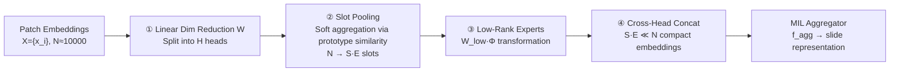

# Mixture of Mini Experts: Overcoming the Linear Layer Bottleneck in Multiple Instance Learning

**Conference**: ICLR 2026  
**OpenReview**: [https://openreview.net/forum?id=S5Io33pc78](https://openreview.net/forum?id=S5Io33pc78)  
**Code**: [https://github.com/mahmoodlab/mammoth](https://github.com/mahmoodlab/mammoth)  
**Area**: Computational Pathology / Whole-Slide Image Classification / Multiple Instance Learning  
**Keywords**: Multiple Instance Learning, Mixture of Experts, Computational Pathology, Whole-Slide Image, Soft Routing, Low-Rank  

## TL;DR
This paper identifies the "task-specific linear layer," often overlooked in Multiple Instance Learning (MIL) pipelines, as the performance bottleneck. It proposes MAMMOTH, a plug-and-play multi-head soft-routing MoE module, to replace this layer. Without increasing the parameter count, MAMMOTH significantly improves the performance of any MIL model (including simple max/mean pooling).

## Background & Motivation
**Background**: In Computational Pathology (CPath), the classification of gigapixel-scale Whole-Slide Images (WSI, approx. 10,000 patches per slide) is typically completed via a three-stage MIL pipeline: ① a patch encoder extracts general features → ② a linear layer maps general features to task-specific features → ③ an aggregator generates a slide-level representation for classification. Academic interest has focused heavily on the first step (Pathology Foundation Models like UNI/Virchow) and the third step (aggregation architectures like ABMIL/CLAM/TransMIL).

**Limitations of Prior Work**: The second step—the linear layer transforming general features into task-specific features—has been largely ignored. Most MIL models apply the **same** linear transformation to all patches, regardless of whether a patch represents epithelial cells, stroma, or lymphocytes. However, breast cancer subtyping requires simultaneously distinguishing various morphological concepts such as epithelial morphology, spatial arrangement, and stromal structure. A shared linear layer compresses patches into a **continuously blurred** embedding space (Fig.1A), making it difficult for downstream aggregators to disentangle these concepts.

**Key Challenge**: Intuitively, a Mixture of Experts (MoE)—where different experts specialize in different morphologies—should replace this layer. However, standard MoE approaches (sparse hard routing) are unsuitable for CPath: the number of patches is massive (≈10,000) while training samples are scarce (<1,000 cases). Hard assignment leads to training instability, uneven expert utilization, and overfitting due to parameter explosion.

**Goal**: Design an MoE module that can replace the linear layer, maintain a **similar parameter budget**, and be plug-and-play for any MIL model.

**Core Idea**: Use **soft routing + multi-head + low-rank + slot pooling**. Each expert processes a "weighted combination of all patches" rather than a hard-assigned subset. This achieves morphological specialization while maintaining training stability and parameter efficiency.

## Method

### Overall Architecture
MAMMOTH (MAtrix-factorized Mixture Module of transformation Heads) directly substitutes $f_{\text{MIL}}^{\text{linear}}$. It transforms the original linear projection in $x_{\text{WSI}} = f_{\text{MIL}}^{\text{agg.}}(\{f_{\text{MIL}}^{\text{linear}}(x_i)\})$ into a pipeline: first, each patch embedding is split into multiple heads for parallel processing; within each head, "slot pooling" based on prototype similarity soft-aggregates thousands of patches into a few slots; then, low-rank experts perform specialized transformations on each slot; finally, the results are concatenated across heads, outputting a compact set of embeddings (**25x smaller than the input**) for the aggregator.

### Key Designs

**1. Multi-head splitting of input: Fine-grained specialization on high-dimensional pathology embeddings.** Patch embeddings from pathology foundation models are high-dimensional (>1024), far exceeding natural image tokens (196/256). MAMMOTH first compresses the embeddings using a linear layer $W \in \mathbb{R}^{(P\cdot H)\times D}$ and splits them into $H$ non-overlapping partitions. The $h$-th partition is $\bar{x}_{i,h} = (Wx_i)[(h-1)P+1 : hP] \in \mathbb{R}^P$, and each is handled by an independent MoE. This differs from Multihead MoE (which flattens partitions into $N\cdot H$ embeddings and shares an expert pool)—MAMMOTH gives each head its own expert pool, providing finer control over embedding subspaces and naturally handling large dimensions. Ablations show that collapsing $H{=}16$ to $H{=}1$ leads to a 5.4% drop.

**2. Slot pooling for soft expert assignment: Every patch contributes to every expert.** This is crucial to avoid the instability of hard routing. For expert $k$, MAMMOTH maintains $S$ trainable, randomly initialized prototypes $\{s_j^{(k)}\}$, each representing a morphological concept. The inner product of input embeddings and prototypes followed by a softmax over $N$ patches yields similarities $\alpha_{j,i}^{(k)} = \frac{\exp(\langle \bar{x}_i, s_j^{(k)}\rangle)}{\sum_{i'}\exp(\langle \bar{x}_{i'}, s_j^{(k)}\rangle)}$. Weighted averaging produces slot embeddings $u_j^{(k)} = \sum_{i=1}^{N}\alpha_{j,i}^{(k)}\cdot\bar{x}_i$. Since all $\alpha$ are non-zero, every patch contributes to every slot (and thus every expert). This "soft assignment" ensures smooth gradients, balanced expert utilization, and provides a "summary" of morphological features within the WSI.

**3. Low-rank experts to maintain parameter budget: Using matrix factorization for expert diversity.** Standard MoE uses dense matrices $W_{\text{full}}^{(k)}$, which scale linearly with the number of experts. MAMMOTH approximates this as "expert-specific small matrices $W_{\text{low}}^{(k)} \in \mathbb{R}^{(D'/H)\times Q}$ × shared matrix $\Phi \in \mathbb{R}^{Q\times P}$", outputting $z_j^{(k)} = \text{LayerNorm}(\text{ReLU}(W_{\text{low}}^{(k)}\cdot\Phi u_j^{(k)}))$. This low-rank decomposition $W_{\text{full}}^{(k)} \simeq W_{\text{low}}^{(k)}\cdot\Phi$ combined with weight sharing allows $E{=}30$ experts while keeping trainable parameters comparable to the original linear layer. Using dense transformations instead leads to a 3.6% performance drop.

**4. Compressed output set instead of per-patch updates: Stable training via prototype aggregation.** While Soft MoE typically restores the output to $N$ updated patch embeddings, MAMMOTH directly uses the concatenated $z_j^{(k)} = \text{Concat}([z_{j,1}^{(k)},\dots,z_{j,H}^{(k)}]) \in \mathbb{R}^D'$ as the final set $\{z_j^{(k)}\}_{j,k=1}^{S\cdot E}$, where $S\cdot E \ll N$. This distills thousands of noisy patches into a few hundred representative morphological aggregates, simplifying the aggregation step and stabilizing training, similar to prototype-based methods. Reverting to per-patch output results in a 4.7% drop.

## Key Experimental Results
Evaluated across **8 MIL methods × 19 classification/survival tasks** (Tissue subtyping: 6; Molecular markers: 13; Survival: 4). Encoder: UNI. Hyperparameters: $E{=}30, H{=}16, S{=}9$.

### Main Results (Tissue Subtyping; Balanced acc. / AUROC / Weighted κ)

| Task (Number of Classes) | ABMIL Base→+Ours | CLAM Base→+Ours | Mean Base→+Ours | Mean of 8 methods ∆ |
|---|---|---|---|---|
| BRACS-C (C=3) | 67.1→72.7 | 56.2→73.4 | 65.1→72.4 | **+7.60** |
| BRACS-F (C=7) | 42.8→46.1 | 32.3→46.8 | 33.7→43.6 | **+6.49** |
| EBRAINS-C (C=12) | 86.1→90.0 | 87.9→91.3 | 86.7→89.4 | **+3.20** |
| EBRAINS-F (C=30) | 67.2→72.4 | 69.8→72.5 | 70.3→72.9 | **+4.33** |
| NSCLC (C=2) | 94.7→94.7 | 91.7→93.7 | 91.4→93.9 | +0.56 |
| PANDA (C=6) | 93.1→94.3 | 92.6→93.3 | 92.7→93.5 | +1.50 |

Improvement was observed in 46 out of 48 configurations for tissue subtyping, with an average gain of **+7.36%**. Decreases occurred only in simple binary tasks like NSCLC that were already saturated.

### Ablation Study (ABMIL, Average of 6 tasks, Full score: 71.6)

| Ablation Dimension | Change | Performance |
|---|---|---|
| Complete Model | MAMMOTH | **71.6** |
| MoE Method | → Original Linear Layer | 68.1 (−4.9%) |
| MoE Method | → Soft MoE | 66.9 (−6.6%) |
| MoE Method | → Sparse Multi-head | 69.1 (−3.5%) |
| MoE Method | → PaMoE | 69.2 (−3.4%) |
| Heads | 16→1 | 67.7 (−5.4%) |
| Transformation | Low-rank→Dense | 69.0 (−3.6%) |
| Shared Φ | Shared→Per-expert | 70.6 (−1.4%) |
| Output | Slots→Per-patch | 68.2 (−4.7%) |
| MoE Target | Linear layer→Aggregator (M4) | 67.4 (−5.9%) |

### Key Findings
- **Task-specific transformation is more important than aggregator choice**: With MAMMOTH, even the weakest aggregator (MaxMIL, 73.9%) outperforms the strongest baseline (ABMIL, 73.6%). Mean/Max pooling improved significantly, surpassing ABMIL by 2.0% and 0.3% respectively.
- **Global reach**: Gains in 130 out of 152 configurations, average **+3.8%**. Survival tasks showed improvement in 30/32 cases, with C-index increasing by an average of +2.78.
- **Interpretability**: Two certified pathologists confirmed that experts spontaneously specialize in different morphologies (tumor, stroma, alveoli, lymphocytes). The model also mitigates "Instance Gradient Interference (IGI)," where heterogeneous patches produce conflicting gradients in a shared linear layer; soft routing decouples these signals.

## Highlights & Insights
- **Precise problem identification**: Accurately identifies the "middle layer" in the triple-stage MIL pipeline as a collective bottleneck and validates this through massive empirical evidence (152 configurations). This is often more valuable than merely proposing a new architecture.
- **Soft routing is key for CPath MoE**: Replacing "hard assignment of few patches" with "soft weighting across all patches" successfully addresses training instabilities caused by the high patch/low sample ratio in pathology. Soft MoE and Sparse MoE both underperform compared to this design.
- **True plug-and-play with zero parameter overhead**: Low-rank decomposition and weight sharing allow 30 experts to fit within the parameter budget of the original linear layer. This makes it highly compatible across 8 different MIL methods with a low barrier for adoption.
- **IGI mechanism**: The observation of Instance Gradient Interference provides a theoretical explanation for why specialization converges quickly in the first epoch, going beyond simple performance benchmarking.

## Limitations & Future Work
- **Limited gains on simple/molecular tasks**: Improvements for saturated binary tasks (e.g., NSCLC) and molecular marker tasks with low baseline AUC (e.g., KRAS, PIK3CA) are inconsistent or slightly negative, likely because morphological signals are insufficient for MoE to exploit.
- **Dependence on strong foundation model embeddings**: The method assumes embeddings from models like UNI already implicitly cluster similar morphologies, enabling "specialization from the start." Whether this holds for weaker encoders is not fully discussed.
- **Hyperparameter sensitivity**: Many hyperparameters ($E, H, S$) are fixed; their cross-task adaptability and the relationship between expert count and slide heterogeneity require further investigation.

## Related Work & Insights
- **MoE Lineage**: Addressing representation collapse in sparse hard routing (Switch/GShard), differentiable gating in Soft MoE, and fine-grained specialization in Sparse Multi-head MoE. MAMMOTH is a fusion of soft routing, multi-head, and parameter efficiency (LoRA-style low-rank/weight sharing).
- **MoE in CPath**: Previous works used MoE for multi-task aggregators (M4), artifact detection via CNN weighting, or replacing transformer FFNs (PaMoE). MAMMOTH is unique in replacing the "ubiquitous initial linear layer," maximizing its generalizability.
- **Insight**: In any set-based task involving "transformation followed by aggregation" (point clouds, video tokens, retrieval), the "ignored element-wise transformation layer" may be a hidden bottleneck. Soft-routing MoE + set compression represents a low-cost, transferable replacement paradigm.

## Rating
- **Novelty**: ⭐⭐⭐⭐ While not inventing MoE, the identification of the MIL bottleneck in the linear layer and the combination of soft routing/multi-head/low-rank for CPath is insightful.
- **Experimental Thoroughness**: ⭐⭐⭐⭐⭐ High volume and rigor with 8 MIL methods, 19 tasks, 152 configurations, complete ablations, pathologist validation, and IGI mechanism analysis.
- **Writing Quality**: ⭐⭐⭐⭐ Clear logic across motivation, method, and experiments; formulas and diagrams are well-executed. Rationales for hyperparameter values could be more detailed.
- **Value**: ⭐⭐⭐⭐⭐ High practical utility for CPath due to its plug-and-play nature, zero parameter cost, and universal performance gains across MIL frameworks.

<!-- RELATED:START -->

## Related Papers

- [\[ICLR 2026\] ASMIL: Attention-Stabilized Multiple Instance Learning for Whole-Slide Imaging](asmil_attention-stabilized_multiple_instance_learning_for_whole-slide_imaging.md)
- [\[ICML 2025\] Do Multiple Instance Learning Models Transfer?](../../ICML2025/medical_imaging/do_multiple_instance_learning_models_transfer.md)
- [\[ICML 2026\] EEG-Based Multimodal Learning via Hyperbolic Mixture-of-Curvature Experts](../../ICML2026/medical_imaging/eeg-based_multimodal_learning_via_hyperbolic_mixture-of-curvature_experts.md)
- [\[CVPR 2026\] Contrastive Cross-Bag Augmentation for Multiple Instance Learning-based Whole Slide Image Classification](../../CVPR2026/medical_imaging/contrastive_cross-bag_augmentation_for_multiple_instance_learning-based_whole_sl.md)
- [\[AAAI 2026\] SEMC: Structure-Enhanced Mixture-of-Experts Contrastive Learning for Ultrasound Standard Plane Recognition](../../AAAI2026/medical_imaging/semc_structure-enhanced_mixture-of-experts_contrastive_learning_for_ultrasound_s.md)

<!-- RELATED:END -->
