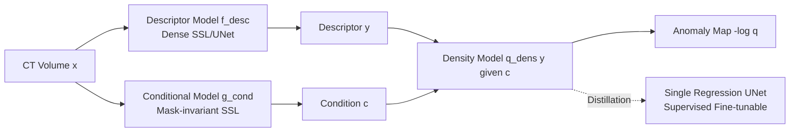

# Modeling the Density of Pixel-level Self-supervised Embeddings for Unsupervised Pathology Segmentation in Medical CT

**Conference**: ICLR 2026  
**OpenReview**: [https://openreview.net/forum?id=i7YnUW0uWg](https://openreview.net/forum?id=i7YnUW0uWg)  
**Code**: [https://github.com/mishgon/screener](https://github.com/mishgon/screener)  
**Area**: Medical Imaging / Unsupervised Anomaly Segmentation / Self-supervised Representation Learning  
**Keywords**: UVAS, Density Estimation, Dense Self-supervised Learning, 3D CT, Pathology Segmentation, Mask-invariant Condition  

## TL;DR
This paper proposes Screener: replacing ImageNet pre-trained features with dense self-supervised learning and replacing manual sinusoidal positional encodings with "mask-invariant" learnable conditional variables. This approach renders the density-based Unsupervised Visual Anomaly Segmentation (UVAS) framework fully self-supervised. After training on 30,000 unlabeled CT scans, it significantly outperforms existing UVAS methods on a multi-pathology test set of 1,820 cases.

## Background & Motivation
- **Background**: Detecting "all" pathologies in 3D medical imaging is a significant challenge. Supervised models can only recognize a few annotated pathology categories (e.g., lung cancer, pneumonia, kidney/liver tumors) and are ineffective against unannotated lesions (e.g., pneumothorax). Meanwhile, vast amounts of unlabeled CT data remain underutilized.
- **Limitations of Prior Work**: When pathology detection is reformulated as Unsupervised Visual Anomaly Segmentation (UVAS), mature methods from natural images underperform in medical imaging. Synthesis-based (DRAEM, MOOD) and reconstruction-based (Autoencoder, f-AnoGAN) methods require training sets to be "entirely healthy," but uncurated CT datasets contain many diseased patients that cannot be automatically excluded. The only density-based methods (CFLOW, MSFlow) that assume "pathology is rare" rather than "absent" rely on ImageNet pre-trained encoders, suffering from severe domain shift.
- **Key Challenge**: Density-based UVAS frameworks are theoretically most suitable for medical scenarios (requiring "rarity" instead of "absence"), but their two core components are designed for natural images: descriptors come from ImageNet encoders (domain shift), and conditional variables use manual sinusoidal positional encodings (medical scans lack anatomical alignment, and positional encodings lack anatomical/patient-level semantics). Replacing these with supervised medical encoders (STU-Net) also fails as features are too task-specific and lack general information for pathology discrimination.
- **Goal**: Construct a fully self-supervised density-based UVAS model that depends neither on annotations nor on external pre-training, capable of both direct unsupervised pathology segmentation and distillation into a fine-tunable pathology segmentation foundation model.
- **Core Idea**: **Reconstruct both components of density-based UVAS using dense self-supervision**—(1) Dense SSL learns in-domain, high-resolution, and discriminative descriptors to replace ImageNet features; (2) Learnable pixel-level embeddings that are "mask-invariant" serve as conditional variables to replace manual positional encodings, simplifying the conditional distribution to the point where a simple Gaussian can rival normalizing flows.

## Method

### Overall Architecture
Screener follows the "descriptor model + density model" structure of density-based UVAS and replaces the conditional mechanism with a learnable self-supervised module. Three modules are trained sequentially: the descriptor model $f_{\theta_{desc}}$ encodes the CT into dense features $y$; the conditional model $g_{\theta_{cond}}$ encodes mask-invariant contextual conditions $c$; and the density model $q_{\theta_{dens}}(y\mid c)$ learns the conditional distribution. During inference, the negative log-density $-\log q(y[p]\mid c[p])$ is used as the anomaly score per voxel. All three modules are executed efficiently per voxel using $1\times1\times1$ convolutions. Finally, the entire inference pipeline is distilled into a single UNet to make the framework amenable to supervised fine-tuning.

### Key Designs

**1. Dense Self-supervised Descriptors: Allowing "normal" to naturally cluster in high-density areas.** The quality of the descriptor determines the success of density modeling — it must be discriminative for pathologies yet robust to irrelevant normal variations. The authors use dense SSL to achieve this balance: two random-sized, overlapping 3D crops are taken from a CT volume, scaled to $H\times W\times S$, and augmented (color jitter, etc.) to obtain $x^{(1)},x^{(2)}$. These pass through the descriptor model to produce feature maps $y^{(1)},y^{(2)}$. Voxel-level targets (DenseInfoNCE or DenseVICReg) force even spatially adjacent positions to be distinguishable, while augmentation invariance removes low-level details, making the embedding space smoother and more semantic—similar normal patterns naturally fall into high-density regions. The architecture is intentionally "minimalist," using a UNet with full-resolution output for precise localization without multi-scale feature pyramids.

**2. Mask-invariant Conditional Variables: Scrubbing "pathology presence" from the context.** Whether a local pattern is abnormal depends on context (anatomical location, patient age/sex)—the same calcification is normal in an elderly lung but abnormal in a breast. Manual sinusoidal positional encodings lack anatomical semantics in unaligned medical scans. The key idea is to train the conditional model $g_{\theta_{cond}}$ to predict voxel embeddings that are "consistent under different masked views." Even if a lesion is visible in one masked view and obscured in another, the model must predict the same conditional embedding for that position. Consequently, the learned conditional features are invariant to the presence of anomalies, retaining only information that can be robustly inferred from global structure (anatomical location, tissue type, patient demographics).

**3. Conditional Density Modeling + Distillation into Fine-tunable UNet.** The density model can be viewed as a predictor that "predicts descriptors based on conditions," where the anomaly score is the per-position prediction error. During training, $m$ crops are sampled, and the pre-trained descriptor/condition models generate $\{y_i\},\{c_i\}$ to minimize the negative log-likelihood $\frac{1}{m\cdot|P|}\sum_i\sum_{p}-\log q_{\theta_{dens}}(y_i[p]\mid c_i[p])$. Two parameterizations are used: simple Gaussian (baseline) and normalizing flows. Because the conditional variable simplifies the distribution, simple Gaussians approach the performance of flow models. For inference, the volume is processed in overlapping patches. To address the non-end-to-end nature of the pipeline, the authors **distill** the entire inference process into a single UNet: using the negative log-density maps from Screener as "pseudo-labels," a regression UNet is trained with MSE, which serves as a new form of self-supervised pre-training.

## Key Experimental Results

Training set: NLST, AMOS, AbdomenAtlas (30,000+ unlabeled CTs); Test set: LIDC, MIDRC, KiTS, LiTS (1,820 cases, only partial pathologies annotated). Metrics include voxel-level AUROC and Dice.

### Main Results (Unsupervised Setting, Voxel-level AUROC)

| Method | LIDC | MIDRC | KiTS | LiTS |
|---|---|---|---|---|
| Autoencoder | 0.71 | 0.65 | 0.66 | 0.68 |
| f-AnoGAN | 0.82 | 0.66 | 0.67 | 0.67 |
| Patched Diffusion | 0.87 | 0.76 | 0.76 | 0.80 |
| DRAEM | 0.63 | 0.72 | 0.82 | 0.83 |
| MOOD-Top1 | 0.79 | 0.79 | 0.77 | 0.80 |
| MSFlow | 0.71 | 0.67 | 0.63 | 0.63 |
| **Screener (Ours)** | **0.96** | **0.87** | **0.90** | **0.93** |

### Ablation Study (Conditional Model × Density Model, DenseVICReg Descriptor)

| Conditional Model | Density Model | LIDC | MIDRC | KiTS | LiTS |
|---|---|---|---|---|---|
| None | Gaussian | 0.81 | 0.81 | 0.61 | 0.71 |
| Sin-cos pos. | Gaussian | 0.82 | 0.80 | 0.74 | 0.77 |
| APE | Gaussian | 0.88 | 0.80 | 0.78 | 0.86 |
| **Masking-invariant** | Gaussian | **0.96** | **0.84** | **0.87** | **0.90** |
| Sin-cos pos. | Norm. flow | 0.96 | 0.89 | 0.90 | 0.94 |
| Masking-invariant | Norm. flow | 0.96 | 0.87 | 0.90 | 0.93 |

### Key Findings
- **Major Unsupervised Lead**: Screener crushes all UVAS baselines in AUROC across four test sets (e.g., LIDC 0.96 vs. 0.87 for the runner-up). Reconstruction methods overfit training pathologies, synthesis methods fail to generalize to real lesions, and ImageNet-dependent MSFlow fails on CT.
- **Mask-invariant Conditions Bridge the Gap**: When using normalizing flows, different conditional strategies perform similarly. However, with simple Gaussians, the results improve with more informative conditions. Mask-invariant conditions allow the Gaussian model to match complex flow models, validating the core argument that "conditions simplify the distribution."
- **Low-shot Fine-tuning as SOTA Pre-training**: With only 25 annotated cases per fold, distilled Screener consistently improves downstream segmentation (LIDC Dice relative gain of ~49% over training from scratch, $p<0.01$), comparable to supervised pre-trained STU-Net and strong SSL like VoCo.
- **Descriptor Ablation**: DenseVICReg slightly outperforms DenseInfoNCE; self-supervised descriptors significantly outperform ImageNet-ResNet50 and supervised STU-Net.

## Highlights & Insights
- **Full Self-supervision in Density-based UVAS**: Both descriptors and conditions are reconstructed with dense SSL, removing dependence on annotations and external pre-training. This directly addresses the structural constraint that "untainted healthy training sets" are unavailable in medical CT.
- **Mask-invariance as an Elegant Condition Learning Principle**: Using "invariance to masking" to define "contextual information irrelevant to pathology" is concise and self-consistent—it effectively strips local content that leaks anomaly information while retaining robust anatomical semantics.
- **Distillation into a Single UNet**: This bridge allows the multi-module pipeline to be reinterpreted as a self-supervised pre-training method, facilitating downstream fine-tuning.
- **First Large-scale CT UVAS Evaluation**: The systematic comparison across 1,820 cases fills a gap in large-scale benchmarking for UVAS in medical imaging.

## Limitations & Future Work
- **No Gain in Full Data Fine-tuning**: When ample annotations are available, Screener pre-training no longer offers an advantage over training from scratch, limiting its value in data-rich scenarios.
- **Dice Underestimation and Threshold Selection**: Since ground truths only label target pathologies while the model detects all anomalies, many "true positives" are treated as false positives. Threshold selection still requires a small number of annotated cases.
- **CT Specificity**: Although claimed to be domain-agnostic, the experiments focus exclusively on 3D CT. Transferability to MRI or pathology slides has not been verified.
- **Complex Pipeline**: The three-stage training process (descriptor $\rightarrow$ condition $\rightarrow$ density $\rightarrow$ distillation) still has room for optimization in terms of end-to-end training and efficiency.

## Related Work & Insights
- **Density-based UVAS**: CFLOW and MSFlow (Gudovskiy 2022; Zhou 2024) established the "descriptor + conditional normalizing flow" paradigm; this work inherits the framework but replaces both major components.
- **Dense SSL**: DenseCL, VADER, and VICRegL (Wang 2021; Pinheiro 2020; Bardes 2022) provide pixel-level SSL objectives; the authors simplified these for the medical domain.
- **Medical Pre-training**: Comparison with SwinUNETR, VoCo, and STU-Net proves that self-supervised descriptors can surpass supervised features in specific contexts.
- **Inspiration**: Using "invariance to a specific augmentation" as a tool to strip specific information (e.g., masking to strip pathology info) is a generalizable design pattern for tasks requiring contextual conditioning while shielding target signals.

## Rating
- **Novelty**: ⭐⭐⭐⭐ Reconstructing both components of density UVAS with dense SSL. The "mask-invariant condition" is a concise and insightful mechanism.
- **Experimental Thoroughness**: ⭐⭐⭐⭐ 30,000 training cases and 1,820 test cases across four datasets. Comprehensive unsupervised, fine-tuning, and ablation experiments.
- **Writing Quality**: ⭐⭐⭐⭐ Logical flow with clear motivation and standardized notation.
- **Value**: ⭐⭐⭐⭐ Provides a practical self-supervised solution and the first CT UVAS benchmark, with high utility due to open-source code and models.

<!-- RELATED:START -->

## Related Papers

- [\[ICLR 2026\] HEEGNet: Hyperbolic Embeddings for EEG](heegnet_hyperbolic_embeddings_for_eeg.md)
- [\[CVPR 2026\] IBISAgent: Reinforcing Pixel-Level Visual Reasoning in MLLMs for Universal Biomedical Object Referring and Segmentation](../../CVPR2026/medical_imaging/ibisagent_reinforcing_pixel-level_visual_reasoning_in_mllms_for_universal_biomed.md)
- [\[ICLR 2026\] PathChat-SegR1: Reasoning Segmentation in Pathology via SO-GRPO](pathchat-segr1_reasoning_segmentation_in_pathology_via_so-grpo.md)
- [\[CVPR 2026\] Dual-Level Confidence based Implicit Self-Refinement for Medical Visual Question Answering](../../CVPR2026/medical_imaging/dual-level_confidence_based_implicit_self-refinement_for_medical_visual_question.md)
- [\[ICCV 2025\] Boosting Vision Semantic Density with Anatomy Normality Modeling for Medical Vision-language Pre-training](../../ICCV2025/medical_imaging/boosting_vision_semantic_density_with_anatomy_normality_modeling_for_medical_vis.md)

<!-- RELATED:END -->
