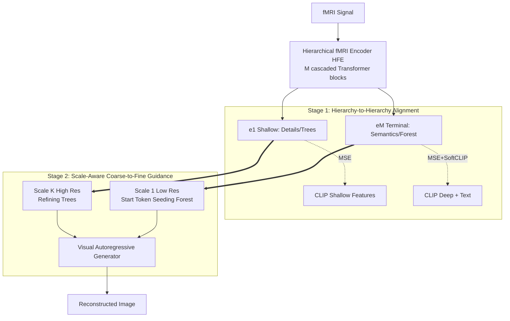

# Moving Beyond Diffusion: Hierarchy-to-Hierarchy Autoregression for fMRI-to-Image Reconstruction

**Conference**: ICLR 2026  
**OpenReview**: [https://openreview.net/forum?id=AT7hCh6HB7](https://openreview.net/forum?id=AT7hCh6HB7)  
**Code**: [https://github.com/XuZhang2/MindHier](https://github.com/XuZhang2/MindHier)  
**Area**: Brain Signal Decoding / fMRI-to-Image Reconstruction / Visual Autoregressive Generation  
**Keywords**: fMRI-to-Image, Visual Autoregression (VAR), Hierarchical Alignment, Coarse-to-Fine, CLIP, NSD  

## TL;DR
MindHier shifts fMRI-to-image reconstruction from "diffusion models + single static guidance" to "next-scale autoregression + hierarchical neural guidance." By injecting brain signals into the generation process across scales following the "forest before trees" principle, it achieves SOTA semantic metrics on NSD while being 4.67× faster and more deterministic.

## Background & Motivation
**Background**: Reconstructing images seen by subjects from fMRI signals is a core task linking computer vision and cognitive neuroscience. Recent mainstream approaches almost exclusively rely on diffusion models: encoding fMRI into a neural embedding within the CLIP space and using it as a "fixed guidance" to iteratively denoise images from Gaussian noise.

**Limitations of Prior Work**: The authors identify two fundamental flaws in this "single static guidance" paradigm. First, fMRI signals are inherently **hierarchical**—different brain regions encode coarse-grained semantics and fine-grained perceptual details. Existing methods collapse this rich information into a **single vector**, leading to significant information loss. Second, while the guidance signal remains **time-invariant**, the generative process is **multi-staged and dynamic**: early stages require global semantic constraints, while later stages require precise structural and textural cues. Static guidance is redundant early on and insufficient later, causing a mismatch between "representation" and "generation." Furthermore, diffusion models offer limited control points for guidance injection.

**Key Challenge**: The hierarchical structure of fMRI + the phased requirements of generation ↔ prior methods use a fixed vector throughout, losing hierarchy and failing to match stages.

**Goal**: Design a reconstruction framework capable of **injecting different levels of neural features at different generation stages**, allowing global semantics to be established first and local details to be refined later.

**Key Insight**: **Replace Diffusion with Visual Autoregression (VAR)**. The "next-scale prediction" in VAR naturally provides a sequence of discrete, controllable scale (resolution) points. By encoding fMRI into multi-level features where **deep semantics guide small scales and shallow details guide large scales**, the reconstruction mimics the "Forest before Trees" hierarchical principle of human perception.

## Method

### Overall Architecture
MindHier is a two-stage coarse-to-fine reconstruction framework. **Stage 1** trains a Hierarchical fMRI Encoder (HFE) to decouple fMRI signals into a set of multi-level features ranging from global semantics to local details, aligned to different layers of a frozen CLIP via hierarchical alignment loss. **Stage 2** freezes the encoder and fine-tunes a scale-based autoregressive generator (pre-trained on Switti/VAR). Different levels of fMRI features are injected into $K$ scales of generation via masked cross-attention, following the "deep guides coarse, shallow guides fine" strategy.

### Key Designs

**1. Hierarchical fMRI Encoder (HFE): Decoupling brain signals into a "Forest-to-Trees" feature pyramid.** Instead of compressing fMRI into a single vector, HFE uses $M$ cascaded Transformer blocks, treating the output of each block $\{e_1,\dots,e_M\}$ as part of the hierarchical representation. This leverages the established pattern in ViTs—shallow layers process local information while deep layers aggregate global information. The terminal output $e_M$ encodes abstract global semantics ("Forest"), while early blocks $e_1,\dots$ preserve fine-grained perceptual details ("Trees"). This single-forward pass for all features contributes to inference efficiency.

**2. Hierarchy-to-Hierarchy Alignment: Using CLIP hierarchy as a blueprint to supervise HFE layer-by-layer.** Structural architecture alone is insufficient; hierarchical training objectives are required to force the encoder to learn structured decomposition. The authors use two complementary losses. **Structural Alignment** uses cascaded MSE to align the output $e_m$ of the $m$-th HFE block with the corresponding layer $v_{g_m}$ of the CLIP image encoder (using $\ell_2$ normalization for stability):
$$\mathcal{L}_{\text{MSE}}=\sum_{m=1}^{M}\big\|\ell_2(e_m)-\ell_2(v_{g_m})\big\|_2^2$$
where the mapping $g_m=8+4m$ aligns fMRI to layers $\{12,16,20,24\}$ of CLIP ViT-L/14. **Semantic Alignment** applies a SoftCLIP contrastive loss to the terminal feature $e_M$ to align with both image features $v$ and text caption features $t$ in the CLIP latent space, providing a global semantic anchor:
$$\mathcal{L}_{\text{SoftCLIP}}=-\frac{1}{B}\sum_{i=1}^{B}\Big[\log\frac{\exp(e_i\cdot v_i/\tau)}{\sum_j\exp(e_i\cdot v_j/\tau)}+\log\frac{\exp(e_i\cdot t_i/\tau)}{\sum_j\exp(e_i\cdot t_j/\tau)}\Big]$$
This top-down alignment (deep-to-deep for layout, shallow-to-shallow for texture) is critical for reconstruction quality.

**3. Scale-Aware Coarse-to-Fine Neural Guidance: Precisely injecting hierarchical features into autoregression by resolution.** VAR quantizes images into $K$ multi-scale token maps $R=\{r_1,\dots,r_K\}$, and autoregressively predicts $p(R|E)=\prod_k p(r_k|r_{<k})$. MindHier replaces generic conditions with **scale-specific** features $s_k$:
$$p(R|E)=\prod_{k=1}^{K} p(r_k\mid r_{<k},\,s_k)$$
Guidance is dynamically selected across two cognitively inspired phases: **Seeding the "Forest" ($k{=}1$)** uses the most abstract semantic feature $e_M$ as a special Start Token to initialize the lowest resolution, providing a coherent global base. **Refining "Trees" ($1<k\le K$)** injects detail features $s_k=e_{h_k}$ at higher resolutions via multi-head cross-attention. The index $h_k=M-\lfloor M(k-1)/K\rfloor$ maps early-block detail features to late-stage generation. This is implemented via a **selective attention mask**: coarse scales only attend to deep semantic features, while fine scales attend to shallow detail features.

## Key Experimental Results

### Main Results (NSD New Test Set, Average across Subject 1/2/5/7)

| Method | PixCorr↑ | SSIM↑ | Incep↑(%) | CLIP↑(%) | Eff↓ | SwAV↓ | Inference (s)↓ |
|------|---------|-------|-----------|----------|------|-------|---------|
| Takagi[CVPR23] | 0.246 | 0.410 | 83.8 | 82.1 | 0.811 | 0.504 | 15.08 |
| MindBridge[CVPR24] | 0.151 | 0.263 | 92.4 | 94.7 | 0.712 | 0.418 | 15.98 |
| Wills Aligner[AAAI25] | 0.271 | 0.328 | 94.3 | 94.8 | 0.649 | 0.373 | - |
| **MindHier (Ours)** | 0.235 | 0.381 | **95.9** | **96.4** | **0.606** | **0.329** | **2.64** |
| †MindEye2[ICML24] | 0.322 | 0.431 | 95.4 | 93.0 | 0.619 | 0.344 | 12.14 |
| †MindHier (Ours) | 0.326 | 0.461 | 95.9 | 95.4 | 0.613 | 0.345 | **2.64** |

(† indicates additional use of MindEye2 biological low-level features.) MindHier achieves SOTA in high-level semantic metrics (Incep/CLIP/Eff/SwAV), with an inference time of 2.64s—**4.67× faster** than MindEye2 (12.14s).

### Ablation Study (Subject 1)

| Encoder Design | CLIP↑ | SwAV↓ | Conclusion |
|-----------|-------|-------|------|
| Single Feature | 95.1% | 0.346 | Baseline |
| Hierarchical (Terminal Supervision only) | 95.4% | 0.339 | Slight gain |
| **Hierarchical (Full Cascaded Supervision)** | **97.2%** | **0.321** | Hierarchy + layer-wise supervision are both essential |

| CLIP Layer Mapping | CLIP↑ | PixCorr↑ | Conclusion |
|------------|-------|----------|------|
| $g_m{=}16{+}2m$ {18,20,22,24} | 95.4% | 0.226 | Too late → Semantic homogeneity, lacks distinctness |
| $g_m{=}6m$ {6,12,18,24} | 94.8% | 0.283 | Too early → Better low-level, lower semantics |
| **$g_m{=}8{+}4m$ {12,16,20,24}** | **97.2%** | 0.273 | Balanced at middle-deep layers |

| Guidance Direction | CLIP↑ | SwAV↓ |
|---------|-------|-------|
| **Coarse-to-Fine** | **97.2%** | **0.321** |
| Fine-to-Coarse | 96.1% | 0.330 |

### Key Findings
- **Hierarchy + Per-layer supervision is the core source of gain**: Moving from single-feature to full cascaded supervision improves CLIP from 95.1% to 97.2%.
- **CLIP layer mapping involves a low-vs-high level trade-off**: Mapping to early layers favors low-level metrics but hurts semantics; mapping to late layers causes semantic homogenization. The middle-to-deep range $\{12,16,20,24\}$ is optimal.
- **Directionality matters**: Reversing the guidance to fine-to-coarse drops CLIP by 1.1%, though the model does not collapse, suggesting VAR+Attention is robust enough to partially compensate for suboptimal guidance.
- **Deterministic Advantage**: Initializing from fMRI features (rather than random noise) results in almost identical repeats, whereas diffusion baselines like MindBridge exhibit significant drift in color and appearance across trials.

## Highlights & Insights
- **Paradigm Shift**: This is the first work to systematically introduce "next-scale prediction" via Visual Autoregression (VAR) to fMRI-to-image tasks, arguing that VAR is more inherently compatible with the hierarchical nature of brain signals than Diffusion.
- **Cognitive Alignment**: The model operationalizes the "Forest before Trees" neuroscientific principle (Navon 1977) into a computational framework, rather than applying generic generative models.
- **Triple Balance**: Establishes a rare balance between semantic fidelity, deterministic stability, and inference speed, moving fMRI decoding toward real-time BCI feasibility.
- **Efficiency Logic**: High speed stems from the single-pass hierarchical encoder and the fact that VAR concentrates most computation on low-resolution scales.

## Limitations & Future Work
- **Suboptimal Low-level Metrics**: In pixel-level metrics like PixCorr and SSIM, the model lags behind diffusion methods like MindEye2 unless auxiliary low-level features (†) are used, indicating VAR still has a gap in precise texture alignment.
- **Dependency on CLIP Hierarchical Prior**: The supervision relies on the assumption that "CLIP shallow=details, deep=semantics." The mapping function $g_m$ is a manually tuned hyperparameter.
- **Single Dataset Validation**: Only tested on the Natural Scenes Dataset (NSD). Generalization across datasets or in real-time online BCI scenarios remains to be verified.
- **Non-End-to-End**: The encoder and generator are trained in separate stages with a frozen encoder; joint optimization has not been explored.

## Related Work & Insights
- **fMRI-to-image Lineage**: Evolved from manual features/sparse regression → VAE/GAN pixel reconstruction → IC-GAN/StyleGAN latents → Current LDM+CLIP semantic dominance. MindHier provides a critical reassessment of the "single CLIP vector guidance" mainline.
- **Visual Autoregression (VAR, Tian et al. 2024)**: The foundational backbone of this work. MindHier adapts it from pure generation to conditional brain decoding by initializing the generator with Switti pre-training.
- **Insight**: For any task using a fixed embedding to guide multi-stage generation (e.g., Text-to-Image), this work suggests a generalizable path: aligning conditional signals hierarchically so that condition granularity matches the dynamic generation stages.

## Rating
- **Novelty**: ⭐⭐⭐⭐ A convincing paradigm shift to VAR with hierarchical alignment and scale-aware guidance.
- **Experimental Thoroughness**: ⭐⭐⭐⭐ Strong internal logic with diagnostic experiments; slightly limited by its focus on a single dataset.
- **Writing Quality**: ⭐⭐⭐⭐ Clear cognitive metaphors ("Forest before Trees") and well-aligned methodology.
- **Value**: ⭐⭐⭐⭐ Significant speedup and deterministic stability make it highly relevant for real-time neural decoding.

<!-- RELATED:START -->

<!-- RELATED:END -->

## Related Papers

- [\[ICLR 2026\] Brain-IT: Image Reconstruction from fMRI via Brain-Interaction Transformer](brain-it_image_reconstruction_from_fmri_via_brain-interaction_transformer.md)
- [\[ICLR 2026\] DM4CT: Benchmarking Diffusion Models for Computed Tomography Reconstruction](dm4ct_benchmarking_diffusion_models_for_computed_tomography_reconstruction.md)
- [\[CVPR 2026\] Benchmarking Endoscopic Surgical Image Restoration and Beyond](../../CVPR2026/medical_imaging/benchmarking_endoscopic_surgical_image_restoration_and_beyond.md)
- [\[ICLR 2026\] Distributional Consistency Loss: Beyond Pointwise Data Terms in Inverse Problems](distributional_consistency_loss_beyond_pointwise_data_terms_in_inverse_problems.md)
- [\[CVPR 2026\] D$^2$-FOSA: Dual-Diffusion Guided EEG-to-Image Reconstruction with Frequency-Oriented Semantic Alignment](../../CVPR2026/medical_imaging/d2-fosa_dual-diffusion_guided_eeg-to-image_reconstruction_with_frequency-oriente.md)

<!-- RELATED:END -->
