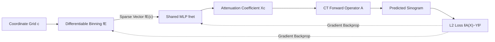

# NAB: Neural Adaptive Binning for Sparse-View CT Reconstruction

**Conference**: ICLR 2026  
**OpenReview**: [https://openreview.net/forum?id=ARXIoso9D3](https://openreview.net/forum?id=ARXIoso9D3)  
**Code**: [https://github.com/Wangduo-Xie/NAB_CT_reconstruction](https://github.com/Wangduo-Xie/NAB_CT_reconstruction)  
**Area**: Self-supervised CT Reconstruction / Implicit Neural Representation / Coordinate Encoding  
**Keywords**: Sparse-view CT, Shape Prior, Adaptive Binning, Coordinate Encoding, Implicit Neural Representation, Industrial CT  

## TL;DR
This work replaces Random Fourier Coding in Implicit Neural Representations (INR) with a set of differentiable "adaptive rectangular bins." By explicitly incorporating the rectangular shape priors common in industrial objects into the coordinate encoding, the position, size, rotation, and steepness of each bin are learned end-to-end from projection data. This approach significantly outperforms INR baselines in sparse-view CT reconstruction.

## Background & Motivation

**Background**: Sparse-view CT reconstruction is a classic ill-posed inverse problem. To reduce industrial inspection costs and medical radiation doses, it is desirable to recover high-quality tomographic images from as few scanning angles as possible. Supervised learning methods rely on paired sparse/dense view training, but distribution shifts between training and testing lead to poor generalization. Consequently, Implicit Neural Representations (INR) have become mainstream: spatial coordinates are mapped to high-frequency features using Random Fourier Coding (RFC), which are then passed through a small MLP to predict attenuation coefficients. This enables self-supervised reconstruction based solely on the object's own projection data.

**Limitations of Prior Work**: RFC-based encoding has two structural flaws. First, it relies on a one-time randomly sampled frequency matrix $\Omega$, which contains no shape prior information about the object—despite industrial CT targets mostly being man-made objects like bricks, brackets, and metal plates that are **predominantly rectangular**. This strong prior is wasted. Second, the functions representable by INR are restricted to harmonic combinations like $\sum_{\omega} c_\omega \sin((\omega, r)+\phi_\omega)$. Due to the Gibbs phenomenon, overshooting and ripple artifacts inevitably occur near the sharp boundaries of rectangular objects, which cannot be eliminated even with more trigonometric bases.

**Key Challenge**: Information is inherently insufficient in sparse-view scenarios, making priors more critical. However, general bases like Fourier encoding neither carry shape priors nor naturally fit right-angled boundaries, meaning the most unsuitable tool is used in the most information-deficient scenario.

**Goal**: To design a differentiable coordinate encoding that explicitly models the prior that "objects are composed of several rectangular blocks," ensuring that the geometric parameters of each block can be optimized via gradients alongside the projection loss.

**Core Idea (Neural Adaptive Binning)**: A 1D "square wave" is constructed using the difference between two shifted hyperbolic tangent (tanh) functions. By applying this along two orthogonal axes and taking the Hadamard product, a local rectangular bin is formed. Differentiable rotation and scaling are then added, allowing the bin to adaptively translate, scale, and rotate to fit any rectangular region within the object.

## Method

### Overall Architecture

NAB replaces the entire encoding module in the classic INR pipeline of "coordinate → RFC → MLP → attenuation coefficient." The coordinate grid is first encoded into a sparse vector (where each dimension corresponds to an adaptive rectangular bin) via a set of differentiable binning functions $\hat g(\cdot)$. This vector is then fed into a shared MLP to predict the attenuation coefficient at each point. The full-image attenuation coefficients are projected into a sinogram via the CT forward operator $A$, and an L2 loss is calculated against the measured projections. Gradients flow back to update both the MLP weights and the geometric parameters of all bins. The process is self-supervised for a single object and requires no external dataset.

### Key Designs

**1. Differentiable rectangular binning via double tanh: Turning "hard boxes" into differentiable shape bases.** The challenge lies in the fact that a "rectangular region" is a non-differentiable indicator function. The authors construct a 1D "square wave" along the x-axis: $\gamma(c)_i = \frac{1}{2}\tanh(k_i(x_c-u_i+\frac{1}{2}h_i)) - \frac{1}{2}\tanh(k_i(x_c-u_i-\frac{1}{2}h_i))$, where $u_i$ is the center, $h_i$ is the side length, and $k_i$ controls the steepness. A dual square wave $\mu(c)_i$ is constructed for the y-axis (parameters $v_i, w_i$). The Hadamard product $g(c)_i = \mu(c)_i \times \gamma(c)_i$ yields a local rectangular bin. Since tanh is differentiable everywhere, the position and size of these "rectangles" can be driven by gradients.

**2. Rotational Embedding: Releasing bins from axis-alignment.** Real-world rectangular parts are rarely aligned perfectly with axes. The authors apply an affine rotation to input coordinates before calculating the square waves: $[x_c-u_i, y_c-v_i]$ is projected onto rotated directions. The rotated bin $\hat g(c)_i$ rotates by angle $\theta_i$ around the center $(u_i,v_i)$. Since $\theta_i$ is also differentiable, it can be learned. The final encoding is $f_E(c) = [\lambda_1\hat g(c)_1, \dots, \lambda_M\hat g(c)_M]^\top$, where each bin also has an amplitude factor $\lambda_i$. Thus, position, size, rotation, steepness, and height are all end-to-end optimizable.

**3. Limit Approximation: Proving it as a non-random hard binning.** The authors theoretically link this soft binning to random hard binning in kernel methods. They prove analytically that as steepness $k_i \to +\infty$, the encoding $f_E(c)$ converges to a set of binary vectors $S$ representing ideal rectangles with sharp boundaries. This establishes a mathematical connection with the random binning of Rahimi & Recht—except NAB places these bins non-randomly and with orientation.

**4. Multi-scale Steepness: Generalizing from right angles to curved geometries.** Purely rectangular bins cannot fit objects with curves or circles. The authors allow steepness $k_i$ to take values from a scale set $\{p_1, \dots, p_q\}$. This set includes high steepness (near-hard rectangles) and low steepness (smooth, bump-like functions). Different steepnesses provide various smooth variants, offering richer bases. This multi-scale mechanism allows the framework to cover both rectangular and curved structures in datasets like Workpieces.

## Key Experimental Results

Datasets: **CaCO3** industrial dataset (predominantly rectangular) and **Workpieces** (containing curves/circles). Projections generated at 16/14/12 views. Metrics: PSNR/SSIM.

### Main Results (CaCO3, Selected)

| Method | 16-view PSNR↑ | 16-view SSIM↑ | 12-view PSNR↑ | Parameters↓ |
|------|------|------|------|------|
| FBP | 11.74 | 0.125 | 9.44 | - |
| DIP-TV | 24.05 | 0.783 | 22.40 | $1.90 \times 10^6$ |
| Instant-NGP | 30.81 | 0.953 | 27.23 | $2.96 \times 10^6$ |
| INRf (Random Fourier) | 29.01 | 0.934 | 25.08 | $2.49 \times 10^5$ |
| INRl2 (7-layer large net) | 38.89 | 0.983 | 30.36 | $1.25 \times 10^6$ |
| **Ours (Iter=29990)** | **43.61** | **0.996** | **34.72** | **$2.52 \times 10^5$** |

Using the same MLP architecture, simply replacing RFC with NAB improves INRf by 9.64 / 12.97 / 14.60 dB at 12/14/16 views, respectively. Even compared to INRl2, which uses nearly 5x the parameters, NAB maintains a significant lead.

### Main Results (Workpieces, curved, Selected)

| Method | 16-view PSNR↑ | 14-view PSNR↑ | 12-view PSNR↑ |
|------|------|------|------|
| DIP-TV | 33.64 | 29.89 | 28.20 |
| Instant-NGP | 31.17 | 31.95 | 28.38 |
| INRf | 33.34 | 34.03 | 27.37 |
| **Ours (Iter=29990)** | **36.26** | **35.23** | **32.76** |

On curved objects, NAB exceeds INRf by an average of 5.39/1.20/2.92 dB. While the gain is smaller than on the purely rectangular CaCO3, it remains the SOTA while only requiring ~20% of the parameters of INRl2.

### Ablation Study (CaCO3, 16 view)

| Configuration (Frozen Component) | PSNR↑ | SSIM↑ |
|------|------|------|
| w/o Center Position $\{u, v\}$ | 29.82 | 0.901 |
| w/o Side Length $\{h, w\}$ | 30.82 | 0.787 |
| w/o Rotation $\theta$ | 37.50 | 0.982 |
| w/o Steepness $k$ | 42.91 | 0.994 |
| w/o Height $\lambda$ | 43.37 | 0.996 |
| **Full (Ours)** | **43.61** | **0.996** |

### Key Findings
- **Location and size are critical**: Freezing bin centers $\{u_i, v_i\}$ or lengths $\{h_i, w_i\}$ results in a drop of 10+ dB, indicating that placing and sizing rectangles correctly is the primary performance driver.
- **Rotation is the second most important**: Disabling rotation drops performance by 6.11 dB, confirming that real-world rectangles are often slanted and axis-aligned bins are insufficient.
- **Steepness and height are fine-tuning factors**: Freezing steepness or height causes minor drops (0.7 dB and 0.24 dB respectively), with the latter likely being compensated by the subsequent MLP.
- **High parameter efficiency**: NAB outperforms Instant-NGP ($2.96 \times 10^6$ parameters) using only $2.52 \times 10^5$ parameters.

## Highlights & Insights
- **Incorporating "shape priors" into the encoding layer rather than the network layers** is a clean perspective. Instead of stacking network capacity to fit rectangles, the coordinate encoding itself is designed as a rectangular basis, saving parameters and improving interpretability.
- **Softening the non-differentiable "box indicator function" into a differentiable shape basis via tanh differences**, paired with analytical proofs of convergence to hard binning, bridges engineering tricks with theoretical kernel methods (random binning).
- **Multi-scale steepness** acts as a lightweight generalization switch—a single set of scales allows the framework to transition from pure rectangles to curved geometries without redesigning the encoding.

## Limitations & Future Work
- **Strong dependence on rectangular/regular geometric priors**: The method is inherently designed for industrial man-made objects. Its advantage may diminish for irregular, highly textured, or soft-tissue-rich medical images.
- **Hyperparameter sensitivity**: The number of bins $M$ and the multi-scale set require manual configuration (e.g., $\{600, 800\}$ for CaCO3 vs. $\{25, 50, 75\}$ for Workpieces).
- **Evaluation limited to 2D parallel beams**: 3D cone-beam, fan-beam, or dynamic scenarios with metal artifacts have not yet been demonstrated.
- **Per-object self-supervision**: Each object requires nearly 30,000 epochs of optimization, making the time cost higher than amortized supervised methods.

## Related Work & Insights
- **Classic CT Reconstruction**: NAB seeks to combine the quality of iterative methods with the robustness needed for sparse views.
- **Self-supervised Reconstruction**: This work identifies the lack of priors in the encoding layers of INR as a neglected weakness and addresses it specifically at the coordinate encoding stage.
- **Explicit Representations**: Compared to 3D Gaussian Splatting (e.g., X-Gaussian), which uses explicit but weaker fitting bases that cannot model right angles, NAB's choice of rectangular bases is highly targeted.
- **Insight**: For target domains with strong structural priors (architecture, circuits, lattices), "tailoring differentiable basis functions + learning geometric parameters end-to-end" is more efficient and interpretable than increasing network depth.

## Rating
- **Novelty**: ⭐⭐⭐⭐⭐ Replacing RFC with differentiable adaptive rectangular binning and providing a limit proof is a highly original perspective at the encoding level.
- **Experimental Thoroughness**: ⭐⭐⭐⭐ Covers two industrial datasets, three view settings, ten+ baselines, and five ablation components. However, 3D/medical scenarios are largely relegated to the appendix.
- **Writing Quality**: ⭐⭐⭐⭐ Clear chain of motivation-formula-theory-experiment. Formula density is high, posing a slight hurdle for those unfamiliar with INR.
- **Value**: ⭐⭐⭐⭐ Achieves significant gains in industrial sparse-view CT with fewer parameters; the concept of "prior-tailored differentiable bases" is transferable to other structured reconstruction tasks.

<!-- RELATED:START -->

## Related Papers

- [\[NeurIPS 2025\] Are Pixel-Wise Metrics Reliable for Sparse-View Computed Tomography Reconstruction?](../../NeurIPS2025/medical_imaging/are_pixel-wise_metrics_reliable_for_sparse-view_computed_tomography_reconstructi.md)
- [\[AAAI 2026\] Unsupervised Motion-Compensated Decomposition for Cardiac MRI Reconstruction via Neural Representation](../../AAAI2026/medical_imaging/unsupervised_motion-compensated_decomposition_for_cardiac_mri_reconstruction_via.md)
- [\[ICML 2026\] Foundation VAEs for 3D CT Reconstruction, Augmentation, and Generation](../../ICML2026/medical_imaging/foundation_vaes_for_3d_ct_reconstruction_augmentation_and_generation.md)
- [\[CVPR 2026\] GaussianPile: A Unified Sparse Gaussian Splatting Framework for Slice-based Volumetric Reconstruction](../../CVPR2026/medical_imaging/gaussianpile_a_unified_sparse_gaussian_splatting_framework_for_slice-based_volum.md)
- [\[ICLR 2026\] OpenPros: A Large-Scale Dataset for Limited View Prostate Ultrasound Computed Tomography](openpros_a_large-scale_dataset_for_limited_view_prostate_ultrasound_computed_tom.md)

<!-- RELATED:END -->
