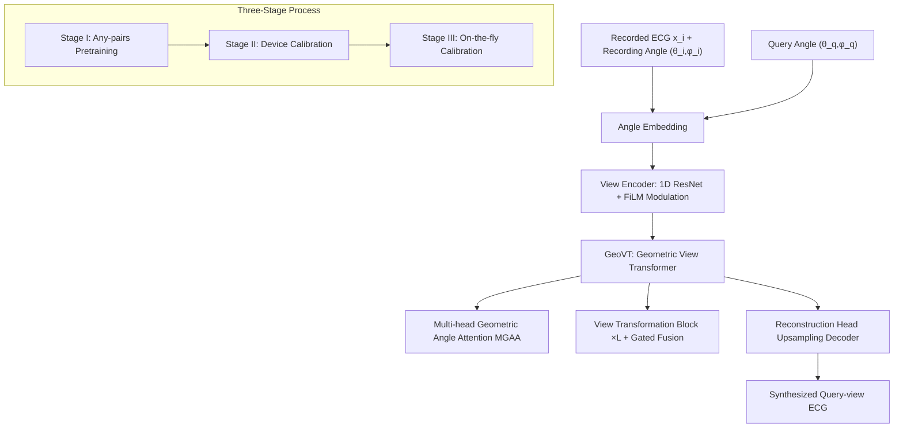

# Nef-Net v2: Adapting Electrocardio Panorama in the Wild

**Conference**: ICLR 2026  
**OpenReview**: [https://openreview.net/forum?id=JzZhhhxniR](https://openreview.net/forum?id=JzZhhhxniR)  
**Code**: [https://github.com/HKUSTGZ-ML4Health-Lab/NEFNET-v2](https://github.com/HKUSTGZ-ML4Health-Lab/NEFNET-v2)  
**Area**: Medical Signal Generation / ECG New View Synthesis  
**Keywords**: Electrocardio Panorama, ECG View Synthesis, Geometric Attention, Cross-device Calibration, Implicit Electrocardio Field  

## TL;DR
This work transfers "arbitrary-view ECG synthesis" from idealized laboratory assumptions to real-world clinical practice. By utilizing a Geometric View Transformer for direct view-to-view mapping, coupled with a three-stage (Pretraining → Device Calibration → On-the-fly Calibration) pipeline, the method addresses three major deployment challenges: long-duration signals, cross-device variance, and electrode displacement. It achieves a PSNR improvement of approximately 6 dB over the previous generation Nef-Net.

## Background & Motivation
- **Background**: Standard 12-lead ECG only observes cardiac electrical activity from fixed anatomical perspectives. Certain pathologies (e.g., Brugada syndrome, posterior wall myocardial infarction) require non-standard views to reveal critical diagnostic signals. Chen et al. (2021) introduced the **Electrocardio Panorama** concept, using implicit neural representations to reconstruct a continuous "electrocardio field" for virtual observation of ECG from any angle. The initial method was named Nef-Net.
- **Limitations of Prior Work**: Nef-Net remains constrained by idealized assumptions, making clinical deployment difficult: (1) It only supports single-beat reconstruction and cannot process continuous long-duration signals; (2) It simply averages features from different views, ignoring the differential correlation of each view to the target view, leading to blurry reconstructions under sparse supervision; (3) It fails to account for inter-device differences (sensors, signal processing pipelines) and inter-individual variations (electrode placement displacement); (4) The lack of dense-view datasets limits evaluation to 8/12-lead narrow-angle settings, failing to verify the generalization of the full electrocardio field.
- **Key Challenge**: Electrocardio panorama synthesis must be both **information-rich (arbitrary views)** and **robust in the real world (cross-device, anti-electrode displacement, long-duration)**. The "shared geometric prior + feature averaging" modeling of the original version collapses in accuracy in in-the-wild scenarios.
- **Goal**: To construct a deployable panorama ECG synthesis framework that supports arbitrary-length and arbitrary-view synthesis, generalizes across different ECG devices, and compensates for electrode placement bias caused by operators.
- **Core Idea**: **[Task Reformulation]** Transform view synthesis from "reconstructing a shared electrocardio field" to **direct pairwise view-to-view deterministic mapping**. Then, use **Geometric Awareness Attention** to explicitly model the spatial relationship between the query view and recorded views, integrated with a **three-stage development-deployment pipeline** to progressively compensate for device and individual biases.

## Method

### Overall Architecture
NEF-NET V2 models arbitrary-view ECG synthesis as a **direct view-to-view transformation**: given $l$ recorded single-lead signals $X=\{x_1,\dots,x_l\}$ (where each $x_i\in\mathbb{R}^{1\times t}$) with their recording angles and a target query angle, it performs a one-step mapping to the query-view signal. It no longer explicitly models a shared electrocardio field representation like Nef-Net. The architecture consists of three core components: Angle Embedding, View Encoder, and Geometric View Transformer (GeoVT). A three-stage training/calibration pipeline is applied for deployment.

### Key Designs
**1. Geometric View Transformer (GeoVT): Replacing Blind Feature Averaging with Angular Similarity**
To address the blurriness caused by Nef-Net's uniform averaging of all view features (which incorporates query-irrelevant signals), GeoVT utilizes a cross-attention module **MGAA** to explicitly compare the angle embeddings of query leads and recorded leads. It calculates a Geometric Angle Attention map $\text{GAA}=\text{softmax}\!\left(\frac{F_qW_q(F_kW_k)^\top}{\sqrt{d'}}\right)$, where $W_q,W_k\in\mathbb{R}^{d\times d'}$ are learnable projections. This attention map measures "which recorded views are geometrically closer to the query view," thereby selectively amplifying geometrically consistent features and suppressing irrelevant signals. All View Transformation Blocks share the same GAA map, ensuring consistency while reducing parameters. Since the heavyweight electrocardio field representation is no longer maintained, the entire pipeline is lighter with fewer parameters.

**2. Hierarchical View Transformation Block + Spatial Gated Fusion: Coarse-to-Fine Feature Transfer**
GeoVT stacks $L$ View Transformation Blocks to transfer recorded features to the query representation layer by layer. The $i$-th block first projects recorded features into an angular latent space $F_v^{i+1}=\text{Linear}(F_v^i)$, then fuses them via GAA, and accumulates them through spatial gating: $F_o^{i+1}=F_o^i\odot(1-G_i)+\text{Ext.}(F_v^i\times\text{GAA})\odot G_i$, where $G_i$ is a learnable gating parameter with sigmoid, and the feature extractor $\text{Ext.}$ follows the SE block design. Gating allows the model to adaptively decide how much old feature to retain and how much new transformed feature to inject at each layer, achieving coarse-to-fine refinement. The Reconstruction Head uses linear interpolation upsampling + spectral-normalized 1D convolution + LayerNorm + GELU to decode the fused embedding back to the time domain. At the View Encoder, after extracting features with a 1D ResNet, FiLM affine modulation is used to inject query features, amplifying signals aligned with $(\theta_q,\varphi_q)$ and suppressing irrelevant components.

**3. Three-Stage Development-Deployment Process: Gradually Absorbing Device and Individual Bias**
To handle device heterogeneity and individual variation in real-world deployment, the training is split into three stages. **Stage I: Any-pairs Pretraining (ANYPRE)**: Available views for each case are randomly divided into recorded–query subsets for dynamic sampling and pairing. All parameters are trainable using MAE loss $L_{\text{MAE}}=\lVert\hat Y_i-Y_i\rVert_1$ to learn cross-view invariant representations (two limb leads are fixed as reference potentials). **Stage II: Device Calibration (D-CAL)**: Fine-tuning is performed on all pairs from the target device using $L_{\text{MAE}}$ to align specific hardware feature distribution shifts. **Stage III: On-the-fly Calibration (OF-CAL)**: Real recording angles $(\theta_{\text{real}},\varphi_{\text{real}})$ often deviate from ideal angles due to electrode placement variation and individual anatomical differences (the standard deviation in Panobench reaches $10.6°$). Learnable angular offsets $(d\theta,d\varphi)$ are introduced to correct ideal angles to $(\theta+d\theta,\varphi+d\varphi)$. Following the clinical 10-second recording standard, the first 5 seconds are used for calibration. The View Encoder and Reconstruction Head are frozen, and only the angle embeddings are fine-tuned to adapt to individual offsets.

**4. Panobench: The First 48-Lead Dense-View Electrocardio Panorama Benchmark**
To overcome the limitations of insufficient evaluation caused by having only 8/12 views, the authors constructed Panobench—containing 4,470 ten-second recordings, with 48 views per case (6 limb leads + 42 types of precordial leads). Each view includes spherical coordinates $(\theta,\varphi)$ measured via CT. These dense views allow the model to be strictly evaluated for full electrocardio field generalization under any combination of "input count / supervision count / synthesis count," providing a high-resolution reference for clinical translation.

## Key Experimental Results
Datasets: PTB-XL, Tianchi, CPSC2018, ChinaDB (public) + self-built Panobench, all resampled to 500 Hz, with an 8:2 split. Metrics: PSNR↑ / SSIM↑.

### Main Results (Reconstruction + Synthesis, parentheses denote View Counts for Input/Reconstruction/Synthesis)

| Task | Method | ChinaDB PSNR | CPSC2018 PSNR | Tianchi PSNR | PTB-XL PSNR |
|---|---|---|---|---|---|
| Reconstruction (3,9) | EKGAN | 32.76 | 33.35 | 34.39 | 31.71 |
| Reconstruction (3,9) | Nef-Net | 29.59 | 29.12 | 31.44 | 30.22 |
| Reconstruction (3,9) | **NEF-NET V2 (Ours)** | **35.84** | **36.12** | **37.13** | **35.21** |
| Synthesis (3,8,1) | Nef-Net | 25.24 | 26.72 | 27.92 | 24.10 |
| Synthesis (3,8,1) | **NEF-NET V2 (Ours)** | **32.57** | **33.62** | **34.46** | **33.41** |
| Synthesis (5,6,1) | Nef-Net | 26.06 | 26.11 | 28.01 | 25.37 |
| Synthesis (5,6,1) | **NEF-NET V2 (Ours)** | **33.16** | **32.76** | **34.82** | **32.07** |

Gain: On synthesis tasks, improvements over Nef-Net generally range from 6–9 dB; performance in the 8-to-12 reconstruction setting is approximately on par with SOTA models like EKGAN/SSSD.

### Ablation Study (Three-Stage Framework, Synthesis PSNR / SSIM)

| Stage | ChinaDB | CPSC2018 | Tianchi | PTB-XL |
|---|---|---|---|---|
| Any-Pairs Pretraining | 29.83 / 0.972 | 31.01 / 0.975 | 32.71 / 0.975 | 31.15 / 0.981 |
| + Device Calibration | 30.77 / 0.973 | 32.08 / 0.979 | 33.05 / 0.977 | 31.15 / 0.981 |
| + On-the-fly Calibration | **32.57 / 0.981** | **33.62 / 0.985** | **34.46 / 0.976** | **33.41 / 0.982** |

Device calibration provides a gain of 0–1.07 dB, while on-the-fly calibration adds another 1.75–2.74 dB—indicating that **individual anatomical differences impact panorama quality more significantly than device differences**.

### Key Findings
- **Advantages are most prominent under sparse-view supervision**: Nef-Net degrades severely under sparse supervision due to feature averaging (Syn is only 21 dB with 3 supervision leads on Panobench), whereas NEF-NET V2 preserves diagnostic details via geometric attention, reaching 31–32 dB in the same setting; the gap narrows as the number of supervision leads increases.
- **Pathological Signal Fidelity**: Average PSNR increased by 6.9 dB across nine categories of heart disease in CPSC2018, with Atrial Fibrillation (AF) improving by 7.3 dB. Larger margins were observed in pathological samples such as AF/I-AVB/PVC/STE, indicating that synthesis retains key pathological features beyond general morphology.
- **The number of input views (3→7) has almost no effect on reconstruction/synthesis performance, while the number of supervision views is the critical variable**; reconstruction performance can be viewed as the upper bound of synthesis performance.

## Highlights & Insights
- **Paradigm Shift is Crucial**: Changing from "reconstructing a shared electrocardio field" to "direct view-to-view mapping" simplifies the pipeline, reduces parameters, and circumvents the fundamental flaw of feature averaging—this is the primary reason for the performance jump.
- **Elegant Engineering**: Breaking clinical deployment into an actionable three-stage calibration and cleverly reusing the clinical standard 10-second recording duration ("first 5 seconds for calibration + last 5 seconds for evaluation") is highly effective.
- **Learnable Angular Offsets** $(d\theta,d\varphi)$ represent a lightweight yet critical design: treating "how much the electrode was misaligned" as an optimizable quantity bypasses the difficulty of directly measuring true angles.
- Panobench (48-lead + CT spherical coordinates) is a valuable community asset, pushing panorama ECG evaluation from 12-lead to dense views.

## Limitations & Future Work
- A clear gap remains between synthesis and reconstruction, indicating that generating completely unseen views remains a fundamental and far-from-saturated challenge.
- The scale of Panobench (4,470 cases) is relatively limited, and the acquisition cost of 48-lead data with CT coordinates is high, limiting external reproducibility.
- On-the-fly calibration depends on online fine-tuning for the first 5 seconds per patient, increasing inference overhead; latency and computational costs for real-time deployment were not fully quantified.
- Evaluation primarily relies on signal fidelity metrics like PSNR/SSIM; "retention of pathological features" mostly depends on qualitative description of a few visualizations, lacking end-to-end validation on downstream diagnostic tasks (e.g., classification AUC).

## Related Work & Insights
- **ECG View Reconstruction/Synthesis Lineage**: From early linear transformations to non-linear methods like RNN/LSTM/CNN/CGAN (capable only of recovering predefined known leads), to Electrocardio Panorama (Chen et al. 2021, the first to synthesize arbitrary unseen views conditioned on viewing angles). This work is a systematic upgrade of the panorama route for in-the-wild scenarios.
- **Design Inspiration**: FiLM affine modulation (Perez et al. 2018), SE block (Hu et al. 2018), spectral-normalized convolution (Miyato et al. 2018), and cross-attention mechanisms—migrating general-purpose vision/generative modules to 1D ECG signals.
- **Mechanism**: The core intuition throughout the paper is analogizing multi-lead ECG to a "multi-view camera system"; the strategy of "geometric prior-guided attention + multi-stage domain adaptation" can be extended to other physiological signal synthesis tasks requiring cross-sensor/cross-individual calibration.

## Rating
- **Novelty**: ⭐⭐⭐⭐ —— Task reformulation (direct view-to-view mapping) + Geometric Angle Attention + Three-stage calibration + New 48-lead benchmark; solid combined innovation. While not a brand-new concept, the systematic upgrade for deployment is substantial.
- **Experimental Thoroughness**: ⭐⭐⭐⭐ —— Covers 5 datasets, reconstruction/synthesis dual tasks, cross-pathology categories, and three-stage ablations; points deducted for lacking end-to-end validation for downstream tasks and quantification of calibration overhead.
- **Writing Quality**: ⭐⭐⭐⭐ —— Clear logic from limitations to contribution, method, and experiments; complete figures and tables with well-explained formulas and design motivations.
- **Value**: ⭐⭐⭐⭐ —— Drives panorama ECG toward clinical readiness; Panobench and open-source code provide community value with practical significance for cardiovascular diagnosis.

<!-- RELATED:START -->

## Related Papers

- [\[ICLR 2026\] HFSTI-Net: Hierarchical Frequency-spatial-temporal Interactions for Video Polyp Segmentation](hfsti-net_hierarchical_frequency-spatial-temporal_interactions_for_video_polyp_s.md)
- [\[CVPR 2026\] SD-FSMIS: Adapting Stable Diffusion for Few-Shot Medical Image Segmentation](../../CVPR2026/medical_imaging/sd_fsmis_adapting_stable_diffusion_for_few_shot_medical_image_segmentation.md)
- [\[ECCV 2024\] Chameleon: A Data-Efficient Generalist for Dense Visual Prediction in the Wild](../../ECCV2024/medical_imaging/chameleon_a_data-efficient_generalist_for_dense_visual_prediction_in_the_wild.md)
- [\[AAAI 2026\] MAISI-v2: Accelerated 3D High-Resolution Medical Image Synthesis with Rectified Flow and Region-specific Contrastive Loss](../../AAAI2026/medical_imaging/maisi-v2_accelerated_3d_high-resolution_medical_image_synthesis_with_rectified_f.md)
- [\[CVPR 2026\] PGR-Net: Prior-Guided ROI Reasoning Network for Brain Tumor MRI Segmentation](../../CVPR2026/medical_imaging/pgr-net_prior-guided_roi_reasoning_network_for_brain_tumor_mri_segmentation.md)

<!-- RELATED:END -->
