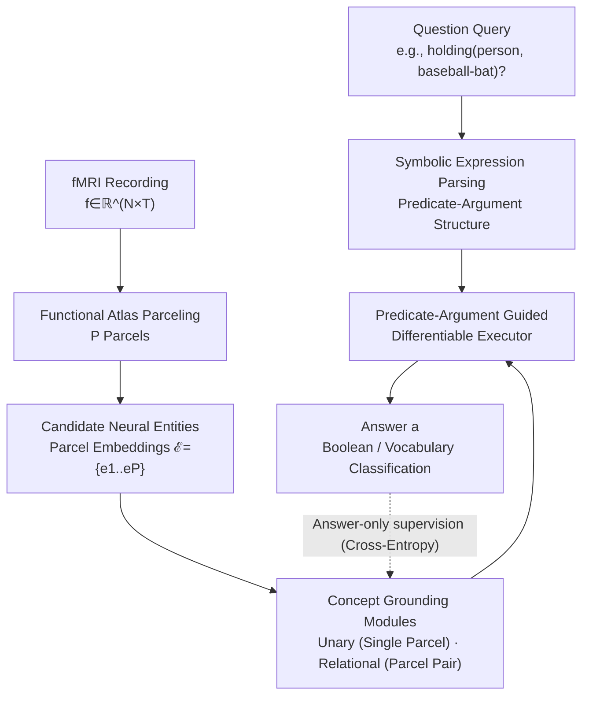

# Neuro-Symbolic Decoding of Neural Activity

**Conference**: ICLR 2026  
**arXiv**: [2603.03343](https://arxiv.org/abs/2603.03343)  
**Code**: None  
**Area**: Neuroscience / Multimodal  
**Keywords**: fMRI decoding, Neuro-symbolic, Conceptual grounding, Language of Thought hypothesis, VQA

## TL;DR
The paper proposes NEURONA, a neuro-symbolic framework for fMRI decoding and conceptual grounding. By decomposing visual scenes into symbolic programs (logical combinations of concepts), it significantly outperforms end-to-end neural decoding and linear models in fMRI question-answering tasks.

## Background & Motivation

**Background**: The "Language of Thought" (LoT) hypothesis in cognitive science suggests that human thinking operates with structured, compositional representations. fMRI neural decoding has made significant progress over past decades, evolving from linear mapping to deep learning methods.

**Limitations of Prior Work**: Existing neural decoding methods utilize either simple linear models (interpretable but under-expressive) or end-to-end neural networks (powerful but black-box). Neither effectively captures compositional relationships and logical structures between concepts.

**Key Challenge**: Semantics in natural scenes are compositional (multiple concepts plus relationships binding them, e.g., "a person holding a baseball bat"). Current decoding either identifies isolated concepts or performs global reconstruction, failing to explicitly model the predicate-argument structure, which leads to inaccurate relational semantics.

**Goal**: Explicitly inject compositional structural priors (how concepts combine via predicate-argument structures) into the decoding process to achieve more accurate and precise semantic decoding that generalizes to unseen concept combinations.

**Key Insight**: Leverage the composite semantics naturally encoded in image/video fMRI data by parsing each question into a symbolic expression. Brain activity is then processed through a set of "concept grounding modules" that execute the expression to derive an answer.

**Core Idea**: Adopt a neuro-symbolic framework—query to symbolic expression, fMRI to candidate brain region entities, and concepts to learnable groundings. These are combined differentiably according to the expression. Predicate-argument dependencies guide the grounding of relational concepts, surpassing linear or end-to-end decoding in accuracy and generalization.

## Method

### Overall Architecture
NEURONA avoids direct end-to-end answer prediction from fMRI. Instead, it injects "compositional structural priors": each question (e.g., "Is there a person holding a baseball bat?") is parsed into a symbolic expression describing the predicate-argument structure (e.g., `holding(person, baseball-bat)`). Simultaneously, an fMRI recording $f\in\mathbb{R}^{N\times T}$ is segmented into $P$ brain regions (parcels) using a standard functional atlas, encoded as a set of candidate "neural entity" embeddings $\mathcal{E}=\{e_1,\dots,e_P\}$. Each concept is scored by a learnable grounding module—determining which parcels (or pairs) support the concept. Finally, a differentiable executor combines these scores according to the symbolic expression. The entire pipeline is trained end-to-end using only the final answer as supervision; the "concept-to-brain region" grounding is learned via weak supervision. The method adapts the LEFT neuro-symbolic framework, with the key difference that fMRI lacks ready-made object proposals, necessitating inference from parcels guided by predicate-argument structures.

### Key Designs

**1. fMRI Parceling into Candidate Neural Entities: Transforming amorphous signals into groundable "entities"**

In images, object proposals serve as candidate entities for grounding. fMRI has no such explicit entities—determining which neural representations correspond to a concept must be inferred. NEURONA uses standard functional atlases (testing Yeo-7/17, DiFuMo-64/128, Schaefer-100; Yeo-17 in main text) to segment the whole brain into $P$ parcels, encoded as embeddings $\mathcal{E}=\{e_1,\dots,e_P\}$. This provides discrete units for grounding and makes the mapping between concepts and brain regions learnable and traceable.

**2. Concept Grounding Modules: Unary concepts to parcels, Relational concepts to parcel pairs**

To answer a query, the model must determine if concepts or relations are evidenced in brain activity. Relations are inherently inter-regional. NEURONA categorizes grounding into two types: Unary concepts (e.g., person) use linear projection $\mathcal{W}_{\text{unary}}$ to score evidence on each parcel, yielding $G_{\text{unary}}(c)\in\mathbb{R}^{P}$. Relational concepts (e.g., holding) score parcel pairs $(i,j)$ by concatenating two parcel embeddings (plus learnable embeddings $\mathcal{E}_b$), passing them through $\mathcal{W}_{\text{pair}}$ and a linear classifier to get $G_{\text{binary}}(c)\in\mathbb{R}^{P\times P}$. This specialized modeling aligns with the neural reality that relational semantics depend on co-activation across multiple regions.

**3. Predicate-Argument Guided Differentiable Execution: Constraining relation grounding by its arguments (Core Innovation)**

If relational concepts are grounded in isolation, cross-regional compositional semantics are lost, and generalization to unseen combinations fails. NEURONA's executor pools grounding scores according to the symbolic expression, specifically guiding the grounding of a predicate $c_p$ using the groundings of its subject $c_s$ and object $c_o$. The paper compares five structural hypotheses: H1 Single region, H2 Multi-region unguided, H3 Subject-guided, H4 Object-guided, and H5 Dual-argument guided. H5 is optimal:

$$G_{\mathrm{H5}}(c_p)=\tilde{G}_{\mathrm{binary}}(c_p)+G_{\mathrm{unary}}(c_s)+G_{\mathrm{unary}}(c_o)$$

($\tilde{G}_{\mathrm{binary}}$ is the parcel-pair score averaged back to parcel-wise space). Conditioning relations on their arguments' regional grounding is the key to compositional generalization. Even for novel queries like `in_front_of(surfboard, person)` where only the reverse combination was seen during training, the model can reuse learned groundings.

### Loss & Training
No labels are provided for intermediate concept grounding. The model is trained end-to-end using cross-entropy loss on the final answer: $\mathcal{L}_{\text{CE}}=-\sum_{k=1}^{K}a_k\log(\hat{a}_k)$, where $\hat{a}$ is the predicted distribution over $K$ answer classes and $a$ is the ground truth.

## Key Experimental Results

### Main Results (fMRI-QA, In-distribution)

| Method | BOLD5000-QA Overall | CNeuroMod-QA Overall |
| :--- | :--- | :--- |
| Linear | 0.4692 | 0.4638 |
| UMBRAE | 0.4754 | 0.4642 |
| SDRecon | 0.4711 | 0.4430 |
| BrainCap | 0.4773 | 0.4417 |
| **NEURONA** | **0.7041** | **0.7046** |

The method achieves approximately **47% relative gain** over the strongest baseline. The largest improvements occur in Action (0.62 vs ~0.24) and Position (0.51 vs ~0.19) queries, which require relational reasoning.

### Ablation Study: Grounding Structure Hypotheses (BOLD5000-QA Overall)

| Structural Hypothesis | Overall | Description |
| :--- | :--- | :--- |
| H1 Single region | 0.6451 | Concepts grounded to single parcels |
| H2 Multi-region unguided | 0.6476 | Expanded to parcel pairs, no guidance |
| H3 Subject-guided | 0.6678 | Predicate guided by subject argument |
| H4 Object-guided | 0.6733 | Predicate guided by object argument |
| **H5 Dual-argument guided** | **0.7102** | Guided by both subject and object |

### Key Findings
- **Representation space alone is insufficient**: Extending to parcel pairs without guidance (H2 vs H1) yields negligible gains and tends to overfit high-frequency labels.
- **Predicate-argument guidance is critical**: Argument guidance consistently outperforms unguided models, with object guidance generally stronger than subject guidance, and dual-argument being best for relational reasoning.
- **Compositional Generalization**: In settings where training/test combinations are non-overlapping, NEURONA achieves 0.6840 (BOLD5000) / 0.6583 (CNeuroMod), while baselines drop to near-random levels.
- **Traceable Grounding**: A consistency metric confirms that specific concepts tend to ground in similar brain regions across samples, indicating that intermediate groundings are meaningful and interpretable.

## Highlights & Insights
- **Computational Validation of LoT**: Using a neuro-symbolic framework to explicitly model predicate-argument structures dramatically improves decoding, providing computational evidence for the hypothesis that the brain represents knowledge compositionally.
- **Structural Priors over Representation Capacity**: Ablations show that simply increasing representation capacity (multiple regions) is ineffective; the significant gain comes from conditioning relations on argument groundings.
- **Interpretable Intermediate Groundings**: The grounding modules are not just latent variables; they reliably identify similar brain regions under weak supervision, offering diagnostic value for neuroscience.

## Limitations & Future Work
- fMRI-QA data is generated from scene graphs extracted by VLMs; QA quality and concept coverage are limited by zero-shot VLM capabilities.
- The grounding structure relies on manually designed hypotheses (H1–H5) rather than automated discovery of optimal structures.
- Experiments are limited to small subject scales (4 for BOLD5000, 3 for CNeuroMod), leaving large-scale cross-subject generalization for future work.
- Relational modeling on parcel pairs is $O(P^2)$, leading to computational and overfitting risks as the number of parcels increases.

## Related Work & Insights
- **vs BrainBERT/Mind-Vis**: End-to-end decoding methods generate text/images directly from fMRI but lack structured reasoning capabilities.
- **vs Neurosymbolic AI (VQA)**: Similar to NS-VQA which decomposes VQA into perception and reasoning, NEURONA introduces this paradigm to the fMRI domain.

## Rating
- Novelty: ⭐⭐⭐⭐⭐ 
- Experimental Thoroughness: ⭐⭐⭐ 
- Writing Quality: ⭐⭐⭐⭐ 
- Value: ⭐⭐⭐⭐ 

<!-- RELATED:START -->

## Related Papers

- [\[CVPR 2026\] NeuroFlow: Toward Unified Visual Encoding and Decoding from Neural Activity](../../CVPR2026/medical_imaging/neuroflow_toward_unified_visual_encoding_and_decoding_from_neural_activity.md)
- [\[NeurIPS 2025\] FireGNN: Neuro-Symbolic Graph Neural Networks with Trainable Fuzzy Rules for Interpretable Medical Image Classification](../../NeurIPS2025/medical_imaging/firegnn_neuro-symbolic_graph_neural_networks_with_trainable_fuzzy_rules_for_inte.md)
- [\[ICLR 2026\] MindMix: A Multimodal Foundation Model for Auditory Perception Decoding via Deep Neural-Acoustic Alignment](mindmix_a_multimodal_foundation_model_for_auditory_perception_decoding_via_deep_.md)
- [\[ICLR 2026\] Spike-based Digital Brain: A Novel Fundamental Model for Brain Activity Analysis](spike-based_digital_brain_a_novel_fundamental_model_for_brain_activity_analysis.md)
- [\[ICLR 2026\] Towards Interpretable Visual Decoding with Attention to Brain Representations](towards_interpretable_visual_decoding_with_attention_to_brain_representations.md)

<!-- RELATED:END -->
