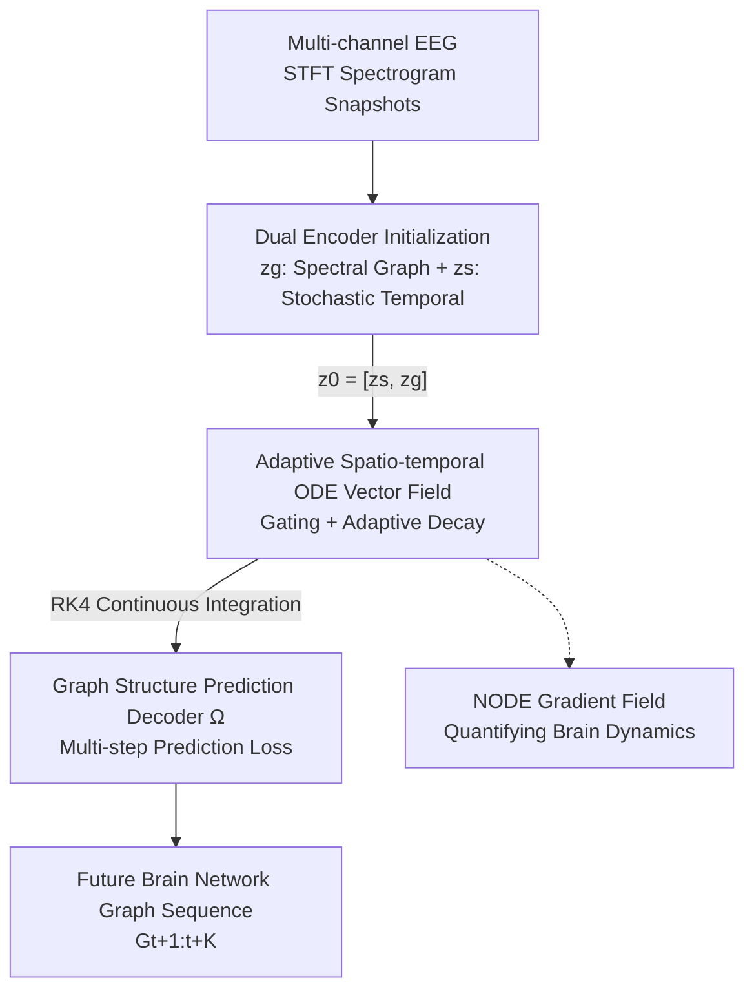

# ODEBRAIN: Continuous-Time EEG Graph for Modeling Dynamic Brain Networks

**Conference**: ICLR 2026  
**OpenReview**: [https://openreview.net/forum?id=9EjZGs8ube](https://openreview.net/forum?id=9EjZGs8ube)  
**Code**: https://github.com/HHJIAnmo/ODEBRAIN (Available)  
**Area**: Medical Signals / EEG / Dynamic Brain Network Modeling  
**Keywords**: Neural ODE, Brain Network, Continuous-time Modeling, Temporal Graph, Epilepsy Detection

## TL;DR
ODEBRAIN utilizes Neural Ordinary Differential Equations (NODE) to explicitly model multi-channel EEG as a "continuous-time dynamic system." By constructing noise-resistant initial states through a dual encoder, solving latent space trajectories via an adaptive spatio-temporal vector field, and employing a graph-structured multi-step prediction loss, it significantly outperforms discrete recurrent baselines on TUSZ/TUAB epilepsy and abnormal EEG tasks (F1 gain of 6.0%, ACC gain of 8.1%).

## Background & Motivation

**Background**: Modeling the dynamic activity of brain networks using EEG is critical for biomarker discovery and clinical diagnosis. Recently, the mainstream approach involves Temporal Graph Networks (TGN)—representing multi-channel EEG as a graph, using GNNs to capture spatial dependencies and recurrent models (RNN/DCRNN/GraphS4mer, etc.) to capture temporal dynamics, thereby characterizing the step-by-step evolution of the brain network.

**Limitations of Prior Work**: These methods force EEG signals into **fixed discrete time steps**. However, brain activity is inherently continuous. Discretization imposes rigid window assumptions, fails to characterize the continuously unfolding temporal process, and cannot capture irregular mutations like seizure onsets that occur at "any moment." Furthermore, recurrent architectures extrapolate step-by-step, leading to accumulated composite prediction errors.

**Key Challenge**: The contradiction between the "continuous, non-stationary, transient, and stochastic" nature of EEG versus the "fixed step size, state transitions occurring only at grid points" assumption of discrete recurrent modeling.

**Goal**: To model the brain network as an explicit continuous-time dynamic system, focusing on two specific sub-problems: (i) providing the NODE with a robust initial state $z_0$ resistant to EEG transients and stochasticity; (ii) providing the vector field $f_\theta$ with a learning objective that characterizes underlying neural dynamics rather than just superficial prediction.

**Key Insight**: The authors introduce NODE into brain network modeling. NODE directly parameterizes the derivative of the latent state and performs continuous integration over time $z(t+1) = z_0 + \int_t^{t+1} f_\theta(t, z_t)\,dt$. It inherently eliminates the need for fixed step sizes, treating discretely sampled EEG as sampled observations of an underlying continuous process $\int f_\theta(t)\,dt$, which can express both slow oscillatory rhythms and sudden transitions.

**Core Idea**: This is the first work to explicitly formulate the EEG brain network as "a sequence of time-varying graphs whose latent dynamics are governed by a NODE," complemented by noise-resistant initialization, an adaptive vector field, and graph-structured prediction targets to ensure latent trajectories are both stable and clinically interpretable.

## Method

### Overall Architecture

The input to ODEBRAIN is a multi-channel EEG signal, and the output is a sequence of future brain network graphs $G_{t+1:t+K}$ over $K$ steps (subsequently used for epilepsy/abnormality classification). The pipeline consists of two stages: **Stage 1 (Inverse Initial State Encoding)** encodes past EEG into a robust initial state $z_0$; **Stage 2 (Forward Spatio-temporal ODE Solving)** uses an adaptive vector field to integrate $z_0$ along time to produce latent trajectories; finally, a **Graph Embedding Prediction Decoder** $\Omega$ maps the latent trajectories back to future graph nodes, supervised by a multi-step prediction loss.

Specifically, each EEG segment is converted into spectrogram snapshots via Short-Time Fourier Transform (STFT) (spectral intensity as node attributes, adjacency matrix as edge attributes). Stage 1 uses a **Dual Encoder**: one path captures frequency-domain graph structures deterministically to obtain $z_g$, while the other encodes the stochasticity of the raw EEG into $z_s$, concatenated as $z_0 = [z_s, z_g]$. The vector field $f_\theta$ in Stage 2 adds gated modulation and adaptive decay onto residual blocks, solved via the RK4 numerical solver to obtain $\{z_{t+1},\dots,z_{t+K}\}$. These trajectories serve as the source for predicting brain networks, while the gradient field $f_\theta$ itself is used as a metric to quantify brain dynamics (speed, direction, convergence centers).

### Key Designs

**1. Dual Encoder for Inverse Initial State Encoding: Providing a Noise-Resistant Starting Point for NODE**

NODE trajectories are integrated entirely from the initial state $z_0$. If $z_0$ is poorly encoded, errors propagate over time, destroying long-term dynamics. EEG is highly stochastic or even chaotic, with key features appearing transitionally without warning. The authors design two complementary encoding paths: the deterministic **Spectral Node Encoding** uses GRUs to model evolution on node and edge spectral attributes ($h_i^n = \mathrm{GRU}_{node}(X_{i,\le t})$, $h_{ij}^e = \mathrm{GRU}_{edge}(A_{ij,\le t})$), followed by GNN aggregation to produce the graph state $z_g$. The **Stochastic Temporal Encoding** uses a descriptor $\Psi: \mathbb{R}^{T\times L}\mapsto \mathbb{R}^c$ ($c\ll m$) to quantify raw EEG segment stochasticity into $z_s$, intentionally introducing controlled randomness. This acts as a latent-space regularizer that enhances robustness and prevents premature convergence to suboptimal solutions.

**2. Adaptive Spatio-temporal ODE Vector Field: Maintaining Trajectory Stability under Noise**

Using a deep network directly as the vector field $f_\theta$ to fit highly variable EEG states can lead to large solver errors and trajectory divergence. The authors design the vector field using a combination of residual blocks, gating, and adaptive decay:

$$f_\theta(z_0) = (g(z_0) + 1) \odot h(z_0) - \lambda(z_s)\,\frac{z_s}{z_0}$$

Where $h(z_0)$ is the base vector field from residual blocks, and $g(z_0) = \sigma(W_g z_0 + b_g) \in (0,1)^{m+c}$ provides state-adaptive gating (deciding which dimensions of dynamics to amplify or suppress). The final term is **Adaptive Decay** $\lambda(z_s) = \mathrm{Softplus}(W_a^{(2)}\circ\tanh(W_s^{(1)} z_s + b_1) + b_2) > 0$ conditioned on the stochastic state $z_s$, which pulls the trajectory back under noisy inputs. The latent trajectory is integrated using the RK4 solver: $z(t+\Delta t) = z(t) + \frac{\Delta t}{6}(k_1 + 2k_2 + 2k_3 + k_4)$.

**3. Graph Structure Prediction Decoder + Multi-step Prediction Loss: Targeting Brain Network Structure**

Standard NODE training often uses regressive targets for future state prediction, which might only learn surface-level temporal patterns. The authors argue that neural firing involves simultaneous activation across asynchronous channels, so the learning objective should be **predicting the graph structure itself**. The decoder $\Omega: \mathbb{R}^{m+c}\mapsto \mathbb{R}^d$ maps latent states at each moment back to future EEG node attributes $\hat{G}_{t+i} = \Omega(z_{t+i})$, supervised by a multi-step graph prediction loss $L_G = \mathbb{E}_G\lVert \hat{G}_{t+1:K} - G_{t+1:K}\rVert^2$.

**4. NODE Gradient Field as a Quantitative Metric: From Prediction to Interpretation**

The authors propose treating the trained vector field $f_\theta$ (i.e., $dz/dt$) as a metric to quantify brain network dynamics. By plotting the direction, speed, and convergence centers of $f_\theta$ in latent space, the ictal (seizure) state exhibits clear "field centers" (regions where gradients converge, corresponding to high-frequency oscillations), whereas normal or pre-ictal states lack such centers and are dominated by low-frequency oscillations. This visualization provides clinical characterization of brain dynamic transitions.

### Loss & Training
During the unsupervised pre-training phase, the multi-step graph prediction loss $L_G = \mathbb{E}_G\lVert \hat{G}_{t+1:K} - G_{t+1:K}\rVert^2$ is minimized. Subsequently, the entire latent trajectory $z(t)$ is pooled across all time steps for fine-tuning on downstream classification tasks (e.g., epilepsy detection). Graph construction employs Top-$\tau=3$ sparsity with Norm/Graphical lasso regularization to mitigate noise and volume conduction effects.

## Key Experimental Results

### Main Results
Comparison on TUSZ (12s epilepsy detection) and TUAB (abnormal EEG classification) against discrete recurrent and continuous ODE baselines. ODEBRAIN† denotes continuous multi-step prediction, while ODEBRAIN‡ denotes continuous single-step prediction.

| Dataset | Metric | ODEBRAIN‡ | Prev. SOTA Baseline | Gain |
| :--- | :--- | :--- | :--- | :--- |
| TUSZ | ACC | 0.877 | neural SDE (0.857) | +2.0% |
| TUSZ | F1 | 0.496 | GDEs (0.475) | +2.1% |
| TUSZ | AUROC | 0.881 | ODE-RNN (0.855) | +2.6% |
| TUAB | ACC | 0.778 | DCRNN/neuralSDE (0.768) | +1.0% |
| TUAB | F1 | 0.774 | DCRNN (0.769) | +0.5% |
| TUAB | AUROC | 0.857 | DCRNN (0.848) | +0.9% |

In comparisons between long and short horizons, ODEBRAIN achieved AUROC 0.828 / F1 0.430 for 60s epilepsy detection, leading DCRNN (0.802 / 0.413) and latent-ODE (0.745 / 0.331).

### Ablation Study

| Configuration | TUSZ AUROC | TUSZ F1 | Description |
| :--- | :--- | :--- | :--- |
| Full model | 0.881 | 0.496 | Complete model |
| − Gate | 0.867 | 0.488 | Without adaptive gating, trajectory stability decreases |
| − Stochastic | 0.848 | 0.462 | Without stochastic regularization, noise resistance drops |
| + Random | 0.860 | 0.474 | Replacing learned gating with random coefficients |

Initial state ablation indicates that spatio-temporal joint initialization (AUROC 0.877) yields the highest gains, especially on long 11s horizons.

### Key Findings
- Gating and stochastic regularization are the two pillars: removing gating drops performance by 1.4 points (stability), while removing stochasticity drops F1 by 3.4 points (noise resistance).
- Spatio-temporal joint initialization is most advantageous for long horizons, confirming the decisive role of $z_0$ for continuous integration.
- Computational costs are manageable: ODEBRAIN has 459K parameters and 164 NFEs, maintaining latency similar to discrete models.
- Graph construction is sensitive to Top-$\tau=3$ sparsity and regularization; adding regularization improves Recall, proving that raw correlation graphs are noisy.

## Highlights & Insights
- **Replacing Implicit Assumptions**: The authors identify that TGNs rely on fixed time steps, which conflicts with the continuous nature of brain activity.
- **Decoupling Structure and Stochasticity**: Using $z_g$ for spectral structure and $z_s$ for controlled stochasticity as latent regularization is a transferable strategy for noisy temporal-graph tasks.
- **Interpretability via Vector Fields**: Treating the gradient field $f_\theta$ as a clinical metric is a unique advantage of continuous modeling that discrete methods cannot provide.
- **Target Shift**: Shifting the prediction focus from raw signals to brain network structures aligns with the physiological reality of asynchronous neural activation.

## Limitations & Future Work
- Although latent dynamics are continuous-time, inputs and supervision are still based on epoched signals, limiting true long-range continuous modeling.
- Generalization remains to be verified beyond epilepsy and abnormal EEG tasks.
- Methodological detail: The element-wise division in the vector field formula $-\lambda(z_s)\frac{z_s}{z_0}$ and specific dimension alignment require reference to the source code.
- Future directions: Moving supervision to continuous time (e.g., for irregularly sampled signals) or developing the gradient field metrics into explicit clinical biomarker scales.

## Related Work & Insights
- **vs DCRNN / EvoBrain (Discrete TGN)**: These use recurrent architectures to model transitions on fixed steps; ODEBRAIN uses continuous integration to capture sudden transients at any moment without accumulating composite errors.
- **vs latent-ODE / neural SDE / GDEs (Continuous Baselines)**: These are mostly general-purpose. ODEBRAIN introduces domain-specific noise-resistant dual encoders and adaptive vector fields for EEG.
- **vs Existing Brain-NODE Work**: Previous works focused on neuroimaging or feature engineering; this is the first to model the EEG brain network as a data-driven continuous-time graph dynamic system.

## Rating
- Novelty: ⭐⭐⭐⭐⭐ 
- Experimental Thoroughness: ⭐⭐⭐⭐ 
- Writing Quality: ⭐⭐⭐⭐ 
- Value: ⭐⭐⭐⭐⭐ 

<!-- RELATED:START -->

## Related Papers

- [\[NeurIPS 2025\] EvoBrain: Dynamic Multi-Channel EEG Graph Modeling for Time-Evolving Brain Networks](../../NeurIPS2025/medical_imaging/evobrain_dynamic_multi-channel_eeg_graph_modeling_for_time-evolving_brain_networ.md)
- [\[ICLR 2026\] Inference-Time Dynamic Modality Selection for Incomplete Multimodal Classification](inference-time_dynamic_modality_selection_for_incomplete_multimodal_classificati.md)
- [\[ICLR 2026\] Lightweight Transformer for EEG Classification via Balanced Signed Graph Algorithm Unrolling](lightweight_transformer_for_eeg_classification_via_balanced_signed_graph_algorit.md)
- [\[ICLR 2026\] CRONOS: Continuous time reconstruction for 4D medical longitudinal series](cronos_continuous_time_reconstruction_for_4d_medical_longitudinal_series.md)
- [\[ICLR 2026\] Functional MRI Time Series Generation via Wavelet-Based Image Transform and Spectral Flow Matching for Brain Disorder Identification](functional_mri_time_series_generation_via_wavelet-based_image_transform_and_spec.md)

<!-- RELATED:END -->
