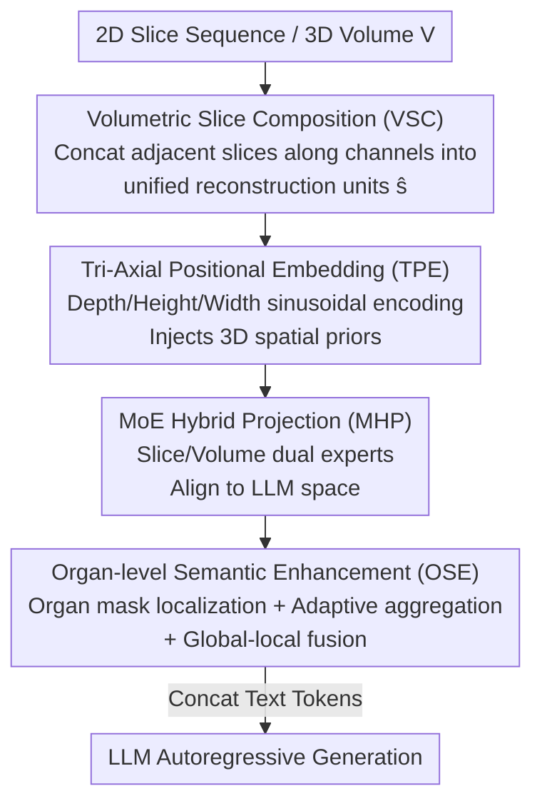

# OmniCT: Towards a Unified Slice-Volume LVLM for Comprehensive CT Analysis

**Conference**: ICLR 2026  
**OpenReview**: [https://openreview.net/forum?id=nrZI64gTvC](https://openreview.net/forum?id=nrZI64gTvC)  
**Code**: https://github.com/ZJU4HealthCare/OmniCT  
**Area**: Medical Imaging / Multimodal VLM  
**Keywords**: CT Understanding, Slice-Volume Unification, Large Vision-Language Model, Organ-level Semantics, Medical Evaluation Benchmark

## TL;DR
OmniCT utilizes a Spatial Consistency Enhancement (SCE) module comprising "slice composition + tri-axial positional encoding + MoE hybrid projection" to unify 2D slices and 3D volumes into a single LVLM token space. It further incorporates Organ-level Semantic Enhancement (OSE) to explicitly inject anatomical region priors into representations. Combined with the MedEval-CT dataset of 1.7 million samples and a hybrid benchmark, OmniCT significantly outperforms existing medical and general LVLMs in both slice-driven and volume-driven CT tasks (7B model averages 81.45 for slices and 66.15 for volumes).

## Background & Motivation

**Background**: CT is an imaging modality with the highest clinical information density, covering critical organs such as the heart, lungs, liver, and intestines. Diagnosis relies on two types of clues: slice-level local features (sub-centimeter lung nodules, lesion boundaries) and volume-level spatial representations (tumor infiltration range, anatomical relationships between organs). Existing medical LVLMs focus almost exclusively on either 2D slices or 3D volumes.

**Limitations of Prior Work**: Slice-driven models benefit from large-scale 2D pre-training, exhibiting strong vision-language alignment and generalization, but **lack spatial consistency across slices**, failing to capture holistic structural relationships in volumes. Volume-driven models explicitly model voxel-level spatial structures and excel at global spatial and organ-level reasoning, but are **insensitive to fine-grained anomalies and boundary morphologies**, and their architectures are difficult to adapt for slice inputs. These two technical routes have remained fragmented.

**Key Challenge**: CT diagnosis fundamentally requires both "micro-detail sensitivity" and "macro-spatial reasoning," which cannot be satisfied by single-dimension modeling. The lack of a unified modeling paradigm is a major bottleneck for the clinical deployment of medical LVLMs. Furthermore, evaluation benchmarks are lacking; existing medical benchmarks often follow a "general multimodal capability" route, lacking task alignment and clinical representativeness for CT interpretation.

**Goal**: ① Fuse the complementary advantages of 2D/3D within a single framework—retaining 2D alignment generalization and efficiency while injecting 3D spatial structure perception; ② Explicitly encode clinical "organ-centric reading" priors into representations; ③ Establish a unified dataset + benchmark + toolchain specifically for CT.

**Key Insight**: The authors observe that if slices and volumes can be reorganized into "unified reconstruction units" fed to the same visual encoder, with 3D positional priors injected into tokens, the model can gain volume perception **without breaking 2D compatibility**. Adding region selection via organ masks further incorporates the clinical organ-perspective into reading.

**Core Idea**: Use "volumetric slice composition + tri-axial positional encoding + MoE hybrid projection" to unify slices and volumes into the same token space (SCE), and then use "organ region localization + adaptive aggregation + context fusion" to inject organ-level semantics (OSE), forming a unified LVLM capable of handling both slices and volumes.

## Method

### Overall Architecture
The input to OmniCT can be independent 2D slice sequences or complete 3D volumes $V \in \mathbb{R}^{D \times H \times W}$. In either case, they are first standardized into unified "reconstruction units" and fed into a visual encoder, with the resulting tokens concatenated with text tokens for autoregressive generation by the LLM. The pipeline consists of two main functional blocks: **Spatial Consistency Enhancement (SCE)**, responsible for unifying slice/volume token spaces and injecting 3D spatial priors, and **Organ-level Semantic Enhancement (OSE)**, responsible for overlaying organ region semantics onto the unified representation. These blocks operate serially: SCE produces space-aware unified visual tokens $\hat{F}$, then OSE performs organ selection and aggregation to obtain global-local fused $\hat{F}_{\text{OSE}}$, which is concatenated with text embeddings and fed to the LLM.

Inside SCE, there are three steps: Volumetric Slice Composition (VSC) concatenates adjacent slices along the channel dimension to form locally consistent volumetric units; Tri-Axial Positional Embedding (TPE) injects sinusoidal positional encoding across depth/height/width axes into patch tokens; MoE Hybrid Projection (MHP) aligns visual features to the LLM space via slice/volume dual experts. OSE also comprises three steps: anatomical region localization using organ masks from TotalSegmentator, adaptive aggregation for organ tokens of varying lengths, and context fusion with global visual tokens.

### Key Designs

**1. Volumetric Slice Composition (VSC): Unifying slices and volumes into a single input unit via channel-dimension concatenation**

The primary obstacle to a single model processing both slices and volumes is the inconsistency in input shapes and semantics. VSC addresses this by: for 3D volumes, concatenating three adjacent slices along the $z$-axis into the channel dimension to construct locally consistent volumetric units $\hat{s}_i = \text{Concat}(V_{3i-2}, V_{3i-1}, V_{3i})$, $i = 1, \dots, \lfloor D/3 \rfloor$, where each $\hat{s}_i \in \mathbb{R}^{3 \times H \times W}$ preserves spatial transitions across slices. For independent 2D slices $s_i \in \mathbb{R}^{1 \times H \times W}$, they are directly replicated along the channel dimension to form $3 \times H \times W$. Thus, both are unified into a sequence of $3 \times H \times W$ reconstruction units $\hat{S} = \{\hat{s}_i\}$, allowing for an identical subsequent encoding path. Unlike general LVLMs that use frame sampling or keyframe stacking, VSC **structurally preserves the contextual spatial continuity of adjacent slices** rather than simply dropping frames, which is the source of "cross-slice spatial consistency."

**2. Tri-Axial Positional Embedding (TPE): Injecting depth/height/width positional info into patch tokens for volume perception without breaking slice compatibility**

The reconstruction units pass through a visual encoder $\phi_v$ to obtain patch tokens $F \in \mathbb{R}^{N_s \times H' \times W' \times d_v}$ (patch size $3 \times K \times K$, $H' = H/K$). Patch features alone do not reflect 3D structure, so TPE constructs sinusoidal positional encodings $P = \{P^{N_s}, P^{H'}, P^{W'}\}$ along the depth $N_s$, height $H'$, and width $W'$ axes, concatenating them to the tokens along the feature dimension:

$$Z = F \oplus P^{N_s} \oplus P^{H'} \oplus P^{W'}, \quad Z \in \mathbb{R}^{N_s \times H' \times W' \times (d_v + d_z + d_y + d_x)}$$

By treating $N_s$ (the number of reconstruction units) as the "depth dimension," tri-axial encoding provides explicit global volume perception. The brilliance lies in the use of concatenation rather than changing the patch structure, ensuring natural compatibility with slice inputs (where $N_s$ is reduced) without needing separate positional schemes for 2D/3D.

**3. MoE Hybrid Projection (MHP): Slice/Volume dual-expert routing to align both modalities into the same LLM semantic space**

Volume inputs produce excessive token volume and high redundancy; direct projection would cause token explosion. MHP first performs token-level unshuffle, pooling spatially adjacent $m \times m$ tokens into a compact representation $\hat{Z}$ (setting $m=1$ for slice inputs to keep resolution), followed by a slice-volume mixture-of-experts projection:

$$\hat{F} = \psi(\hat{Z} \mid \theta_p) = W_{\text{share}} \, \sigma(W_s \hat{Z} \cdot \mathbb{1}_{\text{slice}} + W_v \hat{Z} \cdot \mathbb{1}_{\text{volume}})$$

where $\sigma$ is GELU, and $\mathbb{1}_{\text{slice}}, \mathbb{1}_{\text{volume}}$ are binary routing indicators for slice/volume. Essentially, slices use the $W_s$ expert and volumes use the $W_v$ expert, with both sharing $W_{\text{share}}$ for alignment to the LLM space. This mitigates volume token explosion and unifies both modalities within a single-tower semantic space—the ablation study specifically highlights VSC and MHP as the "foundation" coupling 2D/3D, enabling projection patterns learned in single-modality training to migrate between slices and volumes.

**4. Organ-level Semantic Enhancement (OSE): Using organ masks for explicit region selection + adaptive aggregation to inject clinical reading priors**

Clinical reading involves observation and lesion localization on an organ-by-organ basis. However, CT volumes often contain >150 slices and $512 \times 512$ in-plane pixels, mentre lesions occupy only a small fraction, making detail easily lost in global tokens. OSE solves this in three steps: ① **Anatomical region localization**—generating organ masks $M_o$ for 117 anatomical structures using TotalSegmentator, mapping pixel-to-token scaling to token dimensions, and performing mask indexing $\hat{F}_o = \hat{F}[\hat{M}_o]$ to select organ-specific tokens; ② **Adaptive organ-level aggregation**—as token lengths for different organs vary wildly, direct concatenation with text would cause length imbalance. A fixed-dimension discriminative aggregation $\hat{f}_o = \text{Agg}(\hat{F}_o) \in \mathbb{R}^{L_c \times d_h}$ compresses them to a uniform length $L_c$, providing an "amplification effect" (enhancing fine-grained lesion features in small organs) and a "compression effect" (reducing redundancy in large organs/global regions); ③ **Context fusion**—concatenating organ aggregated representations with global visual tokens as $\hat{F}_{\text{OSE}} = [\hat{F}; \hat{f}_o]$, balancing local discriminative power with global context. This design allows the model to "zoom in" on small, diagnostically relevant structures while maintaining overall coverage, improving clinical relevance and interpretability.

### Loss & Training
The two enhancement modules produce medical visual features $\hat{F}_{\text{OSE}} \in \mathbb{R}^{(L+L_c) \times d_h}$, which are concatenated with the text query embedding $E$ to form a unified input $T = [\hat{F}_{\text{OSE}}; E]$ for the LLM. Optimization follows standard autoregressive cross-entropy:

$$\min_{\theta} \; \mathbb{E}_{(T, y) \sim D} \left[ -\sum_{t=1}^{N_y} \log P(y_t \mid y_{<t}; T; \theta) \right]$$

Training occurs in two stages: the pre-training stage only trains projection parameters $\theta = \{\theta_p\}$; the instruction fine-tuning stage trains both the projection and the LLM $\theta = \{\theta_p, \theta_{\text{llm}}\}$. Models are provided in 3B and 7B scales.

## Key Experimental Results

### Main Results
Slice-driven (2D) tasks were evaluated on SLAKE / VQA-RAD / OmniMedVQA / RadFig-VQA, while volume-driven (3D) tasks were evaluated on M3D / CT-RATE / 3D-RAD.

| Setting | Metric | OmniCT-7B | Next Best | Gain |
| :--- | :--- | :--- | :--- | :--- |
| 2D Slice (Avg of 4 Benchmarks) | Avg. | **81.45** | Lingshu-7B 70.44 | +11.01 |
| 3D Volume (Avg of 3 Benchmarks) | Avg. | **66.15** | CT-CHAT 35.97 | >30.00 |
| RadFig-VQA Task1/Task2 | Acc | 97.97 / 98.70 | GPT-5 67.00 / 69.10 | Massive Lead |

OmniCT-3B is also competitive: slice average 77.71, volume average 63.48; on CT-RATE multiple-choice, it achieves 87.38. In comparison, RadFM (claiming slice+volume capability) averaged only 32.12 for slices. Volume-driven models (M3D-LaMed, CT-CHAT) performed well on specific sub-tasks (CT-CHAT 86.46 on CT-RATE), but their overall averages remained <36, highlighting insufficient coverage and stability.

### Ablation Study
Fixing VSC and MHP (viewed as the 2D/3D coupling foundation), SCE and OSE were analyzed separately:

| Configuration | 2D Public | 3D Public | MedEval Organ | MedEval Task | Avg. |
| :--- | :--- | :--- | :--- | :--- | :--- |
| Baseline | 78.68 | 62.17 | 76.51 | 78.41 | 77.62 |
| + SCE | 80.14 | 63.68 | 76.79 | 78.69 | 78.06 |
| + OSE | 80.74 | 65.37 | 77.02 | 79.42 | 78.62 |
| + SCE + OSE (Full) | **81.45** | **66.15** | **78.24** | **80.27** | **79.62** |

### Key Findings
- SCE and OSE are complementary and positive: individual additions show improvement, but the combination is optimal. Gains are **more pronounced on volume-driven tasks** (3D from 62.17 → 66.15), indicating that spatial consistency and organ semantics are more critical for 3D perception.
- MHP is core to 2D/3D synergy: the authors attribute the success to the "single-tower unified semantic space + MHP," allowing projection patterns learned from slices to naturally transfer to volumes and vice-versa. This explains why OmniCT remains strong despite single-modality training or varying data ratios.
- For report generation, using fine-tuned RadBERT for 18 types of anomaly label prediction, OmniCT outperforms most volume-driven CT models and existing unified models, rivaling models specialized for CT volume reports.

## Highlights & Insights
- **"Channel concatenation + tri-axial positional encoding" is a low-cost trick to unify slices and volumes**: It gains volume perception without changing the visual encoder or designing separate architectures for 2D/3D. By simply concatenating adjacent slices and 3D positional encodings, the same path handles both, which is architecturally efficient.
- **Dual-expert MoE projection + single-tower semantic space enables cross-modal transfer**: Slices and volumes use different experts but share a projection head, allowing capabilities from one modality to migrate to another. This is particularly practical given the skewed distribution of slice/volume data in medical scenarios (16.3% vs 83.7% in this paper).
- **The "amplification-compression" effect of organ aggregation addresses the "small lesion" pain point**: Using segmentation masks for token selection and adaptive compression to fixed lengths amplifies small organs while compressing large areas. This solves length imbalance while preserving fine-grained features—an approach of "explicitly injecting clinical reading priors" that could transfer to other anatomical-centric medical imaging tasks.
- **The MedEval-CT triad (Dataset / Bench / Factory) institutionalizes tools**: 1.7 million VQA pairs, 7 task types, 4 clinical difficulty levels, and 13 organs, plus unified processing for DICOM/NIfTI/array/slice sequences and multi-layered evaluation protocols (statistical/semantic/LLM judging), provide reusable infrastructure for future work.

## Limitations & Future Work
- Organ localization relies on external organ masks from TotalSegmentator; the quality of OSE is capped by the segmentation accuracy. Errors in masks or structures not covered (rare anatomy/severe pathological deformation) could hinder organ-level semantics.
- VSC is fixed at concatenating 3 adjacent slices. For scans with anisotropic slice thickness or ultra-thin/thick slices, the robustness of the "3-slice group" spatial consistency assumption and whether the optimal group size varies with resolution were not deeply discussed.
- Evaluation primarily relies on the self-constructed MedEval-CT. While it covers public benchmarks, the "largest CT dataset + self-built benchmark + strong baseline" all originate from the same source; real-world clinical generalization across institutions and devices still requires external verification.
- Report generation uses prediction of 18 anomaly categories as a proxy, which does not fully capture the clinical completeness and factual consistency of long-text reports.

## Related Work & Insights
- **vs Slice-driven Medical LVLMs (HealthGPT / HuatuoGPT-V / Lingshu / RadFM)**: These rely on 2D pre-training for strong alignment and generalization but lack cross-slice consistency. OmniCT supplements volume perception via VSC+TPE while maintaining 2D compatibility, surpassing Lingshu by 11.01 points on slice averages.
- **vs Volume-driven Medical LVLMs (M3D-LaMed / CT-CHAT)**: These model voxels explicitly but are insensitive to fine-grained anomalies and struggle with slice tasks, with overall averages <36. OmniCT balances micro-detail with macro-space in a unified framework, leading significantly with a volume average of 66.15.
- **vs General LVLMs (InternVL3 / Qwen2.5-VL / GPT-5)**: These have strong language reasoning and lead in individual sub-tasks (e.g., GPT-5 in 3D-RAD) but lack CT domain adaptation and show unstable performance. OmniCT's domain specialization and unified modeling provide comprehensive and stable advantages.

## Rating
- Novelty: ⭐⭐⭐⭐ The slice-volume unified paradigm + dual-expert projection + explicit organ injection is a novel engineering combination, focusing on "cleverness" rather than radical architectural shifts.
- Experimental Thoroughness: ⭐⭐⭐⭐⭐ Covers seven benchmarks across 2D/3D, 3B/7B scales, SCE/OSE ablation, hybrid data, and report generation analysis. The evidence chain is complete.
- Writing Quality: ⭐⭐⭐⭐ Clear structure with explicit mapping between formulas and modules, though specific descriptions of some concepts (e.g., the exact form of the Agg function) are slightly brief.
- Value: ⭐⭐⭐⭐⭐ The unified paradigm + 1.7M dataset + evaluation toolchain provides a strong infrastructure for both clinical landing and future research into CT medical LVLMs.

<!-- RELATED:START -->

## Related Papers

- [\[ICLR 2026\] Unified Brain Surface and Volume Registration](unified_brain_surface_and_volume_registration.md)
- [\[AAAI 2026\] GuideGen: A Text-Guided Framework for Paired Full-Torso Anatomy and CT Volume Generation](../../AAAI2026/medical_imaging/guidegen_a_text-guided_framework_for_paired_full-torso_anatomy_and_ct_volume_gen.md)
- [\[CVPR 2026\] GaussianPile: A Unified Sparse Gaussian Splatting Framework for Slice-based Volumetric Reconstruction](../../CVPR2026/medical_imaging/gaussianpile_a_unified_sparse_gaussian_splatting_framework_for_slice-based_volum.md)
- [\[ICLR 2026\] Improving 2D Diffusion Models for 3D Medical Imaging with Inter-Slice Consistent Stochasticity](improving_2d_diffusion_models_for_3d_medical_imaging_with_inter-slice_consistent.md)
- [\[CVPR 2026\] OmniBrainBench: A Comprehensive Multimodal Benchmark for Brain Imaging Analysis Across Multi-stage Clinical Tasks](../../CVPR2026/medical_imaging/omnibrainbench_a_comprehensive_multimodal_benchmark_for_brain_imaging_analysis_a.md)

<!-- RELATED:END -->
