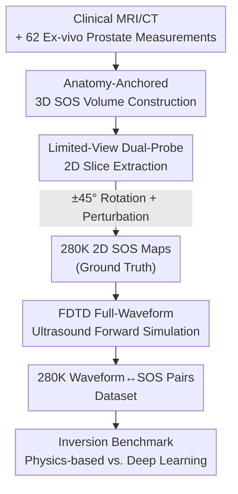

# OpenPros: A Large-Scale Dataset for Limited View Prostate Ultrasound Computed Tomography

**Conference**: ICLR 2026  
**OpenReview**: [https://openreview.net/forum?id=kcFEpBagea](https://openreview.net/forum?id=kcFEpBagea)  
**Code**: https://open-pros.github.io/ (Dataset and solver open-sourced)  
**Area**: Medical Imaging / Datasets & Benchmarks  
**Keywords**: Prostate USCT, Limited-view reconstruction, Speed-of-Sound inversion, Full-waveform simulation, Inverse problem benchmark

## TL;DR
This paper constructs OpenPros, the first large-scale dataset for limited-view prostate Ultrasound Computed Tomography (USCT). By synthesizing anatomically realistic 3D Speed-of-Sound (SOS) volumes based on clinical MRI/CT and ex-vivo measurements, the authors generate 280,000 pairs of 2D SOS maps and full-waveform ultrasound data. Accompanied by an open-source FDTD solver and a physics/deep learning inversion benchmark, the work reveals that while deep learning models are fast and accurate, they still fail to resolve internal prostate micro-structures and struggle with cross-patient generalization.

## Background & Motivation
**Background**: Prostate cancer is a high-incidence and highly lethal malignancy in men, making early screening critical. Current clinical imaging relies on mpMRI, which is accurate but expensive and poorly accessible. Conventional Transrectal Ultrasound (TRUS) is affordable and real-time but has a sensitivity of only 30%–50% for clinically significant tumors, often missing anterior or apical lesions. USCT can reconstruct quantitative tissue parameters such as Speed-of-Sound (SOS) and attenuation, which serve as potential malignant biomarkers and promising alternatives.

**Limitations of Prior Work**: The anatomical location of the prostate restricts data acquisition to transrectal and transabdominal positions, resulting in sparse, angle-restricted "limited-view" data. Coupled with strong tissue heterogeneity and proximity to the bladder and pelvic bones, traditional physics-based inversion suffers from slow convergence, severe ill-posedness, and artifacts, often taking hours to a day per sample. Crucially, there is **no existing** large-scale, anatomically accurate prostate USCT dataset containing bone structures and limited-view configurations; current USCT datasets are almost exclusively for breast tissue and lack bones or limited-view simulations, hindering algorithm development and fair comparison.

**Key Challenge**: Algorithmic progress relies on high-fidelity paired data (SOS maps ↔ full-waveform signals). However, real clinical USCT systems (e.g., SoftVue, QTscan) are full-angle breast devices with hardware incompatible with the prostate, making it impossible to acquire paired data. Purely synthetic data lacks anatomical realism.

**Goal**: To create a large-scale paired dataset that is both anatomically realistic and physically credible, covering limited-view and bone-inclusive scenarios, and providing a unified inversion benchmark protocol (efficiency / accuracy / generalization / robustness).

**Key Insight**: Utilize real clinical scans and ex-vivo measurements to "anchor" the anatomy and SOS distribution. By treating expensive real data as templates and using high-precision wave equation solvers to simulate full-waveform signals in batches, paired samples can be produced at scale with controlled costs.

**Core Idea**: A three-stage pipeline consisting of "Real Anatomical 3D SOS Volumes → Clinical Limited-view Probe 2D Slicing → FDTD Forward Wavefield Simulation" is used to expand 4 clinical scans and 62 ex-vivo prostate cases into 280,000 limited-view USCT training samples, along with open-source solvers and benchmarks.

## Method

### Overall Architecture
OpenPros is not a new model but a **data generation and benchmark evaluation pipeline**. The input consists of real clinical MRI/CT and ex-vivo prostate ultrasound measurements, and the output comprises 280,000 pairs of "2D SOS maps (ground truth) ↔ 40-channel full-waveform ultrasound signals" plus an inversion benchmark. The process follows four steps: first, clinical scans are annotated by experts and fused with ex-vivo SOS data to assemble anatomically realistic 3D SOS volumes; second, 2D slices are extracted using a dual-probe geometry with ±45° rotations; third, a 4th-order spatial/2nd-order temporal FDTD solver performs forward simulation for each 2D map, recording wavefields for 20 sources × 322 receivers; finally, physics-based and deep learning methods are compared on this data using defined ID/OOD/noise protocols.

### Key Designs

**1. Anatomy-Anchored 3D SOS Volume Construction: Grounding Simulation in Real Anatomy and Velocity**

Purely synthetic volumes lack anatomical reality, a major weakness of previous USCT datasets. This work "anchors" every tissue type using multi-modal real data: major organs are annotated by experts on T2-weighted MRI, fat is segmented from T1-weighted MRI, and bone from X-ray CT. The SOS and attenuation of the prostate itself come from real measurements of 62 ex-vivo samples on a QT scanner, while SOS values for other organs are taken from the ITIS tissue database. To simulate internal heterogeneity, the authors assign SOS at the voxel level using a **Gaussian distribution** $c \sim \mathcal{N}(\mu_{\text{tissue}}, \sigma_{\text{tissue}}^2)$ based on database means and standard deviations. This preserves anatomical structures (including bladder and pelvic bones, which are absent in breast datasets) while ensuring the prostate SOS distribution remains close to real measurements.

**2. Limited-View Dual-Probe 2D Slicing: Embedding Clinical Acquisition Constraints**

The difficulty of USCT lies in the limited viewing angle, so the data must replicate these constraints. The authors place two clinically realistic probes—one transrectal probe inside the rectum and one transabdominal probe on the body surface—and extract cross-sections with random perturbations within a ±45° rotational range, resulting in 280,000 2D SOS maps. Each map is fixed to a 401 × 161 grid with a physical field of view of 60 mm (lateral) × 150 mm (axial) and a grid spacing of 0.375 mm. Crucially, sources and receivers are only distributed on the upper and lower boundaries of the grid, embodying the sparse, angle-limited conditions dictated by prostate anatomy.

**3. High-Fidelity FDTD Forward Simulation: Scaling Production of Paired Signals**

With the ground truth SOS map $c$, the corresponding observed waveform $p$ is required. Forward simulation is governed by the wave equation $\nabla^2 p - \tfrac{1}{c^2}\tfrac{\partial^2 p}{\partial t^2} = s$. This work uses an FDTD solver with 4th-order spatial and 2nd-order temporal accuracy to achieve a balance between precision and computational cost. A Ricker wavelet with a 1 MHz peak frequency is used for excitation. Each sample features 20 sources and 322 receivers per source, recording 1000 time steps ($\Delta t = 10^{-7}$ s, total 100 µs), with a 120-grid-point absorbing boundary to suppress reflections. The FDTD solver and Runge-Kutta implicit iterations are open-sourced alongside the dataset.

**4. Multi-dimensional Inversion Benchmark Protocol: Beyond Accuracy**

The value of the dataset lies in its ability to expose method weaknesses. The benchmark covers three core issues: inference efficiency, reconstruction accuracy, and Out-of-Distribution (OOD) generalization. Evaluated methods include two physics-based approaches (Delay-and-Sum beamforming, three-stage multi-frequency USCT inversion) and two deep models (fully convolutional InversionNet, and ViT-Inversion). Evaluation metrics include MAE/RMSE for numerical fidelity and SSIM/PCC for structural alignment, with specific OOD splits—patient-level, leave-one-prostate-out, and combined splits—as well as noise robustness tests ($\sigma \in \{0.01, 0.02, 0.05\}$).

### Loss & Training
Inversion is formulated as a supervised learning problem $\min_\theta \mathbb{E}_{p,c}[\mathcal{L}(c, \hat{c})]$, where $\hat{c} = f_\theta^{-1}(p)$ is the deep network's approximation of the inverse mapping $c = f^{-1}(p)$. MAE/RMSE are commonly used as training objectives. ID experiments use a slice-level 90%/10% random split, while OOD experiments use patient-level or prostate-level splits to test extrapolation.

## Key Experimental Results

### Main Results (In-Distribution ID)

| Method | MAE↓ | RMSE↓ | SSIM↑ | PCC↑ | Inference per Sample |
|------|------|-------|-------|------|-----------|
| Physical USCT (Multi-freq) | — | ≈0.16 | ≈0.90 | — | ≈24 hours |
| Delay-and-Sum Beamforming | — | — | — | — | ≈4 hours |
| InversionNet (CNN) | 0.0074 | 0.0247 | 0.9955 | 0.9851 | 4.9 ms |
| ViT-Inversion | **0.0067** | **0.0205** | **0.9967** | **0.9893** | 8.9 ms |

Deep models reduce RMSE by 5–6× compared to physical methods and push SSIM near 0.99, while reducing inference time from hours to milliseconds. ViT-Inversion is the top performer across all four metrics.

### Ablation Study (OOD/Generalization)

| Scenario | Method | RMSE↓ | SSIM↑ | Description |
|------|------|-------|-------|------|
| Patient-level OOD | InversionNet | 0.1010 | 0.9399 | Error increases 3–5× vs. ID |
| Patient-level OOD | ViT-Inversion | 0.0890 | 0.9496 | More robust than CNN |
| Leave-one-prostate | ViT-Inversion | 0.0210 | 0.9934 | Negligible performance drop |
| Combined OOD | ViT-Inversion | 0.0916 | 0.9482 | As difficult as patient-level |
| Noise σ=0.05 | InversionNet | — | 0.825 | Significant degradation |
| Noise σ=0.05 | ViT-Inversion | — | 0.935 | More stable Transformer |

### Key Findings
- **Cross-patient generalization is the bottleneck**: Error surges 3–5× and SSIM drops from 0.99 to 0.94 when testing on unseen patients, signifying that patient-independent limited-view reconstruction remains an unsolved challenge.
- **"Global look, local blur"**: While SSIM > 0.99 suggests perfection, zoomed-in views show that internal fine structures and small lesions are often smoothed out, indicating that metrics may overestimate clinical utility.
- **ViT outperforms CNN**: Self-attention provides consistent advantages in modeling long-range acoustic interactions, leading to better accuracy and OOD robustness.

## Highlights & Insights
- **Anchoring Synthetic Data with Real Data**: Using clinical scans + ex-vivo measurements to define anatomy and SOS values is a practical paradigm for medical imaging inverse problems where large-scale ground truth is hard to obtain.
- **Built-in Pathological Challenges**: Limited-view constraints are not added as post-processing but are built into the data generation from the probe geometry, making the benchmark truly representative of clinical constraints.
- **Honest Critical Evaluation**: The authors use OOD splits to prove that "high metrics $\neq$ clinical readiness," providing more value than simple leaderboard chasing.

## Limitations & Future Work
- **2D and SOS-only Simplification**: The simulation is 2D and ignores 3D effects, out-of-plane scattering, attenuation, and density.
- **Limited Anatomical Diversity**: With only 4 clinical patients and 62 ex-vivo cases, the dataset may under-sample anatomical variations, explaining the drop in cross-patient generalization.
- **Future Directions**: Expanding patient cohorts, introducing multi-parameter acoustic maps, extending to 3D simulation, and including clinicopathological correlations.

## Related Work & Insights
- **vs. Breast USCT Datasets (Li et al. / Ruiter et al. / OpenWaves)**: These datasets lack prostate anatomy, bone structures, and limited-view simulations. OpenPros is the first to combine all these attributes.
- **vs. Male Pelvic Anatomy Datasets (Segars / Visible Human)**: These provide realistic anatomy but **lack acoustic parameters**, making them unsuitable for USCT inversion.
- **vs. InversionNet**: This work includes InversionNet as a baseline while demonstrating that Transformers offer superior generalization and noise resistance for long-range wave modeling.

## Rating
- Novelty: ⭐⭐⭐⭐⭐ First large-scale prostate USCT dataset filling a clear gap.
- Experimental Thoroughness: ⭐⭐⭐⭐ Systematic ID/OOD/Noise benchmark.
- Writing Quality: ⭐⭐⭐⭐⭐ Clear and honest narrative on motivation and limitations.
- Value: ⭐⭐⭐⭐⭐ Open-source data, solver, and benchmark for clinical inverse problems.

<!-- RELATED:START -->

## Related Papers

- [\[ICLR 2026\] DM4CT: Benchmarking Diffusion Models for Computed Tomography Reconstruction](dm4ct_benchmarking_diffusion_models_for_computed_tomography_reconstruction.md)
- [\[NeurIPS 2025\] Are Pixel-Wise Metrics Reliable for Sparse-View Computed Tomography Reconstruction?](../../NeurIPS2025/medical_imaging/are_pixel-wise_metrics_reliable_for_sparse-view_computed_tomography_reconstructi.md)
- [\[ICLR 2026\] U2-BENCH: Benchmarking Large Vision-Language Models on Ultrasound Understanding](u2-bench_benchmarking_large_vision-language_models_on_ultrasound_understanding.md)
- [\[CVPR 2026\] Instruction-Guided Lesion Segmentation for Chest X-rays with Automatically Generated Large-Scale Dataset](../../CVPR2026/medical_imaging/instruction-guided_lesion_segmentation_for_chest_x-rays_with_automatically_gener.md)
- [\[ICLR 2026\] NAB: Neural Adaptive Binning for Sparse-View CT Reconstruction](nab_neural_adaptive_binning_for_sparse-view_ct_reconstruction.md)

<!-- RELATED:END -->
