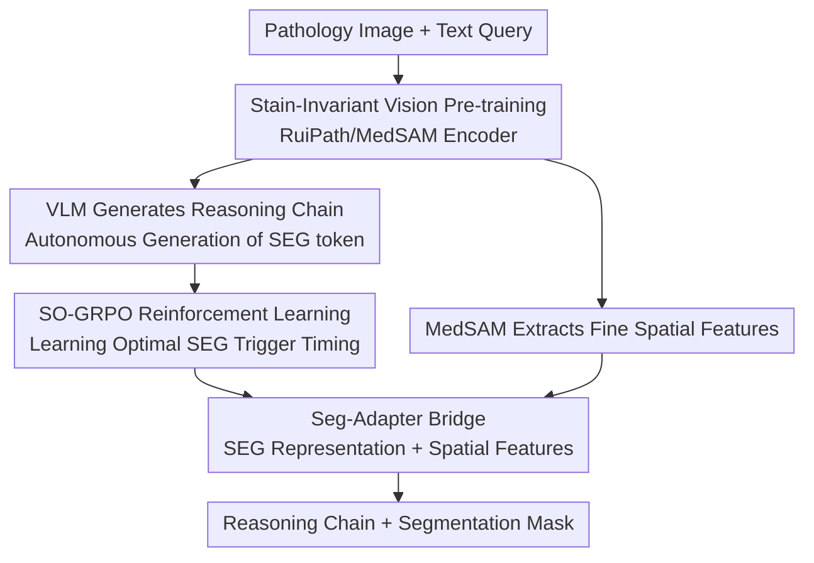

# PathChat-SegR1: Reasoning Segmentation in Pathology via SO-GRPO

**Conference**: ICLR 2026  
**OpenReview**: [https://openreview.net/forum?id=DQESI75YrD](https://openreview.net/forum?id=DQESI75YrD)  
**Code**: https://github.com/yul945562-bit/Pathseg  
**Area**: Medical Imaging / Multimodal VLM / Reinforcement Learning  
**Keywords**: Pathological image segmentation, reasoning segmentation, GRPO, stain-invariant, SEG token

## TL;DR
Addressing the pain point where "rare/unseen morphologies are difficult to segment" in pathology, this paper develops a pathology-specific reasoning segmentation model, PathChat-SegR1. It employs stain-invariant self-distillation to train a pathological vision encoder and utilizes SO-GRPO reinforcement learning to enable the VLM to autonomously decide "when to output the `<SEG>` token to trigger segmentation." It achieves a 61% improvement in zero-shot Dice on unseen pathologies compared to the previous SOTA.

## Background & Motivation
**Background**: Pathological image segmentation supports quantitative analysis and clinical diagnosis. Mainstream approaches include closed-set segmentation models like nnU-Net, MedSAM, and BiomedParse, which perform strongly on predefined categories. Another line of research involves SAM-based open-set segmentation, achieving generalization via point/box prompts.

**Limitations of Prior Work**: Clinical practice frequently encounters rare pathologies or new morphologies absent from training sets, causing closed-set models to fail. While SAM-based models allow for open-set segmentation, manual prompting for every target is impractical for Whole Slide Images (WSI) containing hundreds of structures, and these models cannot interpret semantic/clinical queries expressed in natural language. Furthermore, clinical requirements demand "interpretability"—the model must provide diagnostic rationale rather than just a mask.

**Key Challenge**: Reasoning segmentation (guiding segmentation of unseen objects with natural language queries and generating reasoning chains) is a potential solution. however, migrating existing reasoning segmentation models to pathology faces three obstacles: (1) Vision encoders are from general domains, lacking pathological knowledge and robustness to stain variations; (2) LLM backbones follow the LISA paradigm of "inserting `<SEG>` tokens at preset positions," failing to autonomously judge if the semantic context is sufficient to trigger segmentation; (3) There are no reasoning segmentation datasets or benchmarks in the pathology domain.

**Goal**: To fill these three gaps: pathological-specific and stain-robust visual representations, RL training for autonomous segmentation timing, and a large-scale pathology reasoning segmentation benchmark.

**Key Insight**: The authors observed that pathologists "reason while gathering evidence" when examining rare tumors, only making a conclusion once enough evidence is accumulated. The fixed `<SEG>` insertion paradigm deprives the model of this decision-making power of "when to conclude." Thus, the `<SEG>` token is shifted from "fixed insertion" to "autonomous generation," with RL used to evaluate if triggering segmentation at each step of the reasoning process is optimal.

**Core Idea**: Replace general encoders with pathology-specific, stain-invariant encoders, and use Segmentation-Optimized GRPO (SO-GRPO) to backpropagate segmentation quality gradients to the timing of `<SEG>` generation, teaching the model "when to stop reasoning and output segmentation."

## Method

### Overall Architecture
PathChat-SegR1 takes a pathological image and a text query as input, outputting a natural language reasoning chain and a segmentation mask. The architecture consists of three synergistic components: ① A **VLM backbone** (Qwen2.5-VL, with the vision encoder replaced by the pathology foundation model RuiPath) responsible for image reading and reasoning chain generation, autonomously emitting a `<SEG>` token to command segmentation; ② An independent **MedSAM image encoder** that processes the same image to extract fine-grained spatial features for mask generation; ③ A **Seg-Adapter** that bridges the hidden representation of the VLM's `<SEG>` token to the mask decoder, combining it with MedSAM's spatial features to produce the final mask.

Training proceeds in three serial stages: In the **Pre-training** stage, the VLM learns pathological knowledge (via image-text next-token prediction) while the MedSAM encoder undergoes stain-invariant self-distillation; in the **Supervised Fine-Tuning (SFT)** stage, vision and language embeddings are aligned and the model is taught to correctly place `<SEG>` within reasoning chains using LoRA and adapters to save costs, while the mask decoder undergoes full-parameter training; in the **SO-GRPO Reinforcement Learning** stage, the model learns to generate `<SEG>` only after sufficient semantics have been accumulated.

### Key Designs

**1. Stain-Invariant Vision Pre-training: Making Encoders "Immune" to Staining Styles**
Pathological images exhibit significant staining differences due to varying preparation protocols and laboratory habits. If the staining style changes from the training set, the model’s judgment of tissue morphology may fail. The authors perform stain-invariant self-distillation on the MedSAM vision encoder: for each image $x_i$, RandStainNA is used to perform random channel linear transformations in the LAB color space to generate two "virtually restained" views (embeddings denoted as $z_i^a, z_i^b$). The encoder performs Masked Auto-Encoding (MAE, 75% mask ratio) to reconstruct masked patches while requiring feature consistency between the two stained views. The pre-training objective is:

$$L_{SSL} = \frac{\alpha}{N}\sum_{i=1}^{N}\mathrm{Cos}(s_{i,1}, s_{i,2})\,\|z_i^a - z_i^b\|^2 + L_{MAE}$$

where $s_{i,1}, s_{i,2}$ are the stain template vectors of the two views (composed of the mean $A$ and standard deviation $D$ of the LAB color distribution). The brilliance lies in the cosine distance term acting as an **adaptive weight**: a larger stain difference leads to a larger $\mathrm{Cos}$ value and a heavier penalty on feature inconsistency, forcing the model to decouple "staining style" from features. Similar self-distillation is applied to the RuiPath encoder in the VLM (RuiPath itself is a foundation model pre-trained on large-scale histopathology using DINOv2, possessing pathological priors of tissue structure, cell morphology, and disease patterns).

**2. From Fixed Insertion to Autonomous `<SEG>` Generation + GAE Temporal Credit Assignment**
The LISA paradigm inserts `<SEG>` at a predetermined position, depriving the model of the autonomy of "when to conclude." Simultaneously, standard GRPO allocates reward **uniformly** across the entire trajectory, failing to locate the "optimal step to generate `<SEG>`." The authors replace trajectory-level advantage estimation with **Generalized Advantage Estimation (GAE)** to calculate credit for each time step of reasoning generation:

$$\hat{A}_{GAE}(s_t, a_t) = \sum_{l=0}^{\infty}(\gamma\lambda)^l \delta_{t+l}, \quad \delta_t = r_t + \gamma V(s_{t+1}) - V(s_t)$$

Here, state $s_t$ includes the query, vision features, and all previously generated tokens. $\delta_t$ is the TD residual measuring reward improvement between adjacent states, and $V(s_t)$ estimates the expected cumulative reward from the current context. The model learns to generate `<SEG>` at the point where $\hat{A}_{GAE}(s_t, a_t=\texttt{<SEG>})$ is maximized—meaning "semantics are sufficient, and further reasoning will not improve segmentation." GAE also reduces gradient variance by a factor of $\frac{1-(\gamma\lambda)^{2T}}{1-(\gamma\lambda)^2}$ compared to Monte Carlo estimation, stabilizing policy updates for this critical decision step.

**3. Differentiable Segmentation Reward + Sparse-aware Reward**
Standard segmentation metrics like Dice and IoU are discrete and non-differentiable, preventing the backpropagation of segmentation quality to the `<SEG>` representation. The authors create a **differentiable segmentation reward** using probability softening:

$$R_{soft} = \frac{2\sum_i p_i g_i + \epsilon}{\sum_i p_i + \sum_i g_i + \epsilon}$$

where $p_i = \sigma(M_{pred,i})$ is the softened probability of the predicted mask and $g_i$ is the ground truth. This creates a differentiable path $R_{soft}\to M_{pred}\to h_{SEG}$, allowing the gradient $\partial R_{soft}/\partial h_{SEG}$ to guide the `<SEG>` hidden representation to encode spatial locations and semantics that maximize overlap with the GT. Additionally, to prevent premature or excessive generation of `<SEG>`, a **sparse-aware reward** is established:

$$R_{sparse} = \beta_{sparse}\cdot \mathbb{I}(s_t \in S_{spatial}) - \gamma_{sparse}\cdot \mathbb{I}(s_t \notin S_{spatial})$$

$S_{spatial}$ represents states containing spatial-semantic information (detected via position keywords like "boundary" or "region"). Generating `<SEG>` in non-spatial states is penalized, while generation in spatial states is rewarded. This is mathematically equivalent to maximizing the mutual information $I(M_{gt}; a_t=\texttt{<SEG>}|s_t)$. The final total reward also incorporates a spatial localization reward $R_{spatial}$, format reward $R_{format}$, and length penalty $R_{len}$.

**4. Adaptive Scheduling for Convergence**
Reinforcement learning is prone to oscillation. The authors use a learning rate schedule $\alpha_k=\alpha_0/(1+\eta k)$ satisfying Robbins-Monro conditions, coupled with KL regularization to construct a Lyapunov function $V(\theta)=\mathbb{E}_{s\sim\rho}[\mathrm{KL}(\pi^*\|\pi_\theta)]$. This proves monotonic improvement $V(\theta_{k+1})\le V(\theta_k)-\eta\|\nabla V(\theta_k)\|_2^2$, ensuring that each policy update moves closer to the optimal strategy.

### Loss & Training
The SFT stage jointly optimizes reasoning chain generation and mask prediction:

$$L_{SFT} = \lambda_{CoT}\cdot L_{CE} + \lambda_{seg}\cdot(L_{Dice} + L_{BCE})$$

The first term is the autoregressive cross-entropy for the reasoning chain, and the second term is the Dice + BCE for the mask. Parameter-efficient strategy: LoRA (rank 16, dropout 0.1) is used for the LLM backbone and RuiPath encoder, lightweight adapters are inserted into the MedSAM encoder, and the randomly initialized mask decoder and Seg-Adapter undergo full-parameter training. In the RL stage: 8×H800, AdamW (lr $1\times10^{-4}$), batch size 64.

The dataset benchmark consists of **118,667** 「image-GT mask-query-reasoning chain」 quadruplets: 65% from 6 public sets (Camelyon16/17, CRAG, etc.) plus 43,847 private intraoperative frozen sections containing real artifacts like ice crystals. Reasoning chains were annotated using a semi-automated pipeline: Gemini-2.5-Pro generated morphological descriptions, DeepSeek-R1 converted them into structured reasoning chains, and 3 pathologists reviewed for clinical accuracy.

## Key Experimental Results

### Main Results
Zero-shot in-domain evaluation (Dice):

| Dataset | Ours | MMR-7B (Reasoning SOTA) | nnU-Net (Closed-set) |
|--------|------|------|------|
| Camelyon16 | **0.76** | 0.57 | 0.74 |
| GlaS | **0.87** | 0.72 | 0.91 |
| CRAG | **0.92** | 0.74 | 0.94 |
| FS-Mic | **0.74** | 0.56 | 0.69 |

Ours shows a 33% relative improvement over MMR-7B on Camelyon16 and approaches the performance of the dataset-specifically tuned nnU-Net using a single unified model.

Out-of-domain evaluation on unseen pathologies (Dice):

| Method | PMBT (Zero-shot) | RD (Zero-shot) | RD (1-shot) |
|------|------|------|------|
| MMR-7B | 0.36 | 0.33 | 0.47 |
| Seg-Zero | 0.39 | 0.29 | 0.44 |
| **PathChat-SegR1** | **0.58** | **0.53** | **0.72** |

The Dice of 0.58 on PMBT represents a **61%** relative improvement over MMR-7B; 1-shot in-context learning on rare diseases (RD) further boosts performance to 0.72.

### Ablation Study
Component ablation (PMBT, Dice):

| Configuration | Dice | Note |
|------|------|------|
| Full Model | 0.58 | |
| w/o RuiPath Encoder | 0.42 | -0.16; General encoders lack pathology knowledge |
| w/o RL | 0.40 | -0.18; SFT fails to learn segmentation timing |
| w/o MedSAM Pre-training | 0.51 | Stain-invariant distillation invalidated |
| w/o Auto-emission | 0.51 | Reverted to fixed `<SEG>` insertion |

SO-GRPO Decomposition (PMBT):

| Configuration | Dice | Convergence Steps | Gradient Var |
|------|------|------|------|
| Full SO-GRPO | 0.58 | 18K | 0.031 |
| Standard GRPO | 0.53 | 24K | 0.048 |
| w/o GAE | 0.55 | 22K | 0.042 |

### Key Findings
- **RL and Pathological Encoders Contribute Most**: Removing RL drops performance by 0.18, and removing RuiPath drops it by 0.16, confirming that "segmentation timing" and "pathological priors" are the lifelines.
- **SO-GRPO is More Stable and Faster**: Compared to standard GRPO, Dice improved from 0.53 to 0.58, convergence steps reduced from 24K to 18K, and gradient variance dropped from 0.048 to 0.031.
- **Higher Reasoning Chain Quality**: Achieved a BLEU-4 of 0.315 and F1 of 0.612 on FS-WSI, surpassing Med-PaLM, indicating that RuiPath's visual knowledge contributes significantly to reasoning.

## Highlights & Insights
- **Modeling "When to Segment" as RL Temporal Credit Assignment**: Using GAE to score each reasoning step and triggering `<SEG>` at the maximum advantage is a key move away from fixed insertion, transferable to any task involving special token timing.
- **Differentiable Rewards Bridging the Gradient Loop**: Softening discrete Dice into a differentiable $R_{soft}$ allows gradients to shape the `<SEG>` hidden representation directly.
- **Stain-Invariant Distillation with Adaptive Cosine Weights**: Heavier penalties for larger stain differences is a concise and effective "effort-based" mechanism for medical imaging.

## Limitations & Future Work
- Theoretical guarantees (Robbins-Monro, Lyapunov) are highly formalized, but empirical evidence is limited to gradient variance/steps; the link between theory and practice could be stronger.
- The large portion of private frozen section data (43,847 images) limits benchmark reproducibility.
- The framework is complex (VLM + RuiPath + MedSAM + Seg-Adapter + mask decoder) with three training stages; real-time performance in clinical settings was not reported.
- Although the improvement is large, absolute Dice on unseen domains remains relatively low (0.53 for RD zero-shot).

## Related Work & Insights
- **vs LISA**: LISA uses fixed insertion; this work uses autonomous generation + RL for timing, solving the inability to judge semantic accumulation.
- **vs Seg-Zero / SAM4MLLM**: These use MLLM to generate prompts for a frozen SAM; this work integrates segmentation directly and optimizes end-to-end.
- **vs Standard GRPO**: Standard GRPO applies rewards uniformly; SO-GRPO uses GAE for step-wise credit assignment, converging faster and more stably.

## Rating
- Novelty: ⭐⭐⭐⭐⭐ Modeling segmentation timing as RL credit assignment is a substantial advancement.
- Experimental Thoroughness: ⭐⭐⭐⭐ Extensive coverage with 10 benchmarks and 4 ablation tables, though private data is not public.
- Writing Quality: ⭐⭐⭐⭐ Clear structure and solid motivation, though theoretical parts feel slightly detached from empirical results.
- Value: ⭐⭐⭐⭐⭐ Directly addresses the clinical pain point of "unseen pathology segmentation" with a comprehensive benchmark.

<!-- RELATED:START -->

## Related Papers

- [\[ICLR 2026\] Modeling the Density of Pixel-level Self-supervised Embeddings for Unsupervised Pathology Segmentation in Medical CT](modeling_the_density_of_pixel-level_self-supervised_embeddings_for_unsupervised_.md)
- [\[ICML 2026\] PathCTM: Thinking in Scales — Accelerating Gigapixel Pathology Image Analysis via Adaptive Continuous Reasoning](../../ICML2026/medical_imaging/thinking_in_scales_accelerating_gigapixel_pathology_image_analysis_via_adaptive_.md)
- [\[CVPR 2026\] MedLoc-R1: Performance-Aware Curriculum Reward Scheduling for GRPO-Based Medical Visual Grounding](../../CVPR2026/medical_imaging/medloc-r1_performance-aware_curriculum_reward_scheduling_for_grpo-based_medical_.md)
- [\[ICLR 2026\] Bridging Radiology and Pathology Foundation Models via Concept-Based Multimodal Co-Adaptation](bridging_radiology_and_pathology_foundation_models_via_concept-based_multimodal_.md)
- [\[NeurIPS 2025\] QoQ-Med: Building Multimodal Clinical Foundation Models with Domain-Aware GRPO Training](../../NeurIPS2025/medical_imaging/qoq-med_building_multimodal_clinical_foundation_models_with_domain-aware_grpo_tr.md)

<!-- RELATED:END -->
