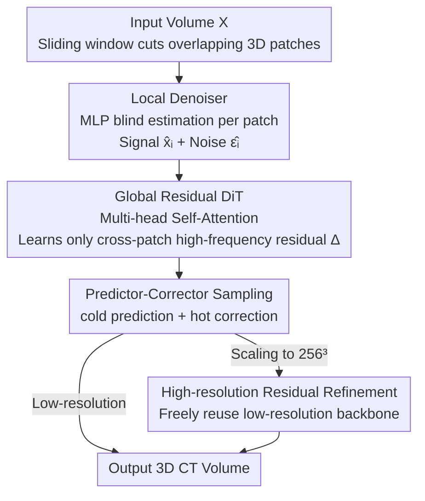

# Pixel-Level Residual Diffusion Transformer: Scalable 3D CT Volume Generation

**Conference**: ICLR 2026  
**OpenReview**: [https://openreview.net/forum?id=bWtRZQ1rm2](https://openreview.net/forum?id=bWtRZQ1rm2)  
**Code**: https://github.com/Fredy-Zhang/PRDiT  
**Area**: Medical Imaging / Diffusion Models / 3D Generation  
**Keywords**: 3D CT Generation, Residual Diffusion, Diffusion Transformer, Voxel-level Generation, High-resolution Scaling

## TL;DR
PRDiT proposes a two-stage residual diffusion framework to generate high-resolution 3D CT volumes **directly at the voxel level**. It utilizes a lightweight MLP "Local Denoiser" to estimate low-frequency coarse structures from overlapping 3D patches, followed by a "Global Residual DiT" to recover high-frequency residuals using a global field of view. Combined with a hot predictor-corrector sampling and a scaling strategy that reuses low-resolution backbones, the method surpasses HA-GAN, 3D LDM, and WDM-3D in 3D FID, MMD, and Wasserstein distance on LIDC-IDRI / RAD-ChestCT, while reducing $256^3$ training costs to 1/4 ~ 1/6 of competitors.

## Background & Motivation

**Background**: 3D medical volume (especially CT) generation is critical for diagnosis, segmentation, and anomaly detection. Current mainstream approaches comprise GANs (HA-GAN, 3D-StyleGAN), which produce realistic local details, and diffusion models (3D-DDPM, 3D LDM, WDM-3D, triplane diffusion), which offer more stable training and higher fidelity, recently becoming the dominant choice.

**Limitations of Prior Work**: The volume of voxel feature maps expands **cubically** with resolution. Running deep U-Nets directly on high-resolution 3D volumes causes memory and computation explosions. Consequently, existing methods resort to "compromises": patch-level processing, downsampling, or compression into latent spaces using VAE/VQ-VAE. However, patching and downsampling **truncate the effective receptive field**, losing global anatomical consistency. Latent space compression fails to train robust encoders in **data-scarce** 3D medical scenarios, leading to poor reconstruction and loss of critical anatomical details.

**Key Challenge**: Balancing local detail fidelity, global structural consistency, and computational feasibility is difficult. Convolutional U-Nets excel at local modeling but fail to capture long-range dependencies. Directly migrating 2D DiTs to dense 3D leads to unstable training, optimization difficulties, and prohibitive costs (token count increases 8x and attention complexity 64x when resolution doubles).

**Goal**: Achieve (1) voxel-level high-fidelity synthesis, (2) global structural consistency, and (3) inexpensive scaling to $256^3$ high resolution, **without introducing autoencoder bottlenecks**.

**Key Insight**: Decompose the generation task by frequency. Low-frequency coarse structures can be **estimated within local patches**, while the truly difficult high-frequency residuals that require global context occur **across patch boundaries**. Thus, a single large model is not required to handle both low and high frequencies simultaneously.

**Core Idea**: A two-stage coarse-to-fine residual learning framework—using a "lightweight Local Denoiser for low-frequency estimation + Global DiT for high-frequency residuals"—generates directly at the voxel level and scales to higher resolutions almost for free by freezing and reusing low-resolution models.

## Method

### Overall Architecture
PRDiT splits the 3D diffusion process into two complementary branches forming a coarse-to-fine residual pipeline. Given a volume $X \in \mathbb{R}^{C\times H\times W\times D}$, it is first cut into $N$ overlapping 3D patches using a **sliding window (window size $p$, stride $s < p$)** and flattened. The first branch is the **Local Denoiser**: an MLP blind estimator that **independently** predicts the clean signal $\hat{x}_i$ and noise $\hat{\epsilon}_i$ for each patch based solely on internal information, providing a "coarse prior estimate" for the entire volume. The second branch is the **Global Residual DiT**: it aggregates all patch embeddings through multi-head self-attention to compute **residual corrections** $\Delta\hat{x}_i, \Delta\hat{\epsilon}_i$ using a global perspective, correcting errors at patch boundaries. Sampling employs a **predictor-corrector (hot diffusion)** scheme to balance deterministic guidance and controllable stochasticity. For higher resolutions, a **frozen and reused** low-resolution PRDiT serves as a structural prior, with only an additional "high-resolution residual refinement module" trained to recover high frequencies lost during sampling/resolution changes.

### Key Designs

**1. Local Denoiser: MLP Blind Estimator for Low Frequencies**

To address memory explosion, a **lightweight per-patch MLP** handles low-frequency structures instead of the large Transformer. Forward diffusion follows the angular schedule of Zhang et al. (2023): at time $t$, clear patch $v_i$ is noised to $v_i^t = \cos(\tfrac{t}{T}\tfrac{\pi}{2})\,v_i + \sin(\tfrac{t}{T}\tfrac{\pi}{2})\,\epsilon_i$. The MLP consists of two **Adaptive SwiGLU** layers (modulated by time embeddings via AdaLN for $\gamma, \beta$) with residual connections and linear projections. It **simultaneously** outputs denoised patch $\hat{x}_i$ and noise estimate $\hat{\epsilon}_i$, aligned with standard diffusion goals. The loss is $L_{local}=\mathbb{E}_i[\|\hat{x}_i-x_i\|_2^2+\|\hat{\epsilon}_i-\epsilon_i\|_2^2]$.

Two details are critical: first, **sliding windows with overlap** ($s < p$) allow adjacent patches to share boundary context, mitigating stitching artifacts (removing overlap degrades FID from 2.04 to 3.27). Second, it is inherently a **blind estimator**—it only sees local information, ensuring errors in global structure are cleanly left for the subsequent stage.

**2. Global Residual DiT: Transformer for Cross-patch High-frequency Correction**

The Local Denoiser is patch-independent and lacks global awareness, leading to errors in patch boundaries and long-range anatomical consistency. Here, the **Local Denoiser is frozen**, and a DiT is trained to attend to all patch embeddings simultaneously. It outputs a **residual** $\Delta$ rather than reconstructing from scratch: refined patches are $\tilde{x}_i=\hat{x}_i+\Delta\hat{x}_i$ and $\tilde{\epsilon}_i=\hat{\epsilon}_i+\Delta\hat{\epsilon}_i$, trained with $L_{global}=\mathbb{E}_i[\|\tilde{x}_i-x_i\|_2^2+\|\tilde{\epsilon}_i-\epsilon_i\|_2^2]$.

This design provides two benefits: first, the DiT only learns "residuals" rather than the entire distribution, reducing complexity and training time. Second, since the local branch is trained only once, expanding DiT depth (4/8/12 layers) can reuse the same Local Denoiser, amortizing scaling costs. Ablations show that **removing Global DiT (leaving only Local) crashes FID to 41.92**, proving global residuals are the key to high fidelity.

**3. Predictor-Corrector Sampling: Upgrading cold to hot Diffusion**

Deterministic cold sampling (single-step gradient updates) lacks diversity and detail. The authors modify the gradient generation path into **separated cold prediction + hot correction steps**: the predictor jumps **forward $k$ steps**, $x_{t-k}=x_t-k\cdot\nabla(\cos(\beta_t)\hat{x}_0+\sin(\beta_t)\hat{\epsilon})$ (where $\beta_t=\tfrac{t}{T}\tfrac{\pi}{2}$); the corrector then **backtracks $k-1$ steps** and injects fresh noise $x_{t-1}=\Gamma_t^{(k)}x_{t-k}+\sqrt{1-(\Gamma_t^{(k)})^2}\,\epsilon'$, with $\Gamma_t^{(k)}=\cos(\beta_{t-1})/\cos(\beta_{t-k})$ for variance preservation.

When $k=1$, it degrades to standard cold sampling. For $k>1$ with the corrector, it becomes **hot diffusion**, injecting controlled stochasticity to increase exploration. This balances "deterministic guidance" and "adaptive randomness." Ablations show $k=1$ (cold) results in an FID of 8.889, while $k=2$ (hot) drops it to 2.173.

**4. High-resolution Scaling: Reusing the Backbone for High-frequency Refinement**

Training a DiT at $256^3$ from scratch is nearly impossible (8x tokens, ~64x attention cost vs $128^3$), leading to OOM or optimization failures. Instead, the **frozen low-resolution PRDiT** is reused as a structural prior. Given a high-resolution noise volume $X_{HR}$: **Downsample** $\rightarrow$ query low-res model $\rightarrow$ **Upsample** to get "coarse" signal/noise values, then use a **high-resolution residual refinement module** (based on Local Denoiser's structure) to recover high frequencies. This is **integrated into the sampling loop** (downsampling/upsampling/refining at every step) rather than post-hoc super-resolution.

A key sampling choice: **trilinear interpolation** is used for signal upsampling (smoother, maintains anatomical continuity), while **nearest neighbor** is used for noise down/upsampling to preserve noise energy and align with the expected noise statistics of the pre-trained model. Training updates only the refinement module with a patch-level signal-noise loss plus a **low-frequency consistency term** to match low-resolution outputs. $256^3$ FID (2.28) significantly outperforms HA-GAN (3.98) and WDM-3D (5.60), with training taking only 36 GPUh vs 120-140 GPUh for competitors.

### Loss & Training
- Local Denoiser: $L_{local}=\mathbb{E}_i[\|\hat{x}_i-x_i\|_2^2+\|\hat{\epsilon}_i-\epsilon_i\|_2^2]$, joint signal and noise estimation.
- Global DiT: Frozen local branch; $L_{global}=\mathbb{E}_i[\|\tilde{x}_i-x_i\|_2^2+\|\tilde{\epsilon}_i-\epsilon_i\|_2^2]$ trains residuals.
- High-res Refinement: Patch-level signal-noise loss + low-frequency consistency term; backbone remains frozen.
- Preprocessing: Clipped to lung window, resampled to 1mm isotropic, cropped/padded to $256^3$. Average pooling for low-res experiments, normalized to $[-1,1]$.

## Key Experimental Results

### Main Results
On LIDC-IDRI and RAD-ChestCT at $128^3$ resolution. FID is $\times 10^3$. Mean $\pm$ std over 3 seeds. W-Score referenced to PRDiT-12L (closer to 1 is better).

| Dataset | Metric | HA-GAN | 3D-LDM | WDM-3D | PRDiT-4L (Ours) | PRDiT-12L (Ours) |
|--------|------|--------|--------|--------|----------|-----------|
| LIDC-IDRI | FID ↓ | 3.26 | 7.62 | 3.67 | 2.04 | **1.41** |
| LIDC-IDRI | MMD ↓ | 0.2071 | 0.3458 | 0.1885 | 0.1852 | **0.1501** |
| RAD-ChestCT | FID ↓ | 3.92 | 4.14 | 4.11 | 1.92 | **1.45** |
| RAD-ChestCT | MMD ↓ | 0.183 | 0.228 | 0.213 | 0.169 | **0.159** |

Even the shallowest PRDiT-4L outperforms all baselines; deepening to 8/12 layers provides stable gains, demonstrating scalability while reusing the same Local Denoiser.

$256^3$ High Resolution (LIDC-IDRI, FID $\times 10^3$, A100 GPU Hours):

| Model | FID ↓ | MMD ↓ | Training Cost |
|------|-------|-------|----------|
| HA-GAN (Prev. SOTA) | 3.98 | 0.2237 | 140 GPUh |
| 3D-LDM | OOM | OOM | — |
| WDM-3D | 5.60 | 0.2590 | 120 GPUh |
| **PRDiT-4L↑256 (Ours)** | **2.28** | **0.1370** | **36 GPUh** |

### Ablation Study
PRDiT-4L, LIDC-IDRI, FID $\times 10^3$.

| Configuration | FID ↓ | MMD ↓ | Note |
|------|-------|-------|------|
| Full model | 2.04 | 0.1853 | Complete model |
| w/o overlap | 3.27 | 0.2304 | No patch overlap; boundary inconsistency |
| w/o local denoiser | 3.10 | 0.2174 | Global DiT only |
| w/o global DiT | 41.92 | 0.7795 | Local branch only; FID crash |

Impact of predictor step $k$ (hot vs cold):

| $k$ | FID ↓ | MMD ↓ | Note |
|-----|-------|-------|------|
| 1.0 (cold) | 8.889 | 0.3490 | Purely deterministic; worst |
| 2.0 | **2.173** | **0.1849** | Optimal |
| 3.0 | 3.112 | 0.2112 | Excessive randomness |
| 4.0 | 4.184 | 0.2425 | Further degradation |

High-resolution scaling strategy: Training PRDiT-128 from scratch costs 80 GPUh (FID 2.04), while the PRDiT-64↑128 upsampling scheme achieves FID 2.89 in just 12 GPUh—over **6x faster**.

### Key Findings
- **Global DiT is vital**: Removing it increases FID from 2.04 to 41.92, proving cross-patch global high-frequency residuals are essential for high fidelity.
- **hot outperforms cold**: Moving $k$ from 1 to 2 reduces FID from 8.889 to 2.173, although excessive $k$ ($>2$) degrades results.
- **Overlapping patches are necessary**: Removing overlap degrades FID by 60%, validating the role of sliding window overlap in boundary continuity.
- **Backbone reuse saves computation**: $256^3$ training requires 36 GPUh vs 120-140 GPUh for competitors; 3D-LDM OOMs, and WDM-3D shows sensitivity to random seeds.

## Highlights & Insights
- **Dividing labor by frequency**: Devolving "low-frequency estimation" to a lightweight MLP and "global high-frequency residuals" to the DiT allows small models to outperform larger ones—4 layers achieved SOTA.
- **Residual learning reduces DiT burden**: DiT learns $\Delta$ instead of full reconstruction, stabilizing training and saving compute. This is a key engineering solution for dense 3D DiTs.
- **Nearest neighbor for noise, trilinear for signal**: This choice preserves noise energy statistics to match pre-trained distributions, a valuable insight for any super-resolution diffusion task.
- **Frozen reuse + in-loop refinement**: Integrating high-res refinement into the sampling loop rather than post-cascade prevents the destruction of low-frequency anatomical structures learned by diffusion.

## Limitations & Future Work
- Evaluations focus on unconditional generation and distribution metrics (3D FID / MMD); downstream gains in diagnosis/segmentation are not yet verified.
- Only validated on chest CT; generalization to other modalities (MRI, PET) or anatomical regions is unknown.
- $k=2$ is empirically optimal, but potential for non-integer $k$ or systematic searching remains.
- Voxel-level generation avoids autoencoder bottlenecks but memory feasibility for extremely large volumes ($>256^3$) and conditional generation (controllable lesion synthesis) has not been explored.

## Related Work & Insights
- **vs HA-GAN (GAN path)**: HA-GAN uses hierarchical patch generators/discriminators but suffers from mode collapse and high VRAM usage. PRDiT is more stable and achieves superior FID/MMD with less training.
- **vs 3D LDM (Latent Diffusion)**: 3D LDM compresses into a latent space, but 3D medical data scarcity leads to poor encoders and lost details; it OOMs at $256^3$. PRDiT **removes the autoencoder bottleneck** for better voxel-level detail.
- **vs WDM-3D (Wavelet U-Net)**: WDM-3D uses 3D U-Nets on wavelet subbands for efficiency but remains limited by convolutional fields of view and seed sensitivity. PRDiT's DiT captures global dependencies more robustly.
- **vs Original 2D DiT / TCAM-Diff**: While DiT works for 2D/sparse 3D (point clouds), directly applying it to **dense 3D** is expensive and unstable. PRDiT’s two-stage residual decomposition is designed specifically to tame dense 3D DiTs.

## Rating
- Novelty: ⭐⭐⭐⭐ Two-stage frequency decomposition + Residual DiT + Frozen reuse scaling is a targeted novelty for 3D medical bottlenecks.
- Experimental Thoroughness: ⭐⭐⭐⭐ Multiple datasets, depths, and resolutions with full ablation; lacks downstream task or cross-modality validation.
- Writing Quality: ⭐⭐⭐⭐ Motivation is clear, figures are well-aligned, and ablations are persuasive.
- Value: ⭐⭐⭐⭐ Voxel-level high-res 3D CT generation with significantly reduced training costs is highly practical for data-scarce medical imaging.

<!-- RELATED:START -->

## Related Papers

- [\[ICLR 2026\] Modeling the Density of Pixel-level Self-supervised Embeddings for Unsupervised Pathology Segmentation in Medical CT](modeling_the_density_of_pixel-level_self-supervised_embeddings_for_unsupervised_.md)
- [\[CVPR 2026\] Sketch2CT: Multimodal Diffusion for Structure-Aware 3D Medical Volume Generation](../../CVPR2026/medical_imaging/sketch2ct_multimodal_diffusion_for_structure-aware_3d_medical_volume_generation.md)
- [\[CVPR 2026\] SPECTRE：面向体积 CT Transformer 的自监督与跨模态预训练](../../CVPR2026/medical_imaging/scaling_self-supervised_and_cross-modal_pretraining_for_volumetric_ct_transforme.md)
- [\[ICLR 2026\] OmniCT: Towards a Unified Slice-Volume LVLM for Comprehensive CT Analysis](omnict_towards_a_unified_slice-volume_lvlm_for_comprehensive_ct_analysis.md)
- [\[NeurIPS 2025\] Scalable Diffusion Transformer for Conditional 4D fMRI Synthesis](../../NeurIPS2025/medical_imaging/scalable_diffusion_transformer_for_conditional_4d_fmri_synthesis.md)

<!-- RELATED:END -->
