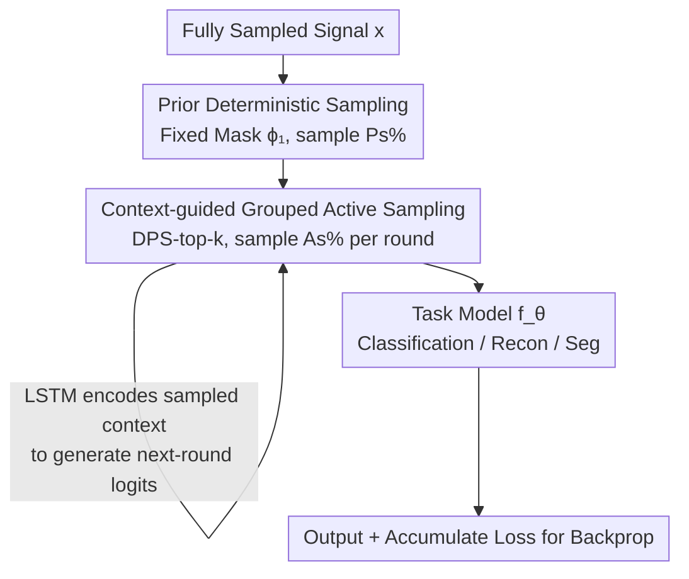

# Prior-aware and Context-guided Group Sampling for Active Probabilistic Subsampling

**Conference**: ICLR 2026  
**OpenReview**: [https://openreview.net/forum?id=GMxQHTyO2T](https://openreview.net/forum?id=GMxQHTyO2T)  
**Code**: https://github.com/B9Kang/PGADPS  
**Area**: Medical Imaging / Compressed Sensing / Active Sampling  
**Keywords**: Probabilistic Subsampling, Active Sampling, MRI Acceleration, Gumbel-top-k, Lipschitz Smoothness

## TL;DR
Building upon Active Deep Probabilistic Subsampling (A-DPS), the proposed method first acquires a batch of samples using a fixed prior mask learned from the training set, followed by context-guided grouped active sampling using DPS-top-k. Complemented by theoretical proof that grouped sampling smoothens optimization via Lipschitz analysis, the method outperforms A-DPS and DPS across MNIST/CIFAR-10 classification, fastMRI reconstruction, and AeroRIT hyperspectral segmentation.

## Background & Motivation

**Background**: Imaging systems such as MRI, CT, ultrasound, and hyperspectral imaging involve high acquisition costs. Subsampling reduces the number of measurements and acquisition time without significantly compromising downstream task performance. While Compressed Sensing (CS) relies on signal sparsity and is task-agnostic, deep subsampling methods (e.g., DPS, LOUPE) jointly optimize the "sampling pattern + task model." However, these learn a fixed mask that is **globally optimal for the dataset average**, which may not be optimal for individual samples. To address this, Active DPS (A-DPS) introduces active sampling: it dynamically decides the next sampling location based on previously acquired samples to generate adaptive trajectories for each test instance—a feature particularly valuable in medical imaging where patients' physiological structures vary.

**Limitations of Prior Work**: Although A-DPS enables instance-adaptivity, its strategy has two weaknesses. First, it iterates from zero and **fails to leverage the global prior knowledge** available in the training set, essentially "starting from scratch" to explore for every sample. Second, A-DPS utilizes **top-1 sampling**: it selects only the single highest-probability sample at each step and trains independent task functions for each sampled pixel/line, leading to unstable optimization.

**Key Challenge**: Point-wise top-1 sampling decomposes the selection of $K$ samples into $K$ concatenated task functions $f_K(f_{K-1}(\cdots f_1(x_1)\cdots))$, where the equivalent Lipschitz constant is the **product** of the Lipschitz constants of each layer: $\prod_r L_r$. Since $L_r$ for neural networks is typically much greater than 1, the product causes the loss landscape to become extremely steep with amplified gradients, making convergence difficult. This explains why A-DPS accuracy often plateaus or even drops as the number of samples increases. In essence, there is a conflict between "point-wise active sampling" and "optimization stability."

**Goal**: (1) Explicitly inject training set priors into the sampling process; (2) replace top-1 active sampling with grouped (top-k) sampling to smooth the optimization landscape; (3) provide a theoretical explanation for why grouped sampling is more stable.

**Key Insight**: The authors observe that top-k sampling in the original DPS outperformed top-1 empirically. They bridge this gap by applying Lipschitz smoothness theory: selecting $k$ samples at once corresponds to a **single** task function $f_k$, where the equivalent Lipschitz constant is $L_k$ rather than a product, making it naturally smaller.

**Core Idea**: Use a two-stage pipeline: "Fixed prior sampling (global) + DPS-top-k grouped active sampling (instance context)." This replaces the pure top-1 point-wise active sampling of A-DPS, resulting in a smoother loss surface and more robust optimization.

## Method

### Overall Architecture

PGA-DPS addresses the same core task: given a fully sampled signal $x \in \mathbb{R}^N$, find a subsampling set $A \subseteq \{0,1\}^N$ of size $M$ (sampling rate $r=100 \times M/N\%$) such that the downstream task $f_\theta$ performs as close to the full-sampling baseline as possible. The process is divided into two stages: **Prior Deterministic Sampling** first uses a fixed mask $\phi_1$ learned from the training set to acquire $P_s$ proportion of samples (providing the global prior). Then, **Context-guided Grouped Active Sampling** uses DPS-top-k over several rounds to acquire $A_s$ proportion of samples per round based on the current input context (providing instance-adaptivity). The combined samples are fed into the task model $f_\theta$. The entire sampling and task pipeline is trained end-to-end, utilizing Gumbel-Softmax to relax the non-differentiable discrete sampling.

Example (Paper Fig. 1, MNIST classification, target 31 pixels): DPS selects 31 pixels in one fixed step; A-DPS requires 31 top-1 iterations; PGA-DPS requires only 3 steps—one prior fixed step + 2 rounds of grouped active sampling.

### Key Designs

**1. Prior Deterministic Sampling: Using Global Priors as a Starting Point**

A-DPS starts active sampling from zero for every instance, ignoring the statistical priors available in the training set. PGA-DPS introduces a set of trainable logits $\phi_1 \in \mathbb{R}^N$ that learns an **average optimal fixed mask** across the training set—analogous to the role of the standard DPS mask. At inference, this fixed mask unconditionally samples $P_s$ of the budget, serving as a foundation for subsequent active steps. In MRI reconstruction, this is intuitive: DPS concentrates on the DC (center) lines of k-space; A-DPS always starts from the center; PGA-DPS’s prior mask naturally captures a "center + periphery" hybrid, balancing frequency components and leaving room for active refinement of details.

**2. Context-guided Grouped Active Sampling: Supplementing by Groups via DPS-top-k**

Fixed priors handle the "global" aspect but lack "instance-adaptivity." This stage follows the analysis-by-synthesis logic of A-DPS: the task model $f_\theta$ predicts based on currently sampled data $t_j = f_\theta(A_{j-1}x)$, and the sampling network $g_j$ (an LSTM + MLP) encodes this task context into the next round's logits $\phi_j = g_j(t_j)$. The key difference is the "batch": while A-DPS uses DPS-top-1 to select a single sample, PGA-DPS uses **DPS-top-k** via $A = \arg\text{top}_k(\phi + G)$ to select $k$ samples simultaneously using a **single shared logit**. The Gumbel-top-k trick enables efficient sampling, and a Gumbel-Softmax relaxation with temperature $\tau=2$ ensures differentiability. This compresses the acquisition of $A_s$ samples into a few grouped rounds (e.g., two rounds of 20% each) rather than dozens of point-wise iterations.

**3. Lipschitz Smoothness of Grouped Sampling: Why top-k is more stable (Theorem 1)**

The authors explain the efficacy of grouped sampling using Lipschitz constants. Top-1 models the selection of $k$ samples as $k$ serial task functions $f = f_k(f_{k-1}(\cdots f_1(x_1)\cdots))$, where the Lipschitz upper bound of the loss is the product:

$$\|\text{Loss}_{\text{DPS-top-1}}(x)\|_2 \le \prod_{r=1}^{k} L_r\,\|x_1^*-x_1\|_2$$

In contrast, top-k passes all $k$ samples to a **single** task function $f_k$, yielding a bound with only one constant:

$$\|\text{Loss}_{\text{DPS-top-k}}(x)\|_2 \le L_k\,\|x^*-x\|_2$$

Assuming $L_j \ge 1$ (typical for neural networks in non-identity tasks like classification, k-space reconstruction, or segmentation), then $L_k \le \prod_r L_r$, implying $\sup_x\|\text{Loss}_{\text{DPS-top-k}}\| \le \sup_x\|\text{Loss}_{\text{DPS-top-1}}\|$. Simply put, top-1 results in a loss surface amplified to be very steep, whereas top-k maintains a smoother surface, enabling more efficient and stable optimization.

**4. (Ps, As) Budget Allocation: Balancing Prior vs. Active**

PGA-DPS splits the sampling budget: a prior portion $P_s$ and an active portion $A_s$. For example, in MNIST, $(P_s, A_s) = (60, 20)$ means 60% of samples are chosen by prior fixed sampling, and the remaining 40% are filled by two rounds of 20% grouped active sampling. This is a crucial trade-off between "global prior vs. instance context." Optimal values vary by task: MNIST $(60, 20)$, CIFAR-10 $(10, 20)$, fastMRI $(30, 30)$, and AeroRIT segmentation $(80, 20)$. An empirical rule of thumb: if DPS typically outperforms A-DPS, the loss landscape is likely steep, warranting a larger $P_s$; otherwise, a smaller $P_s$ is preferred. $A_s$ is recommended to be around 20–30%.

### Loss & Training
Classification and segmentation use cross-entropy, while reconstruction uses deep unfolded proximal gradient networks. The sampling and task networks are trained simultaneously; active sampling loss is accumulated across all iterations, and networks are updated in a semi-greedy fashion. Temperature is fixed at $\tau=2$.

## Key Experimental Results

### Main Results

CIFAR-10 pixel subsampling classification (mean of 6 runs, Accuracy %): As the task becomes harder, PGA-DPS's advantage grows. Notably, A-DPS performance drops after $r \ge 14\%$ due to Lipschitz multiplication, while PGA-DPS continues to improve:

| Rate r | DPS | A-DPS | PGA-DPS |
|--------|------|-------|---------|
| 2% | 38.6 | 52.9 | **54.3** |
| 10% | 46.1 | 70.4 | **74.7** |
| 14% | 49.2 | 70.7 | **78.6** |
| 20% | 54.3 | 68.3 | **82.7** |

fastMRI knee k-space reconstruction (208×208, Acceleration 8x, $r=12.5\%$, mean of 10 runs):

| Method | NMSE↓ | PSNR↑ | SSIM↑ |
|------|-------|-------|-------|
| Low-pass | 0.0462 | 24.5 | 0.511 |
| LOUPE | 0.0465 | 25.1 | 0.574 |
| DPS | 0.0408 | 25.3 | 0.571 |
| A-DPS | 0.0398 | 25.4 | 0.576 |
| **PGA-DPS** | **0.0359** | **25.9** | **0.621** |

Compared to RL-based active acquisition (368×640, Accel 8x, ACS=30): PGA-DPS also leads against Evaluator policy / DS-DDQN with NMSE 0.0331, PSNR 30.5, and SSIM 0.668.

AeroRIT hyperspectral band selection for segmentation (selecting 5 bands, $r \approx 9.8\%$): PGA-DPS achieves mIOU 0.6752, close to the full 51-band performance (0.7037). A-DPS degrades significantly (mIOU 0.5181), confirming that point-wise top-1 struggles with joint optimization in complex tasks.

### Ablation Study
Grid search on $(P_s, A_s)$ for fastMRI (Accel 8x, $M=26$ lines):

| Configuration | NMSE↓ | PSNR↑ | SSIM↑ | Note |
|------|-------|-------|-------|------|
| $P_s{=}0\%, A_s{=}5\%$ | 0.0398 | 25.4 | 0.576 | Equivalent to A-DPS + grouped sampling |
| $P_s{=}0\%, A_s{=}20\%$ | 0.0373 | 25.7 | 0.598 | Grouped only, no prior |
| $P_s{=}30\%, A_s{=}30\%$ | **0.0359** | **25.9** | **0.621** | Optimal |
| $P_s{=}70\%, A_s{=}5\%$ | 0.0370 | 25.7 | 0.596 | Too much prior, low adaptivity |

### Key Findings
- Even with $P_s=0$ (no prior), simply switching from top-1 to top-k grouped sampling improves SSIM as $A_s$ increases (0.576 $\rightarrow$ 0.598), validating Theorem 1.
- Gains plateau or slightly decrease when $A_s$ exceeds 15–20%, suggesting an optimal balance between active and total budget.
- Prior sampling is most beneficial in low-measurement scenarios, providing a stable "floor" when data is extremely sparse.
- A-DPS (top-1) performs okay at low sampling rates in MNIST but drops as $r$ increases. In CIFAR-10, it is more stable than DPS but still drops at $r \ge 14\%$, aligning with the Lipschitz constant analysis.

## Highlights & Insights
- **Theoretical Grounding**: It turns the empirical observation of "top-k > top-1" into a rigorous Lipschitz-based theory, explaining how grouped decisions smooth the loss landscape. This analysis is transferable to other differentiable selection problems.
- **Prior + Active Hybrid**: A simple yet effective "stitching" of fixed masks for global averages and grouped active sampling for instance-level details.
- **Performance Gap as a Probe**: Using the performance difference between DPS and A-DPS as a heuristic to gauge landscape steepness and determine $P_s$.
- The method is task-agnostic (class/recon/seg) and modality-agnostic (image/MRI/hyperspectral), providing immediate value for cost-sensitive acquisition systems.

## Limitations & Future Work
- $(P_s, A_s)$ requires manual tuning per task/model/rate, with optimal values ranging from 10% to 80%. Automated hyperparameter tuning is a future direction.
- While $\tau=2$ is effective, temperature annealing/scheduling might offer further gains.
- The theoretical analysis assumes tasks are far from identity mappings ($L_j \ge 1$). Its validity for near-identity tasks (e.g., light denoising) remains untested.
- Experiments focus on medium-scale datasets; stability in high-resolution, multi-coil MRI or more complex segmentation remains to be verified.

## Related Work & Insights
- **vs. A-DPS**: Both jointly optimize sampling and tasks, but A-DPS uses point-wise top-1 without training priors. PGA-DPS adds fixed prior sampling and grouped top-k, achieving superior stability and performance.
- **vs. DPS / LOUPE**: These learn a single globally optimal fixed mask without instance adaptivity. PGA-DPS treats these masks as a prior starting point.
- **vs. RL-Active Acquisition**: RL methods typically require a pre-trained reconstruction network capable of handling arbitrary patterns. PGA-DPS enables end-to-end joint training and achieves better reconstruction metrics in 368×640 settings.

## Rating
- Novelty: ⭐⭐⭐⭐ The hybrid approach is intuitive, and the Lipschitz justification adds significant weight.
- Experimental Thoroughness: ⭐⭐⭐⭐ Covers 3 tasks across 4 datasets with RL baselines and ablations, though dataset sizes are relatively small.
- Writing Quality: ⭐⭐⭐⭐ Clear chain of logic: motivation $\rightarrow$ method $\rightarrow$ theory $\rightarrow$ experiments.
- Value: ⭐⭐⭐⭐ Direct practical value for acquisition-limited fields like MRI. Method is easily pluggable into existing DPS frameworks.

## Related Papers

- [\[CVPR 2026\] Active Inference for Micro-Gesture Recognition: EFE-Guided Temporal Sampling and Adaptive Learning](../../CVPR2026/medical_imaging/active_inference_for_micro-gesture_recognition_efe-guided_temporal_sampling_and_.md)
- [\[NeurIPS 2025\] Active Target Discovery under Uninformative Prior: The Power of Permanent and Transient Memory](../../NeurIPS2025/medical_imaging/active_target_discovery_under_uninformative_prior_the_power_of_permanent_and_tra.md)
- [\[CVPR 2026\] PGR-Net: Prior-Guided ROI Reasoning Network for Brain Tumor MRI Segmentation](../../CVPR2026/medical_imaging/pgr-net_prior-guided_roi_reasoning_network_for_brain_tumor_mri_segmentation.md)
- [\[AAAI 2026\] Towards Effective and Efficient Context-aware Nucleus Detection in Histopathology Whole Slide Images](../../AAAI2026/medical_imaging/towards_effective_and_efficient_context-aware_nucleus_detection_in_histopatholog.md)
- [\[CVPR 2026\] OSA: Echocardiography Video Segmentation via Orthogonalized State Update and Anatomical Prior-aware Feature Enhancement](../../CVPR2026/medical_imaging/osa_echocardiography_video_segmentation_via_orthogonalized_state_update_and_anat.md)

<!-- RELATED:END -->

<!-- RELATED:START -->

## Related Papers

- [\[ICLR 2026\] Anatomy-aware Representation Learning for Medical Ultrasound](anatomy-aware_representation_learning_for_medical_ultrasound.md)
- [\[ICLR 2026\] Rethinking Radiology Report Generation: From Narrative Flow to Topic-Guided Findings](rethinking_radiology_report_generation_from_narrative_flow_to_topic-guided_findi.md)
- [\[ICLR 2026\] Learning Self-Critiquing Mechanisms for Region-Guided Chest X-Ray Report Generation](learning_self-critiquing_mechanisms_for_region-guided_chest_x-ray_report_generat.md)
- [\[ICLR 2026\] Accelerating Benchmarking of Functional Connectivity Modeling via Structure-aware Core-set Selection](accelerating_benchmarking_of_functional_connectivity_modeling_via_structure-awar.md)
- [\[ICLR 2026\] DISCO: Densely-overlapping Cell Instance Segmentation via Adjacency-aware Collaborative Coloring](disco_densely-overlapping_cell_instance_segmentation_via_adjacency-aware_collabo.md)

<!-- RELATED:END -->
