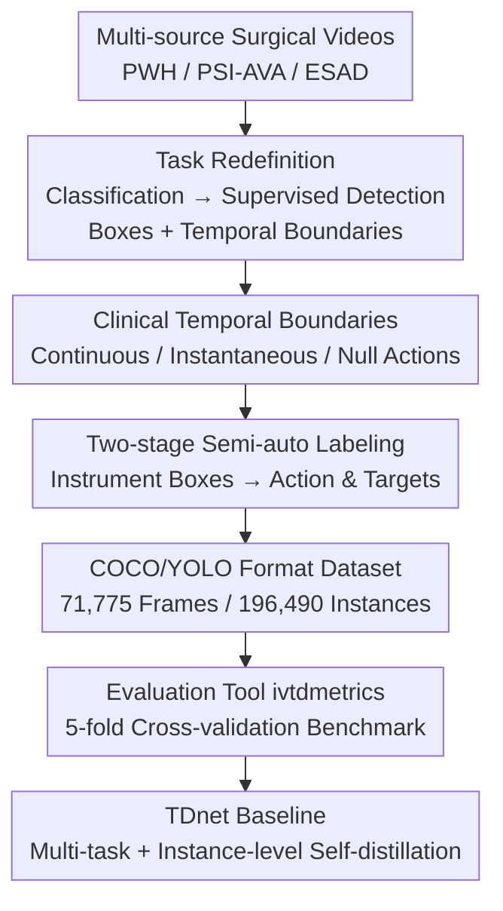

# ProstaTD: Bridging Surgical Triplet from Classification to Fully Supervised Detection

**Conference**: ICLR 2026  
**OpenReview**: [https://openreview.net/forum?id=0NkXZ98BjJ](https://openreview.net/forum?id=0NkXZ98BjJ)  
**Code**: https://github.com/chen-yiliang/ProstaTD  
**Area**: Medical Imaging / Surgical Video Understanding / Object Detection  
**Keywords**: Surgical triplet detection, fully supervised, dataset, prostatectomy, self-distillation

## TL;DR
This work constructs the first large-scale multi-center dataset for "fully supervised surgical triplet detection," named ProstaTD (21 robot-assisted radical prostatectomies, 71,775 frames, 196,490 instances with bounding boxes, 89 triplet classes). By employing clinically defined temporal boundaries and precise bounding boxes, the task is advanced from "frame-level weakly supervised classification" to "fully supervised detection with spatial localization." It is accompanied by two labeling tools, an evaluation suite, and TDnet—a baseline integrating multi-task learning and instance-level self-distillation.

## Background & Motivation
**Background**: A surgical triplet refers to the identification of an `<instrument, verb, target>` triplet from each frame of a surgical video, characterizing "which instrument performs what action on which anatomical structure." This is a foundational task in surgical data science for intraoperative decision support, postoperative skill assessment, and standardized training. The field was pioneered by the CholecT40/45/50 series, with CholecT50 currently being the mainstream benchmark.

**Limitations of Prior Work**: CholecT50 has three major drawbacks. First, **lack of bounding box annotations**: it provides only frame-level category labels, confining the task to a weakly supervised setting and precluding precise spatial localization. Although the CholecTriplet 2022 challenge included detection, it relied on Class Activation Maps (CAM) + NMS to "guess" positions weakly, resulting in ambiguous predictions. Second, **vague and inconsistent temporal boundaries**: it is unclear whether a triplet begins when the instrument "enters the view" or "contacts the target," or ends when it "leaves the target" or "exits the view." This lack of clear protocol leads to inconsistent annotations, preventing models from learning stable temporal dynamics. Third, **single data source**: it originates from a single institution’s cholecystectomies, leading to monotonous instrument appearances and surgical styles, a lack of rare triplets, and poor cross-hospital generalization.

**Key Challenge**: For triplet tasks to be truly "clinically applicable," they must provide both **spatial locations (boxes)** and **semantic labels (triplet categories)**. However, existing datasets only support classification due to the absence of frame-level spatial supervision, which imposes a performance ceiling on the entire field.

**Goal**: To create a detection-level dataset with **precise bounding boxes + clinically standardized temporal boundaries + multi-institutional sources**, upgrading the task from classification to fully supervised detection, and providing the necessary tools and baselines for fair comparison.

**Key Insight**: The authors select "Robot-Assisted Radical Prostatectomy (RARP)" as the new domain. RARP is a more complex procedure than cholecystectomy, featuring higher instrument concurrency and more intricate anatomical structures. Data is aggregated from three sources (ESAD, PSI-AVA, and a self-collected PWH set), making it more suitable for stressing the capabilities of detection models.

**Core Idea**: Replace "frame-level weakly supervised classification labels" with a "fully supervised detection dataset + clinically defined spatio-temporal annotation protocol."

## Method

### Overall Architecture
ProstaTD is a complete pipeline consisting of "dataset construction + benchmark + baseline." The task is first **redefined** as fully supervised detection with boxes and temporal boundaries. Surgical videos are aggregated from three heterogeneous sources (9 from PWH, 8 from PSI-AVA, 4 from ESAD). Original annotations are discarded in favor of a new protocol. Labeling is completed semi-automatically in two stages (instrument boxes first, then actions/targets), supported by two self-developed tools. The resulting dataset is provided in COCO/YOLO formats, covering 7 instruments, 10 verbs, 10 targets, and 89 triplet classes. Finally, a five-fold cross-validation benchmark is established using a dedicated evaluation tool (`ivtdmetrics`), with TDnet providing the baseline.

### Key Designs

**1. Task Redefinition: From Frame-level Weak Supervision to Bounding Box Detection**

Addressing the deficiency of CholecT50, this work formalizes surgical triplets as a standard detection problem: given a video frame $F_t$, each instrument instance is associated with a bounding box $B = \{(c_x, c_y, w, h)\}$ and a triplet category $C \in \{C_1, \dots, C_N\}$. The objective is to detect all triplets $T_t = \{C_1, \dots, C_k\}$ while identifying the **spatial position + semantic label** of each interaction. The introduction of boxes allows the model to decouple multiple co-occurring instruments and reliably associate instruments with their respective actions/targets—something CAM-based weak supervision fails to achieve.

**2. Clinically Defined Temporal Boundaries**

In collaboration with urological experts, a unified rule was established. The key insight is that the triplet should not start merely when an instrument appears, but rather based on clinical significance. Triplet actions are categorized into three types: **Continuous actions** (e.g., lymph node dissection), starting when the instrument contacts or is extremely close to the target and ending when it leaves the target for more than 2 seconds; **Instantaneous actions** (e.g., cutting a suture), defined by a window 2 seconds before and after the contact; and **null actions**, where the instrument is static or moving without substantial interaction.

**3. Two-stage Semi-automated Labeling + Dedicated Tools**

To ensure quality across 200,000 instances, labeling was split. **Stage 1 (Instrument Boxes)**: Used a pre-trained cystoscopy instrument detection model for pre-labeling, followed by five cycles of "manual correction + fine-tuning." **Stage 2 (Action/Target)**: Completed by 10 surgeons and 14 senior medical students, with at least 3 reviewers per frame. Two tools were developed: `Triplet-labelme` for fine-grained per-frame editing and `SurgLabel` for high-throughput batch annotation of time segments. The final labels achieved a Cohen's Kappa of 0.82.

**4. TDnet Baseline: Multi-task Learning + Instance-level Self-distillation**

To mitigate the severe long-tail distribution of the 89 triplet classes, TDnet employs **multi-task learning**, adding auxiliary supervision for instruments (I), verbs (V), and targets (T). Furthermore, **instance-level self-distillation** is introduced to improve robustness. TDnet achieves a Recall of 39.7% (compared to ~36% for mainstream YOLO) and the highest F1 of 32.8%, while maintaining a real-time speed of 126.6 FPS.

## Key Experimental Results

### Main Results
Protocol: Five-fold cross-validation on 21 videos. Input 640×640. Metrics reported include mAP at IoU 0.5 and 0.50:0.95, along with Precision/Recall/F1. $mAP_{IVT}$ represents the full triplet.

| Method | mAP$_I$@50 | mAP$_V$@50 | mAP$_T$@50 | mAP$_{IVT}$@50 | mAP$_{IVT}$@95 | FPS |
|------|-----------|-----------|-----------|---------------|---------------|-----|
| Tripnet-Det* (Weakly) | 1.6 | 0.6 | 0.4 | 0.1 | – | 331.8 |
| RDV-Det* (Weakly) | 1.8 | 0.6 | 0.3 | 0.1 | – | 146.6 |
| Faster R-CNN | 73.3 | 48.4 | 43.5 | 25.9 | 22.6 | 23.4 |
| RT-DETR | **91.6** | 58.9 | 56.8 | 33.0 | 29.6 | 66.3 |
| YOLOv12 | 88.8 | 59.9 | 54.5 | 34.3 | 31.5 | 204.1 |
| MCIT-IG | 77.4 | 53.6 | 48.4 | 29.6 | 26.0 | 16.0 |
| **TDnet (Ours)** | 89.9 | **61.7** | **55.7** | **36.1** | **33.1** | 126.6 |

\* Weakly supervised methods. The $mAP_{IVT}$ of weakly supervised pipelines is only 0.1%, demonstrating that they almost completely fail to decouple co-occurring instruments or associate them with targets without spatial supervision.

### Precision–Recall Analysis (IVT component)

| Method | Precision | Recall | F1 |
|------|-----------|--------|----|
| Deformable-DETR | 36.1 | 19.7 | 22.7 |
| RT-DETR | **36.4** | 31.5 | 30.9 |
| YOLOv12 | 33.5 | 36.2 | 31.9 |
| TAPIR | 35.2 | 20.3 | 23.4 |
| MCIT-IG | 35.5 | 21.0 | 24.1 |
| **TDnet (Ours)** | 34.7 | **39.7** | **32.8** |

### Key Findings
- **Weakly vs. Fully Supervised Gap**: Weakly supervised methods are rendered obsolete by the 25–36% mAP achieved by fully supervised detectors, proving spatial supervision is indispensable.
- **Classic Surgical Methods Underperform**: Methods like TAPIR and MCIT-IG, designed for sparse or semi-supervised settings, struggle in this fully annotated scenario.
- **Imbalance Remains a Challenge**: The best F1 score is still only 32.8%, indicating significant room for improvement in handling long-tail distributions in surgical triplets.
- **Higher Complexity**: 58.77% of frames in ProstaTD contain $\geq 3$ triplet instances, compared to none in CholecT50, representing a much more "crowded" scene.

## Highlights & Insights
- **Breaking the Ceiling**: By identifying "missing spatial supervision" as the root cause of the field's stagnation, the authors successfully move beyond the "classification-only" limitation of prior datasets.
- **Clinical Annotation Philosophy**: Categorizing actions by clinical contact rather than mere visual appearance provides a more semantic basis for temporal limits.
- **Scalable Medical Labeling**: The five-cycle iteration loop provides a reusable paradigm for high-quality, large-scale medical annotation at reduced costs.
- **Auxiliary Supervision for Long-tail**: TDnet's use of component-wise auxiliary supervision and distillation effectively boosts recall without sacrificing precision.

## Limitations & Future Work
- The F1 score of 32.8% highlights that triplet detection under heavy imbalance is still unresolved.
- The dataset is restricted to a **single surgery type** (RARP); cross-procedure generalization remains to be verified.
- TDnet serves as a benchmark baseline; the methodological innovation is relative to the dataset contribution.
- Future work: Incorporating temporal modeling (cross-frame consistency) and using this dataset to pre-train surgical foundation models.

## Related Work & Insights
- **vs. CholecT45/50**: Earlier datasets supported only classification; ProstaTD provides boxes and clear clinical boundaries for surgical detection.
- **vs. CholecQ**: While CholecQ has boxes, it consists of tiny segments from a single procedure, making it "toy-sized" compared to the full-procedure coverage of ProstaTD.
- **vs. ESAD / PSI-AVA**: These were original RARP resources, but their original labels were either coarse or sparse; ProstaTD re-annotates them under a unified, rigorous protocol.
- **vs. Weakly Supervised Baselines**: ProstaTD improves detection accuracy by orders of magnitude compared to CAM-based localization.

## Rating
- Novelty: ⭐⭐⭐⭐☆ (First fully supervised triplet detection dataset; task redefinition is significant.)
- Experimental Thoroughness: ⭐⭐⭐⭐⭐ (5-fold cross-validation across 13+ detectors; deep analysis of complexity and consistency.)
- Writing Quality: ⭐⭐⭐⭐☆ (Clear motivation and construction; baseline details are somewhat condensed.)
- Value: ⭐⭐⭐⭐⭐ (Essential infrastructure for moving the field from classification to detection.)

<!-- RELATED:START -->

## Related Papers

- [\[CVPR 2026\] TRCoRSurg: Temporal-Relational Co-Reasoning for Surgical Video Triplet Recognition](../../CVPR2026/medical_imaging/trcorsurg_temporal-relational_co-reasoning_for_surgical_video_triplet_recognitio.md)
- [\[AAAI 2026\] Bridging Vision and Language for Robust Context-Aware Surgical Point Tracking: The VL-SurgPT Dataset and Benchmark](../../AAAI2026/medical_imaging/bridging_vision_and_language_for_robust_context-aware_surgical_point_tracking_th.md)
- [\[CVPR 2026\] Synergistic Bleeding Region and Point Detection in Laparoscopic Surgical Videos](../../CVPR2026/medical_imaging/synergistic_bleeding_region_and_point_detection_in_laparoscopic_surgical_videos.md)
- [\[ICLR 2026\] Bridging Radiology and Pathology Foundation Models via Concept-Based Multimodal Co-Adaptation](bridging_radiology_and_pathology_foundation_models_via_concept-based_multimodal_.md)
- [\[ICLR 2026\] CodeBrain: Bridging Decoupled Tokenizer and Multi-Scale Architecture for EEG Foundation Model](codebrain_bridging_decoupled_tokenizer_and_multi-scale_architecture_for_eeg_foun.md)

<!-- RELATED:END -->
