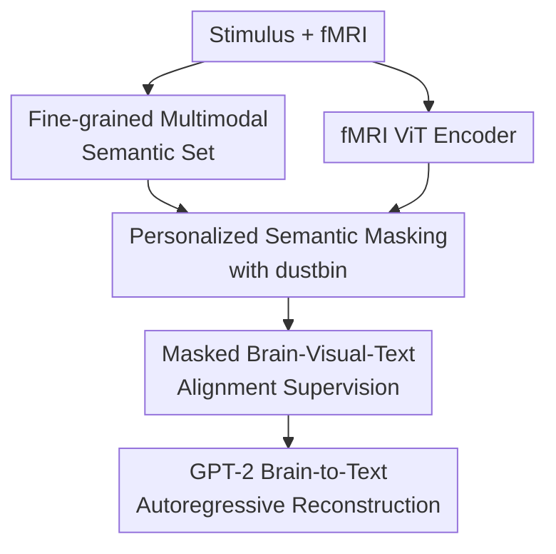

# Reducing Semantic Mismatch in Brain-to-Text Decoding Through Personalized Multimodal Masking

**Conference**: ICLR2026  
**OpenReview**: [https://openreview.net/forum?id=ya00JrKTjp](https://openreview.net/forum?id=ya00JrKTjp)  
**Code**: None  
**Area**: Medical Imaging / Neuroimaging Decoding  
**Keywords**: fMRI Brain Decoding, Brain-to-Text Generation, Semantic Mismatch, Optimal Transport, Multimodal Semantic Masking

## TL;DR
This paper proposes Yo'Mind, which employs personalized multimodal semantic masking driven by Optimal Transport (OT). It identifies visual and textual semantics actually encoded by each subject's brain signals during image viewing and uses them for brain-to-text decoding, thereby alleviating semantic mismatch between brain and machine representations and achieving superior results in cross-subject brain-to-text reconstruction on the Natural Scenes Dataset (NSD).

## Background & Motivation
**Background**: Non-invasive brain decoding has increasingly relied on Large Model representations in recent years. One class of methods maps fMRI to visual semantic spaces like Stable Diffusion or CLIP for brain-to-image reconstruction; another integrates fMRI as a condition into language models such as GPT-2, GIT, or BLIP to generate natural language descriptions of the stimulus. For brain-to-text tasks, the key shifts from pixel-level restoration to extracting stable, verbalizable semantic content from brain activity.

**Limitations of Prior Work**: Standard alignment strategies typically treat the global representation of the entire image as the supervisory target, assuming a match between machine-perceived and brain-encoded semantics. However, Vision-Language Model (VLM) image embeddings attempt to encode all visible elements, whereas the human brain does not attend to all content equally when viewing natural images. One person may focus on a boy flying a kite, another on the lakeside scenery, and a third on a nearby dog. Forcing the same global representation to align with fMRI across all subjects leads to semantic mismatch.

**Key Challenge**: The root cause is that machine representations provide "full-scene semantics," while brain signals are more akin to a "selective semantic subset." This selectivity is influenced not only by image complexity but also by individual interests, attentional bias, and the semantic specialization of brain regions. This contradiction is more pronounced in cross-subject decoding, as the same image may correspond to different semantic emphases in different subjects' brains.

**Goal**: The authors aim to automatically determine which visual/linguistic semantic components are likely encoded by a specific subject's brain signals without additional manual annotation, manual thresholds, or a fixed masking count for every image. These identified components then serve as the supervision for brain-to-text reconstruction.

**Key Insight**: The paper observes that visual stimuli can be decomposed into fine-grained semantic elements, and fMRI can be decomposed into brain region/patch representations. If a semantic element is truly encoded by brain activity, it should establish a low-cost match with certain fMRI patches. Optimal Transport is naturally suited for describing "soft assignment from one set to another" and can thus model brain semantic selection rather than hard-masking a fixed number of image patches.

**Core Idea**: Use Optimal Transport with a "dustbin" to dynamically allocate image patch semantics and MLLM-generated textual semantics to fMRI patches or the dustbin. This constructs personalized, soft-masked multimodal semantic supervision for each subject.

## Method
The Yo'Mind approach involves three steps: decomposing a stimulus image into sets of visual and linguistic semantics, matching these elements with fMRI patches using Optimal Transport, and using only the matched semantics to supervise the brain-to-text decoder. Instead of fitting a global CLIP embedding, it identifies which semantics the brain "captured."

### Overall Architecture
The input consists of fMRI signals from a subject viewing natural images and the corresponding stimuli. On the image side, a frozen CLIP vision encoder extracts image patch embeddings, while Harmon/Qwen2.5 generates discriminative semantic descriptions, followed by a frozen CLIP text encoder to obtain word-level embeddings. On the brain side, fMRI voxels are processed as sequences and encoded into brain representations via a ViT. Yo'Mind then solves an Optimal Transport problem with a dustbin between the brain representations and the multimodal semantic set to obtain personalized masking, using the result to train the brain-to-text decoder.

### Key Designs
**1. Fine-grained Multimodal Semantic Set: Decomposing the "Entire Image" into Candidates**

If the target is a single global embedding, the model cannot distinguish between "the subject didn't encode this object" and "the embedding contains this object." Yo'Mind divides image $x$ into $N$ non-overlapping patches to get visual semantics $v_i$ via CLIP. Simultaneously, Harmon generates descriptive captions to obtain $M$ textual semantics $t_i$. An image is thus represented as a candidate set $s_j=\{v_1,\ldots,v_N,t_1,\ldots,t_M\}$. This allows space for "selective attention," where visual patches provide spatial cues and text provides abstract relation/object cues within a shared CLIP space.

**2. Personalized Semantic Masking with Dustbin: Soft Selection via OT**

Given fMRI patch representations $r_i$ and semantic elements $s_j$, Yo'Mind constructs a cost matrix $C_{i,j}=1-\langle r_i,s_j\rangle$ and solves for entropy-regularized OT via the Sinkhorn algorithm. Since not all semantics are encoded by the brain, the paper introduces a "dustbin" (learnable virtual bins in the cost matrix) similar to techniques in graph matching. Elements can be assigned to real fMRI patches or the dustbin. After discarding the dustbin, a partial assignment matrix $P\in[0,1]^{K\times(N+M)}$ is obtained, satisfying $P\mathbf{1}\leq\mathbf{1}$ and $P^T\mathbf{1}\leq\mathbf{1}$. This determines "how much, which, and with what intensity" semantics are retained based on data.

**3. Brain-Visual-Text Alignment Supervision: Fitting Personalized Semantics**

With the partial assignment matrix, fMRI patches specifically fit the weighted semantic targets aggregated by $P$: $L_{align}=\sum_i\|r_i-\sum_j P_{i,j}s_j\|_2^2$. If semantics are assigned to the dustbin, they are excluded from supervision. This aligns different brain patches with different semantic components (e.g., ventral pathway for categories, dorsal/parietal for space/action) and allows the same image to have different supervisory targets across subjects.

**4. End-to-End Brain-to-Text Architecture: Trainable Decoding Gains**

The decoding component follows the MindGPT style: the fMRI encoder outputs representations, and a frozen GPT-2Base receives brain conditions through cross-attention in each layer to generate word sequences $W=[w_i]_{i=1}^n$. The training optimizes both the alignment loss and the language modeling objective $P(W)=-\sum_i\log P(w_i|[w_j]_{j<i},F(y);\theta)$, where $F(y)$ is the OT-guided fMRI encoding. Since Sinkhorn and aggregation are differentiable, semantic filtering and reconstruction are optimized jointly.

### Loss & Training
The visual and text encoders use frozen CLIP ViT-B/32. The fMRI encoder is a 16-layer, 16-head ViT. ROI voxels (27,638) from early visual, ventral, lateral, and parietal areas in NSD are flattened and divided into $K=8$ patches. GPT-2Base is frozen, with 12-head cross-attention added to each layer. Sinkhorn is run for 100 iterations with $\epsilon=1$. Optimization uses Adam (LR $1e^{-4}$, weight decay $1e^{-4}$) on 4 NVIDIA RTX 3090s.

## Key Experimental Results

### Main Results
Evaluation on the Natural Scenes Dataset (NSD) using Subjects 1, 2, 5, and 7 (27,750 trials). Test set comprises 982 shared COCO images.

| Method | Subject Setting | B@4 | METEOR | ROUGE | CIDEr | SPICE |
|------|----------|-----|--------|-------|-------|-------|
| MindGPT | S1/S2/S5/S7 | 15.87 | 20.04 | 38.41 | 43.56 | 10.97 |
| UMBRAE | S1/S2/S5/S7 | 18.40 | 19.24 | 43.64 | 57.76 | 12.42 |
| Mind-SA | S1/S2/S5/S7 | 18.86 | 38.08 | 42.72 | 54.03 | 12.25 |
| **Yo'Mind** | S1/S2/S5/S7 | **20.88** | **38.40** | **43.63** | **56.07** | **12.42** |
| Mind-SA† | Harmon caption | 32.46 | 36.25 | 54.26 | 79.48 | 18.72 |
| **Yo'Mind†** | Harmon caption | **33.36** | **39.25** | **55.19** | **81.16** | **19.25** |

Compared to MindGPT, Yo'Mind improves METEOR, BLEU-4, and CIDEr by approximately 91.6%, 31.6%, and 28.7%, respectively. It consistently outperforms Mind-SA across different captioning setups.

### Ablation Study
| Configuration | B@4 | METEOR | ROUGE | CIDEr | Note |
|------|-----|--------|-------|-------|------|
| ventral + masking | 17.64 | 35.99 | 41.88 | 46.24 | Using ventral ROI with masking |
| ventral, no masking | 15.90 | 21.05 | 38.98 | 43.68 | Significant drop without masking |
| ventral+lateral+parietal + masking | 21.78 | 38.98 | 45.82 | 58.87 | Best performance with high-level ROIs |
| v+l+p, no masking | 16.37 | 21.26 | 38.06 | 46.87 | Masking remains critical |
| visual only | 21.45 | 38.07 | 44.97 | 57.24 | Visual semantic set only |
| text only | 18.35 | 32.95 | 41.87 | 45.02 | Textual semantic set only |
| **visual + text** | **21.78** | **38.98** | **45.82** | **58.87** | Multimodal set is most robust |

### Key Findings
- **Personalized masking is the primary source of gain**: METEOR improves from 21.26 to 38.98, showing that filtering unencoded semantics is more important than simply increasing brain region input.
- **Multimodal sets outperform single modal sets**: Textual semantics supplement relationships and scene attributes that are difficult to express via visual patches alone.
- **Caption quality affects the ceiling**: Harmon captions provide the best METEOR and CIDEr scores compared to SMALLCAP or BLIP3o.
- **$K=8$ fMRI patches are optimal**, matching the anatomical organization of the NSD ROIs.
- **Robustness**: Bootstrap tests show Yo'Mind's gains over Mind-SA are statistically significant ($P < 0.0001$).

## Highlights & Insights
- Formulating semantic mismatch as a "set matching + discardable elements" problem using OT and a dustbin is an elegant solution.
- It bridges selective attention in neuroscience with Optimal Transport in machine learning, indirectly recovering "brain-preferred semantics."
- Multimodal sets are highly practical—fMRI can choose between local visual cues or abstract semantic relationships.
- For cross-subject modeling, this soft assignment manages individual differences by determining what the supervisory signal should be for each person on a per-image basis.

## Limitations & Future Work
- **Biological Validation**: Covert attention cannot be fully verified with NSD data as subjects maintained central fixation; current visualizations are more model-based interpretations.
- **Model Dependencies**: The method relies on CLIP and MLLM priors; if these models are biased, the "candidate set" may not fully cover true brain activity.
- **Static Stimuli**: Primarily tested on static images. Stability in dynamic video or free-viewing BCI scenarios remains to be verified.
- **Computational Cost**: Sinkhorn scales with $N+M$, which might pose challenges for longer textual sequences or denser image patches.

## Related Work & Insights
- **vs MindGPT**: MindGPT performs global alignment; Yo'Mind introduces personalized semantic supervision.
- **vs Mind-SA**: Mind-SA uses hard masking of a fixed number of patches; Yo'Mind uses OT soft allocation and an automatic dustbin.
- **vs UMBRAE**: UMBRAE focuses on shared representations; Yo'Mind focuses on the fine-grained match between tiap image element and brain patch.
- **Inspiration**: For multimodal learning, this suggests that when modalities share only partial semantics, local matching with discardable elements is more robust than global alignment.

## Rating
- **Novelty**: ⭐⭐⭐⭐⭐ Clear problem definition using OT with dustbins for personalized masking.
- **Experimental Thoroughness**: ⭐⭐⭐⭐ Solid results and ablations, though stronger biological validation of attention would be ideal.
- **Writing Quality**: ⭐⭐⭐⭐ Well-motivated, complete formulas, and clear qualitative analysis.
- **Value**: ⭐⭐⭐⭐⭐ High reference value for brain-to-text decoding and explainable BCI.

<!-- RELATED:START -->

## Related Papers

- [\[ICLR 2026\] SEED: Towards More Accurate Semantic Evaluation for Visual Brain Decoding](seed_towards_more_accurate_semantic_evaluation_for_visual_brain_decoding.md)
- [\[ICLR 2026\] Seeing Through the Brain: New Insights from Decoding Visual Stimuli with fMRI](seeing_through_the_brain_new_insights_from_decoding_visual_stimuli_with_fmri.md)
- [\[ECCV 2024\] UMBRAE: Unified Multimodal Brain Decoding](../../ECCV2024/medical_imaging/umbrae_unified_multimodal_brain_decoding.md)
- [\[ICCV 2025\] Beyond Brain Decoding: Visual-Semantic Reconstructions to Mental Creation Extension Based on fMRI](../../ICCV2025/medical_imaging/beyond_brain_decoding_visualsemantic_reconstructions_to_ment.md)
- [\[ICLR 2026\] Towards Interpretable Visual Decoding with Attention to Brain Representations](towards_interpretable_visual_decoding_with_attention_to_brain_representations.md)

<!-- RELATED:END -->
