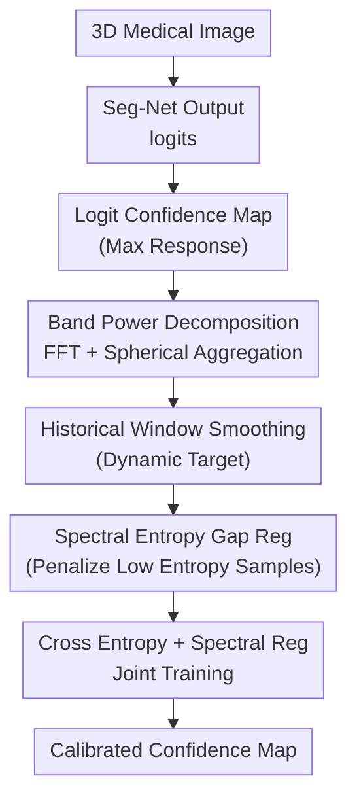

# Rethinking Model Calibration through Spectral Entropy Regularization in Medical Image Segmentation

**Conference**: ICLR2026  
**OpenReview**: [https://openreview.net/forum?id=SOFSVaZXSj](https://openreview.net/forum?id=SOFSVaZXSj)  
**Code**: None  
**Area**: Medical Imaging  
**Keywords**: Medical image segmentation, model calibration, spectral entropy regularization, uncertainty estimation, frequency domain analysis  

## TL;DR
This paper reframes the over-confidence calibration problem in medical image segmentation from a frequency domain perspective. It posits that low-frequency dominated spectral bias and confidence saturation (which suppresses total spectral energy in confidence maps) jointly lead to boundary uncertainty distortion. The authors introduce spectral entropy regularization with cross-batch power spectrum smoothing during training to improve calibration with minimal sacrifice to segmentation accuracy.

## Background & Motivation
**Background**: Medical image segmentation models achieve high Dice scores on tasks such as tumors, organs, cardiac structures, and the prostate. However, clinical systems require reliable voxel-level confidence scores rather than just segmentation contours. Ideally, a confidence of 0.8 for a voxel belonging to a lesion should correspond to an approximately 80% probability of being correct; this is the core of the calibration problem.

**Limitations of Prior Work**: Existing segmentation networks often exhibit over-confidence at lesion boundaries, thin organ structures, and blurred tissue interfaces. Post-hoc calibration methods like temperature scaling or Platt scaling apply global adjustments to logit distributions, failing to adapt to different organs, modalities, and local regions. Training-time methods (e.g., Label Smoothing, Focal Loss, MarginLoss, SVLS, CRaC) suppress over-confidence through spatial or categorical probability constraints but rarely consider the frequency domain structure of the confidence map itself.

**Key Challenge**: Confidence maps in medical segmentation must convey two types of information. Low-frequency components correspond to large-scale structures of organs or lesions, determining whether the model knows the general location. High-frequency components correspond to boundaries and fine structures, determining whether the model can assign uncertainty to truly ambiguous areas. Standard neural network training suffers from spectral bias, tending to learn low frequencies first and weaken high frequencies. Furthermore, over-confident maps approach saturated values, resulting in low overall power spectral density. Consequently, while the model appears confident, it flattens boundary uncertainty and structural variations.

**Goal**: The authors aim to design a training-time calibration method that maintains pixel-level cross-entropy supervision and segmentation accuracy while actively preserving the spectral richness of the confidence map. Specifically, the method should reduce excessive low-frequency concentration, restore high-frequency boundary information, and avoid training noise caused by large inter-sample variance in batch-level spectral statistics.

**Key Insight**: Observations using synthetic binary confidence maps show that as boundaries transition from over-confident (1.0) to more reasonable levels (0.5), the power spectrum density (PSD) becomes richer across frequency bands. Over-confident maps exhibit sparse spectral energy. This suggests that calibration is not merely a probability "temperature" issue but manifests as a structural problem in the frequency domain of the confidence map.

**Core Idea**: Use the spectral entropy of the confidence map as a training regularizer. It ensures that the power distribution across frequency bands for each sample does not collapse relative to a dynamically smoothed target, thereby shifting medical segmentation calibration from "reducing probability" to "preserving reasonable frequency domain complexity."

## Method
### Overall Architecture
The proposed method is a frequency-aware calibration framework integrated into the training objective. Given a 3D medical image, the segmentation network outputs logits for each category. The method extracts the maximum class response per voxel to form a scalar confidence map, performs 3D FFT, and aggregates the power spectrum into concentric frequency bands. Current batch spectral statistics are buffered into a historical window to form a smoothed target. Finally, a hinge-like spectral entropy regularization penalizes samples with insufficient spectral entropy, optimized jointly with standard cross-entropy.

The mechanism does not simply maximize predictive entropy or flatten output probabilities; it constrains the "uni-modality of frequency band power." If power is concentrated solely in low frequencies, it suggests the model has smoothed out boundary and detail uncertainty. A more balanced distribution indicates the ability to express structural and boundary-level uncertainty simultaneously.

### Key Designs
**1. Band Power Decomposition: Reframing Over-confidence from Spatial to Spectral Distribution**

The method constructs a scalar confidence map from network logits rather than softmax probabilities. Softmax saturates near 0 or 1, potentially obscuring original evidence strength; logits retain a wider dynamic range suitable for observing when regions are pushed toward excessive confidence. For each sample $b$, it takes $z_b(d,h,w)=\max_c z_{b,c}(d,h,w)$ to obtain a 3D scalar field.

A 3D FFT is performed, followed by spectrum centralization and Power Spectral Density (PSD) calculation $E_b(u,v,w)=|F_b(u,v,w)|^2$. To compress the 3D spectrum into trainable statistics, the authors divide the spectrum into $K$ concentric spherical shells $I_k$ based on frequency radius, summing the power within each to get $S_b^{(k)}=\sum_{(u,v,w)\in I_k}E_b(u,v,w)$. This represents a confidence map as a $K$-dimensional band power vector, allowing low-frequency structures and high-frequency boundaries to be measured separately.

**2. Historical Window Spectral Smoothing: Reducing Noise via Cross-batch Dynamic Targets**

Using the current batch's spectral distribution as a target directly would lead to unstable training signals, especially since medical imaging batches are typically small (batch size of 2 in experiments). Differences in cases, organ sizes, and lesion morphologies cause significant variance in band power.

A historical spectrum window of length $W$ is maintained. For each batch, sample band powers are averaged and added to the historical buffer. The target spectral vector $\tilde{S}$ is the average of the last $W$ batches. This mechanism allows the spectral entropy target to update dynamically with training without being dominated by the morphology of a single case.

**3. Spectral Entropy Gap Regularization: Selective Penalty for Low Entropy**

Band powers $S_b$ and the smoothed target $\tilde{S}$ are normalized into probability distributions $P_b$ and $\tilde{P}$: $P^{(k)}=S^{(k)}/(\sum_j S^{(j)}+\epsilon)$. Shannon entropy measures the balance of the distribution: $H_{spec}(P)=-\sum_{k=1}^{K}P^{(k)}\log(P^{(k)}+\epsilon)$. 

A hinge-like loss is used: $L_{Spectral}=\frac{1}{B}\sum_{b\in B}[\max(0,H_{spec}(\tilde{P})-H_{spec}(P_b))]^2$. Penalties occur only when a sample's spectral entropy is lower than the dynamic target. This is more robust than blind maximization, as medical confidence maps should retain realistic structures rather than generating high-frequency noise for the sake of uniformity.

**4. Joint Optimization with Segmentation Goal**

The final objective is $L_{total}=L_{CE}+\lambda L_{Spectral}$. While $L_{CE}$ ensures voxel-level accuracy, $L_{Spectral}$ constrains frequency domain complexity. Parameters like $\lambda$ control the trade-off. This design requires no multiple inferences, ensembles, or Bayesian sampling, making it lightweight for clinical deployment.

### Loss & Training
The training process consists of four steps: 1) Input batch and compute $L_{CE}$ from logits. 2) Extract max logit maps, perform 3D FFT, and aggregate power into $K$ bands. 3) Update the historical window $W$ to compute the target $\tilde{S}$ and its entropy $H_{spec}(\tilde{P})$. 4) Compute the spectral entropy gap loss and backpropagate the weighted sum. Default settings use 3D patches ($96\times96\times96$), batch size 2, and $\lambda$ between $0.01$ and $0.05$.

## Key Experimental Results
### Main Results
Evaluation was conducted on six datasets: BraTS2020, iSeg2017, FLARE2021, ACDC, ATLAS2023, and PROMISE2012.

| Dataset | Metric | CE | Strongest Baseline | Ours | Conclusion |
|---------|--------|----|-------------------|------|------------|
| BraTS2020 | DSC↑ / ECE↓ | 86.9 / 9.1e-3 | CRaC ECE 2.2e-3 | 87.2 / 1.5e-3 | ECE is lowest; Dice improved |
| iSeg2017 | DSC↑ / ECE↓ | 94.2 / 4.5e-3 | MbLS ECE 2.1e-3 | 94.4 / 2.0e-3 | Marginal lead in both |
| FLARE2021 | DSC↑ / ECE↓ | 91.5 / 25.5e-3 | MbLS ECE 2.2e-3 | 92.5 / 0.8e-3 | Massive improvement in calibration |
| ACDC | DSC↑ / ECE↓ | 91.1 / 32.5e-3 | MbLS ECE 23.2e-3 | 91.3 / 2.1e-3 | Drastic ECE reduction |
| ATLAS2023 | DSC↑ / ECE↓ | 68.7 / 24.9e-3 | SVLS ECE 6.8e-3 | 71.8 / 5.5e-3 | Best accuracy and calibration |
| PROMISE2012 | DSC↑ / ECE↓ | 80.2 / 11.7e-3 | CE ECE 11.7e-3 | 81.2 / 10.8e-3 | Better segmentation |

Ours does not sacrifice accuracy for calibration. On complex tasks like FLARE2021 or ATLAS2023, DSC and ECE improve simultaneously.

### Ablation Study
Ablations on BraTS2020 and FLARE2021:

| Config | BraTS DSC↑ | BraTS ECE↓ | FLARE DSC↑ | FLARE ECE↓ |
|--------|------------|------------|------------|------------|
| Baseline $L_{CE}$ | 0.869 | 0.0091 | 0.915 | 0.0255 |
| $L_{CE}$ + $L_{Spectral}$ w/o $W$ | 0.870 | 0.0065 | 0.921 | 0.0170 |
| $L_{CE}$ + $L_{Spectral}$ (Full) | 0.872 | 0.0015 | 0.925 | 0.0008 |

### Key Findings
- **Superiority**: Ours leads in ECE and SCE. While CRaC shows local advantages in TACE on ACDC, it does not translate to stable overall segmentation gains.
- **Visualization**: PSD analysis shows CE baseline has the lowest spectral power and steeper slopes (indicating saturation). Ours preserves more power in high-frequency regions, aligning reliability curves closer to the diagonal.
- **Generalization**: The method is effective across various architectures (nnUNet, SwinUNETR, TransUNet, etc.) using fixed hyperparameters.
- **Sensitivity**: Optimal $\lambda$ is usually $0.01$ to $0.05$. Windows $W=50$ and bands $K=3 \sim 7$ provide balance.

## Highlights & Insights
- **Novelty**: Reframes "over-confidence" as spectral collapse rather than just sharp softmax probabilities, creating a measurable link between architecture bias and boundary uncertainty.
- **Design Motivation**: The hinge loss is restrained; it prevents entropy collapse rather than pushing for maximum randomness, maintaining structural integrity.
- **Mechanism**: The historical window compensates for small batch sizes in 3D medical segmentation, making the regularization act on the data distribution level rather than individual case noise.

## Limitations & Future Work
- **Generalization**: Stability under significant domain shift or varying clinical scanning protocols needs further validation.
- **Heuristics**: Requires tuning of $\lambda, W, K$ per dataset.
- **Function**: Currently uses max logit; future work could incorporate logit margins or entropy maps to better utilize multi-class information.
- **Noise Sensitivity**: Frequentist regularization might amplify non-semantic high frequencies if the data contains strong artifacts or inconsistent labels.

## Related Work & Insights
- **vs Post-hoc methods**: Unlike Temperature Scaling which is global, ours is region-adaptive by acting on the training process.
- **vs Label Smoothing/Focal Loss**: These can lead to under-confidence; ours preserves spectral complexity to maintain a better balance.
- **vs SVLS/CRaC**: While those focus on spatial/neighborhood consistency, ours provides a complementary frequency perspective.

## Rating
- **Novelty**: ⭐⭐⭐⭐⭐ Clear frequency domain interpretation.
- **Experimental Thoroughness**: ⭐⭐⭐⭐⭐ Extensive datasets and metrics.
- **Writing Quality**: ⭐⭐⭐⭐ Logic is sound; spectral energy gain explanation could be slightly more rigorous.
- **Value**: ⭐⭐⭐⭐⭐ Highly practical for trustworthy medical segmentation.

<!-- RELATED:START -->

<!-- RELATED:END -->

## Related Papers

- [\[ICLR 2026\] K-Prism: A Knowledge-Guided and Prompt Integrated Universal Medical Image Segmentation Model](k-prism_a_knowledge-guided_and_prompt_integrated_universal_medical_image_segment.md)
- [\[AAAI 2026\] Refine and Align: Confidence Calibration through Multi-Agent Interaction in VQA](../../AAAI2026/medical_imaging/refine_and_align_confidence_calibration_through_multi-agent_interaction_in_vqa.md)
- [\[CVPR 2026\] GeoSemba: Reconstructing State Space Model for Cross Paradigm Representation in Medical Image Segmentation](../../CVPR2026/medical_imaging/geosemba_reconstructing_state_space_model_for_cross_paradigm_representation_in_m.md)
- [\[CVPR 2026\] TANGO: Learning Distribution-wise Foundation Prior Consistency and Instance-wise Style Calibration for Medical Image Generalization](../../CVPR2026/medical_imaging/tango_learning_distribution-wise_foundation_prior_consistency_and_instance-wise_.md)
- [\[CVPR 2026\] Learning Diffeomorphism for Medical Image Registration with Time-Embedded Architectures Using Semigroup Regularization](../../CVPR2026/medical_imaging/learning_diffeomorphism_for_medical_image_registration_with_time-embedded_archit.md)

<!-- RELATED:END -->
