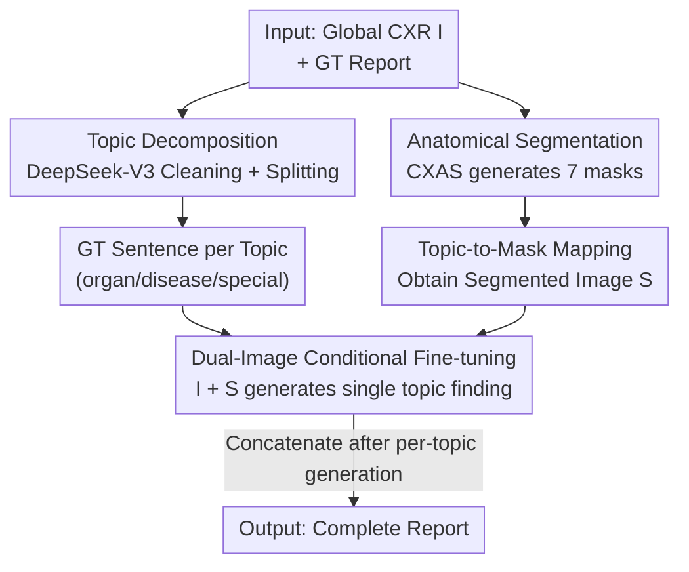

# Rethinking Radiology Report Generation: From Narrative Flow to Topic-Guided Findings

**Conference**: ICLR 2026  
**OpenReview**: [https://openreview.net/forum?id=nV3SAjFlyv](https://openreview.net/forum?id=nV3SAjFlyv)  
**Code**: To be confirmed  
**Area**: Medical Imaging / Multimodal VLM  
**Keywords**: Radiology Report Generation, Visual Grounding, Topic Decomposition, Anatomical Segmentation, Hallucination Suppression

## TL;DR
This paper points out that the "narrative flow imitation" paradigm in report generation causes VLMs to over-rely on language priors and weakens visual grounding. The authors propose LLaVA-TA: decomposing the report into independent topics organized by anatomical regions, where each topic generates a single finding sentence based on the full image and a corresponding anatomical mask. This approach significantly improves RadGraph F1 (report-level 29.4→34.3, topic-level up to 44.0) and CheXpert F1 on MIMIC-CXR.

## Background & Motivation

**Background**: The mainstream approach for Radiology Report Generation (RRG) is to fine-tune VLMs as general captioning models. The model treats the entire report as a continuous sequence and generates it auto-regressively "sentence by sentence" to mimic the narrative flow of human radiologists. This paradigm is directly transferred from general vision-language tasks.

**Limitations of Prior Work**: RRG has extremely low tolerance for errors—a hallucinatory "finding" can lead to serious clinical consequences. However, the authors suspect that optimizing for narrative coherence induces models to rely on "linguistic correlations between sentences" rather than visual evidence. In other words, the model learns linguistic patterns like "if the previous sentence mentions the heart, the next is likely about the lungs," which overrides direct evidence in the image.

**Key Challenge**: The authors designed a controlled experiment to verify this hypothesis: a pre-trained LLaVA-Rad is tasked to complete the last $K$ sentences of a report given preceding ground truth sentences, comparing performance when fed "real CXR" versus "all-black images." The results (Fig.1) clearly show that as the text prefix grows longer ($K$ becomes smaller), the performance gain of using real images over black images diminishes. As **textual context increases, the model ignores the input image** and relies on language priors. The authors name this "Narrative Bias": the auto-regressive model $P(y_t|y_{<t}, I)$ tends to maximize the linguistic probability $P(y_t|y_{<t})$ rather than the visual conditional probability $P(y_t|I)$.

**Goal**: Force the model to ground every clinical finding in corresponding visual evidence without sacrificing linguistic quality, fundamentally cutting the dependency chain where "preceding tokens dominate subsequent findings." Existing works (e.g., MAIRA-2, DART's explicit grounding/self-correction, Multi-Phased Supervision's hierarchical training) have made progress in alignment but still retain the auto-regressive narrative structure, failing to dismantle inter-sentence dependencies.

**Key Insight**: Since narrative flow is the root cause, **dismantle the narrative structure itself**. Reconstruct the report from a "linear narrative" into a "set of independent findings, each responsible for a single clinical topic," where each topic only attends to its corresponding anatomical region.

**Core Idea**: Replace "linear narrative generation" with "topic-guided decomposition + anatomical grounding"—letting the model independently generate a visually grounded finding for each clinical topic (e.g., organ-lungs, disease-consolidation). This breaks inter-sentence language priors and enforces stricter visual grounding.

## Method

### Overall Architecture
The core of LLaVA-TA is replacing "unstructured, narrative" training supervision with "structured supervision explicitly aligned by topic and anatomical region." The pipeline consists of three steps: first, use an LLM to decompose ground truth reports into clean, atomic sentences aligned by clinical topics; simultaneously, use a specialized CXR segmentation model to generate masks for anatomical regions; finally, during fine-tuning, the model consumes both the "global image + the corresponding anatomical mask" and is prompted to generate a finding for a single topic. During inference, sentences generated for each topic are concatenated into a complete report.

### Key Designs

**1. Topic-Guided Report Decomposition: Dismantling Linear Narrative into Atomic Findings**

This step directly addresses the root of "Narrative Bias"—inter-sentence dependency. The authors use an instruction-following LLM (DeepSeek-V3) to perform two tasks on ground truth reports: **Cleaning** (removing comparative/speculative phrases like "compared to previous" or "may represent atelectasis," keeping only evidence-based findings) and **Topic Partitioning** (mapping each sentence to a unique topic based on a hierarchical ontology: ① pathology-level such as disease-consolidation, ② anatomy-level such as organ-lungs, ③ auxiliary categories such as support devices). Strict "one sentence per topic" mapping is enforced, comparative/vague phrasing is rewritten, and negative expressions are standardized (e.g., "Pneumothorax is absent"). This transforms each report into a set of direct, clear, and visually grounded targets. This is effective because the training objective shifts from "a long string of entangled narratives" to "short supervision signals of one topic per sentence," preventing the model from relying on linguistic correlations.

**2. Anatomical Segmentation for Spatial Grounding: Directing Attention to Specific Regions**

Topic decomposition alone is insufficient; the model must be told *where* to look (e.g., look at the heart for cardiac findings). The authors use CXAS (a UNet-based segmentation model) to divide each CXR into 7 key anatomical regions: vertebrae, ribs, diaphragm, mediastinum, abdomen, heart, and lungs. Each clinical topic is mapped to one or more regions via a predefined lookup table. Consequently, each "topic-sentence" pair has two aligned visual inputs: the original global image $I$ and a topic-specific segmented image $S$. This strategy focuses model attention on relevant regions, reducing noise from irrelevant areas and improving interpretability.

**3. Dual-Image Visual-Language Fine-tuning: Feeding Global and Local Views into the LLM**

The architecture follows the LLaVA-Rad framework: a BiomedCLIP-CXR visual encoder (pre-trained on 697k radiology pairs, encoding $I$ and $S$ into $Z_I$ and $Z_S$), a learnable MLP alignment layer, and a Vicuna-7B-v1.5 language model. Each training sample is a structured prompt with two `<image>` placeholders: "Given the image `<image>` and the segmented part `<image>`, describe the findings for the topic: *topic*." During the forward pass, placeholders are replaced by projected visual embeddings. The objective is standard auto-regressive cross-entropy:

$$\mathcal{L}(\theta) = -\sum_{t=1}^{L} \log P(y_t \mid y_{<t}, X_{\text{prompt}}, Z_I, Z_S; \theta)$$

A two-stage protocol is used: Stage 1 freezes the vision encoder and LLM while training the MLP for cross-modal alignment; Stage 2 keeps the vision encoder frozen and uses LoRA (rank=128) to fine-tune the MLP and LLM end-to-end. Crucially, although the loss is auto-regressive, the short targets for single topics naturally constrain narrative language priors.

### Main Results
MIMIC-CXR-JPG Test Set (selection of key results; topic / report denote two evaluation settings). LLaVA-TA achieves new SOTA, with the 7B model even surpassing Med-PaLM M (84B) and GPT-4V.

| Model | Scale | RadGraph F1 | CheXpert Macro-F1-14 | BLEU-4 | ROUGE-L |
|------|------|-------------|----------------------|--------|---------|
| LLaVA-Rad | 7B | 29.4 | 39.5 | 16.1 | 30.8 |
| MAIRA-1 | 7B | 29.6 | 42.3 | 14.2 | 28.9 |
| Med-PaLM M | 84B | 26.7 | — | 11.3 | 27.3 |
| LLaVA-T (report) | 7B | 34.2 | 63.0 | 25.7 | 41.8 |
| **LLaVA-TA (report)** | 7B | **34.3** | **62.4** | **24.8** | **42.6** |
| LLaVA-TA (topic) | 7B | 44.0 | 77.9 | 31.8 | 60.6 |

> Note: The improvements cited in the abstract (RadGraph F1 29.4→44.0, CheXpert F1-14 39.5→71.5) refer to topic-level metrics. Report-level gains are 29.4→34.3 and 39.5→62.4. Topic-level evaluation only assesses topics present in the ground truth, avoiding false positives from correctly identified negative findings, hence the systematically higher values. These cannot be directly compared across settings.

### Ablation Study

| Configuration | RadGraph F1 (report) | Description |
|------|----------------------|------|
| LLaVA-Rad (Narrative Baseline) | 29.4 | Full auto-regressive narrative |
| LLaVA-T (Topic only, no mask) | 34.2 | Topic decomposition with only global image |
| LLaVA-TA (Topic + Anatomical mask) | 34.3 | Full model |

In the PEFT setting (only training MLP, freezing vision encoder and LLM), differences are magnified (Table 2, RadGraph F1): LLaVA-Rad is 19.8, LLaVA-T drops to 1.6, while **LLaVA-TA reaches 31.1**.

### Key Findings
- **Topic decomposition is the primary performance driver**: Adding only topic decomposition (LLaVA-T) increases RadGraph F1 from 29.4 to 34.2 and CheXpert Macro-F1-14 from 39.5 to 63.0, proving that breaking narrative flow is the most critical factor.
- **Anatomical masks are vital for parameter-efficient scenarios**: While LLaVA-TA and LLaVA-T are similar in full fine-tuning, LLaVA-T collapses (RadGraph F1 1.6) when the LLM is frozen. LLaVA-TA maintains 31.1, indicating that explicit spatial cues are essential for lightweight MLPs to map visual regions to LLM latent spaces.
- **Cross-domain robustness**: On IU-Xray, LLaVA-TA significantly outperforms LLaVA-Rad (RadGraph F1 31.4 vs 19.8, report-level), suggesting it relies less on training set linguistic priors.
- **Interpretability**: Attention visualizations (Fig.3/4) show that even when a finding is missed, the model's attention correctly highlights the lesion area, providing trustworthy grounding feedback for radiologists.

## Highlights & Insights
- **Well-designed controlled experiments for Narrative Bias**: Using the difference curve between "real vs. black images" across prefix lengths quantifies the issue of models ignoring images as text context grows, providing a clear motivation.
- **Restructuring supervision rather than scaling parameters**: The 7B model outperforms the 84B Med-PaLM M, showing that decomposing tasks into independent topic-driven supervision is more efficient than simply scaling the LLM.
- **The value of anatomical masks in PEFT**: The authors honestly note that masks provide little gain in full fine-tuning but are critical when the LLM is frozen—a valuable insight for designing structured visual inputs.

## Limitations & Future Work
- **Reliance on GT labels for disease topics**: The report-level evaluation uses ground truth disease labels as prompts to isolate generation quality from upstream classifier errors. Real-world deployment would require an integrated disease classifier.
- **Dependence on external component quality**: Topic decomposition relies on DeepSeek-V3, and grounding relies on CXAS segmentation. Errors in these upstream components can propagate.
- **Concatenated reports may lose narrative readability**: Joining independent sentences may reduce the natural flow and priority ordering radiologists expect; the lower report-level metrics compared to topic-level metrics reflect this trade-off.
- **Future Work**: Making disease topic selection learnable for end-to-end optimization; exploring finer-grained or learnable topic-to-region mappings to reduce reliance on manual ontologies.

## Related Work & Insights
- **vs. LLaVA-Rad**: LLaVA-TA uses it as a backbone but replaces "narrative generation after filtering history" with "topic decomposition + dual-image grounding," raising RadGraph F1 from 29.4 to 34.3.
- **vs. MAIRA-2 / DART**: While these add explicit grounding or self-correction to align text with lesions, they retain the auto-regressive narrative structure. LLaVA-TA modifies the generation paradigm itself.
- **vs. COMG / Multi-Grained**: These introduce masks or sentence-level contrastive learning but do not achieve topic-level decoupling. LLaVA-TA's "one topic per supervision" is a more thorough disentanglement.

## Rating
- Novelty: ⭐⭐⭐⭐ Diagnosing "narrative flow" as the hidden cause of weakened grounding and restructuring the paradigm accordingly is a novel perspective.
- Experimental Thoroughness: ⭐⭐⭐⭐ Extensive comparisons, including PEFT, cross-domain, and attention visualization. However, using ground truth labels for disease topics slightly weakens the end-to-end claim.
- Writing Quality: ⭐⭐⭐⭐ Clear logical loop from motivation to method and experiments. Effective visualizations.
- Value: ⭐⭐⭐⭐ The approach of restructuring supervision granularity instead of scaling parameters offers strong lessons for medical VLMs and structured fact generation.

<!-- RELATED:START -->

## Related Papers

- [\[CVPR 2026\] BiOTPrompt: Bidirectional Optimal Transport Guided Prompting for Disease Evolution-aware Radiology Report Generation](../../CVPR2026/medical_imaging/biotprompt_bidirectional_optimal_transport_guided_prompting_for_disease_evolutio.md)
- [\[ICLR 2026\] Learning Self-Critiquing Mechanisms for Region-Guided Chest X-Ray Report Generation](learning_self-critiquing_mechanisms_for_region-guided_chest_x-ray_report_generat.md)
- [\[CVPR 2026\] CURE: Curriculum-guided Multi-task Training for Reliable Anatomy Grounded Report Generation](../../CVPR2026/medical_imaging/cure_curriculum-guided_multi-task_training_for_reliable_anatomy_grounded_report_.md)
- [\[CVPR 2026\] SAT-RRG: LLM-Guided Self-Adaptive Training for Radiology Report Generation with Token-Level Push–Pull Optimization](../../CVPR2026/medical_imaging/sat-rrg_llm-guided_self-adaptive_training_for_radiology_report_generation_with_t.md)
- [\[CVPR 2026\] OraPO: Oracle-educated Reinforcement Learning for Data-efficient and Factual Radiology Report Generation](../../CVPR2026/medical_imaging/orapo_oracle-educated_reinforcement_learning_for_data-efficient_and_factual_radi.md)

<!-- RELATED:END -->
