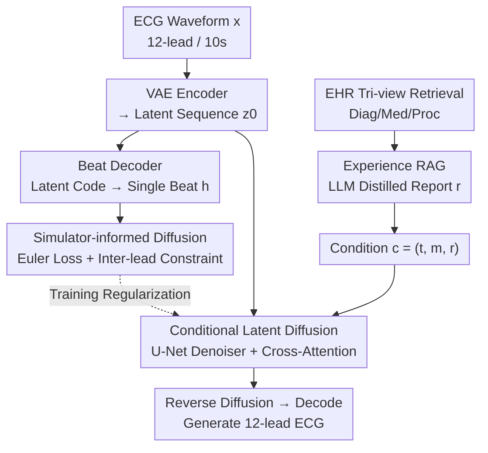

# SE-Diff: Simulator and Experience Enhanced Diffusion Model for Comprehensive ECG Generation

**Conference**: ICLR 2026  
**OpenReview**: [https://openreview.net/forum?id=95ZV35sBDm](https://openreview.net/forum?id=95ZV35sBDm)  
**Code**: https://github.com/ignite-abd/SE-Diff  
**Area**: Medical Imaging / Diffusion Models / Time Series Generation  
**Keywords**: ECG Generation, Text-to-ECG, Diffusion Model, ODE Physics Simulation, Retrieval Augmented

## TL;DR
SE-Diff integrates a lightweight ODE ECG simulator and an LLM-based retrieval enhancement based on EHR case experience into a conditional latent diffusion model. This allows for the generation of 12-lead, 10-second ECGs from clinical text that conform to both the physical mechanisms of cardiac electrical activity and real-world clinical experience, outperforming previous text-to-ECG methods in signal fidelity, text alignment, and downstream classification tasks.

## Background & Motivation

**Background**: Cardiovascular disease is the leading cause of death globally. The 12-lead electrocardiogram (ECG) is the most commonly used non-invasive diagnostic tool, but large-scale labeled ECG corpora are scarce due to costs, privacy concerns, and clinical workflow constraints. A natural solution is to "generate" ECGs—using synthetic data to augment training sets, construct unbiased datasets, and facilitate privacy-friendly data sharing. Recently, Diffusion Models (DDPM) have demonstrated strong fidelity across various modalities and have been migrated to time-series tasks, particularly text-conditional ECG generation (e.g., DiffuSETS).

**Limitations of Prior Work**: The authors point out two significant gaps in current text-to-ECG generation. First, **ignoring physiological simulator knowledge**: existing diffusion models rely almost entirely on data to learn ECG morphology and timing, whereas decades of physiological modeling have already provided compact ODE simulators (such as the McSharry three-equation model) that can generate realistic P–QRS–T morphologies and heart rate variability under controllable parameters. These mechanistic priors are rarely injected into diffusion training as constraints, leading to a disconnect between "statistical generation" and "mechanistic interpretability." Second, **underutilizing large-scale experiential knowledge**: previous works only conditioned on narrow patient metadata, failing to leverage the "case experience" dispersed across large-scale Electronic Health Records (EHR)—specifically, the diagnostic patterns of similar patients.

**Key Challenge**: ECG is not an arbitrary time series; it is driven by real cardiac electrical activity. It must satisfy both the physical P–QRS–T morphology of single leads and the physiological dependencies among the 12 leads. Purely data-driven diffusion models can neither learn these mechanistic constraints nor utilize the thousands of experiences stored in EHRs.

**Goal**: To directly generate realistic 10-second, 12-lead ECGs from natural language clinical descriptions, ensuring the generation is simultaneously guided by "physical mechanisms" and "clinical experience."

**Key Insight**: For physics, the authors connect an ODE simulator to the denoising dynamics of the diffusion process. However, since the simulator operates on individual heartbeats and the diffusion operates on the entire latent space, a "bridge" is needed to translate latent codes into single-cycle heartbeats. For experience, Retrieval-Augmented Generation (RAG) is used to find similar patients from the EHR, and an LLM distills their diagnostic patterns into a concise, physiologically sound report.

**Core Idea**: Use "ODE simulator consistency constraints + LLM experience retrieval reports" to simultaneously enhance conditional latent diffusion, making ECG generation both mechanistically reasonable and experientially grounded.

## Method

### Overall Architecture
SE-Diff is a conditional diffusion framework operating in a VAE latent space. The input is clinical text conditions $c=(t,m,r)$ (original diagnosis $t$, basic metadata $m$, and retrieval-augmented report $r$), and the output is a 12-lead, 10-second waveform $x\in\mathbb{R}^{12\times L}$. The pipeline consists of three steps: First, a VAE is trained to encode the full ECG into a latent sequence $z_0=E_\phi(x)\in\mathbb{R}^{d\times T}$, while an additional **lightweight Beat Decoder** $D_\psi^{beat}$ is attached to translate the latent code into a QRS-aligned single heartbeat $h\in\mathbb{R}^{12\times L_c}$. This single heartbeat serves as the "interface" for the subsequent ODE simulator constraint. Then, the VAE and Beat Decoder are frozen, and a U-Net denoiser $\epsilon_\vartheta(z_t,t,c)$ with cross-attention is trained in the latent space. During training, the simulator constraint is applied to the single heartbeat output by the Beat Decoder, and the retrieved experience report enters the conditions via the text pathway. During inference, reverse diffusion starts from Gaussian noise to obtain $\hat z_0$, which is decoded back into a waveform $\hat x=D_\theta(\hat z_0)$ by the full VAE.

In summary, the physics pathway (Beat Decoder → simulator constraint) acts as a regularizer during training and **does not change the reverse sampling process**; the experience pathway (EHR retrieval → LLM report) injects external knowledge into the conditions. These two pathways are independent yet collectively refine the generation results.

### Key Designs

**1. Beat Decoder: Mapping the full latent sequence to a single heartbeat to provide a physics interface**

The difficulty with simulator constraints lies in the scale mismatch—ODE simulators describe the P–QRS–T morphology of a single cardiac cycle, while diffusion operates on the entire 10-second latent sequence. It is impossible to direct apply equation constraints to $z_0$. The authors' solution is to attach a lightweight Beat Decoder $D_\psi^{beat}:\mathbb{R}^{d\times T}\to\mathbb{R}^{12\times L_c}$ to the VAE to specifically decode the latent code $z_0$ into a QRS-aligned single-cycle heartbeat $h$. When training the Beat Decoder, the first R-peak is used to crop the real single heartbeat $C(x)=x[:,\,r_0-0.2f_s:r_0+0.4f_s]$ as supervision, with the loss $L_{beat}=\frac{1}{12L_c}\|C(x)-D_\psi^{beat}(E_\phi(x))\|_F^2$.

To ensure the single heartbeat reflects the statistical properties of all beats in the 10-second window, the authors detect all R-peaks in the window, crop $J$ equal-length beats, and align them in the frequency domain. For each beat, the zero-mean one-sided log-magnitude spectrum $\hat S_\ell[k]=\log(\varepsilon+|\mathrm{rFFT}(h_\ell-\bar h_\ell)[k]|)$ is calculated. A spectral loss $L_{spec}=\frac{1}{12JK}\sum_{\ell,j,k}w(f_k)(\hat S_\ell[k]-S_\ell^{(j)}[k])^2$ is then used to align the single heartbeat prediction with the spectrum of each observed beat, where weights $w(f)$ can emphasize physiologically significant bands (e.g., the 0.5–3 Hz heart rate band). The total VAE loss $L_{VAE}=L_{full}+\beta_{KL}L_{KL}+L_{beat}+\alpha_{spec}L_{spec}$ optimizes full reconstruction, KL divergence, single beat reconstruction, and frequency domain statistics. This step is not a "generative innovation" in itself, but it is the prerequisite for implementing all subsequent physical constraints.

**2. Simulator-informed Diffusion: Injecting mechanistic priors into the denoiser via ODE simulators**

This is the core design addressing the "ignoring physiological simulator knowledge" pain point. Based on the McSharry three-equation ECG simulator (an ODE model rotating on a unit limit cycle, encoding cardiac cycles by phase, and superimposing Gaussian bumps at P/Q/R/S/T points to produce voltage), the authors offline fit a set of morphological parameters $\eta_{class}=\{\theta_\beta,a_\beta,b_\beta\}$ for each category. During diffusion training, two complementary regularization terms constrain the single heartbeat $h$ output by the Beat Decoder to be physically plausible.

The first is the **Simulator-guided Euler loss**: an Euler integrator runs the simulator with parameters $\eta$ and fixed initial values to produce a reference trajectory. The deviation between the discrete derivative of each step of the single heartbeat and the right-hand side of the ODE is punished: $L_{Euler}=\frac{1}{12(L_c-1)}\sum_{\text{lead}}\sum_\ell\big\|\frac{h_{\ell+1}-h_\ell}{\Delta t}-f_z(x_\ell,y_\ell,h_\ell,t_\ell;\eta)\big\|^2$. This requires the generated heartbeat to "obey" the ECG dynamic equations at every time point. The second is the **Inter-lead dependency constraint**: In real 12-lead ECGs, not only must the morphology of each lead be correct, but leads must also satisfy classic front-plane lead identities (derived from the Einthoven triangle and Goldberger's central terminal), such as $I=II-III$ and $aVR=-\frac12(I+II)$. The authors write these identities as $(y,p,q,\beta,\gamma)$ tuples, constraining the discrete derivative of child leads to equal the linear combination of the parent leads' simulator derivatives: $L_{inter\text{-}lead}=\sum_{(y,p,q,\beta,\gamma)}\sum_\ell\big(\frac{h_{\ell+1}^y-h_\ell^y}{\Delta t}-\beta f_z(\cdot;\eta_p)-\gamma f_z(\cdot;\eta_q)\big)^2$. Both constraints are only applied during training and do not enter reverse sampling, essentially "shaping" the denoiser with physical knowledge.

**3. Experience Retrieval-Augmented Condition: Distilling experiences from similar cases via LLM**

To address the "underutilizing large-scale experiential knowledge" pain point, the authors link MIMIC-IV-ECG to MIMIC-IV-Clinical and build a compact **tri-view profile** (diagnosis, medication, procedure) for each hospitalization. For a given index hospitalization $u$, similarity is calculated across the three views using Jaccard similarity $\tau_{X}(u,u')=J(E_u^X,E_{u'}^X)$, and then aggregated into a single similarity $\tau(u,u')=\lambda_1\tau_{Diag}+\lambda_2\tau_{Med}+\lambda_3\tau_{Proc}$ to retrieve the top-$k$ most similar hospitalizations. These profiles, along with $(t,m)$, are fed into an LLM to distill a concise, physiologically sound report $r$. The final condition $c=(t,m,r)$ enters the denoiser through cross-attention. The ingenuity of this design lies in using retrieval to bring in the experience of "what similar patients look like in real clinical practice" and using an LLM to translate scattered diagnostic codes into coherent descriptions.

### Loss & Training
The framework is trained in two stages. First, the VAE (encoder, full decoder, and Beat Decoder) is trained using $L_{VAE}=L_{full}+\beta_{KL}L_{KL}+L_{beat}+\alpha_{spec}L_{spec}$. Then, $E_\phi, D_\theta, D_\psi^{beat}$ are frozen, and only the denoiser is trained. The objective is the latent diffusion loss plus the two simulator regularizers: $L_{total}=L_{DDPM}+\lambda L_{Euler}+\gamma L_{inter\text{-}lead}$. All simulator-driven terms are for training only; inference follows the standard DDPM reverse process with optional classifier-free guidance.

## Key Experimental Results

### Main Results
The model was trained on MIMIC-IV-ECG (800k 12-lead, 10s ECGs, 500 Hz) and externally validated on PTB-XL. Comparisons were made against SSSD, WGAN, BeatDiff, and DiffuSETS. Evaluation spanned four clinical levels: signal stability (MAE, NRMSE), feature-level physiology (Heart Rate error $MAE\_HR$), diagnostic/semantic alignment (rCLIP, rFID), and beat-level morphology and interval fidelity.

| Dataset | Metric | SE-Diff | DiffuSETS (Prev. SOTA) | Description |
|--------|------|---------|----------|------|
| MIMIC-IV-ECG | MAE ↓ | **0.0923** | 0.1092 | Better waveform reconstruction |
| MIMIC-IV-ECG | NRMSE ↓ | **0.0714** | 0.0851 | — |
| MIMIC-IV-ECG | MAE_HR ↓ | **8.43** | 13.29 | Significant drop in HR error |
| MIMIC-IV-ECG | rCLIP ↑ | **0.9470** | 0.9309 | Stronger text-ECG alignment |
| MIMIC-IV-ECG | rFID ↑ | **0.9509** | 0.9209 | Distribution closer to real |
| PTB-XL (Ext) | MAE ↓ | **0.1076** | 0.1281 | Still leading on external set |
| PTB-XL (Ext) | MAE_HR ↓ | **8.24** | 17.88 | Extra-set HR error halved |

In terms of beat-level morphology/intervals (Table 2), SE-Diff achieved the lowest median error for PR, QRSd, QT/QTcF, ST@J+60, and P/T wave durations. For example, on MIMIC, the QT error dropped from 8.20 (DiffuSETS) to 4.50, and the P-wave duration error dropped from 5.60 to 2.50, indicating that it faithfully preserves beat-level timing and morphology beyond global statistics.

### Ablation Study
Removing components individually (retrained with the same scheduler and seed):

| Configuration | MAE_HR (MIMIC) ↓ | rFID ↑ | Description |
|------|------|--------|------|
| Full SE-Diff | **8.43** | **0.9509** | Full Model |
| w/o Sim (Remove Euler consistency) | 14.28 | 0.9138 | HR error nearly doubles |
| w/o InterLead (Remove inter-lead constraint) | 19.21 | 0.9128 | Most significant HR error worsening |
| w/o Exp (Remove EHR retrieval) | 15.06 | 0.9032 | Largest drop in rFID |

Downstream classification (Table 3, augmenting minority classes with synthetic data under severe class imbalance): Gender classification F1 improved from 42% (Unbalanced) to 58%, and AUC from 46% to 58%, approaching the Balanced upper bound (62%). Rare disease classification (Sinus vs. SVT) F1 improved from 56% to 72%, with the most significant gains in the minority SVT class.

### Key Findings
- **Inter-lead constraints are critical for heart rate**: Removing $L_{inter\text{-}lead}$ caused $MAE\_HR$ on MIMIC to jump from 8.43 to 19.21. This single item caused the largest performance drop, showing that enforcing inter-lead physiological consistency significantly stabilizes rhythm/HR estimation.
- **Each of the three components addresses a specific area**: Removing "Sim" mainly hurts HR and morphology; removing "InterLead" mainly hurts HR and lead consistency; removing "Exp" primarily hurts distribution fidelity ($rFID$ drops to 0.9032). The three are complementary.
- **Experience enhancement is more valuable for rare classes**: Relative gains for the rare disease SVT were greater than for common scenarios, suggesting that RAG-enhanced synthetic data is particularly effective when physiological heterogeneity is high and minority labels are scarce.

## Highlights & Insights
- **Reconnecting "old-school" ODE physical models with modern diffusion**: The authors did not abandon decades of ECG physiological modeling. Instead, they used a differentiable Beat Decoder as a bridge to turn the McSharry simulator into a training regularizer. This "classical mechanism + data-driven" hybrid approach can be migrated to any signal generation task with known physical/differential equation priors (e.g., EEG, blood pressure waves, seismic waves).
- **Inter-lead identities as hard constraints**: Directly writing globally recognized identities like Einthoven/Goldberger as losses is a simple yet effective inductive bias. This suggests that for any multi-channel generation with known linear relationships between channels, the "child derivative = linear combination of parent derivatives" constraint can be applied.
- **RAG for time-series generation instead of text generation**: Moving RAG from "supplementing LLM knowledge" to "supplementing signal generator conditions," and retrieving from structured EHR tri-views before distilling into natural language, is a pipeline with high reuse value.

## Limitations & Future Work
- **Offline parameter fitting**: $\eta_{class}$ is obtained by fitting representative real heartbeats offline; the coverage and quality of this fitting directly affect the effectiveness of the physical constraints. For rare morphologies unseen during training, the simulator prior may be inaccurate.
- **Dependence on linkable EHR**: Experience retrieval relies heavily on MIMIC-IV-ECG being linked to clinical records with tri-view data. This pathway cannot be enabled in scenarios without matching EHR or under privacy constraints.
- **Physical constraints only during training**: The simulator terms do not enter reverse sampling. If classifier-free guidance or the sampling schedule is inappropriate, inference results may still deviate from physics. Integrating mechanistic constraints into the sampling process could be a future direction.
- **Evaluations still biased toward automatic metrics**: Fidelity/alignment rely on auto-metrics and downstream classification; a blind evaluation by clinicians on the readability and diagnostic utility of the generated ECGs is missing.

## Related Work & Insights
- **vs. DiffuSETS**: DiffuSETS was the only previous method for 12-lead 10s ECG generation from clinical text but was purely data-driven. SE-Diff adds simulator consistency and EHR retrieval, outperforming it across all metrics, especially HR error (13.29 → 8.43).
- **vs. SSSD / BeatDiff**: SSSD uses Structured State Spaces for conditional ECG diffusion, and BeatDiff focuses on morphology-oriented heartbeat diffusion. Neither explicitly injects 12-lead physical dependencies. SE-Diff's inter-lead constraint fills this gap.
- **vs. WGAN-based augmentation**: GAN-based augmentation provides limited improvement in imbalanced classification. SE-Diff, because its generation aligns better with real distributions ($rFID$ is higher), provides significantly larger gains for minority classes.

## Rating
- Novelty: ⭐⭐⭐⭐⭐ First to integrate an ODE ECG simulator into latent diffusion and use EHR tri-view RAG + LLM distillation as conditions for time-series generation.
- Experimental Thoroughness: ⭐⭐⭐⭐ Uses two datasets, four levels of metrics, and comprehensive ablation/downstream tasks. Lacks clinician blind review.
- Writing Quality: ⭐⭐⭐⭐ Clear module boundaries and complete derivation for physical constraints, though some notation is dense.
- Value: ⭐⭐⭐⭐⭐ Alleviates ECG data scarcity and privacy issues; the "classical mechanism + RAG" paradigm is highly transferable to other physiological signals.

<!-- RELATED:START -->

## Related Papers

- [\[ICLR 2026\] Pixel-Level Residual Diffusion Transformer: Scalable 3D CT Volume Generation](pixel-level_residual_diffusion_transformer_scalable_3d_ct_volume_generation.md)
- [\[CVPR 2026\] Diffusion-Based Native Adversarial Synthesis for Enhanced Medical Segmentation Generalization](../../CVPR2026/medical_imaging/diffusion-based_native_adversarial_synthesis_for_enhanced_medical_segmentation_g.md)
- [\[ICLR 2026\] OmniCT: Towards a Unified Slice-Volume LVLM for Comprehensive CT Analysis](omnict_towards_a_unified_slice-volume_lvlm_for_comprehensive_ct_analysis.md)
- [\[CVPR 2026\] MUST: Modality-Specific Representation-Aware Transformer for Diffusion-Enhanced Survival Prediction with Missing Modality](../../CVPR2026/medical_imaging/must_modality-specific_representation-aware_transformer_for_diffusion-enhanced_s.md)
- [\[CVPR 2026\] Sketch2CT: Multimodal Diffusion for Structure-Aware 3D Medical Volume Generation](../../CVPR2026/medical_imaging/sketch2ct_multimodal_diffusion_for_structure-aware_3d_medical_volume_generation.md)

<!-- RELATED:END -->
