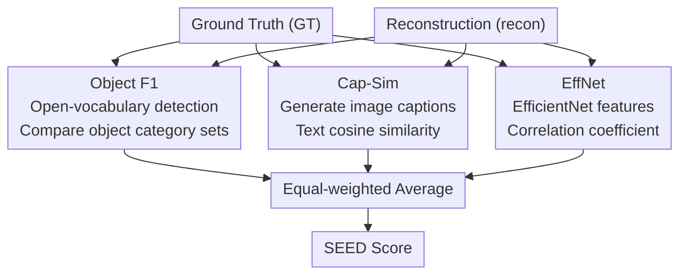

# SEED: Towards More Accurate Semantic Evaluation for Visual Brain Decoding

## Meta Information
- **Conference**: ICLR 2026
- **arXiv**: [2503.06437](https://arxiv.org/abs/2503.06437)
- **Code**: [https://github.com/Concarne2/SEED](https://github.com/Concarne2/SEED)
- **Area**: Others
- **Keywords**: brain decoding, evaluation metrics, fMRI, semantic similarity, visual attention, human evaluation

## TL;DR
The authors propose SEED (Semantic Evaluation for Visual Brain Decoding), a composite evaluation metric combining Object F1, Cap-Sim, and EffNet, which significantly surpasses all existing metrics in alignment with human evaluation.

## Background & Motivation
- Significant progress has been made in visual brain decoding (reconstructing visual stimuli from fMRI), with recent models approaching perfect scores on existing percentage-based metrics, suggesting the problem is nearly solved.
- **Critical Observation**: Reconstructed images often lose key semantic elements (e.g., a teddy bear becoming a cat), yet existing metrics still provide high scores, misleading the research direction.
- **Three Major Issues with Existing Evaluations**:
  1. **Pool Dependency**: N-way identification metrics (AlexNet, CLIP, etc.) depend on a comparison pool, making comparisons between different models unfair.
  2. **Insufficient Difficulty**: N-way identification tasks are too simple; recent models have reached near-perfect performance.
  3. **Lack of Human Consistency**: Metrics based on abstract features deviate significantly from human intuition.

## Method

### Overall Architecture
SEED is inspired by the two-stage mechanism of human visual attention: the first stage processes basic features such as color, orientation, and brightness in parallel, while the second stage binds these features into coherent objects. Most existing metrics only cover the global features of the first stage, lacking object-level semantic judgment. Therefore, SEED feeds the same pair of ground truth (GT) and reconstructed images into three complementary evaluation branches: object-level Object F1, description-level Cap-Sim, and global structure-level EffNet. A single score is obtained by calculating the equal-weighted average of these three scores, covering both "what objects are seen" and "overall appearance." Additionally, the authors collected a set of human scoring data to verify SEED's alignment with human intuition.

### Key Designs

**1. Object F1: Aligning Key Objects with Open-Vocabulary Detection**

The most critical errors in reconstructed images often involve changes in object categories (e.g., a teddy bear becoming a cat), but existing global feature metrics are largely insensitive to such errors. SEED utilizes the open-vocabulary grounding model MM-Grounding-DINO to detect 82 categories of objects in both the GT and reconstructed images, then compares the sets of identified categories. Given a detection threshold $t$, the recall is the number of shared categories divided by the number of categories in the GT: $\text{Object Recall}_t = \frac{|\text{GT}\cap\text{recon}|}{|\text{GT}|}$, and the precision is the number of shared categories divided by the number of categories in the reconstructed image: $\text{Object Precision}_t = \frac{|\text{GT}\cap\text{recon}|}{|\text{recon}|}$. To avoid choosing a manual threshold, the authors average the results as $t$ slides from 0 to a cutoff value, finally taking their harmonic mean: $\text{Object F1} = \frac{2}{\text{Object Recall}^{-1} + \text{Object Precision}^{-1}}$, directly measuring whether key objects are correctly reconstructed.

**2. Cap-Sim: Capturing Object Attributes and Scene Semantics with Image Captions**

Focusing only on object categories misses finer semantics such as pose, color, and background, which are critical to human-perceived similarity. SEED uses the image captioning model GIT to generate text descriptions for both the GT and reconstructed images, then encodes these descriptions with a Sentence Transformer to calculate cosine similarity: $\text{Cap-Sim} = \cos\big(e_{\text{text}}(c(I_{GT})),\, e_{\text{text}}(c(I_{recon}))\big)$, where $c$ is the GIT captioner and $e_{\text{text}}$ is the text encoder. This approach of "translating to language before comparing" is simple yet previously unexplored; it shifts image similarity into linguistic space, naturally incorporating attributes and contextual information missed by Object F1.

**3. EffNet: Preserving Global Structural Correlation**

While the first two metrics emphasize high-level semantics, the overall layout and texture structure of a scene also influence perception. SEED retains the strongest existing single metric, EffNet: using an ImageNet-pretrained EfficientNet to extract image features from both images and calculating the correlation coefficient: $\overline{\text{EffNet}} = \text{corr}\big(e_{\text{img}}(I_{GT}),\, e_{\text{img}}(I_{recon})\big)$. This corresponds to the global feature processing in the first stage of visual attention, supplementing the structural dimension. Finally, the three are fused as: $\text{SEED} = \frac{\text{Object F1} + \text{Cap-Sim} + \overline{\text{EffNet}}}{3}$, allowing a single score to reflect key object existence, high-level semantic details, and global structure.

**4. Human Evaluation Benchmark: Calibrating Metrics with Human Scores**

The validity of an evaluation metric depends on its alignment with human intuition. Thus, the authors collected a human evaluation dataset as a calibration benchmark. 22 evaluators scored 1,000 GT-reconstruction pairs on a 5-point Likert scale. The inter-class correlation coefficient ICC(2, n) = 0.84 (p=0) indicates high consistency among evaluators. This data is open-sourced with the paper to serve as a standard for future research.

## Key Experimental Results

### Main Results: Alignment with Human Evaluation (NSD + MindEye2)

| Metric | Pairwise Accuracy | Kendall $\tau$ | Pearson $r$ |
|------|----------|----------|----------|
| PixCorr | 53.8% | .075 | .117 |
| SSIM | 54.5% | .090 | .112 |
| AlexNet(2) | 55.0% | .185 | .187 |
| AlexNet(5) | 49.5% | .236 | .258 |
| Inception | 63.8% | .330 | .475 |
| CLIP | 66.4% | .368 | .436 |
| EffNet | 78.0% | .559 | .748 |
| SwAV | 69.7% | .394 | .576 |
| Object F1 | 75.8% | .516 | .708 |
| Cap-Sim | 73.8% | .477 | .666 |
| **SEED** | **81.0%** | **.621** | **.813** |

> SEED leads significantly across all three human alignment metrics, achieving 81% pairwise accuracy and a Pearson $r$ of 0.813.

### Cross-Dataset Validation (GOD + Mind-Vis)

| Metric | Pairwise Accuracy | Kendall $\tau$ | Pearson $r$ |
|------|----------|----------|----------|
| CLIP | 62.6% | — | — |
| EffNet | ~70% | — | — |
| Object F1 | ~68% | — | — |
| **SEED** | **~73%** | — | **Best** |

> SEED's performance advantage remains consistent across different datasets and model combinations.

### Key Findings
1. Most commonly used metrics (PixCorr, SSIM, AlexNet) show almost no correlation with human evaluation.
2. EffNet is the best existing single metric (Pearson 0.748), but SEED further improves this to 0.813.
3. Object F1 and Cap-Sim individually show high correlations with human evaluation.
4. Re-evaluating SOTA models with SEED reveals that even models with "near-perfect" scores frequently confuse key objects.
5. Description-based similarity evaluation (Cap-Sim) had never been proposed despite its conceptual simplicity.

## Highlights & Insights
- **Revealing Evaluation Blind Spots**: Challenges the illusion that "brain decoding is nearly solved."
- **Neuroscience-Inspired**: Two-stage visual attention $\rightarrow$ Object F1 + Cap-Sim.
- **Human Evaluation Benchmark**: Open-sourced 1,000 pairs × 22 person evaluation data, providing a standard for future research.
- **Novelty of Cap-Sim**: The simplest idea (comparing image descriptions) had surprisingly never been implemented previously.

## Limitations
- SEED focuses solely on semantic similarity and does not evaluate low-level visual quality (e.g., texture, color accuracy).
- Object F1 is limited to the 82 object categories recognizable by the detection model.
- Cap-Sim relies on the quality of the image captioning model (potential for hallucinated descriptions).
- No in-depth analysis on whether equal-weighted averaging of the three metrics is optimal.

## Related Work
- **Brain Decoding Models**: MindEye (Scotti et al., 2023/2024), NeuroPictor (Huo et al., 2024), BrainDiffuser (Ozcelik et al., 2023)
- **Image Quality Evaluation**: SSIM (Wang et al., 2004), FID, LPIPS
- **Open-Vocabulary Detection**: Grounding DINO (Zhao et al., 2024)
- **Image Captioning**: GIT (Wang et al., 2022)

## Rating
- Novelty: ⭐⭐⭐⭐ — Cap-Sim is novel; the problem definition and solution are clear.
- Theoretical Depth: ⭐⭐⭐ — Primarily empirical-driven, lacking deep theoretical analysis.
- Experimental Thoroughness: ⭐⭐⭐⭐⭐ — Large-scale human evaluation + comprehensive multi-metric comparison + cross-dataset validation.
- Value: ⭐⭐⭐⭐⭐ — Directly improves brain decoding evaluation standards; human data is open-sourced.

<!-- RELATED:START -->

## Related Papers

- [\[ICLR 2026\] COMPASS: Robust Feature Conformal Prediction for Medical Segmentation Metrics](compass_robust_feature_conformal_prediction_for_medical_segmentation_metrics.md)
- [\[CVPR 2025\] Multi-Resolution Pathology-Language Pre-training Model with Text-Guided Visual Representation](../../CVPR2025/medical_imaging/multi-resolution_pathology-language_pre-training_model_with_text-guided_visual_r.md)
- [\[AAAI 2026\] FaNe: Towards Fine-Grained Cross-Modal Contrast with False-Negative Reduction and Text-Conditioned Sparse Attention](../../AAAI2026/medical_imaging/fane_towards_fine-grained_cross-modal_contrast_with_false-negative_reduction_and.md)
- [\[AAAI 2026\] GuideGen: A Text-Guided Framework for Paired Full-Torso Anatomy and CT Volume Generation](../../AAAI2026/medical_imaging/guidegen_a_text-guided_framework_for_paired_full-torso_anatomy_and_ct_volume_gen.md)
- [\[AAAI 2026\] Small but Mighty: Dynamic Wavelet Expert-Guided Fine-Tuning of Large-Scale Models for Optical Remote Sensing Object Segmentation](../../AAAI2026/medical_imaging/small_but_mighty_dynamic_wavelet_expert-guided_fine-tuning_of_large-scale_models.md)

<!-- RELATED:END -->
