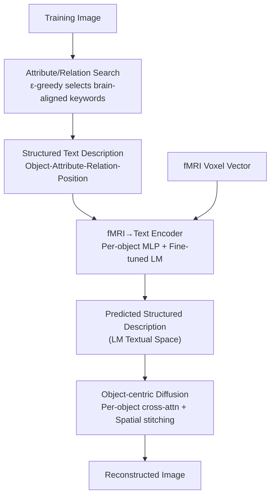

# Seeing Through the Brain: New Insights from Decoding Visual Stimuli with fMRI

**Conference**: ICLR 2026  
**OpenReview**: [https://openreview.net/forum?id=88ZLp7xYxw](https://openreview.net/forum?id=88ZLp7xYxw)  
**Code**: https://github.com/GraphmindDartmouth/PRISM  
**Area**: Medical Imaging / Brain Signal Decoding / Diffusion Models  
**Keywords**: fMRI visual decoding, Textual latent space, Object-centric generation, Prompt search, Diffusion models

## TL;DR
PRISM overturns the convention that "visual representations must be used to reconstruct visual images." The authors first prove via alignment metrics that fMRI signals most closely resemble the **textual space** of language models. Consequently, they project fMRI into a structured textual space as an intermediate bridge. By utilizing "automated search for brain-aligned keywords + object-centric diffusion" to synthesize images from text, they reduce the perceptual loss LPIPS by up to approximately 6% across the NSD, BOLD5000, and GOD datasets.

## Background & Motivation

**Background**: Reconstructing images seen by subjects from fMRI signals is a cross-disciplinary hotspot in brain science and machine learning. The mainstream approach involves two steps: first mapping fMRI signals to a latent space, and then generating images from that space using a pre-trained generative model (mostly diffusion models). Reconstruction quality depends on two factors: the "alignment" between the latent space and neural activity, and the generative model's ability to produce high-quality images from that space.

**Limitations of Prior Work**: Recent works have focused on stacking generative models (like SDXL) to improve image quality while **defaulting to the assumption that the latent space must match the stimulus modality**. They assume that since the goal is visual reconstruction, representations from visual models (ResNet, CLIP-image, LDM) should serve as the core latent space. A few methods incorporate semantic information from language models as secondary aids, but the backbone remains visual. This path faces two issues: first, "alignment" has been overlooked, with no verification that visual space is truly the most proximal to the brain; second, visual representations use a **unified global latent vector** to encode both objects and their attributes simultaneously. This entanglement often leads to object recognition errors, such as reconstructing "a grey tabby cat" as a tiger.

**Key Challenge**: Human visual processing is fundamentally **object-centric and compositional**—identifying objects, their attributes, and their relationships rather than understanding the entire image as a monolithic whole (Marr’s theory of vision). Using a global latent vector creates a fundamental mismatch with this compositional cognitive structure.

**Goal**: (1) Re-examine which latent space should truly be used for visual reconstruction; (2) Enable the latent space and generative model to explicitly model the compositionality and relationality of visual stimuli (objects, attributes, relationships).

**Key Insight**: Instead of pre-supposing an answer, the authors quantify the alignment between fMRI signals and three types of representation spaces: language model textual space, vision-language joint space, and pure visual space. An counter-intuitive observation emerges—the brain prioritizes the **semantic meaning** of images over pixel details; thus, pure textual space is actually more proximal to neural activity.

**Core Idea**: Utilize pure text as the intermediate representation between fMRI and images, organizing text into structured descriptions of "object-attribute-relationship-position," and then reassembling these into images using object-centric diffusion generation.

## Method

### Overall Architecture

PRISM addresses "fMRI → image" reconstruction through a new bridge: a **structured textual space** instead of a visual latent space. The pipeline consists of training and inference phases. On the training side: for each training image, a VLM generates a structured text description (a tuple of `[object : description : location]` per object + background). These descriptions are guided by an "attribute/relationship search module" that automatically selects keywords that best align with the brain. Using these descriptions as supervision, an encoder and a fine-tuned language model are trained to map fMRI signals into the LM's textual space. On the inference side: the encoder predicts structured descriptions from fMRI, which are then passed to a modified pre-trained diffusion model for **object-centric generation**—denoising objects independently, stitching them spatially according to predicted positions, and finally fusing the background to output the reconstructed image.

The foundation of the design is the core finding in §3.1: fMRI is most aligned with the LM textual space, making the "text-as-bridge" approach an empirically grounded choice rather than an engineering trick.

### Key Designs

**1. Text as Intermediate Representation: Proving fMRI is More "Text-like" Than "Image-like"**

This is the foundation of the paper, responding to the convention of matching latent spaces to stimulus modality. The authors compare three categories of spaces against fMRI: textual (T5, LLaMA3 embeddings using image captions), visual (LDM, ResNet50 image embeddings), and dual-modal (CLIP). Alignment is measured via three metrics: Centered Kernel Alignment (CKA, higher is better), Canonical Correlation Analysis (CCA, using the first canonical correlation $\rho=\mathrm{corr}(p_1^\top X, p_2^\top K)$, higher is better), and Generalization Gap (train-test loss difference when mapping fMRI to the target space via MLP, lower is better). CKA is defined as normalized HSIC: 
$$\mathrm{CKA}(X,K)=\frac{\mathrm{HSIC}(X,K)}{\sqrt{\mathrm{HSIC}(X,X)\cdot\mathrm{HSIC}(K,K)}}$$
using a Gaussian RBF kernel.

The results are counter-intuitive: the T5 textual space leads across all metrics (CKA 0.558, CCA 0.834, Gap 0.113), while pure visual spaces (ResNet50/LDM) perform worst (CKA only 0.18/0.20). Surprisingly, CLIP, which fuses both modalities, performs worse than pure language models. The authors interpret this as a sign that the brain is more concerned with the "meaning" of an image than pixel-level details, making the high semantic density of textual space naturally more proximal to neural activity.

**2. Attribute/Relationship Search Module: Optimization for "What to Describe"**

Simply using "structured text" is insufficient; the key is which **attributes and relationships** to emphasize (color? action? spatial layout?). Many attributes may not correspond to brain signals, and forced inclusion could contaminate alignment. Instead of manual selection, the authors formalize "keyword selection" as a constrained prompt optimization problem: given keywords $a$, a VLM generates structured descriptions $D_i^a=\mathrm{VLM}(Y_i,P(a))$ for image $Y_i$. The goal is to maximize the similarity of the reconstructed image to the original, while constraining the CKA of the textual embedding and fMRI to exceed threshold $\beta$:

$$\max_a \sum_{i=1}^N S\big(Y_i, \mathrm{Diff}( \mathrm{VLM}(Y_i,P(a)) ) \big)\quad \text{s.t.}\ \ \mathrm{CKA}(X, K^a)>\beta$$

where $S$ is image similarity (e.g., negative perceptual loss). For solving, an LLM acts as a keyword generator for $\varepsilon$-greedy search: starting from a common set $A$ of attribute/relation keywords, each step either generates a new candidate from the current optimal keyword's semantic neighborhood (with $1-\varepsilon$ probability) or explores randomly (with $\varepsilon$ probability). An interesting empirical conclusion is that despite broad exploration, optimal keywords consistently converge to **spatial relationships** (Spatial Layout, Relative Position), which is consistent with neuroscience findings regarding the brain's sensitivity to spatial arrangements.

**3. fMRI→Text Encoder: Per-object MLP Encoding + Fine-tuned LM Structure Decoding**

With structured descriptions as supervision, fMRI is projected into textual space. The "object-centric" idea is reused here: instead of one global network, a separate MLP is used for each object, $f_j = \mathrm{MLP}_j(x_i)$. The concatenated object representations are then fed into a language model to generate the estimated structured description $\hat D_i^a = \mathrm{LM}(\mathrm{MLP}_g(\mathrm{Concat}(f_1,\dots,f_m)))$. The LM is fine-tuned using autoregressive cross-entropy on per-object descriptions:

$$\mathcal{L}_{\mathrm{LM}}=-\sum_{j=1}^m \sum_{t'=1}^T \log p(y_{t'} \mid y_{<t'}, f_j)$$

Training occurs in two stages: training MLPs independently for several epochs, followed by joint fine-tuning of the LM and MLPs. This per-object encoding ensures fine-grained alignment between fMRI and text.

**4. Object-centric Diffusion: Per-object Cross-attention + Spatial Stitching + Background Fusion**

The final step is to synthesize the image from reconstructed descriptions without losing objects. The authors modify a pre-trained diffusion model for compositional generation: global context prompt $\hat p_0$ and per-object descriptions $\hat d_j$ are encoded into condition matrices $C_0, C_j$. At each denoising step, object $j$'s latent representation undergoes separate cross-attention: $H^j_{t-1} = \mathrm{CrossAttention}(H_t, C_j)$; then, individual latents are spatially scaled and concatenated based on predicted positions $\hat{loc}_j$: $H^{cat}_{t-1} = \Psi(\{H^j_{t-1}, \hat{loc}_j\}_{j=1}^m)$. To ensure smooth boundaries, the final representation is a weighted fusion of the stitched objects and global context:

$$H_{t-1} = \beta \cdot H^{cat}_{t-1} + (1-\beta) \cdot H^0_{t-1}$$

This ensures that each object is generated independently from its description and then assembled, preventing the omission of key objects common in the Mindeye series.

### Loss & Training
The core training objective is the autoregressive cross-entropy loss $\mathcal{L}_{\mathrm{LM}}$ summed across $m$ object descriptions. Training involves a two-stage strategy (MLP independent training followed by joint LM + MLP fine-tuning). During VLM inference, negative prompts are introduced to suppress distorted objects and background clutter.

## Key Experimental Results

Datasets: NSD, BOLD5000, and GOD. Five metrics: PixCorr/SSIM (pixel/structural similarity), LPIPS (perceptual similarity, lower is better), and dual-mode recognition via CLIP and Inception V3 (semantic consistency). All methods used a Stable Diffusion 2.1 backbone for fairness.

### Main Results (NSD, SD 2.1 Backbone)

| Method | PixCorr ↑ | SSIM ↑ | LPIPS ↓ | CLIP ↑ | Inception V3 ↑ |
|:---|:---:|:---:|:---:|:---:|:---:|
| **PRISM** | **0.3404** | **0.4640** | **0.5963** | **0.9467** | **0.9516** |
| Mindeye2 | 0.3160 | 0.4447 | 0.6338 | 0.9201 | 0.9308 |
| Mindeye1 | 0.3114 | 0.3868 | 0.6501 | 0.9121 | 0.9198 |
| NeuralDiffuser | 0.3011 | 0.3348 | 0.6522 | 0.9409 | 0.9487 |
| Takagi | 0.2100 | 0.3880 | 0.7665 | 0.8811 | 0.9086 |

PRISM leads across all datasets and metrics. LPIPS decreased from 0.6338 (Mindeye2) to 0.5963, a ~6% improvement in perceptual quality. Using the SDXL backbone further increased the lead (PRISM+SDXL LPIPS 0.5563). PRISM consistently reconstructs **all objects**, whereas previous methods frequently miss key objects.

Image Question Answering (QA) tests: Using Qwen2.5 to answer COCO-based questions on reconstructed images, PRISM achieved 60.54% accuracy, significantly higher than Mindeye2 (57.65%), indicating that the reconstructions are not only visually similar but semantically readable.

### Ablation Study (NSD)

**Latent Space Comparison** (Validating the use of "Textual Space"):

| Latent Space | PixCorr ↑ | SSIM ↑ | LPIPS ↓ |
|:---|:---:|:---:|:---:|
| LM Textual Space (Ours) | **0.3404** | **0.4640** | **0.5963** |
| CLIP Textual Embedding | 0.3208 | 0.3725 | 0.6611 |
| LDM Visual Latent Space | 0.2090 | 0.3727 | 0.7502 |

**Module Ablation**:

| Configuration | PixCorr ↑ | SSIM ↑ | LPIPS ↓ |
|:---|:---:|:---:|:---:|
| PRISM (Full) | 0.3404 | 0.4640 | 0.5963 |
| w/o Object-centric Diffusion | 0.3291 | 0.4299 | 0.6111 |
| w/o Search (Best Init Word) | 0.3311 | 0.4421 | 0.6005 |
| w/o Search (Worst Init Word) | 0.3068 | 0.4167 | 0.6398 |

### Key Findings
- **Textual space is a genuine superiority, not a fluke**: LM textual space outperformed both CLIP and visual spaces in both alignment and reconstruction metrics, proving "pure text can carry multi-level visual information."
- **Object-centric diffusion is the most critical module**: Removing it causes a degradation that prompt optimization cannot recover, confirming the core role of "per-object generation" for perceptual accuracy.
- **Spatial relationships are the neuro-alignment key**: The $\varepsilon$-greedy search consistently converged to Spatial Layout / Relative Position. Gradient attribution localized the highest activation to the Presubiculum (mean activation 0.0080), a brain region associated with spatial memory.

## Highlights & Insights
- **"Measure before Model" Paradigm**: By first proving fMRI is more text-like via CKA/CCA/Gap metrics, the authors turned a radical design choice (discarding visual latent space) into an empirically supported conclusion.
- **Prompt Engineering as Constrained Optimization**: Automated $\varepsilon$-greedy search ensures the semantic dimensions selected are those truly aligned with brain signals, avoiding manual guesswork.
- **End-to-end Compositional Pipeline**: Per-object MLP encoding coupled with per-object cross-attention ensures the object-centric nature is preserved from fMRI signal to pixel output, solving the "blurred global vector" problem.
- **Machine Learning Insights for Neuroscience**: The discovery that spatial layout keywords maximize alignment and link to specific brain regions (Presubiculum) provides a verifiable neuroscientific hypothesis derived from an ML system.

## Limitations & Future Work
- The neuroscientific interpretation of the Presubiculum remains a correlation derived from gradient attribution and requires further validation by neuroscientists.
- The pipeline relies on multiple external models (VLM for descriptions, LLM for search), introducing complexity and potential error propagation.
- For scenes with extremely dense objects or severe occlusion, the simple blending $\beta$ might struggle with boundary artifacts.
- The conclusion that "text is most aligned" was derived from specific models; its generalizability to stimuli without clear semantic objects (e.g., abstract patterns) remains to be explored.

## Related Work & Insights
- **vs. Mindeye1/Mindeye2 (Scotti et al.)**: While prior SOTA mapped fMRI to CLIP **image** space, PRISM maps to pure textual space and uses object-centric diffusion. PRISM prevents object loss and improves all perceptual/semantic metrics at the cost of requiring a VLM/LLM pipeline.
- **vs. MindDiffuser (Lu et al.)**: Prior methods used a two-stage approach with visual scaffolding; PRISM refutes the necessity of visual scaffolding via alignment experiments.
- **vs. Semantic-aided methods**: Previous works treated language as an auxiliary feature; PRISM elevates text to the primary intermediate latent space.

## Rating
- Novelty: ⭐⭐⭐⭐⭐ 
- Experimental Thoroughness: ⭐⭐⭐⭐ 
- Writing Quality: ⭐⭐⭐⭐ 
- Value: ⭐⭐⭐⭐⭐ 

<!-- RELATED:START -->

## Related Papers

- [\[ICLR 2026\] Towards Interpretable Visual Decoding with Attention to Brain Representations](towards_interpretable_visual_decoding_with_attention_to_brain_representations.md)
- [\[CVPR 2026\] Duala: Dual-Level Alignment of Subjects and Stimuli for Cross-Subject fMRI Decoding](../../CVPR2026/medical_imaging/duala_dual-level_alignment_of_subjects_and_stimuli_for_cross-subject_fmri_decodi.md)
- [\[ICLR 2026\] Brain-IT: Image Reconstruction from fMRI via Brain-Interaction Transformer](brain-it_image_reconstruction_from_fmri_via_brain-interaction_transformer.md)
- [\[ICLR 2026\] SEED: Towards More Accurate Semantic Evaluation for Visual Brain Decoding](seed_towards_more_accurate_semantic_evaluation_for_visual_brain_decoding.md)
- [\[ICLR 2026\] A Cognitive Process-Inspired Architecture for Subject-Agnostic Brain Visual Decoding](a_cognitive_process-inspired_architecture_for_subject-agnostic_brain_visual_deco.md)

<!-- RELATED:END -->
