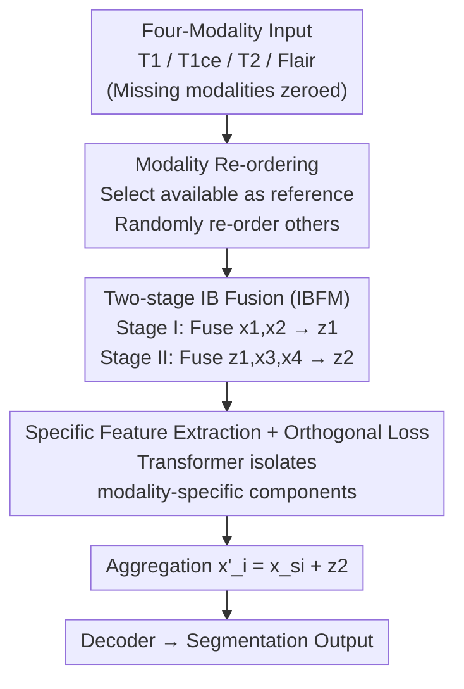

# Sequential Information Bottleneck Fusion: Towards Robust and Generalizable Multi-Modal Brain Tumor Segmentation

**Conference**: ICLR 2026  
**OpenReview**: [https://openreview.net/forum?id=tmV2sOZ8TV](https://openreview.net/forum?id=tmV2sOZ8TV)  
**Code**: None  
**Area**: Medical Imaging  
**Keywords**: Brain Tumor Segmentation, Missing Modality, Information Bottleneck, Sequential Fusion, Multi-modal MRI

## TL;DR
Addressing the common "missing modality" issue in multi-modal MRI brain tumor segmentation, this paper proposes **Sequential Information Bottleneck Fusion** to progressively compress information from various modalities into a shared latent representation. From an information-theoretic perspective, it is demonstrated that this approach is more robust and provides a tighter generalization upper bound than mainstream parallel fusion. Based on this, the SMSN network is designed, which comprehensively outperforms parallel fusion baselines on BRATS18/20 and generalizes from glioma to brain metastasis without fine-tuning.

## Background & Motivation
**Background**: Brain tumor segmentation relies on the complementary information of four MRI modalities: T1, T1ce, T2, and Flair. However, in clinical settings, one or more modalities are often missing due to equipment or procedural defects, making "missing modality segmentation" a critical requirement. Current mainstream approaches are **fusion-based methods**—merging available modalities into a joint representation for segmentation, exemplified by mmFormer, M2FTrans, MMMViT, and IMS2Trans.

**Limitations of Prior Work**: almost all these methods employ **parallel fusion**, where all modalities are concatenated or mapped to a shared latent space via attention simultaneously. The issue is that when a modality is missing, this "all-in-one" fusion fails to **preserve modality-common information**, leading to a drop in segmentation performance.

**Key Challenge**: Parallel fusion tends to **rely heavily on the dominant modality** (the modality with the highest mutual information with the target $Y$, such as Flair for the whole tumor or T1ce for the enhanced tumor). Once the dominant modality is absent, the fused representation loses its most informative source, and predictions collapse. The root cause is that parallel fusion does not explicitly control "what information to keep and what to compress."

**Goal**: Design a fusion method that **does not tie the representation to the availability of any single modality** and preserves task-related shared information as much as possible under any combination of missing modalities.

**Key Insight**: The authors start from Information Bottleneck (IB) theory and compare **sequential fusion** (recursively updating latent states modality-by-modality) with parallel fusion using information theory. They prove that sequential IB fusion yields a tighter generalization upper bound and a tighter Lipschitz bound (corresponding to a smoother loss surface and stronger robustness).

**Core Idea**: Replace "parallel fusion" with "sequential information bottleneck fusion"—compressing modalities into a shared latent representation step-by-step, retaining only task-related information and compressing redundancy to remain stable when modalities are missing.

## Method

### Overall Architecture
SMSN (Sequential Multi-modal Segmentation Network) aims to ensure that segmentation does not fail regardless of which modalities are missing. The core mechanism is replacing "parallel one-time fusion" with "two-stage sequential IB fusion," complemented by modules for handling missing data and decoupling features.

The pipeline is: Four modalities pass through independent encoders → **Modality Re-ordering** places available modalities in suitable positions → **Two-stage Information Bottleneck Fusion Module (IBFM)** progressively compresses a shared (modality-common) latent representation $z_1, z_2$ → **Transformer-based specific feature extraction** with orthogonal loss decouples modality-specific components from $z_2$ → Specific features are aggregated with the shared representation ($x_i' = x_{si} + z_2$) → Decoder outputs the segmentation. The encoder/decoder structures follow mmFormer and M2FTrans; the innovation lies entirely in the intermediate fusion and decoupling.

### Key Designs

**1. Sequential Information Bottleneck Fusion: Replacing Parallel Concatenation with Recursive Latent State Updates**

This is the fundamental logic of the paper. Parallel fusion $X=(X_1,\dots,X_M)\xrightarrow{f}Z$ maps all modalities at once, which fails if the dominant modality is absent. Sequential fusion $X_1,X_2\xrightarrow{f_1}Z_1,\ X_3\xrightarrow{f_2}Z_2,\dots$ allows modalities to enter step-by-step with recursive latent state updates. The authors use the IB objective $Z^*=\arg\max_{p(z|x)}[I(Z;Y)-\beta I(X;Z)]$ to constrain each fusion step: under a fixed information constraint $I(X;Z)$, the optimal representation $Z^*$ maximizes predictive information $I(Z^*;Y)$ while compressing task-irrelevant information.

The authors provide three arguments for why this is more robust and generalizable: (i) **Tighter generalization upper bound**—according to the information-theoretic generalization bound $\epsilon_T(h)\le \epsilon_S(h)+O(\sqrt{I(Z;X)/n})$, IB fusion actively reduces $I(Z_{IB};X)$, making $I(Z_{IB};X)<I(Z_p;X)$, thus the test error upper bound is strictly smaller (Proposition 1/2); (ii) **Persistence under missing modalities**—whether the dominant modality $X_d$ or the supporting modality $X_s$ is missing, IB fusion retains clean task-related signals, and $I(Z_{IB};X)<I(Z_p;X)$ holds; (iii) **Tighter Lipschitz bound**—under the assumption of 1-Lipschitz modules, $\prod_i L_{\phi_i}L_i\le \min_i L_i\le \sqrt{\sum_i L_i^2}$, meaning the Lipschitz constant of sequential fusion is smaller than that of parallel fusion, corresponding to smoother decision boundaries. Measured loss landscapes also remain flatter and more regular as the number of missing modalities increases.

**2. Two-stage Information Bottleneck Fusion Module (IBFM): Compressing Four Modalities into Shared Representation**

The implementation of sequential fusion. For four modalities $x=\{x_i\}_{i=1}^4$, IBFM (inspired by ITHP) operates in two stages: Stage I fuses $x_1,x_2$ to obtain bottleneck representation $z_1$; Stage II fuses $x_3,x_4$ based on $z_1$ to obtain $z_2$. Each $z$ is a compressed latent representation. The fusion objective is formulated in IB form:

$$F = \underbrace{I([x_1,x_2];z_1)-\beta I(z_1;y_0)}_{\text{stage I}} + \underbrace{I(z_1,[x_3,x_4];z_2)-\gamma I(z_2;y_1)}_{\text{stage II}}$$

Where $y_0,y_1$ are task targets for each stage, and $\beta, \gamma$ balance compression and relevance. Since mutual information is not directly optimizable, variational approximation is used to upper-bound $I([x_1,x_2];z_1)$ and $I(z_1,[x_3,x_4];z_2)$ using KL divergence against a standard normal prior $r(\cdot)$:

$$L_e = \mathbb{E}\big[D_{KL}(p(z_1|[x_1,x_2])\,\|\,r(z_1))\big] + \mathbb{E}\big[D_{KL}(p(z_2|z_1,[x_3,x_4])\,\|\,r(z_1))\big]$$

This recursive compression ensures that only task-related information is added to the latent representation at each step, making the global mutual information $I(Z;X)$ much less sensitive to missing modalities than parallel fusion.

**3. Modality Re-ordering + Modality-Aware Reconstruction: Preventing Contamination at the Sequence Origin**

Sequential fusion has a risk: if a missing modality (represented by a zero tensor) is placed at the start of the sequence, the IB objective may be misled. To address this, a **modality re-ordering strategy** is proposed—randomly selecting one available modality as the initial reference, then randomly re-ordering the remaining $N-1$ modalities (regardless of availability) for sequential fusion. This ensures the sequence always starts with valid information.

To focus the network on "usable" modalities, a **modality-aware reconstruction loss** is introduced: two decoders reconstruct input modalities from $z_1$ and $z_2$, respectively, multiplied by a binary availability mask $M_i\in\{0,1\}$ ($M_i=1$ if modality $x_i$ exists):

$$L_r = \beta\,\mathbb{E}_{z_0}\Big[\sum_{i=1}^{2}M_i\log q_{\psi_0}(x_i|z_0)\Big] + \gamma\,\mathbb{E}_{z_1}\Big[\sum_{i=3}^{4}M_i\log q_{\psi_1}(x_i|z_1)\Big]$$

The mask compels the network to reconstruct only truly existing modalities, avoiding "hard reconstruction" of zero tensors, which improves stability under missing conditions.

**4. Specific Feature Extraction + Orthogonal Loss: Separating Shared and Specific Information**

Theoretically, IB can separate shared information from mixed features, but in practice, some modality-specific information remains in $z_2$. For clean decoupling, a Transformer block is used for **specific feature extraction**: modality features $\{x_i\}$ from the encoders are concatenated with $z_2$ and passed through the Transformer, then split back into specific components $x_{si}$. To force $x_{si}$ to contain only information "not captured by $z_2$," an **orthogonal loss** $L_o=\sum_{i=1}^M\|z_2\cdot x_{si}\|^2$ is added, making specific components orthogonal to the shared representation. Finally, aggregated features $x_i' = x_{si}+z_2$ (shared + specific) are sent to the decoder.

### Loss & Training
The total loss optimizes the segmentation loss $L_s$ with three auxiliary losses: IB variational loss $L_e$ (KL compression), orthogonal loss $L_o$ (decoupling specific/shared), and modality-aware reconstruction loss $L_r$ (robustness to missing data). $\beta, \gamma$ are key IB hyperparameters. Training is conducted from scratch on BRATS without pre-training.

## Key Experimental Results

### Main Results
Average Dice scores across 15 missing modality combinations on BRATS18/20 for three sub-regions (WT/TC/ET), compared against four parallel fusion baselines. SMSN leads in most sub-regions and means, with a significant advantage in difficult scenarios (missing 2-3 modalities).

| Dataset / Sub-region | Metric | Ours (SMSN) | Prev. SOTA | Gain |
|--------|------|------|----------|------|
| BRATS18 / WT | Avg. Dice | **85.62** | 85.39 (M2FTrans) | +0.23 |
| BRATS18 / TC | Avg. Dice | **75.20** | 73.25 (mmFormer) | +1.95 |
| BRATS18 / ET | Avg. Dice | **62.39** | 55.21 (MMMViT) | +7.18 |
| BRATS20 / WT | Avg. Dice | **87.14** | 85.74 (mmFormer) | +1.40 |
| BRATS20 / TC | Avg. Dice | **78.80** | 77.79 (mmFormer) | +1.01 |
| BRATS20 / ET | Avg. Dice | **63.06** | 62.17 (M2FTrans) | +0.89 |

The largest improvement is in ET (enhancing tumor, the most T1ce-dependent and difficult sub-region), showing that sequential IB fusion preserves critical information when the dominant modality is sparse.

**Cross-domain Generalization**: The model trained on BRATS20 was transferred to the Brain Metastasis (BM) dataset **without fine-tuning**.

| Sub-region | SMSN Avg. | Next Best (M2FTrans) | Note |
|------|------|------|------|
| WT | **57.03** | 55.16 | Lower std dev, more stable under input variation |
| TC | **45.70** | 38.62 | Significant lead |
| ET | **36.89** | 31.74 | Significant lead |

### Ablation Study
Removing IBFM, the specific feature extraction module, orthogonal loss, or reconstruction loss confirms each component is necessary.

| Configuration | BRATS18 TC | BRATS18 ET | Note |
|------|---------|---------|------|
| Full SMSN | **75.20** | **62.39** | Complete model |
| w/o specific modules/losses | 72.72~74.19 | 56.71~61.69 | All metrics drop, ET most significantly |

### Key Findings
- **Orthogonal loss + specific feature extraction are critical**: Removing them significantly drops performance, confirming that IB leaves residual specific info that requires explicit decoupling.
- **$\beta, \gamma$ are sensitive but robust**: Performance varies with $\beta$ (compression strength) and $\gamma$ (loss weight), but SMSN consistently outperforms baselines across a wide range, indicating stable benefits without exhaustive tuning.
- **Advantage scales with difficulty**: As more modalities are missing, SMSN's lead over parallel baselines increases, consistent with theory on flatter loss surfaces and tighter Lipschitz bounds.

## Highlights & Insights
- **Theoretic Elevation**: The paper elevates the "sequential vs. parallel" debate to information theory, using generalization bounds, Lipschitz bounds, and loss landscapes as evidence. This "proof-then-design" approach is rigorous.
- **Elegant Engineering with Re-ordering**: Modality re-ordering solves the inherent flaw of sequential fusion (sensitivity to sequence start) at zero cost, making the approach viable.
- **Masked Reconstruction and Decoupling**: The combination of masked reconstruction and the "Shared-via-IB, Specific-via-Transformer + Orthogonal" decoupling strategy is easily adaptable to other multi-modal tasks like classification or retrieval.
- **Zero-shot Transferability**: Transferring from glioma to morphologically distinct metastasis without fine-tuning suggests the IB-compressed shared representation captures task essence rather than training domain noise.

## Limitations & Future Work
- **Fixed Two-stage Grouping**: The method fixedly groups four modalities into (x1,x2) and (x3,x4). The impact of different groupings or scaling to more/fewer modalities is not fully explored.
- **Hyperparameter Sensitivity**: $\beta, \gamma$ significantly impact performance. While the effective range is broad, locating the "optimal compression point" remains challenging.
- **Idealized Lipschitz Assumptions**: 1-Lipschitz continuity is hard to strictly satisfy for softmax attention. The authors use LayerNorm to stabilize gradients as a practical approximation.
- **Backbone Dependency**: Encoders and decoders are directly inherited from mmFormer/M2FTrans; innovation is focused on the fusion layer rather than end-to-end architectural exploration.

## Related Work & Insights
- **vs. mmFormer / M2FTrans (Parallel Fusion SOTA)**: They use concatenation or attention for one-time fusion. This work changes to two-stage sequential IB fusion to explicitly discard task-irrelevant info, proving more robust in many-missing-modality scenarios.
- **vs. ITHP (IB-driven Hierarchical Distillation)**: ITHP distills auxiliary info into compact representations; this work adapts IB for missing modality segmentation, adding re-ordering and masked reconstruction.
- **vs. Non-fusion methods (M3AE / ShaSpec)**: Those often involve high computational overhead or limited scalability; as a fusion-based approach, SMSN is lighter and demonstrates superior performance.

## Rating
- Novelty: ⭐⭐⭐⭐⭐ Systematically introduces sequential IB fusion to missing modality segmentation with strong theoretic guarantees.
- Experimental Thoroughness: ⭐⭐⭐⭐ Extensive missing combinations, cross-domain transfer, and ablation; could benefit from expansion beyond brain tumors.
- Writing Quality: ⭐⭐⭐⭐ Clear theoretical derivation and methodological narrative.
- Value: ⭐⭐⭐⭐ Highly practical as missing modalities are a real clinical pain point; shows strong robust and zero-shot capabilities.

<!-- RELATED:START -->

## Related Papers

- [\[CVPR 2026\] Uni-Encoder Meets Multi-Encoders: Representation Before Fusion for Brain Tumor Segmentation with Missing Modalities](../../CVPR2026/medical_imaging/uni-encoder_meets_multi-encoders_representation_before_fusion_for_brain_tumor_se.md)
- [\[CVPR 2025\] Federated Modality-specific Encoders and Partially Personalized Fusion Decoder for Multimodal Brain Tumor Segmentation](../../CVPR2025/medical_imaging/federated_modality-specific_encoders_and_partially_personalized_fusion_decoder_f.md)
- [\[ICLR 2026\] Frequency-Balanced Retinal Representation Learning with Mutual Information Regularization](frequency-balanced_retinal_representation_learning_with_mutual_information_regul.md)
- [\[ICCV 2025\] M-Net: MRI Brain Tumor Sequential Segmentation Network via Mesh-Cast](../../ICCV2025/medical_imaging/m-net_mri_brain_tumor_sequential_segmentation_network_via_mesh-cast.md)
- [\[ICLR 2026\] Histopathology-Genomics Multi-modal Structural Representation Learning for Data-Efficient Precision Oncology](histopathology-genomics_multi-modal_structural_representation_learning_for_data-.md)

<!-- RELATED:END -->
