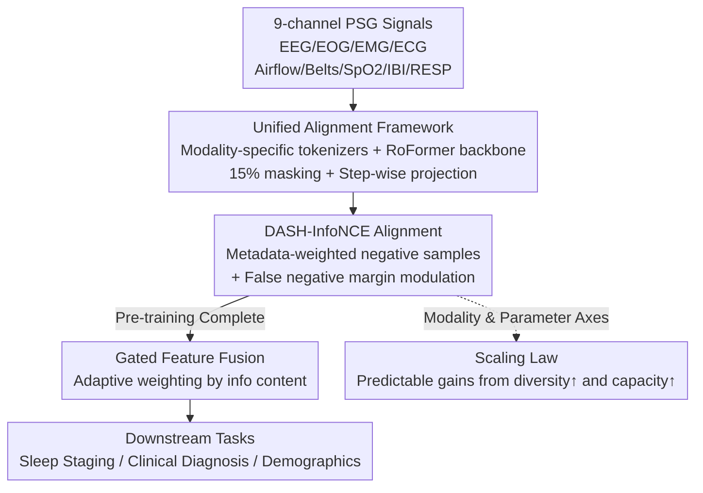

# sleep2vec: Unified Cross-Modal Alignment for Heterogeneous Nocturnal Biosignals

**Conference**: ICLR 2026  
**OpenReview**: [https://openreview.net/forum?id=DDXhRN66eV](https://openreview.net/forum?id=DDXhRN66eV)  
**Code**: TBD  
**Area**: Medical Signal / Self-Supervised Representation Learning / Multimodal Alignment  
**Keywords**: Sleep Monitoring, PSG Foundation Model, Cross-Modal Contrastive Alignment, Metadata-Aware, Scaling Law

## TL;DR
sleep2vec performs cross-modal contrastive pre-training on 42,249 nights across nine sleep physiological signals. It utilizes a DASH-InfoNCE objective that dynamically weights negative samples based on demographic and acquisition metadata to align heterogeneous signals into a unified representation space. This enables inference with arbitrary modality subsets, provides robustness to sensor loss, and characterizes the scaling laws of PSG signals relative to modality diversity and model scale.

## Background & Motivation
**Background**: The gold standard for clinical sleep assessment is polysomnography (PSG), which simultaneously records over a dozen synchronized signals, including electroencephalogram (EEG), electrooculogram (EOG), electromyogram (EMG), electrocardiogram (ECG), nasal airflow, chest/abdominal belts, and blood oxygen (SpO2). In residential settings, various bedside monitors and wearables collect only a subset of these channels, resulting in a fragmented landscape of diverse devices, missing channels, and varying sampling rates. Self-supervised pre-training on physiological signals is expected to become the paradigm for unified modeling.

**Limitations of Prior Work**: Existing efforts are either specialized models trained for single downstream tasks (e.g., sleep staging), lacking the generality of foundation models, or contrastive pre-training methods that cover only one to three channels (typically EEG and ECG) without scaling to the full PSG set. When modalities increase, objective functions often degenerate into reconstruction. Reconstruction emphasizes recovering details specific to each modality rather than forcing heterogeneous inputs into a shared semantic manifold, causing performance collapse when sensors are missing during inference.

**Key Challenge**: To create a unified representation that generalizes robustly across heterogeneous sensor configurations, the key lies not in "reconstructing every signal" but in "aligning different modalities into a shared semantic space." However, cross-center contrastive learning faces the risk of models exploiting cohort-specific "shortcuts" (e.g., equipment fingerprints or demographic biases) to distinguish negative samples, thereby over-fitting to specific datasets rather than learning genuine physiological states.

**Goal**: (1) Align nine waveform or interval-derived signals into a modality-agnostic embedding space to support any modality subset and provide robustness against missing data; (2) Design a contrastive objective capable of suppressing cohort shortcuts and improving cross-center generalization; (3) Systematically characterize the scaling laws of PSG foundation models across the axes of modality diversity and parameter scale.

**Key Insight**: The authors hypothesize that synchronized signals from the same night are multiple views of the same underlying physiological state (the physical premise behind Rechtschaffen-Kales and AASM staging standards). Since they share a latent state, aligning these views should yield a modality-agnostic and robust representation. Furthermore, demographic similarity can be used to determine which negative samples should be more challenging or which are "false negatives" from the same subject.

**Core Idea**: Perform step-wise cross-modal contrastive alignment on 40,000+ nights of nine-modality PSG data. Inject metadata such as age, sex, acquisition center, and night identity into InfoNCE for negative sample weighting and margin modulation (DASH-InfoNCE), replacing per-channel reconstruction with "alignment + metadata-aware + principled scaling."

## Method

### Overall Architecture
sleep2vec is a PSG foundation model designed to unify the modeling of nine heterogeneous signals with frequent missingness. The pipeline consists of two stages: In the pre-training stage, 30-second tokens from each channel are encoded by modality-specific tokenizers and fed into a shared modality-agnostic backbone, followed by step-wise cross-modal alignment in a projection space using DASH-InfoNCE. In the fine-tuning stage, the masks and projection heads are removed, and available modalities are aggregated via gated fusion before reaching the task head.

Specifically, each overnight recording is segmented into intra-subject segments (same subject, different time slices) and inter-subject segments (different subjects). Each modality uses its own MLP tokenizer to map 30-second tokens into embeddings of equal dimension (high-frequency EEG/EOG/EMG/ECG are resampled to 128 Hz, while low-frequency airflow/belts/SpO2/IBI/RESP are resampled to 4 Hz; tokenizers process raw sampling rates to align temporally). Each mini-batch is constructed around a single modality pair $(m_a, m_b)$ for stable optimization. For paired instances, 15% of time steps are masked, a learnable [CLS] token is prepended, and the sequence passes through a modality-agnostic RoFormer backbone. Hidden states at each time step are projected into a 128-dimensional alignment space via a shared three-layer MLP, where contrastive loss is applied step-wise. The [CLS] position provides a night-level global representation. For downstream tasks, either step-wise hidden states (for sequential tasks like staging) or [CLS] global representations (for aggregate tasks like diagnosis) are used.

### Key Designs

**1. Unified Multi-modal Alignment Framework: Modality-specific entry + Modality-agnostic backbone**

Addressing fragmented channels and sampling rates, the framework decouples "modality handling" from "semantic learning." Differences are handled at the entry point, while semantics are processed by a shared backbone. Each modality has a minimal MLP tokenizer (two-layer feed-forward + residual, SiLU activation, 0.1 dropout, LayerNorm), encoding 30-second tokens—matching the standard AASM epoch—into embeddings of unified dimensions. This ensures that signals with different sampling rates are naturally aligned in time and can be fed into the same RoFormer backbone. The backbone is positioned as a general instance of a sequence encoder. Alignment occurs step-wise: hidden states are projected into a 128-dimensional space, and contrastive loss is applied to masked segments at each time step and averaged ($L_{\text{DASH}}=\frac{1}{L}\sum_{t=1}^{L} L^{(t)}_{\text{DASH}}$), ensuring temporal resolution consistency for tasks like sleep staging.

**2. DASH-InfoNCE: Reshaping Negative Samples with Metadata to Eliminate Cohort Shortcuts**

This core contribution addresses the issue of cross-center contrastive learning exploiting cohort shortcuts. Standard InfoNCE treats all non-paired samples in a batch equally as negatives. DASH-InfoNCE modifies the denominator:

$$\ell_{\text{DASH}}(i,t) = -\log \frac{\exp\!\big(s_{i,\pi(i),t}/\tau\big)}{\sum_{j=1}^{B} \omega_{i,j}\,\exp\!\big((s_{i,j,t}-\gamma\,\psi(d_{i,j},p_{i,j,t}))/\tau\big)}$$

First, **metadata-driven sample weighting** $\omega_{i,j}$ is applied: a symmetric kernel $\kappa$ based on age difference $|a_i-a_j|$ is multiplied by similarity factors for sex $s^{(g)}_{i,j}$ and acquisition center $s^{(c)}_{i,j}$. Weights $\alpha_{i,j}$ are normalized to $\omega_{i,j}$. This concentrates probability mass on negative samples that are "demographically similar" and thus theoretically harder, forcing the model to learn genuine physiological differences. Second, **false-negative margin modulation** addresses segments from the same person on the same night that are semantically similar. An indicator $h_{i,j}$ identifies these "false negatives," and a fixed margin $\gamma m$ is subtracted from their logits to reduce their competitiveness in the softmax while preserving their presence in the denominator. This remains purely self-supervised as it uses only metadata $(a_i, g_i, c_i)$ and identity $u_i$.

**3. Gated Feature Fusion: Adaptive weighting for missingness and noise**

During fine-tuning, the method of aggregating multiple modalities is critical. Simple concatenation leads to high-dimensional sparse representations and overfitting, while mean pooling assumes all channels are equally reliable. Physiological signals vary significantly in signal-to-noise ratio and complementary content. The gating mechanism learns a scalar weight for each modality, adaptively amplifying useful modalities and suppressing noisy ones, resulting in a compact, task-oriented representation robust to sensor missingness.

**4. Modality and Parameter Scaling Laws: Predictable gains from diversity and capacity**

The authors systematically experimented across two axes: modality diversity and parameter scale. They found that gains follow a predictable trend, particularly in cross-cohort generalization scenarios where differences in acquisition configuration and population are significant. In clinical diagnosis experiments, the ROC-AUC rose monotonically with the number of modalities $N$, and the advantage of DASH-InfoNCE over standard InfoNCE increased with $N$, validating that metadata-aware alignment better extracts cross-modal physiological correlations in large-scale settings.

### Loss & Training
Pre-training uses DASH-InfoNCE (formula above), calculated step-wise within batches. A 15% masking probability is used, with alignment performed between masked segments. Each batch samples only one modality pair for stability. The corpus includes 42,249 nights from 30,852 subjects across four cohorts (SHHS/MrOS/MESA/WSC). Fine-tuning removes masks and uses a fixed modality configuration.

## Key Experimental Results

### Main Results
On SHHS 5-stage sleep staging (W/N1/N2/N3/REM), compared with foundation model (FM) baselines and specialized models:

| PSG Channel Set | Model | Acc.(%) | κ | MF1(%) |
|:---|:---|:---|:---|:---|
| EEG | SleepFM (FM) | 86.3 | 0.81 | 76.3 |
| EEG | sleep2vec | 87.4 | 0.82 | 77.3 |
| IBI & RESP | SleepFM | 79.7 | 0.71 | 65.7 |
| IBI & RESP | SleepFounder | 80.9 | 0.73 | 68.3 |
| IBI & RESP | sleep2vec | 83.0 | 0.75 | 65.9 |
| ECG & ABD | SleepFM | 77.9 | 0.68 | 62.7 |
| ECG & ABD | sleep2vec | 82.7 | 0.75 | 65.6 |
| FULL | SleepFM | 86.7 | 0.81 | 77.3 |
| FULL | PFTSleep | 87.7 | 0.83 | 80.8 |
| FULL | sleep2vec | 88.6 | 0.84 | 79.5 |

Ours (sleep2vec) consistently outperforms baseline FMs across all PSG subsets. The gain is particularly evident in weak channel configurations like IBI & RESP (83.0% vs. SleepFM 79.7%). Performance in some configurations approaches or exceeds specialized models.

Cross-cohort evaluation: Fine-tuned on SHHS, tested directly on the unseen APPLES cohort:

| Channel Set | Model | Acc.(%) | κ | MF1(%) |
|:---|:---|:---|:---|:---|
| IBI & RESP | SleepFM | 69.1 | 0.55 | 54.3 |
| IBI & RESP | sleep2vec | 73.2 | 0.61 | 57.8 |
| FULL | SleepFM | 71.4 | 0.59 | 60.0 |
| FULL | sleep2vec (InfoNCE) | 76.8 | 0.67 | 63.5 |
| FULL | sleep2vec | 78.4 | 0.69 | 65.2 |

The robust performance under distribution shift is significant, with a 7% lead over SleepFM (78.4% vs 71.4%) in the full channel configuration.

### Ablation Study

| Configuration | Key Phenomenon | Description |
|:---|:---|:---|
| sleep2vec (full DASH-InfoNCE) | FULL Acc. 88.6 / APPLES 78.4 | Full model |
| sleep2vec (InfoNCE) | FULL Acc. 88.4 / APPLES 76.8 | Reverting to standard InfoNCE drops 1.6 points cross-cohort |
| Leave-one-out (No EEG/IBI) | Significant Acc. drop | These two modalities contribute the most |
| Leave-one-out (No SpO2/EOG) | Minimal Acc. impact | High redundancy |
| Concat / Mean Fusion | Underperforms Gating | Concat overfits; Mean dilutes cues |

### Key Findings
- **DASH-InfoNCE gains are most prominent cross-cohort**: Within the same distribution (SHHS), the difference compared to InfoNCE is only 0.2 points, but it widens to 1.6 points on the unseen APPLES cohort, indicating that metadata weighting primarily suppresses cohort shortcuts.
- **Modality importance is highly uneven**: Leave-one-out testing shows EEG and IBI are most critical, while SpO2 and EOG have minimal impact, justifying the need for gated fusion.
- **Modality scaling is monotonically effective**: ROC-AUC for four clinical diagnosis tasks (hypertension, allergy/sinus, asthma, CAD) improves as $N$ increases.

## Highlights & Insights
- **Demographic metadata as geometric regulators**: Age, sex, and center are not used as labels but as regulators for contrastive geometry—a transferable approach for any contrastive pre-training prone to cohort shortcuts.
- **Alignment over Reconstruction**: The authors argue that reconstruction-based methods fail to force shared semantic manifolds; switching to step-wise alignment ensures modality-agnostic and robust representations.
- **First PSG Scaling Law Characterization**: Moving from empirical observation to predictable trends for "adding sensors" or "adding parameters" provides high clinical utility.
- **Agnostic to Backbone**: The authors explicitly state that RoFormer is not the primary contribution, emphasizing that the "flexible backbone + metadata-aware alignment" recipe is what drives performance.

## Limitations & Future Work
- **Adult-focused evaluation**: While the age span is 1-109, evaluations are concentrated on adult cohorts; generalizability to pediatrics or specific clinical subgroups remains to be verified.
- **Metadata dependency**: DASH-InfoNCE relies on $a_i, g_i, c_i$. Performance under missing or unreliable metadata cases was not extensively discussed.
- **Hyperparameter sensitivity**: The specific forms of kernel $\kappa$, similarity factors, and margin $m$ lack comprehensive ablation in the main text.
- **Sampling strategy**: Only one modality pair is sampled per batch, leaving potential for more advanced pair-sampling strategies.

## Related Work & Insights
- **vs SleepFM / SleepFounder**: These often pre-train channels separately or are limited to small subsets. sleep2vec covers nine modalities in a single pre-training phase and leads across all configurations, especially on weak channels and cross-cohort testing.
- **vs Reconstruction-based methods**: These prioritize signal fidelity, tying inference to the training modality set. sleep2vec uses explicit alignment for modality-agnostic representations.
- **vs CLIP / ImageBind**: While following a similar alignment paradigm, sleep2vec specifically addresses "false negatives" and "cohort shortcuts" unique to physiological signals using DASH-InfoNCE.

## Rating
- Novelty: ⭐⭐⭐⭐⭐ 
- Experimental Thoroughness: ⭐⭐⭐⭐ 
- Writing Quality: ⭐⭐⭐⭐⭐ 
- Value: ⭐⭐⭐⭐⭐ 

<!-- RELATED:START -->

## Related Papers

- [\[ICLR 2026\] BioX-Bridge: Model Bridging for Unsupervised Cross-Modal Knowledge Transfer across Biosignals](biox-bridge_model_bridging_for_unsupervised_cross-modal_knowledge_transfer_acros.md)
- [\[ICLR 2026\] The Mind's Transformer: Computational Neuroanatomy of LLM-Brain Alignment](the_minds_transformer_computational_neuroanatomy_of_llm-brain_alignment.md)
- [\[ICLR 2026\] Unified Brain Surface and Volume Registration](unified_brain_surface_and_volume_registration.md)
- [\[ICLR 2026\] Joint Adaptation of Uni-modal Foundation Models for Multi-modal Alzheimer's Disease Diagnosis](joint_adaptation_of_uni-modal_foundation_models_for_multi-modal_alzheimers_disea.md)
- [\[ICLR 2026\] OmniCT: Towards a Unified Slice-Volume LVLM for Comprehensive CT Analysis](omnict_towards_a_unified_slice-volume_lvlm_for_comprehensive_ct_analysis.md)

<!-- RELATED:END -->
