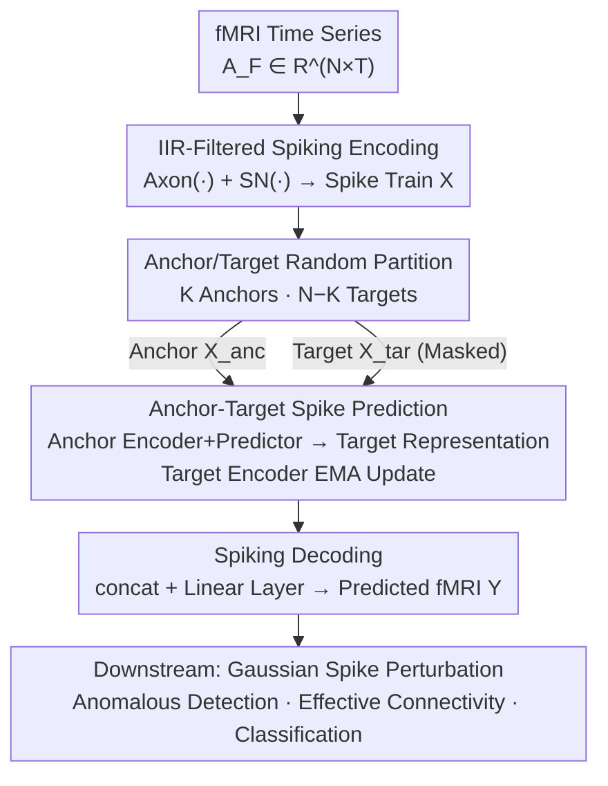

# Spike-based Digital Brain: A Novel Fundamental Model for Brain Activity Analysis

**Conference**: ICLR 2026  
**OpenReview**: [https://openreview.net/forum?id=Mkjcuo6PN4](https://openreview.net/forum?id=Mkjcuo6PN4)  
**Code**: https://github.com/UAIBC-Brain/Spike-DB  
**Area**: Medical Imaging / Spiking Neural Networks / fMRI Brain Activity Modeling  
**Keywords**: Digital Brain, Spiking Neural Networks, fMRI, Self-supervised Prediction, Effective Connectivity

## TL;DR
This paper proposes Spike-DB, which introduces the spiking computation paradigm into fMRI time-series modeling. By using spiking neurons simulated with IIR filters to encode BOLD signals into spike trains, it employs an "anchor region $\rightarrow$ target region" self-supervised prediction framework to learn temporal driving relationships between brain regions. It achieves high-precision brain activity prediction, disease classification, anomalous region identification, and effective connectivity inference on epilepsy and Alzheimer's (ADNI) datasets.

## Background & Motivation
**Background**: fMRI is currently the most widely used non-invasive whole-brain imaging technique, reflecting the spatiotemporal dynamics of neural activity through BOLD signals. Recently, brain activity modeling has shifted from early statistical methods (ICA, Dynamic Causal Modeling DCM) to deep learning, resulting in large-scale pre-trained "foundation models" such as BrainLM, BrainMass, and Brain-JEPA. These models learn general representations from massive neuroimaging data using masked autoencoding or joint-embedding predictions, leading to the development of whole-brain scale digital brain models like "virtual brains" or "digital twins."

**Limitations of Prior Work**: BOLD signals have a low signal-to-noise ratio and are susceptible to interference from physiological noise and scanning conditions, making it difficult to extract stable neural activity features. More crucially, existing digital brain models are almost entirely built on **statistical or continuous-valued neural networks**. While these can characterize macroscopic temporal patterns and functional connectivity, they **cannot reflect the discrete firing characteristics and biological constraints of real neural activity**, making it difficult to explain the underlying mechanisms of actual brain function.

**Key Challenge**: Biologically, brain activity consists of **discrete spiking discharges**, whereas mainstream modeling tools rely on continuous-valued tensor operations. This "mismatch in representation paradigms" means that even if a model predicts accurately, it cannot clarify how brain regions drive one another or where pathological abnormalities originate.

**Goal**: To construct a brain activity modeling framework that is closer to the biological nervous system, capable of high-precision brain activity prediction while revealing causal/driving relationships between brain regions, and supporting clinical downstream tasks such as disease classification, anomalous region localization, and effective connectivity inference.

**Key Insight**: The authors draw inspiration from Spiking Neural Networks (SNNs)—where spikes are event-driven, discrete, and low-redundancy, naturally fitting neural firing—and JEPA-style self-supervised approaches that "predict part of the signal from another." By applying this to spiking representation space, the model learns **temporal driving relationships** between brain regions rather than simple reconstruction.

**Core Idea**: Use spike trains instead of continuous values to represent fMRI, and utilize an "anchor region driving target region" spiking space prediction task to approximate real brain dynamics.

## Method

### Overall Architecture
Spike-DB is a non-generative framework that performs self-supervised learning in **spiking representation space**. An fMRI time series of a subject is denoted as $A_F \in \mathbb{R}^{N \times T}$ ($N$ regions, length $T$). The overall process consists of five steps: (1) Use IIR-filtered spiking neurons to encode $A_F$ into spike trains $X \in \mathbb{R}^{N \times T}$; (2) **Randomly sample $K$ regions as anchors and designate the remaining $N-K$ regions as targets**, which are fed into an anchor encoder and a target encoder, respectively; (3) The predictor uses anchor representations plus a learnable mask token (with positional embedding) for each target region as input to predict the spiking representation of the target regions; (4) The weights of the target encoder do not receive gradients but are updated via an Exponential Moving Average (EMA) of the anchor encoder to stabilize training; (5) A spiking decoder restores the predicted embeddings back to the original fMRI space. After training, prediction errors are used for anomalous region detection, the model itself is used for disease classification, and perturbations applied to the input allow for the inference of effective connectivity.

All three encoding/prediction modules use **Spike Transformer** as the backbone, operating in the spiking space to preserve dynamic information while suppressing redundancy and noise.

### Key Designs

**1. IIR-Filtered Spiking Neurons: Capturing BOLD Frequencies and Long-range Dependency**

**Design Motivation**: Traditional Leaky Integrate-and-Fire (LIF) neurons only focus on membrane potential dynamics, ignoring synaptic dynamics and internal signal filtering mechanisms. Consequently, they struggle to characterize high/low-frequency components and long-term dependencies across brain regions in BOLD signals. This work employs Infinite Impulse Response (IIR) filters to construct LIF neurons, utilizing recursive structures to capture fMRI temporal dynamics. The SNN is split into two operations: $\text{Axon}(\cdot)$, responsible for transmitting spikes via a second-order exponential IIR filter—$f_i[t] = \alpha_1 f_i[t{-}1] + \alpha_2 f_i[t{-}2] + \beta x_i[t{-}1]$, where $\alpha_1, \alpha_2, \beta$ are coefficients determined by time constants $\tau_m, \tau_s$; and $\text{SN}(\cdot)$, responsible for membrane potential updates and firing, defined by $v[t] = -V_{thre}r[t] + \sum_i \omega_i f_i[t]$, a reset filter $r[t]$, and the Heaviside threshold function $O[t] = \text{Hea}(v[t]-V_{thre})$. Stacked layers $X_l = \text{SN}_l(\text{Axon}_l(X_{l-1}))$ encode continuous BOLD into event-driven spike trains. The second-order filter provides the frequency selectivity and long-range memory missing in standard LIF.

**2. Anchor-Target Spiking Space Prediction: Learning Temporal Causality via Inter-regional Driving**

**Mechanism**: Simple reconstruction results in the model "copying" signals without understanding inter-regional driving. Spike-DB draws from the JEPA concept, defining the task as **using the representations of $K$ anchor regions to predict the representations of $N-K$ target regions**. Anchor spikes $X_{anc}$ pass through an anchor encoder $f_\theta$ to produce region-level representations $r_{anc} \in \mathbb{R}^{K \times D}$ (updated via gradients). Target spikes $X_{tar}$ pass through a target encoder $f_{\bar\theta}$ to get $r_{tar}^j$. Notably, targets are masked at the **encoder output** rather than the input. The predictor $z_\phi$ takes $r_{anc}$ and shared learnable mask tokens $\{m_j\}$ for each target region (with positional embeddings) to predict $\hat r_{tar}^j = z_\phi(r_{anc}, \{m_j\})$ independently for each of the $N-K$ target regions. The training loss is the Mean Squared Error (MSE) of the **firing rates** between predicted and real representations:

$$L_r = \frac{1}{N-K}\sum_{j=1}^{N-K}(\hat R_{tar}^j - R_{tar}^j)^2,\quad R_{tar}^j = \frac{1}{D}\sum_{d=1}^{D} r_{tar}^j$$

Predicting target regions in latent space rather than signal space forces the model to learn how anchors temporally drive targets—the basis for effective connectivity inference.

**3. EMA Target Encoder + Spiking Decoding: Stabilizing Training and Mapping to fMRI Space**

**Design Motivation**: If both ends of the anchor-target self-supervision are updated by gradients, the model may collapse or become unstable. Spike-DB ensures the **target encoder $\bar\theta$ is not updated by gradients, but by the Exponential Moving Average (EMA) of the anchor encoder $\theta$**, smoothing the training process and achieving stable representations. A spiking decoder is added to return to a clinically usable form: predicted target representations $\hat r_{tar}^1, \dots, \hat r_{tar}^{N-K}$ are concatenated into $\hat r_{tar} \in \mathbb{R}^{(N-K) \times D}$, and a fully connected layer performs regression $Y = \text{Linear}(\hat r_{tar})$ to restore the predicted fMRI time series $Y \in \mathbb{R}^{(N-K) \times T}$.

**4. Gaussian Spike Perturbation for Effective Connectivity: "Virtual Stimulation Experiments"**

**Function**: To quantify the direction and polarity of effective connectivity (EC) after training, a perturbation is applied to a single input region to observe the change in prediction: $EC_i = \delta(X + \Delta \cdot e_i) - \delta(X)$, where $e_i$ is a unit vector. Since Spike-DB operates in **spiking space**, the authors designed a Gaussian-based perturbation: injecting a local, smooth Gaussian spike $\Delta = k \cdot \exp\!\big(-\tfrac{(T-t_0)^2}{2\alpha^2}\big)$ (with amplitude $k=1$, center $t_0=T/2$, width $\alpha=20$) into the spike train to simulate transient stimulation effects.

### Loss & Training
The pre-training objective is the MSE loss $L_r$ on firing rates. A Spike-DB model is pre-trained independently for each dataset ($\delta_{FLE}, \delta_{TLE}, \delta_{SMC}, \delta_{EMCI}, \delta_{NC\text{-}E}, \delta_{NC\text{-}A}$). Data is split 80% for training and 20% for testing by **subject**. The number of anchors $K$ is set to 89 by default.

## Key Experimental Results

**Data**: In-house epilepsy dataset (FLE, TLE, and control NC-E, $T=240$) and public ADNI dataset (SMC, EMCI, and control NC-A, $T=197$). fMRI prediction is evaluated using RSE (lower is better) and $R^2$ (higher is better); classification uses ACC and F1.

### Main Results

fMRI Time-Series Prediction (Mean of 5 runs), compared against BrainLM / BrainMass / Brain-JEPA / BrainSymphony:

| Data | Metric | Brain-JEPA | BrainSymphony | Spike-DB |
|------|------|------------|---------------|----------|
| FLE | $R^{2}$↑ / RSE↓ | 0.952 / 0.219 | 0.963 / 0.192 | **0.972 / 0.168** |
| TLE | $R^{2}$↑ / RSE↓ | 0.964 / 0.217 | 0.969 / 0.202 | **0.979 / 0.184** |
| NC-E | $R^{2}$↑ / RSE↓ | 0.967 / 0.182 | 0.974 / 0.162 | **0.983 / 0.131** |
| EMCI | $R^{2}$↑ / RSE↓ | 0.938 / 0.249 | 0.947 / 0.231 | **0.954 / 0.213** |
| SMC | $R^{2}$↑ / RSE↓ | 0.943 / 0.240 | 0.948 / 0.228 | **0.957 / 0.207** |
| NC-A | $R^{2}$↑ / RSE↓ | 0.965 / 0.188 | 0.975 / 0.160 | **0.981 / 0.137** |

Spike-DB achieves SOTA across all categories. Compared to the strongest baseline BrainSymphony, $R^2$ increases by approx. 1%/0.8%, and RSE decreases significantly by 14.9%/11.4%.

Disease Classification (Four binary tasks, ACC%/F1%):

| Task | Starformer | BrainSymphony | Spike-DB |
|------|-----------|---------------|----------|
| FLE vs NC-E | 89.81 / 88.89 | 88.89 / 87.76 | **91.67 / 91.90** |
| TLE vs NC-E | 89.11 / 86.75 | 88.12 / 85.37 | **90.10 / 88.09** |
| EMCI vs NC-A | 86.36 / 83.20 | 85.88 / 86.21 | **87.88 / 85.19** |
| SMC vs NC-A | 85.92 / 85.71 | 84.51 / 83.58 | **86.95 / 87.32** |

### Ablation Study

| Configuration | Observation | Explanation |
|------|------|------|
| Full model | Optimal | Complete Spike-DB |
| w/o Spiking Mechanism | Significant drop in $R^2$ and RSE | Removing spiking neurons turns the model into a standard Transformer, proving spikes are vital for temporal dependency |
| Decreasing Anchors $K$ | Performance degrades as $K$ decreases | Drastic drop when $K < 45$ |

### Key Findings
- **Spiking mechanisms are the core source of gain**: Removing spike encoding leads to a significant decline in prediction accuracy, suggesting discrete spiking representations better capture fMRI temporal dependencies and dynamic firing patterns than continuous values.
- **Optimal threshold for anchor quantity**: Too few anchors ($K < 45$) weaken the model's ability to capture regional interactions. Setting $K$ to 89 (leaving only 1 target region) yielded the best results, indicating that a highly constrained prediction task facilitates the learning of driving relationships.
- **Anomalous regions match clinical evidence**: Using NC models to predict patient data revealed significant anomalies in regions such as the HIP, THA, and PCUN, consistent with literature on epilepsy and ADNI.
- **Imbalance in Excitation/Inhibition Connectivity**: Patient groups showed significantly fewer ECs than controls, with inhibitory connections overtaking excitatory ones, supporting neuroscientific theories regarding E-I balance and disease progression.

## Highlights & Insights
- **Introducing Spiking Computation to fMRI Digital Brains**: Replacing continuous representations with IIR-filtered spiking neurons maintains biological realism while capturing frequency selectivity.
- **Repurposing Prediction Models as Causal Probes**: Measuring EC via Gaussian perturbations $\delta(X+\Delta e_i) - \delta(X)$ turns a self-supervised predictor into a tool for causal analysis, effectively conducting "virtual stimulation experiments."
- **Steady Self-Supervision via Latent Prediction and EMA**: Predicting in spiking latent space instead of signal space forces the model to learn inter-regional driving rather than simple signal copying.

## Limitations & Future Work
- **Validation limited to fMRI**: The method is tied to BOLD signals; its generalizability to higher temporal resolution modalities like EEG/MEG is unverified.
- **Dependence on Parcellations**: Experiments used approximately 90 regions. Scalability and computational costs for finer-grained atlases remain unexplored.
- **Relative Effective Connectivity**: EC is defined by prediction differences under specific hyperparameter settings ($k, t_0, \alpha$) and lacks a gold standard (e.g., invasive electrophysiology) for validation.

## Related Work & Insights
- **vs Brain-JEPA / BrainLM / BrainMass**: These utilize masked/joint-embedding self-supervision but model in **continuous** space. Spike-DB moves prediction to **spiking space**, adding biological constraints that improve both accuracy and classification.
- **vs BrainSymphony / Starformer**: While these are strong in specific tasks, Spike-DB serves as a unified digital brain covering prediction, classification, anomaly localization, and EC inference.
- **vs Traditional LIF-SNN**: Standard LIF misses synaptic dynamics. This paper's second-order IIR reconstruction of the Axon/SN steps allows spiking encoding to handle the slow temporal dependencies of BOLD signals.

## Rating
- Novelty: ⭐⭐⭐⭐⭐ Systematically introduces spiking computation and uses perturbations for causal probing.
- Experimental Thoroughness: ⭐⭐⭐⭐ Covers multiple tasks, though constrained by dataset size.
- Writing Quality: ⭐⭐⭐⭐ Clear framework and complete equations.
- Value: ⭐⭐⭐⭐⭐ High potential for clinical neuroscience research in epilepsy and AD.

<!-- RELATED:START -->

## Related Papers

- [\[ICLR 2026\] A Brain Graph Foundation Model: Pre-Training and Prompt-Tuning across Broad Atlases and Disorders](a_brain_graph_foundation_model_pre-training_and_prompt-tuning_across_broad_atlas.md)
- [\[ICLR 2026\] Brain-IT: Image Reconstruction from fMRI via Brain-Interaction Transformer](brain-it_image_reconstruction_from_fmri_via_brain-interaction_transformer.md)
- [\[ICLR 2026\] The Mind's Transformer: Computational Neuroanatomy of LLM-Brain Alignment](the_minds_transformer_computational_neuroanatomy_of_llm-brain_alignment.md)
- [\[ICLR 2026\] Unified Brain Surface and Volume Registration](unified_brain_surface_and_volume_registration.md)
- [\[ICLR 2026\] Neuro-Symbolic Decoding of Neural Activity](neuro-symbolic_decoding_of_neural_activity.md)

<!-- RELATED:END -->
