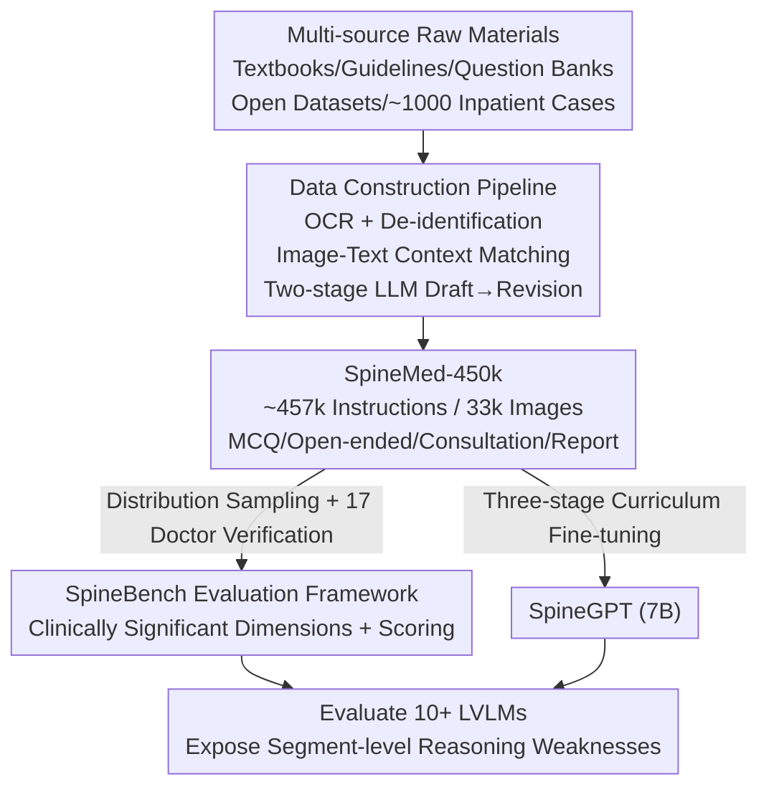

# SpineBench: A Clinically Significant, Segment-Aware Spinal Diagnosis and Treatment Evaluation Benchmark and SpineMed-450k Corpus

**Conference**: ICLR 2026  
**OpenReview**: [https://openreview.net/forum?id=sHeQG5aav8](https://openreview.net/forum?id=sHeQG5aav8)  
**Code**: None  
**Area**: Medical Imaging / Multimodal VLM / Evaluation Benchmark  
**Keywords**: Spinal Diagnosis and Treatment, Segment-Aware Reasoning, Clinical Instruction Data, Evaluation Benchmark, Curriculum Learning

## TL;DR
This paper constructs **SpineMed-450k**, a traceable multimodal spinal diagnosis and treatment instruction corpus with 450,000 entries, and an accompanying benchmark **SpineBench** through a clinician-in-the-loop approach. It reveals systematic weaknesses in current Large Vision-Language Models (LVLMs) regarding fine-grained reasoning for "locating specific vertebral segments." Using a fine-tuned 7B model, **SpineGPT**, the authors demonstrate that specialized instruction data enables small models to achieve clinical performance comparable to Gemini-2.5-Pro.

## Background & Motivation

**Background**: Spinal diseases (degeneration, deformity, trauma, inflammation) affect 619 million people worldwide and are a leading cause of disability. Spinal clinical decision-making is unique because **a single modality cannot provide a definitive diagnosis**—doctors must integrate findings from X-rays, CT, and MRI to locate **specific vertebral segments** (e.g., L4/L5), grade severity, and plan surgery. While many general and medical LVLMs have emerged, they lack targeted capabilities for spinal workflows that heavily rely on anatomical localization.

**Limitations of Prior Work**: Progress is bottlenecked by both data and evaluation. On one hand, there is a lack of **traceable, clinically solid** instruction data—existing medical data consists mostly of generalized corpora lacking the high-quality supervision required for spinal specialization. On the other hand, there is a lack of **segment-aware standardized evaluation**—existing spinal datasets (VerSe, RSNA LumbarDISC, Spark, etc.) are almost entirely unimodal and oriented toward low-level perception tasks like segmentation, detection, or classification, outputting voxel masks or category labels that cannot characterize the holistic context needed for complex clinical decisions.

**Key Challenge**: Spinal diagnosis and treatment is essentially a "Collaborator AI" task—requiring cross-modal synthesis, segment-level reasoning, and coverage of the complete workflow from diagnosis to treatment and prognosis. However, existing datasets can only train "Tool AI" (for single-point perception). A cognitive gap exists between these two. Furthermore, previous works rarely involved clinicians in the **entire** pipeline construction, limiting data utility.

**Goal**: Build the first multimodal instruction corpus for full-process spinal clinical reasoning, paired with an evaluation benchmark capable of exposing real-world clinical error modes, and demonstrate the value of this data through a deployed model.

**Key Insight**: Embed spinal surgeons into every stage of data construction (defining inclusion criteria, selecting images with high decision value, specifying failure modes that must be exposed). Use a "two-stage LLM generation (draft → revision) + image-text context binding" approach to ensure high-quality, traceable data, and then sample SpineBench from this corpus with manual verification by 17 doctors.

## Method

### Overall Architecture

The paper does not propose a new model architecture but rather a **data-evaluation-model trinity ecosystem**. The overall workflow is a pipeline from "multi-source raw materials" to "usable spinal AI": first, textbooks, clinical guidelines, expert consensus, question banks, open-source spinal datasets (Spark, VerSe), Europe PMC case reports, and approximately 1,000 de-identified real inpatient cases are aggregated. After preprocessing (OCR parsing, de-identification, deduplication, image-text context matching), a two-stage LLM process distills four types of supervised data: multiple-choice questions, open-ended questions, multi-turn consultations, and diagnostic reports, forming **SpineMed-450k** (~457,000 instructions, 33,000 images). This corpus is then used in two ways: one part is sampled by distribution and verified by 17 orthopedic surgeons to form the **SpineBench** framework (487 multiple-choice + 87 report generation tasks); the other part serves as training data to fine-tune the **SpineGPT** model through three-stage curriculum learning.

### Key Designs

**1. Clinician-in-the-loop Traceable Data Pipeline: Distilling "Textbooks and Cases" into High-Quality Spinal Instructions**

This design addresses the lack of traceable and clinically solid instruction data. The pipeline consists of several stages: **Data collection** tracks the source for every derived item (Dataset ID/DOI, case identifier), prioritizing upstream data with permissive licenses. Clinicians define inclusion criteria and select the most decision-relevant images (e.g., target MRI sequences, key CT segments). **Structured information extraction** uses PaddleOCR to parse PDFs and images into Markdown while preserving tables and captions. A self-developed **Picture Context Matching (PCM)** algorithm anchors each image to its surrounding paragraphs via regex caption matching, followed by a semantic consistency check using GPT-5-mini to filter mismatched samples. **De-identification and cleaning** removes all PII in compliance with HIPAA, discards irrelevant images (post-op photos, non-diagnostic tables), and uses GPT-5-mini for fine-grained classification into 7 orthopedic and 14 spinal sub-fields to ensure purity. **Data generation** is source-dependent: external knowledge (textbooks) uses Gemini-2.5-pro to generate bilingual (CN/EN) and bimodal (text/image-text) MCQ/open questions; open-source 3D datasets generate simulated multi-turn consultations; and real clinical records utilize **locally deployed** GLM-4.5V (for data security) to generate MCQs, consultations, and full diagnostic reports.

The key is the **two-stage LLM generation (draft → revision)**: a draft is produced and then revised according to doctor-specified criteria (with explicit prompts and logs). Clinicians continuously review and refine prompt strategies to align outputs with reporting standards. Diagnostic reports are organized across six dimensions—structured findings, AI-assisted diagnosis, treatment suggestions (patient-friendly vs. evidence-based), risk/prognosis, post-op management, and diagnostic basis—simulating a real clinical workflow.

**2. SpineBench: Quantifying "Segment-level Reasoning Accuracy" via Clinically Significant Multi-dimensional Scoring**

Data alone is insufficient; evaluation must expose real clinical errors. SpineBench samples 500 MCQs and 100 medical reports from SpineMed-450k **according to original distributions**. These are independently verified by **17 certified orthopedic surgeons in three groups** to correct errors and remove unsuitable items, resulting in 487 high-quality MCQs and 87 report generation prompts.

Evaluation spans ten clinical dimensions (imaging report, diagnosis, patient guidance, evidence-based treatment, technical feasibility, risk prognosis, coverage, relevance, granularity, interpretability). A weighted total score is calculated from text MCQ, image-text MCQ, and report generation based on sample size:

$$Score_{total} = \sum_{k=1}^{3} w_k \cdot P_k, \qquad w_k = \frac{N_k}{\sum_{i=1}^{3} N_i}$$

The report score $P_3$ is normalized (0–100) across five sections, with multiple dimensions (1–5 points each) per section:

$$P_3 = 20 \times \sum_{i=1}^{5}\left(\frac{1}{n_i}\sum_{j=1}^{n_i} s_{ij}\right)$$

where $s_{ij}$ is the score of the $j$-th dimension in the $i$-th section, and $n_i$ is the number of dimensions in that section. This unified scoring allows for direct comparison between basic diagnostic reasoning and complex report generation. To validate the reliability of automated LLM scoring, **human-machine consistency analysis** was performed. Comparing blind human reviews with LLM scores yielded Pearson correlation coefficients ranging from 0.382 to 0.949, with most dimensions exceeding 0.7, confirming the automated score as a reliable proxy for expert judgment.

**3. SpineGPT: Three-stage Curriculum Learning to Match Massive Models with a 7B Model**

To validate SpineMed-450k, the authors fine-tuned Qwen2.5-VL-7B-Instruct using the ms-swift framework on 8 A100 GPUs. **Stage-1 (General & Orthopedic Foundations)** uses public medical text (medical-o1-reasoning, Medical-R1-Distill, MedThoughts-8K) and 150k PubMedVision multimodal instructions, followed by the non-spinal orthopedic subset of SpineMed-450k. The authors found that non-spinal data significantly improves SpineBench performance, suggesting that broader knowledge benefits specialized tasks. **Stage-2 (Spinal Specialization)** focuses on all spinal data, constructing long reasoning chains from MCQs and open questions. **Stage-3 (Report & Dialogue Enhancement)** further trains dialogue and generation using multi-turn conversations and long-chain reasoning. To handle up to 49k tokens, DeepSpeed was switched from Zero2 to Zero3 offloading. This curriculum moves from easy to hard, general to specialized, and short to long, pushing the model toward practical spinal clinical utility.

### Loss & Training

All three stages use standard instruction fine-tuning (SFT) for 1 epoch. Stage-1/2: learning rate $1\times10^{-5}$, max length 16,384, DeepSpeed Zero2. Stage-3: learning rate $1\times10^{-6}$, max length 49,152, DeepSpeed Zero3 offloading. Global batch sizes were optimized per stage for maximum GPU utilization.

## Key Experimental Results

### Main Results

The authors evaluated 10+ contemporary LVLMs (closed vs. open, general vs. medical). Core conclusion: current models are generally weak in segment-level fine-grained diagnosis and open-ended clinical reasoning, while SpineGPT (7B) achieves a breakthrough among open-source models.

| Model | Size | Closed QA Avg | Report Gen Sum | Total Avg |
|------|------|------|------|------|
| Gemini-2.5-Pro | >100B | 88.50 | 93.32 | **89.23** |
| GPT5-mini | - | 85.83 | 93.56 | 87.01 |
| GPT5 | - | 84.46 | 91.60 | 85.54 |
| GLM-4.5V (Best Open) | 21B | 83.98 | 79.24 | 83.26 |
| Qwen2.5-VL-72B | 72B | 82.75 | 63.80 | 79.88 |
| Medgemma-27B (Medical) | 27B | 82.34 | 70.16 | 76.66 |
| Qwen2.5VL-7B (Base) | 7B | 74.95 | 54.52 | 64.74 |
| **SpineGPT (Ours)** | **7B** | **87.89** | 87.24 | **87.44** |

Key findings: **(1) Domain pre-training alone is insufficient**—Medgemma-27B scored only 76.66, over 10 points lower than SpineGPT despite being nearly 4x larger. **(2) Cross-modal alignment is weak**—nearly all models dropped points on image-text tasks; GPT5 fell from 87.41% (text) to 79.97% (image), a 7.44% gap. **(3) Small model outperformance**—SpineGPT surpassed all open-source models by 4.18+ points in total average. Its closed QA (87.89%) outperformed Claude4 (79.67%) and GPT-4o (84.74%), and its text-only QA (89.46%) even surpassed GPT5 (87.41%). With <7% the parameters of Gemini-2.5-Pro, it reached ~98% of its performance and can be deployed locally behind hospital firewalls.

### Ablation Study

Ablation focused on "which training data is decisive" (Closed QA, units %):

| Training Configuration | Text | Image | Average | Note |
|------|------|------|------|------|
| Qwen2.5-VL-7B (Baseline) | 75.51 | 74.09 | 74.95 | No fine-tuning |
| General Medical Only | - | - | 65.31 | **Dropped** ~10 pts vs. Baseline |
| + Non-spinal Ortho Subset | - | - | 82.14 | Domain alignment added +7 pts |
| Spinal Subset Only | - | - | 87.07 | ~99% of full model performance |
| General + Non-spinal | 83.67 | 77.20 | 81.11 | Limited without spinal data |
| Full Curriculum (Complete) | 89.46 | 84.46 | **87.89** | Peak performance |

### Key Findings
- **Spinal specialized data is the decisive factor**: Using the spinal subset alone achieves ~99% of full model performance (87.07 vs. 87.89), whereas using large-scale general medical data alone caused a drop to 65.31, proving general medical corpora are insufficient or even harmful for spinal tasks.
- **Domain alignment matters more than scale**: Adding the non-spinal ortho subset jumped the score from 74.95 to 82.14, validating the value of "proximal-domain, high-density specialized data."
- **Cross-modal alignment is a universal bottleneck**: Even the strongest closed-source models dropped ~7% on image-text tasks, suggesting the bottleneck remains in medical image understanding and vision-language alignment.

## Highlights & Insights
- **"Clinician-in-the-loop" throughout, not just for final audit**: Doctors defined criteria, selected images, and specified failure modes. Combined with two-stage "draft → revision" and full traceability, "trustworthiness" was engineered into the pipeline itself.
- **PCM re-binds fragmented text and images**: OCR typically breaks associations between figures, captions, and text. Using PCM regex anchoring and LLM consistency filtering to re-contextualize images is a reusable engineering feat for medical corpora.
- **Small Model + Specialized Data ≈ Large Model**: The 7B SpineGPT matches ~98% of Gemini-2.5-Pro's effects. Local deployment capability is a major selling point for privacy-sensitive medical applications.
- **Level-aware evaluation as the primary axis**: Treating "locating specific vertebrae like L4/L5" as a first-class citizen aligns with real-world clinical failure modes better than generic diagnostic accuracy.

## Limitations & Future Work
- **Model scale and training paradigm**: Only 7B models and SFT were verified; the authors plan to scale up and introduce Reinforcement Learning (RL).
- **Report evaluation relies on LLM scoring**: Despite human-machine consistency, some dimensions (e.g., imaging_report, Pearson 0.382) show lower correlation, indicating instability in automated scoring.
- **Data bias towards textbooks**: 377k of 456k entries are from textbooks; only ~9,700 are from real cases. Long-tail clinical distributions might not be fully covered.
- **Comparison with latest models**: Continuous benchmarking against evolving models like GPT-4/Gemini is required to maintain a clear performance metric.

## Related Work & Insights
- **vs. VerSe / RSNA LumbarDISC / Spark**: These are unimodal, low-level perception datasets (segmentation/classification). Ours is the first multimodal (X-ray+CT+MRI+Text) corpus for full-process clinical reasoning (diagnosis → treatment → prognosis), moving from "Tool AI" to "Collaborator AI."
- **vs. General/Medical LVLMs (GPT5, Gemini, Medgemma)**: These are strong in general medicine but weak in spinal segment-level reasoning. Our specialized small model outperforms them, proving the marginal value of domain data exceeds parameter scaling.
- **vs. Medical Instruction Datasets (PubMedVision)**: While they provide general supervision, this paper proves they can be harmful when used alone for spinal tasks; domain-aligned specialized data is essential.

## Rating
- Novelty: ⭐⭐⭐⭐ First segment-aware, full-process multimodal spinal corpus/benchmark. Solid engineering, though methodologically incremental.
- Experimental Thoroughness: ⭐⭐⭐⭐ Evaluated 10+ LVLMs, curriculum ablation, and human-machine consistency, but lacks exhaustive direct comparison with all latest closed-source iterations.
- Writing Quality: ⭐⭐⭐⭐ Clear motivation and complete charts; some low-correlation evaluation dimensions were not fully discussed.
- Value: ⭐⭐⭐⭐⭐ Fills a data/evaluation void in spinal AI. The 7B local model is highly practical for clinical deployment.

<!-- RELATED:START -->

## Related Papers

- [\[ICLR 2026\] You Point, I Learn: Online Adaptation of Interactive Segmentation Models for Handling Distribution Shifts in Medical Imaging](you_point_i_learn_online_adaptation_of_interactive_segmentation_models_for_handl.md)
- [\[ICLR 2026\] Boosting Medical Visual Understanding From Multi-Granular Language Learning](boosting_medical_visual_understanding_from_multi-granular_language_learning.md)
- [\[ICLR 2026\] Rethinking Radiology Report Generation: From Narrative Flow to Topic-Guided Findings](rethinking_radiology_report_generation_from_narrative_flow_to_topic-guided_findi.md)
- [\[ICLR 2026\] MedGMAE: Gaussian Masked Autoencoders for Medical Volumetric Representation Learning](medgmae_gaussian_masked_autoencoders_for_medical_volumetric_representation_learn.md)
- [\[ICLR 2026\] Towards Text–Mask Consistency in Medical Image Segmentation](towards_text-mask_consistency_in_medical_image_segmentation.md)

<!-- RELATED:END -->
