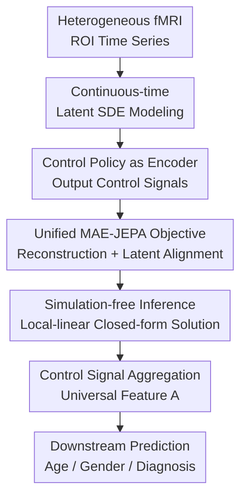

# Stochastic Optimal Control for Continuous-Time fMRI Representation Learning

**Conference**: ICLR2026  
**OpenReview**: [https://openreview.net/forum?id=N51nP3TBwR](https://openreview.net/forum?id=N51nP3TBwR)  
**Code**: Provided in supplementary materials; public repository TBD  
**Area**: Medical Imaging / fMRI Representation Learning  
**Keywords**: fMRI Representation Learning, Continuous-time Modeling, Stochastic Optimal Control, Self-supervised Learning, Brain Dynamics  

## TL;DR
BDO treats heterogeneous fMRI time series as continuous-time latent stochastic dynamical systems, utilizing stochastic optimal control to unify MAE reconstruction and JEPA latent variable prediction. This approach learns brain dynamic representations that are more robust to TR discrepancies and more computationally efficient across multiple datasets.

## Background & Motivation
**Background**: fMRI records brain activity through BOLD signals over time and is commonly used for downstream tasks such as age, gender, and cognitive trait prediction, as well as psychiatric diagnosis. Due to the high cost of labeled data and significant cross-cohort variability, recent trends involve pre-training on large-scale unlabeled fMRI data followed by transferring these representations to specific clinical or neuroscientific tasks. Existing methods generally fall into two categories: those like BrainLM and Brain-JEPA that segment ROI time series into fixed spatio-temporal patches, and those like BrainMass that compress entire time series into static functional connectivity graphs.

**Limitations of Prior Work**: Both approaches sacrifice the critical temporal structure of fMRI during pre-processing. Patch-based methods require fixed lengths and sampling intervals; when encountering inconsistent TRs across datasets, they must resort to downsampling, upsampling, or adjusting patch sizes. Graph-based methods avoid sequence length issues but average signals into connectivity, losing short-term dynamics. For multi-center fMRI, this is a practical issue: the UK Biobank has a TR of approximately 0.735s, while TRs in ABIDE sites vary between 1.5 and 3.0s. Forcing such data into a discrete-time grid results in tokens with inconsistent meanings on a physical time scale.

**Key Challenge**: Real fMRI signals are continuous-time, noisy, and irregularly sampled brain dynamics. However, mainstream self-supervised models discretize them into regular patches or static graphs for engineering convenience. The more a model depends on a fixed grid, the harder it is to preserve fine-grained temporal variations while maintaining cross-dataset transferability.

**Goal**: The authors aim to construct a self-supervised framework capable of directly handling continuous-time fMRI. It must place scans with different TRs and lengths on the same physical timeline, extract compact representations from high-dimensional, noisy ROI sequences, and maintain computational costs low enough for pre-training on datasets with 40,000+ samples, unlike traditional SDE/ODE solvers.

**Key Insight**: The paper observes that continuous-time latent dynamics naturally represent irregularly sampled fMRI, and Stochastic Optimal Control (SOC) provides a way to formulate "correcting latent trajectories based on observations" as an optimization problem. In other words, the encoder is not merely a black-box feature extractor but is interpreted as a control policy: its control signals push prior stochastic dynamics toward posterior dynamics that explain the observed fMRI.

**Core Idea**: "Optimal control signals" are used as universal fMRI representations, learned within a continuous-time latent SDE. These signals are constrained by both masked reconstruction (MAE) and stable latent variable targets (JEPA), ensuring they explain masked brain signals without being overfit to raw BOLD noise.

## Method

### Overall Architecture
The input to BDO consists of ROI-level fMRI time series $Y=\{y_{t_1},\cdots,y_{t_k}\}$ and real timestamps $T=\{t_1,\cdots,t_k\}$. The output is not a single latent point but a sequence of control signals $\{\alpha_t\}$ generated by a control policy. These signals drive the continuous-time latent states $X_t$, which are then mean-pooled to obtain universal features $A$ for downstream tasks like age regression and psychiatric diagnosis.

During training, the model randomly masks approximately 75% of the time points, using unmasked parts as context and masked parts as targets. The online encoder produces control signals based on context to drive the latent SDE and predict states at target timestamps. A decoder reconstructs the original fMRI from the latent variables. Simultaneously, an EMA-updated target encoder generates stable latent goals for the real target segments, forcing the online control signals to align with these goals. To avoid numerical SDE solvers, the authors approximate the controlled SDE as a piecewise local-linear system, allowing for closed-form mean and covariance calculations and parallel scan computation for long sequences.

### Key Designs
**1. Continuous-time Latent SDE Modeling: Aligning different TRs on a real timeline**

BDO avoids modeling high-dimensional BOLD signals directly in observation space. Instead, it assumes low-dimensional latent states $X_t \in \mathbb{R}^d$ evolving via Itô diffusion. The prior process is $dX_t=f(t,X_t)dt+\sigma(t)dW_t$. In simplified settings, the prior is reduced to a pure stochastic process $dX_t=\sigma(t)dW_t$, acknowledging that real fMRI dynamics are difficult to specify a priori. The data-explaining capability resides in the control term of the posterior process: $dX_t^\star=[f(t,X_t^\star)+\sigma(t)\alpha^\star(t,X_t^\star;Y)]dt+\sigma(t)dW_t$. This ensures that timestamps represent physical time, allowing data with TR=0.735s and TR=2s to coexist in a unified framework.

**2. Control Policy as Encoder: Defining brain dynamics via "Prior Correction"**

Representation learning is reformulated as a stochastic optimal control problem. The parameterized control policy $\alpha_\theta(t,X_t^\theta;Y)$ is implemented by a Transformer encoder. The optimization objective includes control energy $\int_0^T \frac{1}{2}\|\alpha_\theta(t,X_t^\theta;Y)\|^2dt$ and observation likelihood $-\sum_{t\in T}\log g_\psi(y_t|X_t^\theta)$. This objective is equivalent to the Evidence Lower Bound (ELBO) in variational inference. The optimal control policy itself serves as the latent encoder, and control signals over time are aggregated into universal features $A=f(\{\alpha_t^\star\}_{t\in T})$, capturing systematic adjustments needed to align latent dynamics with observed fMRI.

**3. Unified MAE-JEPA Self-supervised Objective: Reconstructing signals while avoiding BOLD noise**

Pure MAE reconstruction of raw BOLD signals $Y_{tar}$ can lead to overfitting on noise. BDO incorporates a JEPA-style latent prediction: the online encoder predicts control latents for target segments based on context, while an EMA target encoder provides stable target control signals $\bar{\alpha}_t$. The final objective includes a reconstruction term $\|y_t-D_\psi(\tilde{\alpha}_t)\|^2$ and a latent alignment term $\tau\|\tilde{\alpha}_t-\bar{\alpha}_t\|^2$, balancing observable structure with stable self-distillation.

**4. Simulation-free Inference: Replacing expensive SDE solvers with local-linear closed-form solutions**

To avoid the bottleneck of numerical integration, BDO approximates the controlled SDE as a local-linear system: $dX_t^\theta=[-D_{t_i}X_t^\theta+\alpha_{t_i}^\theta(Y)]dt+dW_t$. In this form, the marginal distribution at any observation point remains Gaussian, allowing for closed-form mean $\mu_t$ and covariance $\Sigma_t$ calculations. Utilizing $D_{t_i}=V\Lambda_{t_i}V^\top$ and parallel scan, the complexity is reduced from $O(k)$ serial steps to $O(\log k)$ parallel time, making SOC training practical for large-scale fMRI SSL.

### A Complete Example
Suppose a subject's resting-state fMRI is preprocessed into a $160\times450$ ROI time series with real timestamps. During training, BDO masks 75% of the points. The online encoder takes the ~40 context points and their timestamps to output control signals. Through the closed-form inference of the local-linear SDE, it estimates the latent state distribution for masked points. The decoder reconstructs the masked signals, while the EMA target encoder provides stable targets from the real masked segments. After training, the feature $A=\frac{1}{|T|}\sum_{t\in T}\alpha_t$ is extracted for downstream use. This allows models to handle datasets with different TRs naturally without padding or resampling.

### Loss & Training
The BDO training objective is:

$$
\hat{L}_{\theta,\psi}=\mathbb{E}_{X^\theta}\left[\int_0^T \sigma_q^2\|\alpha_t^\theta\|^2dt-\sum_{t\in T_{tar}}\mathbb{E}_{\tilde{\alpha}_t^\theta}\left(\|y_t-D_\psi(\tilde{\alpha}_t^\theta)\|^2+\tau\|\tilde{\alpha}_t^\theta-\alpha_t^{\bar{\theta}}\|^2\right)\right].
$$

Where $\tau=\frac{(1-\lambda)\sigma_\zeta^2}{\sigma_q^2}$ controls JEPA regularization. Pre-training uses 41,072 subjects from UKB, with an 80/20 train/internal-eval split. Temporal masking rate $\gamma=0.75$. Optimization uses Adam with a 128 batch size over 200 epochs, employing a cosine decay learning rate from 0.0001 to 0.001 after a 10-epoch warm-up. Three BDO sizes (5M, 21M, 86M) were tested with latent dimensions of 192, 384, and 768.

## Key Experimental Results

### Main Results
BDO is evaluated on UKB held-out, HCP-A, ABIDE, ADHD200, and HCP-EP. Its primary advantage lies in stable transfer across age regression, gender classification, and psychiatric diagnosis, particularly showing robustness to TR/length differences.

| Dataset / Task | Protocol | BDO (Ours) | Strongest Baseline | Conclusion |
|----------------|----------|-----------|--------------------|------------|
| UKB Age | FT | MSE 0.481 / $\rho$ 0.722 | BrainNetTF: MSE 0.561 / $\rho$ 0.673 | Significantly outperforms task-specific and SSL models |
| UKB Gender | FT | ACC 92.59 / F1 92.57 | BrainNetTF: ACC 91.19 / F1 91.17 | Highest results on internal classification |
| HCP-A Age | FT | MSE 0.273 / $\rho$ 0.851 | BrainLM: MSE 0.340 / $\rho$ 0.818 | Strongest cross-dataset age transfer |
| HCP-A Gender | FT | ACC 79.40 / F1 78.98 | BrainLM: ACC 72.78 / F1 72.36 | Significant improvement in external gender classification |
| ABIDE Diagnosis | FT | ACC 69.32 / F1 68.32 | BrainMass: ACC 67.27 / F1 66.66 | Outperforms fMRI SSL baselines in Autism classification |
| ADHD200 Diagnosis| FT | ACC 64.16 / F1 64.27 | BrainMass: ACC 63.91 / F1 62.55 | Small but stable lead in ADHD classification |
| HCP-EP Diagnosis| FT | ACC 82.86 / F1 82.87 | BrainMass: ACC 76.19 / F1 76.25 | Largest gain in early psychosis classification |

### Ablation Study
| Configuration | Key Metrics | Note |
|---------------|-------------|------|
| BDO Standard Scale | HCP-A Age $\rho$ 0.768 / Gender ACC 72.00 | Uses real TR and continuous-time inference |
| Compressed TR | HCP-A Age $\rho$ 0.678 / Gender ACC 67.59 | Performance drops when TR is artificially compressed |
| Dilated TR | HCP-A Age $\rho$ 0.660 / Gender ACC 67.82 | Performance drops when TR is artificially elongated |
| No masking ($\gamma=0$) | Age $\rho$ 0.445 | SSL representation fails without the MAE task |
| Optimal masking ($\gamma=0.75$) | Age $\rho$ 0.738 | High masking rate forces learning of temporal structures |
| JEPA-only | Age $\rho$ 0.521 | Latent prediction alone is insufficient for strong representations |
| MAE-only ($\tau=0$) | Age $\rho$ 0.717 | Reconstruction is the core, but still inferior to unified goal |
| MAE+JEPA ($\tau=0.03$) | Age $\rho$ 0.738 | JEPA regularization yields gains for MAE representations |

### Key Findings
- BDO's external generalization advantage is most prominent in cross-dataset scenarios where TR and sequence lengths differ.
- MAE is the core training signal; high masking rates ($\gamma=0.75$) are essential for learning transferable temporal dependencies.
- JEPA serves effectively as a regularizer, reducing noise overfitting while not being sufficient as a standalone task.
- Computational efficiency is outstanding: 86M BDO pre-trained in 15 GPU hours compared to BrainLM's 496 hours.
- Scalability holds true as performance generally improves with model size and pre-training data volume.

## Highlights & Insights
- Interpreting the encoder as a control strategy is insightful, providing a semantic meaning to $\alpha_t$: the data-driven correction required to explain brain dynamics.
- Continuous-time modeling addresses a real pain point in fMRI SSL; TR heterogeneity is not a minor preprocessing detail but a fundamental factor in token interpretation.
- The combination of MAE and JEPA is better suited for fMRI than direct computer vision SSL ports, balancing observation constraints with noise suppression.
- Simulation-free inference is the key to practical deployment, allowing SDE frameworks to scale to large datasets.
- The "time axis" in medical imaging tasks deserves more rigorous treatment, and this framework could extend to EEG, ECG, or longitudinal follow-up imaging.

## Limitations & Future Work
- Local-linear approximations may introduce a variational gap, potentially accumulating error in highly non-linear dynamics.
- High model complexity (SOC, SDE, MAE, JEPA) creates a barrier for replication and tuning in typical medical imaging teams.
- Neurobiological interpretation is still preliminary; the link between control signals $\alpha_t$ and specific neural mechanisms needs deeper investigation.
- Downstream evaluation focuses on predictive performance; clinical utility requires more granular bias analysis and expert-level interpretability.

## Related Work & Insights
- **vs BrainLM / Brain-JEPA**: These discretize fMRI into patches. BDO avoids this grid, making it intrinsically suited for different TRs and sequence lengths.
- **vs BrainMass**: BrainMass averages temporal dynamics into static graphs. BDO preserves and compresses dynamic evolution into control signal features.
- **vs Latent ODE / GRU-ODE-Bayes**: These typically rely on expensive numerical solvers. BDO's inference enables large-scale SSL efficiency.
- **Insights**: Representation learning for medical time series should respect the true sampling mechanism of the data rather than forcing data into model-friendly formats. TR and sampling frequency are structural observations, not noise.

## Rating
- Novelty: ⭐⭐⭐⭐⭐ Reinterpreting fMRI SSL through stochastic optimal control is a distinct and powerful idea.
- Experimental Thoroughness: ⭐⭐⭐⭐⭐ Comprehensive coverage across internal/external tasks, efficiency, and ablations.
- Writing Quality: ⭐⭐⭐⭐☆ Solid theory and clear tables, though the SOC/SDE math is heavy for generalists.
- Value: ⭐⭐⭐⭐⭐ Highly valuable for heterogeneous fMRI foundation models and irregular medical time series frameworks.

<!-- RELATED:START -->

## Related Papers

- [\[ICLR 2026\] CRONOS: Continuous time reconstruction for 4D medical longitudinal series](cronos_continuous_time_reconstruction_for_4d_medical_longitudinal_series.md)
- [\[ICLR 2026\] ODEBRAIN: Continuous-Time EEG Graph for Modeling Dynamic Brain Networks](odebrain_continuous-time_eeg_graph_for_modeling_dynamic_brain_networks.md)
- [\[ICLR 2026\] Anatomy-aware Representation Learning for Medical Ultrasound](anatomy-aware_representation_learning_for_medical_ultrasound.md)
- [\[ICLR 2026\] MnemoDyn: Learning Resting State Dynamics from 40K fMRI Sequences](mnemodyn_learning_resting_state_dynamics_from_40k_fmri_sequences.md)
- [\[ICLR 2026\] CortiLife: A Unified Framework for Cortical Representation Learning across the Lifespan](cortilife_a_unified_framework_for_cortical_representation_learning_across_the_li.md)

<!-- RELATED:END -->
