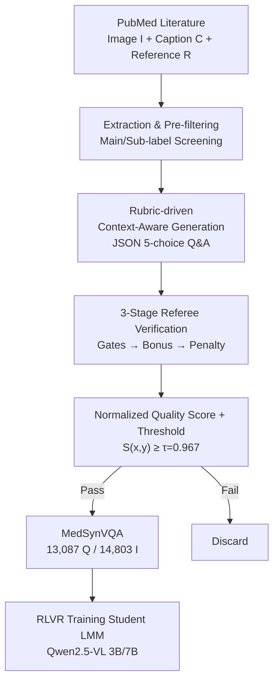

# MedVLSynther: Synthesizing High-Quality Medical Visual Question Answering from Biomedical Literature with Generator-Verifier LMMs

**Conference**: ICLR 2026  
**OpenReview**: [https://openreview.net/forum?id=ULMWcNduE3](https://openreview.net/forum?id=ULMWcNduE3)  
**Code**: https://github.com/UCSC-VLAA/MedVLSynther  
**Area**: Medical Imaging / Multimodal VLM / Data Synthesis  
**Keywords**: Medical VQA, Data Synthesis, Generator-Verifier, Rubric, RLVR

## TL;DR
This paper proposes MedVLSynther, a rubric-driven and context-aware generator-verifier framework that synthesizes multiple-choice medical VQA data directly from open PubMed biomedical literature (figures, captions, and in-text references). After a multi-stage automated verification process, it produces 13,087 high-quality samples (MedSynVQA). Training open-source LMMs using this data via Reinforcement Learning from Verifiable Rewards (RLVR) achieves average accuracies of 55.85 (3B) and 58.15 (7B) across 6 medical VQA benchmarks, outperforming several strong medical LMM baselines.

## Background & Motivation
**Background**: Large Multimodal Models (LMMs) are becoming biomedical Q&A assistants, requiring the joint interpretation of medical imaging (X-rays, CT, micrographs, etc.) and surrounding text (captions, narratives). While comprehensive benchmarks exist for evaluation (OmniMedVQA, MMMU-Med, etc.), they are designed only for testing and do not provide training splits.

**Limitations of Prior Work**: Training datasets generally fall into three categories, each with significant drawbacks: (1) Expert-annotated sets (VQA-RAD, SLAKE) have high quality but small scales and narrow modalities; (2) Automatically generated sets (PMC-VQA, etc.) are easy to scale but are mostly produced by **text-only LLMs**, ignoring visual evidence and figure-text relationships, leading to ambiguous questions, distracted options, or medically unsound answers that hinder model learning; (3) Closed-source large-scale resources (e.g., GMAI-VL-5.5M) cannot be shared due to patient privacy, licensing, and institutional agreements.

**Key Challenge**: The community can comprehensively **evaluate** medical VQA systems but cannot **widely and transparently train** them—the missing piece is a large-scale, publicly available, high-quality, and auditable training corpus. Text-only generation is efficient but loses visual grounding; private clinical data is high quality but non-reproducible.

**Goal**: Can high-quality, auditable medical VQA training data be synthesized directly from open biomedical literature? This breaks down into two sub-problems: (1) How to generate exam-level questions that are grounded in visual evidence without leaking answers through captions; (2) How to automatically filter out low-quality questions to ensure the entire pipeline is transparent and end-to-end reproducible.

**Key Insight**: The authors bet on making both generation and verification explicitly rubric-driven and context-aware. Open-weight LMMs (such as GLM-4.5V-108B) have approached closed-source systems in multimodal tasks, making them suitable for strong perception and reasoning while remaining open and auditable throughout the process.

**Core Idea**: Use a pair of LMMs—a rubric-driven generator and a multi-stage verifier—to transcribe figure-caption-reference triplets from open literature into exam-level multiple-choice VQA. A normalized quality score with a high threshold is used for screening, followed by training student models using RL from Verifiable Rewards (RLVR).

## Method

### Overall Architecture
The MedVLSynther pipeline converts a PubMed paper into several audited multiple-choice medical VQA samples, which are then used to train student LMMs. The process begins by extracting `x=(I, C, R)` from Biomedica (figures and metadata from PMC-OA)—consisting of images `I` (one caption may correspond to up to 6 images), caption `C`, and the in-text reference segment `R`. After pre-filtering by primary labels (clinical imaging, microscopy) and 25 sub-categories, 23,788 triplets are obtained. Then, the generator LMM `G_θ`, constrained by a rubric, produces 5-option questions `y={q, options{A..E}, answer}` in strict JSON format. The verifier LMM `V_φ` observes the same context and candidate question, scoring it in three stages (Essential Gates → Bonus Points → Penalty Points). These are aggregated into a normalized quality score `S(x,y)`, with a threshold `τ=0.967` used to accept 13,087 samples, named MedSynVQA. Finally, Qwen2.5-VL 3B/7B students are trained on MedSynVQA via RLVR.

### Key Designs

**1. Rubric-Driven Context-Aware Generation: Rooting Questions in Images instead of Fabrications**

This step addresses Limitation ②—questions generated by text-only LLMs ignore visual evidence. The authors provide the generator `G_θ` with the image `I`, caption `C`, and reference `R` (context-aware). It acts as a "medical education expert" producing questions under a self-check rubric. The rubric includes: **Essential (Mandatory)**—the question must be self-contained (no "caption/context" meta-references), require visual features to answer, use caption facts implicitly without leaking answers, have exactly one best answer, and be medically correct; **Important (Recommended)**—higher cognitive levels than "application," strong parallel distractors, and focus on a single concept; **Optional**—localization or quantitative details when evidence is clear. A set of question prototypes (Anomaly Identification, Modality Recognition, Anatomy, etc.) is used to reduce prompt entropy and guide clinically meaningful questions.

**2. Three-Stage Referee-Style Verification: Turning Quality Control into Auditable Rules**

Automated verification is necessary for scale. The verifier `V_φ` acts as both **Referee** and **Critic**, returning structured rubric scores. The stages are: **Stage-1 Essential Screening (Hard Gate)**—The Referee evaluates 7 non-negotiable items (Self-containment, No Unfounded Facts, Diagnostic Leakage, Single Correct Option, Semantic Consistency, Clinical Validity, Image-Text Consistency) with scores of `{0,5}`. **Any failure results in immediate discard**. **Stage-2 Fine-grained Bonus**—The Critic defaults to "not excellent" and only awards scores for 4–8 bonus items (Important weighted 3/4, Optional 1/2) under undeniable evidence. This deliberately lowers recall to increase precision. **Stage-3 Penalties (Critique)**—Active search for common pitfalls: Forbidden words (−2), Synonym drift (−1), Multiple answers (−2), and Medical inaccuracy (−2). Specific reasons must be provided for penalties. The authors found that using a different model for the verifier than the generator improves robustness.

**3. Normalized Quality Score and High-Threshold Acceptance: Precision via Interpretable Scoring**

To aggregate scores into a decision, the authors define a normalized quality score. Let $P$ be the set of positive criteria (Important∪Optional, weights $w_i>0$, scores $s_i\in\{0,w_i\}$) and $N$ be the set of pitfalls (weights $w_j<0$, scores $p_j\in\{0,w_j\}$):

$$S(x,y)=\mathrm{clip}_{[0,1]}\!\left(\frac{\sum_{i\in P}s_i+\sum_{j\in N}p_j}{\sum_{i\in P}w_i}\right).$$

Candidates passing Stage-1 are accepted only if $S(x,y)\ge\tau$ (where $\tau=0.967$). This high threshold emphasizes precision. The denominator normalizes the score to $[0,1]$, while penalties in the numerator quickly lower the score for "trap" samples. Ablations show diminishing returns after 5K samples, suggesting high-threshold filtering is the core of quality assurance rather than sheer volume.

### Loss & Training
After obtaining MedSynVQA, the authors train student LMMs (Qwen2.5-VL 3B/7B) using two methods: **SFT**—imitating MedVLThinker, using GLM-4.5V-108B to distill thinking traces for supervised fine-tuning on (chain-of-thought, answer) pairs; **RLVR (Reinforcement Learning from Verifiable Rewards)**—using GRPO to optimize **only for the answer** (not the reasoning chain). Rewards encourage exact matching and schema compliance. Experiments show RL consistently outperforms SFT, with MedSynVQA providing the strongest reward signal.

## Key Experimental Results

### Main Results
Multiple-choice accuracy is reported across 6 medical VQA benchmarks, comparing with general and medical LMMs:

| Model | PathVQA | SLAKE | VQA-RAD | Average |
|------|---------|-------|---------|------|
| Qwen2.5-VL-7B-Instruct (base) | 65.39 | 65.71 | 68.75 | 53.50 |
| HuatuoGPT-Vision-7B | 63.53 | 75.00 | 63.60 | 54.69 |
| MedVLThinker-7B (Prev. SOTA) | 66.83 | 65.79 | 64.71 | 54.88 |
| **Ours-3B** | 62.82 | 74.76 | 73.53 | **55.85** |
| **Ours-7B** | 65.56 | 72.36 | **77.57** | **58.15** |

The 3B student outperforms MedVLThinker-7B (+0.97 Gain), and the 7B student improves over the Prev. SOTA by +3.27 Gain.

### Ablation Study

| Configuration (3B / 7B Avg) | 3B | 7B | Description |
|------|------|------|------|
| Zero-shot base | 49.14 | 53.50 | Qwen2.5-VL Instruct |
| PMC-style Text-only Gen | 54.25 | 54.41 | Text LLM Questioning |
| PMC-style Figure-Text Gen | 54.80 | 55.15 | Adding Images |
| Rubric Context-aware Gen | 54.72 | 57.33 | Ours (Generator) |
| + Rubric Context-aware Verifier | **55.85** | **57.56** | Full Pipeline |

**Data Scale Ablation (3B)**: 1K→52.64, 5K→55.85, 10K→55.03. Diminishing returns after 5K suggests high-threshold filtering is key.

### Key Findings
- **Generation and Verification are both Essential**: Rubric context-aware generation is similar to PMC's figure-text generation in isolation, but **adding the verifier** achieves the best average performance (55.85), especially in clinically grounded datasets like SLAKE and VQA-RAD.
- **Stronger Verifiers Improve Downstream Performance**: Using GLM-108B for both generator and verifier brings the 7B student to 58.08.
- **RL > SFT**: SFT on text-only m23k data even caused performance drops (32.80 for 3B), while RLVR was stable across all sources.
- **No Benchmark Leakage**: Contamination analysis customized for synthetic medical VQA detected no overlaps with test sets.

## Highlights & Insights
- **Decoupling "Questioning" and "Grading"**: Splitting the task into a Generator-Verifier pair allows for a three-stage (Gate/Bonus/Penalty) audit. This provides full reproducibility of prompts, rubrics, and metadata, which is a major advantage over private datasets.
- **"Quality over Quantity"**: The normalized quality score with a high threshold (0.967) converts subjective quality into an interpretable scalar. Penalties allow for a "one-vote veto" of flawed samples.
- **Heterogeneous Generator/Verifier**: Using different models for the referee prevents the "student grading their own paper" bias, a trick applicable to any LLM-self-generation pipeline.
- **Fully Open Pathway**: By using open literature and open-weight models, the authors provide a viable path for "reproducible and privacy-preserving" medical training data.

## Limitations & Future Work
- Synthetic data **cannot replace** meticulously annotated clinical datasets; it serves as a viable and useful supplement.
- Diminishing returns after 5K samples suggest current filtering requires better diversity or difficulty control rather than just more volume.
- The scope is limited to **Multiple-Choice VQA (MC-VQA)**, excluding open-ended generation or bounding box localization.
- Verifier bias may be systematically introduced into the dataset, and contamination analysis is only "not detected" under specific protocols, not a guarantee of absolute zero leakage.

## Related Work & Insights
- **vs PMC-VQA**: Uses text-only LLMs to produce 220k+ pairs but ignores visual evidence and is often ambiguous. MedVLSynther's "context-awareness + explicit quality check" is far superior in RL training.
- **vs MedVLThinker**: Trained on text-only medical corpora. This work provides the missing high-quality **multimodal** supervision signal.
- **vs Closed-source Sets (e.g., GMAI-VL-5.5M)**: These are large but not shareable. This work trades scale for transparency and reproducibility.

## Rating
- Novelty: ⭐⭐⭐⭐ The combination of Generator-Verifier + Rubric + Normalized Quality Score is pragmatic and effective.
- Experimental Thoroughness: ⭐⭐⭐⭐⭐ 6 benchmarks, multiple ablations (pipeline, scale, model choice), and contamination analysis.
- Writing Quality: ⭐⭐⭐⭐ Clear structure; good figure-text alignment.
- Value: ⭐⭐⭐⭐⭐ Provides a reproducible, auditable, and scalable path for medical VQA training data.

<!-- RELATED:START -->

## Related Papers

- [\[AAAI 2026\] Q-FSRU: Quantum-Augmented Frequency-Spectral Fusion for Medical Visual Question Answering](../../AAAI2026/medical_imaging/q-fsru_quantum-augmented_frequency-spectral_fusion_for_medical_visual_question_a.md)
- [\[CVPR 2026\] Dual-Level Confidence based Implicit Self-Refinement for Medical Visual Question Answering](../../CVPR2026/medical_imaging/dual-level_confidence_based_implicit_self-refinement_for_medical_visual_question.md)
- [\[CVPR 2026\] MR-RAG: Multimodal Relevance-Aware Retrieval-Augmented Generation for Medical Visual Question Answering](../../CVPR2026/medical_imaging/mr-rag_multimodal_relevance-aware_retrieval-augmented_generation_for_medical_vis.md)
- [\[ICLR 2026\] A Structured, Tagged, and Localized Visual Question Answering Dataset with Full Sentence Answers and Scene Graphs for Chest X-ray Images](a_structured_tagged_and_localized_visual_question_answering_dataset_with_full_se.md)
- [\[CVPR 2026\] From Panel to Pixel: Zoom-In Vision-Language Pretraining from Biomedical Scientific Literature](../../CVPR2026/medical_imaging/from_panel_to_pixel_zoom-in_vision-language_pretraining_from_biomedical_scientif.md)

<!-- RELATED:END -->
