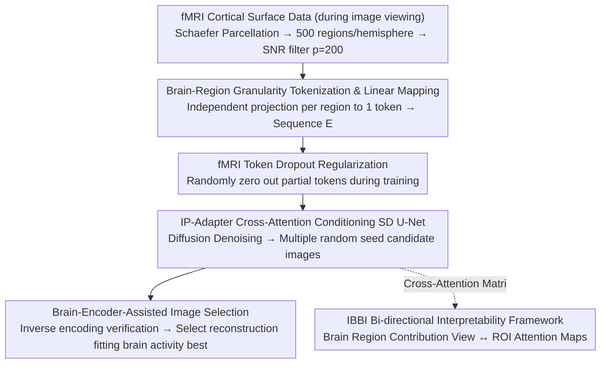

# Towards Interpretable Visual Decoding with Attention to Brain Representations

**Conference**: ICLR 2026  
**arXiv**: [2509.23566](https://arxiv.org/abs/2509.23566)  
**Code**: [GitHub](https://github.com/kriegeskorte-lab/NeuroAdapter)  
**Area**: Brain-Computer Interface / Visual Decoding / Medical Imaging  
**Keywords**: fMRI visual decoding, end-to-end brain-to-image reconstruction, cross-attention conditioning, bi-directional interpretability, brain region tokens

## TL;DR

NeuroAdapter is proposed to segment fMRI signals into independent tokens by brain region and directly condition Stable Diffusion via cross-attention. By bypassing traditional CLIP/DINO intermediate embedding spaces, it achieves high-level semantic metrics superior to or on par with existing methods on datasets like NSD. Furthermore, the IBBI bi-directional interpretability framework is introduced, revealing for the first time how different cortical regions dynamically drive image generation during the denoising trajectory.

## Background & Motivation

**Background**: Reconstructing visual stimuli from human fMRI activity is a core challenge in computational neuroscience. Current mainstream methods employ a two-stage pipeline: first mapping fMRI to the embedding space of pre-trained vision-language models (e.g., CLIP, DINO), and then using these embeddings to guide generative models like Stable Diffusion for image reconstruction. Representative works include Brain Diffuser, MindEye1, and DREAM.

**Limitations of Prior Work**: The two-stage pipeline suffers from two fundamental issues. (1) **Information Bottleneck**: The dimensionality and semantic coverage of intermediate embedding spaces are limited; rich low-level/high-level neural information in fMRI may be lost during mapping—reconstruction quality depends on the alignment between fMRI and the embedding space rather than the information content of the brain activity itself. (2) **Obscured Interpretability**: Intermediate mappings sever the direct link between brain regions and generation results, making it impossible to trace "which brain regions drive which parts of the image," which limits the value of decoding methods in neuroscience research.

**Key Challenge**: Two-stage methods place "improving reconstruction quality" and "maintaining interpretability" in opposition—the introduction of embedding spaces enhances generation quality at the expense of brain region attribution transparency.

**Goal**: (1) Design an end-to-end framework directly from fMRI to images without intermediate embedding spaces; (2) Achieve brain-region-level interpretability without sacrificing reconstruction quality—dynamically tracking the contribution of each cortical region to the generation process.

**Key Insight**: Treat each brain region as an independent token and allow the diffusion model to directly "attend" to these brain region tokens via a cross-attention mechanism. This design naturally aligns attention weights with brain regions, making the attention matrix itself the object of interpretability analysis.

**Core Idea**: Use brain-region-granularity tokens to directly condition the diffusion model through cross-attention, making attention weights a natural carrier for interpretability.

## Method

### Overall Architecture

The objective of NeuroAdapter is straightforward: bypass intermediate embedding spaces like CLIP/DINO, allowing fMRI signals themselves to serve as conditions for the diffusion model while making the mapping of "which brain region drives the image" readable. The pipeline operates as follows: fMRI cortical surface data from subjects viewing images is first segmented using Schaefer parcellation into 500 regions per hemisphere, from which the $p=200$ regions with the highest Signal-to-Noise Ratio (SNR) are selected. Each brain region undergoes an independent linear projection to be compressed into a token, forming a condition sequence $E \in \mathbb{R}^{p \times f}$. During training, fMRI Token Dropout is applied to these tokens for regularization. Subsequently, the cross-attention layers in the Stable Diffusion U-Net are replaced with IP-Adapter-style modules, allowing the spatial queries of the U-Net to directly "attend" to these 200 fMRI tokens for denoising and generating reconstructed images. The Stable Diffusion backbone is frozen during training, with only the brain region projection matrices and the new cross-attention modules being updated. During inference, a brain encoder is used to select the optimal reconstruction from multiple candidates. Finally, because brain regions correspond one-to-one with tokens, the attention matrix can be interpreted via the IBBI framework to trace "which brain region drives which part of the image."

### Key Designs

**1. Brain-Region Granularity Tokenization & Linear Mapping: Projecting each brain region into a single token for natural anatomical alignment.**

Two-stage methods map fMRI into a unified embedding space, which disconnects brain regions from generation results. This work changes the granularity: for each brain region $P_i$, its vertex response vectors are padded to a maximum vertex count $v_{max}$ and then mapped into an $f$-dimensional token ($f=768$) through an **independent** projection matrix $w \in \mathbb{R}^{v_{max} \times f}$. Thus, 200 brain regions produce 200 tokens forming the sequence $E \in \mathbb{R}^{p \times f}$, where projection matrices do not share parameters. The key lies in the "one region = one token" correspondence: unlike flattening the whole brain into one high-dimensional vector, the brain-region granularity ensures each column of the cross-attention matrix corresponds exactly to an anatomically defined brain region. Interpretability is thus "built-in" rather than an afterthought. Linear mapping is intentionally used instead of MLP to prevent non-linear transformations from confounding the source of brain region information.

**2. fMRI Token Dropout Regularization: Randomly dropping brain region tokens during training to prevent the model from over-relying on specific regions.**

Direct conditioning can lead to overfitting on specific brain region combinations, making decoding non-robust. The approach involves sampling a dropout probability $r \sim \mathcal{U}(0,1)$ independently for each training sample and generating a binary mask $M \in \{0,1\}^{p \times 1}$ where each token is zeroed out with probability $r$: $E' = E \odot M$. Since the dropout probability is uniformly random, the model encounters scenarios ranging from "almost no dropout" to "almost total dropout," forcing it to produce reasonable outputs under any degree of incompleteness—an approach similar to conditional dropout in classifier-free guidance. This component is crucial; ablation studies show high-level semantic metrics drop significantly without it.

**3. Brain-Encoder-Assisted Image Selection: Using "inverse encoding" to verify candidate images and pick those best fitting original brain activity.**

The stochasticity of diffusion models is a double-edged sword; generation quality can vary significantly under the same conditions. For each test fMRI sample, $n$ candidate images are generated using different random seeds. A pre-trained whole-brain encoder (Transformer architecture) is then used to predict the fMRI response $B'_i$ that each candidate **should** evoke. The Pearson correlation between $B'_i$ and the actual measured fMRI is calculated, and the image with the highest correlation is selected. This essentially uses encoding-decoding consistency as a quality filter: the image that best "recovers" the original brain activity pattern is deemed the most likely correct reconstruction.

**4. IBBI Bi-directional Interpretability Framework: Using the cross-attention matrix directly as a probe to read brain region ↔ image correspondences.**

Since brain regions correspond one-to-one with tokens, the attention matrix $A^{(\ell,h,t)} \in \mathbb{R}^{q \times p}$ inherently carries interpretability information. The IBBI (Image–Brain BI-directional) framework reads it from two complementary directions. The **Brain-oriented view** answers "which brain regions drive generation": the attention matrix is aggregated across query dimensions, layers, and heads to obtain a brain region contribution vector $B^{(t)} \in \mathbb{R}^p$ where $\sum_j B_j^{(t)} = 1$. Projecting this back to the cortical surface reveals the relative influence of each region at each denoising step. The **Image-oriented view** answers "where the image is being attended to by a specific brain region": for a given ROI $\mathcal{R}$, attention is pooled over heads and tokens within the ROI to produce a query-wise attention map $m_\mathcal{R}^{(\ell,t)} \in \mathbb{R}^{q^\ell}$ per layer, which is reshaped to 2D, upsampled to image resolution, and averaged across layers to obtain the ROI attention map $I_\mathcal{R}^{(t)}$—revealing the "functional footprint" of brain regions like the FFA (Face Area) or PPA (Place Area) in image space.

### Loss & Training

A basic diffusion loss is paired with a Min-SNR weighting strategy: reducing the loss weight for high-SNR steps (less noise, easy reconstruction) and maintaining weights for low-SNR steps (more noise, difficult reconstruction) to balance the training signal. The text encoder receives null inputs to ensure fMRI tokens are the sole source of conditioning. The model is trained for 300 epochs with a batch size of 16 on 2 NVIDIA L40 GPUs, taking approximately 25 hours.

## Key Experimental Results

### Main Results

Comparison with mainstream methods on the NSD dataset (averaged across 4 subjects, improvement percentage relative to ImageNet retrieval baseline):

| Method | Type | CLIP↑ | Incep↑ | Eff↑ | SwAV↑ | PixCorr↑ | SSIM↑ |
|------|------|-------|--------|------|-------|----------|-------|
| Brain Diffuser (w/ VDVAE) | Two-stage | High | High | High | High | **Highest** | **Highest** |
| Brain Diffuser (w/o VDVAE) | Two-stage | Medium | Medium | Medium | Medium | Comparative | Comparative |
| MindEye1 | Two-stage | High | High | High | High | Medium | Medium |
| DREAM | Two-stage | High | High | High | High | Medium | Medium |
| MindFormer | Multi-subject | High | High | High | High | Medium | Medium |
| **NeuroAdapter (Ours)** | **End-to-End** | **Highest/Tie** | **Highest/Tie** | **Competitive** | **Competitive** | Medium | Medium |

Key Conclusion: NeuroAdapter competes with or exceeds two-stage methods using CLIP/DINO embeddings in high-level semantic metrics (CLIP, Incep, Eff, SwAV). In low-level metrics (PixCorr, SSIM), it performs comparably to Brain Diffuser without its VDVAE path—suggesting the gap in low-level metrics stems from the additional VDVAE low-level feature path rather than limitations of the end-to-end approach itself.

### Ablation Study

Key ablations on NSD Subject 1 (direction of change relative to baseline):

| Configuration | High-level Metrics | Low-level Metrics | Description |
|------|---------|---------|------|
| Full NeuroAdapter | Optimal | Optimal | Full model, $p=200$, $f=768$ |
| w/o fMRI Token Dropout | Significant Decrease | Decrease | Dropout is critical for robustness |
| w/o Min-SNR Weighting | Slight Decrease | Decrease | Helps balance training signal |
| w/o Brain Encoder Selection | Decrease | Decrease | Randomness leads to unstable quality |
| $p=50$ (Fewer regions) | Significant Decrease | Decrease | Insufficient information |
| $p=400$ (More regions) | Slight Decrease | Slight Decrease | Low SNR regions introduce noise |
| Visual tokens only (No brain structure) | Large Decrease | Large Decrease | Brain-region tokenization is core |

### Key Findings

- **fMRI Token Dropout is the most critical design**: Performance drops sharply without it, indicating the model easily overfits to specific brain region combinations. Uniformly sampling the dropout probability is more effective than a fixed probability.
- **Region count $p=200$ is the sweet spot**: Too few (50) lacks info, too many (400) introduces low-SNR noise. The combination of SNR filtering and moderate region count is most effective.
- **High-level visual areas dominate generation dynamics**: IBBI analysis shows that attention contributions from high-order visual areas like FFA (face-selective) and PPA (scene-selective) are consistently much higher than low-level areas like V1/V2.
- **Temporal dynamics of attention maps align with neuroscience**: In early denoising steps, attention is scattered across the image, gradually concentrating on semantically relevant areas—face ROIs converge on faces, and scene ROIs expand to the background.
- **Causal perturbations validate functional selectivity**: Masking low-level visual ROIs (V1-V3) does not affect semantic content, but masking high-level ROIs (FFA, PPA, LOC) completely changes the generated image, confirming these regions carry core semantic information.
- **Generalization on NSD-Imagery and Deeprecon**: NeuroAdapter demonstrates reasonable generalization in mental imagery tasks and settings where train/test categories do not overlap, with high-level semantic metrics comparable to existing methods.

## Highlights & Insights

- **The "one region = one token" design is exceptionally clever**: This seemingly simple correspondence simultaneously addresses conditioning and interpretability—each column of the cross-attention matrix directly corresponds to an anatomical brain region, enabling contribution analysis without extra probes or post-processing. This "interpretability-by-design" approach is a valuable takeaway.
- **The IBBI framework provides a neuroscience probe for generative models**: Linking the denoising trajectory of diffusion models with brain region functions not only validates known visual hierarchies (low-level → low-level features, high-level → semantics) but also provides new insights in the temporal dimension (dynamic attention process from diffusion to convergence).
- **The counter-intuitive conclusion that "removing intermediate embeddings does not hurt performance"**: This suggests that the information carried by fMRI itself is sufficient to drive high-quality generation directly. CLIP/DINO embedding spaces serve more as a convenience than a necessity. This has implications for conditional generation in other modalities—can intermediate representations be bypassed there as well?
- **The Brain Encoder selection strategy** provides a general paradigm for generative quality filtering: By using "inverse encoding" to verify consistency between reconstruction and input conditions, it can be extended to any conditional generation task.

## Limitations & Future Work

- **Weak reconstruction of low-level visual features**: By forgoing low-level feature paths like VDVAE, the end-to-end method lags in PixCorr/SSIM. Future work could consider adding a lightweight pixel-level auxiliary loss or a wave-VAE branch.
- **Stochasticity of diffusion models**: Even with brain encoder selection, generation quality remains unstable. Deterministic sampling or consistency models could be explored to reduce randomness.
- **Interpretability is still correlational rather than causal**: Cross-attention weights reflect "what the model chooses to attend to" rather than "what the brain region truly encodes." Causal perturbation analysis is one step, but more rigorous causal inference methods are needed.
- **Limited subject scale**: NSD includes only 8 subjects, and cross-subject generalization has not been fully validated. Combining functional alignment techniques to support cross-subject decoding is a future direction.
- **Overhead of the Brain Encoder**: The selection strategy requires a pre-trained encoder and multiple forward passes, leading to high inference costs.

## Related Work & Insights

- **vs Brain Diffuser**: Uses two paths (CLIP+VDVAE) for high-level and low-level guidance of SD. This work replaces them with a single end-to-end path, matching/exceeding high-level metrics but falling behind in low-level metrics due to the lack of VDVAE. A key difference is that Brain Diffuser's embedding mapping cuts the attribution link to brain regions.
- **vs MindEye1/DREAM**: Uses sophisticated CLIP alignment strategies and large-scale data augmentation. This work proves that direct conditioning can achieve competitive levels even without embedding alignment—suggesting the gains from embedding alignment might be overestimated.
- **vs DynaDiff**: Uses LoRA to fine-tune SD for dynamic fMRI, representing another path toward single-stage decoding. However, the LoRA approach lacks brain-region-granularity interpretability, as attention analysis cannot be mapped back to anatomical structures.
- **vs Brain Encoding Models (Adeli et al. 2025)**: Transformer attention maps in the encoding direction (Image → fMRI) reveal "which visual features are routed to which brain regions." This work provides a complementary perspective from the decoding direction (fMRI → Image); combining both could lead to a more complete understanding of brain visual representations.

## Rating

- Novelty: ⭐⭐⭐⭐ End-to-end conditioning + "interpretability-by-design" is a significant paradigm innovation.
- Experimental Thoroughness: ⭐⭐⭐⭐ Three datasets, comprehensive ablations, and IBBI qualitative/quantitative analysis, though discussion of low-level metrics could be deeper.
- Writing Quality: ⭐⭐⭐⭐ Clear descriptions of the method and interpretability framework, with high-quality illustrations.
- Value: ⭐⭐⭐⭐ Provides a new interpretability tool for neuroscience decoding research, with high-level semantic reconstruction at SOTA levels.

<!-- RELATED:START -->

## Related Papers

- [\[ICLR 2026\] SEED: Towards More Accurate Semantic Evaluation for Visual Brain Decoding](seed_towards_more_accurate_semantic_evaluation_for_visual_brain_decoding.md)
- [\[ICLR 2026\] A Cognitive Process-Inspired Architecture for Subject-Agnostic Brain Visual Decoding](a_cognitive_process-inspired_architecture_for_subject-agnostic_brain_visual_deco.md)
- [\[ICLR 2026\] Autoregressive Visual Decoding from EEG Signals](autoregressive_visual_decoding_from_eeg_signals.md)
- [\[NeurIPS 2025\] MoRE-Brain: Routed Mixture of Experts for Interpretable and Generalizable Cross-Subject fMRI Visual Decoding](../../NeurIPS2025/medical_imaging/more-brain_routed_mixture_of_experts_for_interpretable_and_generalizable_cross-s.md)
- [\[CVPR 2026\] Decoding 3D Perception via BrainSSD: Synergistic Fusion of EEG Representations from Static and Dynamic Visual Streams](../../CVPR2026/medical_imaging/decoding_3d_perception_via_brainssd_synergistic_fusion_of_eeg_representations_fr.md)

<!-- RELATED:END -->
