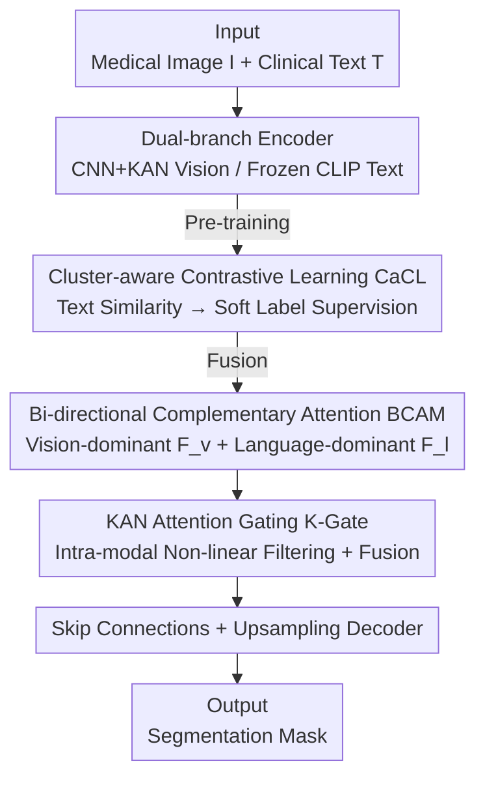

# Towards Text–Mask Consistency in Medical Image Segmentation

**Conference**: ICLR 2026  
**OpenReview**: [https://openreview.net/forum?id=riOevy2RwZ](https://openreview.net/forum?id=riOevy2RwZ)  
**Code**: None  
**Area**: Medical Imaging / Text-guided Segmentation / Multi-modal Alignment  
**Keywords**: Text-mask consistency, Contrastive learning, Bi-directional attention, KAN, Medical segmentation

## TL;DR
To address the "mask-text mismatch" in text-guided medical segmentation, C2Seg proposes a two-stage scheme: the pre-training stage utilizes Cluster-aware Contrastive Learning (CaCL) with text-similarity-based soft labels to resolve false negative conflicts caused by templated clinical descriptions; the fusion stage employs Bi-directional Complementary Attention Module (BCAM) to explicitly construct a "language-dominant" spatial feature path, complemented by KAN gating for fine-grained selection, achieving simultaneous improvements in text-mask consistency and segmentation accuracy across four public medical datasets.

## Background & Motivation
**Background**: Adapting Vision-Language Models (VLM) for medical segmentation has become mainstream—pairing an image with clinical text (e.g., "bilateral lung infection, two lesions, upper left") and using language semantics like quantity, location, and laterality as constraints to segment lesion areas.

**Limitations of Prior Work**: Actual output masks frequently conflict with the text. For instance, the model may mark lesions in both lungs when the text specifies "unilateral, one infected area," or provide an incorrect count of lesions despite the text stating "two infected areas." This suggests existing pipelines fail to convert clinical language into pixel-level structural constraints, failing to maintain text-mask consistency regarding semantic attributes like lesion count, laterality, and coarse location.

**Key Challenge**: The authors attribute this mismatch to two root causes. First, clinical descriptions are highly templated and semantically repetitive—approximately 7,000 samples in QaTa-COV19 share only about 300 unique text templates. Standard InfoNCE contrastive learning treats $(I^{(i)}, T^{(j)})$ as a strong negative sample even if $T^{(j)}$ and $T^{(i)}$ share the same template, creating massive false negatives and contrastive conflicts that degrade cross-modal alignment. Second, most methods remain "vision-centric" with unidirectional cross-attention. Even those claiming bi-directional interaction (DualA) only update text tokens; language only indirectly modulates visual features via attention weights without forming an explicit, language-dominant representation that preserves spatial structure, leading to insufficient semantic modeling.

**Goal**: To resolve the false negative issue in the contrastive learning stage and supplement the missing "language-dominant and spatial-aware" pathway in the fusion stage without updating the language encoder, thereby improving both consistency and accuracy.

**Core Idea**: Use text-text similarity for soft labels instead of hard positive/negative samples (for alignment), replace pseudo-bi-directional mechanisms (which only update tokens) with a true language-dominant attention path that produces pixel-grid features (for fusion), and employ KAN gating for intra-modal non-linear filtering.

## Method

### Overall Architecture
C2Seg (Consistency-enhanced Two-stage Segmentation) is a two-stage sequential framework. Input consists of medical image $I$ and paired text $T$, and the output is a pixel-level segmentation mask. The first stage (pre-training) focuses on contrastive alignment: dual-branch encoders extract vision and language features, using **Cluster-aware Contrastive Learning (CaCL)** to convert in-batch text similarity into soft labels to supervise the image-text similarity distribution. The second stage (fusion segmentation) feeds features into the **Bi-directional Complementary Attention Module (BCAM)**, producing both vision-dominant features $F_v$ and language-dominant features $F_l$, which are merged via **KAN Attention Gating (K-Gate)** to obtain $F_{out}$. Finally, resolution is restored through skip connections and upsampling. During training, the vision encoder is fine-tuned with a small learning rate while the language encoder is frozen to preserve stable semantic anchors.

### Key Designs

**1. Cluster-aware Contrastive Learning (CaCL): Converting "Text Neighborhood Similarity" into Soft Labels to Resolve False Negatives**

CaCL addresses false negative conflicts caused by templated clinical text. Instead of treating in-batch contrastive learning as "one positive + all others negative," it reformulates it as "in-batch semantic distribution matching." First, text-text cosine similarity $M_{ij}=\cos(l_i, l_j)$ is computed in the frozen language space. Since shared templates inflate similarity, the authors apply "debiasing + non-negative truncation": $M'_{ij}=\max\{M_{ij}-\mu_i, 0\}$, where $\mu_i=\frac{1}{B}\sum_k M_{ik}$ acts as the batch-level "template bias." Subtracting it suppresses global template effects and focuses soft labels on local semantic neighborhoods. Soft targets are normalized via temperature $\tau$: $\hat{Y}_{ij}=\frac{\exp(M'_{ij}/\tau)}{\sum_k \exp(M'_{ik}/\tau)}$, and mixed with the diagonal to preserve anchor identity: $Y_{ij}=\rho \hat{Y}_{ij}+(1-\rho)\mathbb{1}[j=i]$.

Cross-modal logits $s_{ij}=v_i^\top l_j$ are supervised via bi-directional InfoNCE to pull the predicted distribution toward $Y$:

$$L_{CaCL} = -\frac{1}{B}\sum_{i=1}^{B}\sum_{j=1}^{B}\left(Y_{ij}\log P^{v\to l}_{ij} + Y_{ji}\log P^{l\to v}_{ij}\right)$$

The gradient $\frac{\partial L_{CaCL}}{\partial s_{ij}}=\frac{1}{B\tau}\left((P^{v\to l}_{ij}-Y_{ij})+(P^{l\to v}_{ij}-Y_{ji})\right)$ shows that semantically similar but unpaired samples (with $Y_{ij}>0$) receive weakened or reversed repulsive gradients, mitigating the false negative problem. Unlike "cluster prototypes," CaCL fits a continuous semantic distribution with minimal overhead ($O(B^2C)$).

**2. Bi-directional Complementary Attention Module (BCAM): Constructing a True Language-dominant Path for Pixel-grid Features**

BCAM addresses the "pseudo-bi-directional, vision-centric" fusion defect. Representative methods like M3Att use cross-attention but flatten the spatial dimension into the channel dimension, destroying spatial inductive bias. BCAM constructs two parallel complementary pathways to produce spatially aligned multi-modal features on the pixel grid.

Learnable KAN layers project vision features $V\in\mathbb{R}^{P\times C}$ and language features $L\in\mathbb{R}^{N\times C}$ to keys/values, calculating scores $A=\frac{1}{\sqrt{d}}V_{key}(L_{key})^\top\in\mathbb{R}^{P\times N}$. The **Vision-dominant path** aggregates language values along the language axis $N$: $F_v=\mathrm{Softmax}_N(A)\cdot L_{value}\in\mathbb{R}^{P\times C}$. The **Language-dominant path** normalizes $A^\top$ along the spatial axis $P$, applying each token's spatial weight to vision values and summing across tokens:

$$F_l=\frac{1}{N}\sum_{n=1}^{N}\mathrm{Softmax}_P\!\left(A^\top[n,:]\right)\odot V_{value}\in\mathbb{R}^{P\times C}$$

$F_l$ encodes "the aggregated spatial influence of each token," resulting in a spatially coherent language-guided feature map aligned with the image grid.

**3. KAN Attention Gating (K-Gate): Non-linear Selective Gain within Each Modality**

K-Gate performs intra-modal suppression/enhancement before fusion to prevent noise propagation. Independent gating heads (two KAN layers with ReLU) are built for $F_v$ and $F_l$, with weights constrained to $[-1,1]$ via tanh: $g_v=\tanh(\mathrm{KAN}^{(2)}_v(\mathrm{ReLU}(\mathrm{KAN}^{(1)}_v(F_v))))$. Element-wise reweighting $F^g_v=F_v\odot g_v$ is performed before concatenation and linear mixing via $1\times1$ convolution. KAN layers provide stronger non-linear modeling with fewer parameters compared to standard MLPs.

### Loss & Training
The pre-training stage uses $L_{CaCL}$, while the segmentation stage uses a combination of BCE and Dice loss (BCEDice). Default parameters: $\tau=0.07$, $\rho=0.8$, pre-training batch size 256, segmentation batch size 32. The vision encoder uses a small learning rate, and the language encoder is frozen.

## Key Experimental Results

### Main Results
C2Seg (18.92M parameters) was evaluated on QaTa-COV19, MosMedData+, CVC-ClinicDB, and Kvasir datasets.

| Dataset | Metric | C2Seg | Prev. SOTA | Gain |
|--------|------|--------|----------|------|
| QaTa-COV19 | Dice(%) | 85.25 | 84.27 (MedLangViT) | +0.98 |
| QaTa-COV19 | mIoU(%) | 76.97 | 75.93 (MedLangViT) | +1.04 |
| MosMedData+ | Dice(%) | 77.81 | 75.95 (MedLangViT) | +1.86 |
| CVC-ClinicDB | Dice(%) | 91.82 | 89.96 (MMIUNet) | +1.86 |
| Kvasir | Dice(%) | 91.92 | 90.83 (LAVT) | +1.09 |

Significant improvements were observed in distance metrics (e.g., QaTa-COV19 HD95 dropped from 14.51 to 12.71), indicating more accurate boundary and lesion localization. Qualitative results confirm that C2Seg adheres better to text regarding counts and locations.

### Ablation Study
Incremental component testing on MosMedData+ and CVC-ClinicDB (using CLIP):

| Configuration | MosMed Dice(%) | CVC Dice(%) | Description |
|------|----------------|-------------|------|
| (a) Vision only | 73.61 | 86.59 | Baseline |
| (b) +DualA | 75.59 | 89.56 | Traditional bi-directional fusion |
| (c) DualA→BCAM | 76.50 | 90.31 | Proposed BCAM fusion |
| (d) +K-Gate | 77.03 | 90.68 | Addition of gating |
| (e) +HardCL | 77.32 | 91.26 | Stage I with hard labels |
| (f) Full (CaCL) | 77.81 | 91.82 | Full model |

### Key Findings
- **BCAM is the primary driver**: Replacing DualA with BCAM yielded gains of +0.91/+0.75 respectively, proving the value of the language-dominant spatial path.
- **CaCL outperforms HardCL**: Soft labels effectively mitigate the false negative issue.
- **Language Encoders**: CLIP slightly outperformed BioBERT/PubMedBERT as its embedding space is naturally aligned with vision, making it suitable for short, location/count-heavy descriptions.
- **KAN Effectiveness**: A hybrid encoder (CNN for first 3 layers + KAN for last 2) performed best (77.81 Dice), suggesting KAN is a strong high-level complement but cannot entirely replace CNN's local receptive field.

## Highlights & Insights
- **Turning "Templated Text" into a Signal**: While clinical template redundancy usually plagues contrastive learning, CaCL utilizes this structure as semantic neighborhood supervision.
- **Spatial Alignment of Language**: The normalization of $A^\top$ along the spatial axis in BCAM ensures that the language branch output preserves pixel topology, facilitating direct decoding.
- **Debiasing Component $\mu_i$**: A lightweight yet physically meaningful design that suppresses global template effects at near-zero cost.

## Limitations & Future Work
- Benefits of CaCL might diminish in datasets with high text diversity and low template reuse.
- Soft label quality depends on the frozen language encoder's similarity estimates.
- Lack of direct quantitative metrics for "text-mask consistency" (e.g., counting accuracy) beyond standard segmentation metrics.

## Related Work & Insights
- **vs M3Att / DualA**: Most prior language-dominant branches update only tokens, leaving segmentation dependent on vision maps. BCAM explicitly outputs $F_l$, mapping text semantics directly to a spatial representation.
- **vs Prototype/Neighbor Clustering (PCL, NNCLR)**: These relax one-to-one mapping to one-to-many hard labels; CaCL fits a continuous distribution.
- **vs UKAN / MM-UKAN++**: While others use KAN for vision, this work systematically integrates KAN into cross-modal key/value projections and gating.

## Rating
- Novelty: ⭐⭐⭐⭐ Soft-label debiasing + explicit language spatial paths directly address core pain points in text-guided segmentation.
- Experimental Thoroughness: ⭐⭐⭐⭐ Complete across four datasets with ablation studies, though direct consistency metrics are missing.
- Writing Quality: ⭐⭐⭐⭐ Clear motivation, solid derivations, and effective qualitative analysis.
- Value: ⭐⭐⭐⭐ Improves both consistency and accuracy with a smaller parameter footprint.

<!-- RELATED:START -->

## Related Papers

- [\[CVPR 2026\] CG-Reasoner: Centroid-Guided Positional Reasoning Segmentation for Medical Imaging with a Robust Visual-Text Consistency Metric](../../CVPR2026/medical_imaging/cg-reasoner_centroid-guided_positional_reasoning_segmentation_for_medical_imagin.md)
- [\[CVPR 2026\] VoxTell: Free-Text Promptable Universal 3D Medical Image Segmentation](../../CVPR2026/medical_imaging/voxtell_free-text_promptable_universal_3d_medical_image_segmentation.md)
- [\[CVPR 2026\] Learning Generalizable 3D Medical Image Representations from Mask-Guided Self-Supervision](../../CVPR2026/medical_imaging/learning_generalizable_3d_medical_image_representations_from_mask-guided_self-su.md)
- [\[CVPR 2026\] Simple-ViLMedSAM: Simple Text Prompts Meet Vision-Language Models for Medical Image Segmentation](../../CVPR2026/medical_imaging/simple-vilmedsam_simple_text_prompts_meet_vision-language_models_for_medical_ima.md)
- [\[CVPR 2026\] From Infusion to Assimilation Distillation for Medical Image Segmentation](../../CVPR2026/medical_imaging/from_infusion_to_assimilation_distillation_for_medical_image_segmentation.md)

<!-- RELATED:END -->
