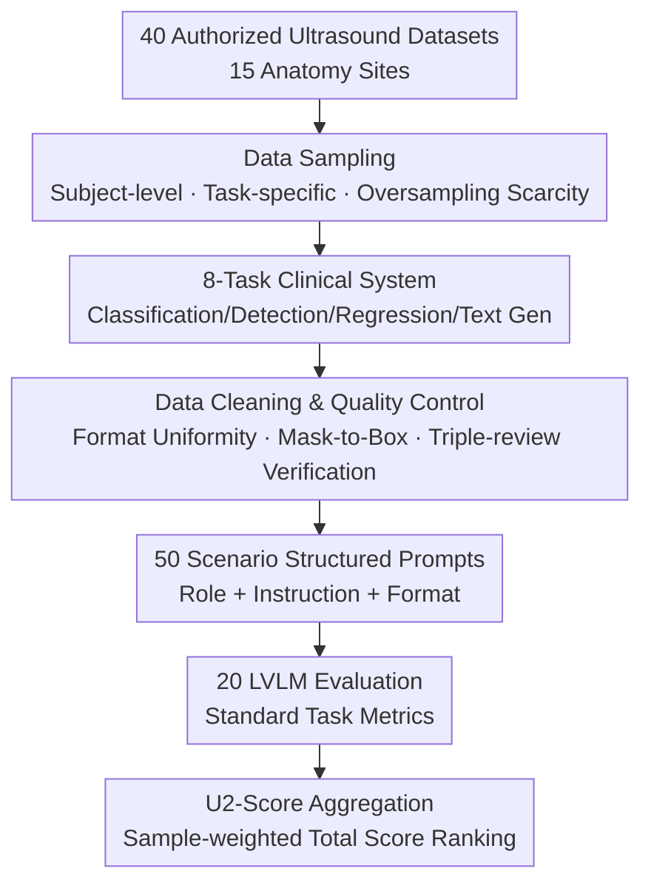

# U2-BENCH: Benchmarking Large Vision-Language Models on Ultrasound Understanding

**Conference**: ICLR 2026  
**OpenReview**: [https://openreview.net/forum?id=jU10qDevGg](https://openreview.net/forum?id=jU10qDevGg)  
**Code**: https://dolphin-sound.github.io/u2-bench/ (Dataset available at HuggingFace DolphinAI/u2-bench)  
**Area**: Medical Imaging / Multimodal VLM  
**Keywords**: Ultrasound Understanding, Medical Benchmark, Large Vision-Language Models, Spatial Reasoning, Clinical Report Generation

## TL;DR
U2-BENCH is the first benchmark to systematically evaluate the ultrasound understanding capabilities of Large Vision-Language Models (LVLMs). By sampling 7,241 cases across 15 anatomy sites from 40 authorized datasets and defining 8 clinical tasks across four categories (classification, detection, regression, and text generation), the evaluation of 20 open-source and closed-source models reveals that while models perform acceptably on image-level classification, they generally fail in spatial reasoning and clinical language generation.

## Background & Motivation
**Background**: Ultrasound is one of the most widely used imaging modalities globally (essential in obstetrics, emergency rooms, cardiology, and low-resource settings). It is real-time and low-cost but notoriously difficult to interpret. Recent medical LVLMs have demonstrated impressive multimodal capabilities on **static, low-noise, and view-standardized** modalities such as X-rays, CT, MRI, and pathology.

**Limitations of Prior Work**: However, these models and benchmarks almost entirely bypass ultrasound. Most ultrasound AI work is based on small-scale, task-specific datasets (e.g., fetal plane recognition, lesion segmentation). There is a lack of a public, balanced, and broad-coverage benchmark to answer a key question: can these emerging LVLMs generalize from static medical vision tasks to ultrasound tasks requiring **spatial reasoning and anatomical context understanding**? Even existing general medical benchmarks like GMAI-MMBench contain only about 1.4k ultrasound cases, concentrated on classification and segmentation across only 6 anatomy sites, failing to measure broader capabilities like clinical value estimation or structured report generation.

**Key Challenge**: The inherent difficulty of ultrasound differs fundamentally from natural images or other medical modalities. It is highly operator-dependent, filled with artifacts (acoustic shadowing, anisotropy), and **dynamically presents 3D anatomical structures** within image sequences. Accurate interpretation requires not just identifying visual patterns, but also understanding anatomy and performing dynamic spatial-contextual reasoning—capabilities that are scarcest in current LVLM training data.

**Goal**: To construct the first comprehensive benchmark for evaluating LVLM ultrasound understanding by decomposing the vague question of "can it understand ultrasound?" into 8 specific clinical tasks under four core capabilities (classification, detection, regression, and text generation), providing a unified total score for horizontal comparison.

**Key Insight**: Design tasks based on **actual ultrasound diagnostic workflows**—rather than artificial questions—referencing typical procedures in radiology and refined by clinical experts to ensure each task corresponds to a real-world clinical application scenario (50 in total).

**Core Idea**: A clinical-oriented task system of "Four Capabilities × Eight Tasks × 15 Anatomy Sites × 50 Scenarios," coupled with a sample-weighted aggregate metric, the U2-Score, to turn LVLM ultrasound understanding into a standardized, reproducible, and rankable evaluation.

## Method

### Overall Architecture
U2-BENCH is essentially a benchmark consisting of **data, tasks, and an evaluation protocol**. Its construction follows three stages: first, sampling 7,241 cases (covering 15 anatomy sites) from 40 authorized ultrasound datasets using a "subject-level, task-specific" strategy; second, aligning these cases with 8 clinical tasks grouped into four capabilities; and finally, performing annotation standardization, format unification, image/frame selection, and quality verification, while designing structured prompts for each of the 50 application scenarios. During evaluation, all tasks are run on 20 open/closed-source and general/medical-specific LVLMs, scored using task-specific standard metrics, and aggregated into a ranked U2-Score weighted by sample size.

### Key Designs

**1. Clinical-Oriented 8-Task System: Decomposing Ultrasound Understanding**

The core contribution is the task design. Instead of stacking VQA questions, the authors categorize ultrasound understanding into four core capabilities with 8 corresponding tasks: **Disease Diagnosis (DD)** and **View Recognition and Assessment (VRA)** under classification; **Lesion Localization (LL)**, **Organ Detection (OD)**, and **Keypoint Detection (KD)** under detection; **Clinical Value Estimation (CVE)** (predicting continuous parameters like lesion size, ejection fraction, or liver fat fraction) under regression; and **Report Generation (RG)** and **Description Generation (CG)** under text generation. These tasks are mapped directly to clinical diagnostic/reasoning capabilities, allowing the benchmark to expose structural gaps, such as the ability to classify vs. the failure of spatial reasoning.

**2. Subject-Level Sampling + Triple-Review Data Pipeline**

The 7,241 cases come from 40 authorized datasets. To reflect real clinical distributions and prevent data leakage, the authors use **subject-level** sampling. Under clinician guidance, they perform intentional **oversampling** of high-priority but data-scarce tasks to prevent the benchmark from being dominated by high-volume tasks like thyroid or breast imaging. The cleaning pipeline involves standardizing image formats, selecting representative frames from video sequences, and translating text into English via "medical-guided translation + terminology disambiguation + final clinical review." Quality control includes automated filtering and human verification by a 10-person team following a triple-review protocol (metadata validation, label-image consistency, and final diagnostic consensus).

**3. 9-Sector Localization for Detection + U2-Score Aggregation**

To address the issue where many LVLMs fail to generate stable coordinates or follow bounding box formats, the authors **simplified detection into a 9-sector position classification** (dividing the image into regions like top-left, center, bottom-right). Furthermore, to synthesize disparate metrics (Acc, F1, RMSE, BLEU) into a comparable ranking, the U2-Score is defined as a weighted aggregation:

$$\text{U2-Score} := \sum_{t=1}^{N} w_t d_t,\quad w_t = \frac{n_t}{\sum_j n_j},\quad d_t \le 1$$

where $N$ is the number of tasks, $d_t$ is the normalized metric for task $t$, and the weight $w_t$ is determined by the proportion of samples $n_t$ for that task. This represents a **subject-level average**, mitigating task imbalances.

**4. Three-Part Structured Prompting**

To ensure consistent behavior across 20 models in 50 scenarios, each prompt contains: **Clinical Role Definition** (e.g., "You are a radiologist"), **Task-Specific Instructions**, and **Output Format Specifications**. This template eliminates noise from prompt engineering variance and allows for ablation studies on prompt components, such as the inclusion of explicit anatomical site names.

## Key Experimental Results

### Main Results (U2-BENCH, 20 LVLMs, U2-Score Ranking)

| Model | Type | DD Acc↑ | KD Acc↑ | CVE RMSE↓ | RG BLEU%↑ | U2-Score↑ |
|-------|------|---------|---------|-----------|-----------|-----------|
| Dolphin-V1 | Closed | **0.682** | **0.478** | 0.243 | 3.22 | **0.5835** |
| GPT-5 | Closed | 0.537 | 0.266 | 0.310 | 1.06 | 0.3250 |
| Gemini-2.5-Pro-Preview | Closed | 0.426 | 0.271 | 0.294 | 5.50 | 0.2968 |
| Lingshu-7B | Med-Specific | 0.459 | 0.127 | 0.258 | 2.00 | 0.2704 |
| MedGemma-4B-it | Med-Specific | 0.501 | 0.275 | 0.167 | 1.54 | 0.2668 |
| DeepSeek-VL2 | Open | 0.413 | **0.295** | 0.296 | **7.47** | 0.2630 |
| Qwen-2.5-VL-72B | Open | 0.490 | 0.115 | 0.322 | 3.09 | 0.2421 |
| Claude-3.7-Sonnet | Closed | 0.212 | 0.136 | 0.176 | 0.69 | 0.1596 |
| Random Guessing | — | 0.414 | 0.112 | 0.547 | 0 | — |

Note: Dolphin-V1 (the authors' model) leads by a significant margin. However, **no model exceeds 0.30 accuracy significantly on KD (DeepSeek-VL2 at 0.295 is an exception), and all models have BLEU scores below 7.5 for RG**, highlighting universal weaknesses in spatial reasoning and report generation.

### Ablation Study

| Analysis | Configuration | Key Result | Note |
|------|------|---------|------|
| Anatomy Info in Prompt | W/ Anatomy Token | Acc 52.4% | Gemini-2.0-Pro on 521 breast/thyroid cases |
| Anatomy Info in Prompt | W/O Anatomy Token | Acc 45.1% | McNemar's test $\chi^2=16.04$, $p=6.2\times10^{-5}$ |
| Model Scale (Qwen-2.5-VL) | 3B → 72B | DD 0.450 → 0.490; CVE RMSE ↓ | Classif./Regression scales slightly |
| Model Scale | 3B → 72B | RG/KD stale or decr. | Generation/Spatial reasoning hits ceiling |
| Instruction Following | DD Task | 6/17 models perfect | Modern models follow prompts well |

### Key Findings
- **Task Difficulty Stratification**: Image-level classification and continuous clinical value estimation are relatively manageable, but spatial reasoning and text generation remain consistently difficult, suggesting LVLMs lack ultrasound-specific spatial awareness and echogenicity understanding.
- **Diminishing Returns on Scale**: Scaling Qwen-2.5-VL from 3B to 72B improves regression but shows no gain in language generation or spatial reasoning. Over-scaling might lead to overfitting on shallow visual patterns.
- **Medical Specific vs. General**: Medical models (e.g., MedGemma) are competitive in reasoning-heavy tasks, but large general models still lead in coarse visual recognition.
- **Anatomy Prompts are Effective**: Explicitly mentioning the anatomical site in the prompt improves diagnostic accuracy by +7.3 percentage points, indicating models rely heavily on textual priors to compensate for visual deficiencies.
- **Instruction Following is not the Bottleneck**: Most models can follow the requested formats; failures are due to diagnostic errors or safety filters rather than misunderstanding instructions.

## Highlights & Insights
- **Clinical Lineage of Task Design**: Mapping tasks to real workflows ensures the benchmark measures whether a model can "act like a sonographer" rather than just "describe an image."
- **Pragmatic Engineering on Coordinates**: Reducing detection to 9-sector classification decouples "localization ability" from "format-following ability," a strategy applicable to other modalities where coordinate regression is unstable.
- **Weighted U2-Score**: Using sample-size weighting prevents the "thyroid/breast bias," making the final ranking more representative of overall capability.
- **Statistical Rigor**: Using McNemar's paired test for prompt ablation provides a statistically significant conclusion beyond simple accuracy comparison.

## Limitations & Future Work
- **Limitations**: Current LVLMs have weak perception of ultrasound structures and relative spatial relationships. There is a lack of large-scale ultrasound-specific pre-training data.
- **Sub-specialty Complexity**: Ultrasound spans 15+ sub-specialties, each with distinct protocols. A truly useful LVLM must understand sub-specialty anatomy and diagnostic workflows, which current models do not.
- **Potential Bias**: Dolphin-V1 is developed by the authors and leads significantly; it is difficult to determine how much of this is general capability versus familiarity with the benchmark distribution.
- **Future Directions**: Introducing temporal/3D evaluation tasks; using third-party models as lead judges; and reporting both sector-based and box-based detection to differentiate capabilities.

## Related Work & Insights
- **vs. GMAI-MMBench**: U2-BENCH provides significantly higher specialty depth (15 vs 6 anatomy sites, clinical value regression, and structured reports).
- **vs. MedGemma / Med-Gemini**: While these models claim ultrasound coverage, their evaluation is often limited to captioning; U2-BENCH precisely exposes their shortfalls in spatial reasoning.
- **Insight**: When model output formats are difficult to constrain (e.g., coordinates), "downgrading" the task to a stable classification form is a practical way to ensure fair comparison.

## Rating
- Novelty: ⭐⭐⭐⭐ First systematic ultrasound LVLM benchmark; clinical-driven design.
- Experimental Thoroughness: ⭐⭐⭐⭐⭐ Comprehensive cross-model, cross-task, and cross-anatomy evaluation.
- Writing Quality: ⭐⭐⭐⭐ Clear task definitions, though the lead of the authors' model warrants further discussion.
- Value: ⭐⭐⭐⭐⭐ Fills a gap for a high-value clinical modality often ignored in benchmark development.

<!-- RELATED:START -->

## Related Papers

- [\[ICLR 2026\] Fetal-Gauge: A Benchmark for Assessing Vision-Language Models in Fetal Ultrasound](fetal-gauge_a_benchmark_for_assessing_vision-language_models_in_fetal_ultrasound.md)
- [\[CVPR 2026\] LLaDA-MedV: Exploring Large Language Diffusion Models for Biomedical Image Understanding](../../CVPR2026/medical_imaging/llada-medv_exploring_large_language_diffusion_models_for_biomedical_image_unders.md)
- [\[ICLR 2026\] DM4CT: Benchmarking Diffusion Models for Computed Tomography Reconstruction](dm4ct_benchmarking_diffusion_models_for_computed_tomography_reconstruction.md)
- [\[ICLR 2026\] Boosting Medical Visual Understanding From Multi-Granular Language Learning](boosting_medical_visual_understanding_from_multi-granular_language_learning.md)
- [\[ICLR 2026\] OpenPros: A Large-Scale Dataset for Limited View Prostate Ultrasound Computed Tomography](openpros_a_large-scale_dataset_for_limited_view_prostate_ultrasound_computed_tom.md)

<!-- RELATED:END -->
