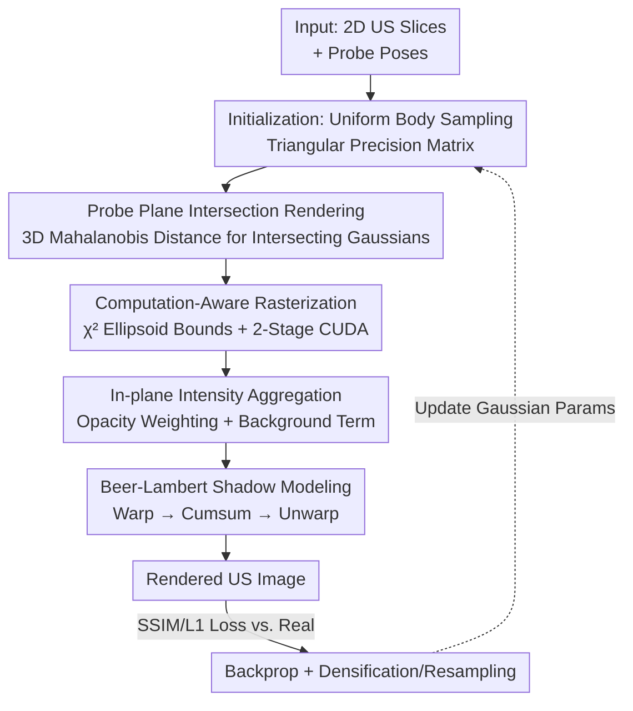

# UltraGauss: Ultrafast Gaussian Reconstruction of 3D Ultrasound Volumes

**Conference**: ICLR 2026  
**OpenReview**: [https://openreview.net/forum?id=0imrI7UXdu](https://openreview.net/forum?id=0imrI7UXdu)  
**Paper**: [VGG Project Page](https://www.robots.ox.ac.uk/~vgg/research/UltraGauss/)  
**Code**: https://www.robots.ox.ac.uk/~vgg/research/UltraGauss/ (Available)  
**Area**: Medical Imaging / 3D Vision  
**Keywords**: Ultrasound Imaging, Gaussian Splatting, 2D-to-3D Reconstruction, Probe Plane Intersection, Fetal Brain

## TL;DR
UltraGauss transforms Gaussian Splatting from "camera projection + depth occlusion" into an ultrasound-specific rendering paradigm of "probe plane intersection + in-plane aggregation." Combined with triangular precision matrix parameterization and two-stage load-balanced CUDA rasterization, it reconstructs 2D ultrasound slices into 3D volumes in ~20 minutes on a single GPU, achieving 0.99 SSIM. Clinical experts generally consider its reconstructions more realistic than baselines.

## Background & Motivation

**Background**: Ultrasound (US) is the most ubiquitous modality in medical imaging—real-time, inexpensive, portable, and free of ionizing radiation. However, in clinical practice, doctors can only view 2D slices, relying on mental reconstruction to visualize 3D anatomical structures. This process is highly operator-dependent, leading to poor reproducibility and high cognitive load. Although 3D volumetric probes exist, their workflows are often offline and hardware costs are high, making them difficult to popularize in resource-limited regions. Thus, reconstructing 3D volumes from conventional 2D acquisitions represents a purely software-based, scalable path.

**Limitations of Prior Work**: Recent learning-based methods follow two main branches, both having significant drawbacks. Implicit NeRF-like representations (ImplicitVol, RapidVol, UltraNerf) are computationally heavy and slow to train; explicit voxel grids are restricted by memory and resolution. More fundamentally, many methods directly adopt optical light transport assumptions—accumulating along rays and modeling occlusion with transmittance—which **fundamentally mismatch** ultrasound physics. Ultrasound involves acoustic waves entering tissue and reflecting back to the probe; there is no such thing as "opaque objects in front occluding those behind."

**Key Challenge**: Classic Gaussian Splatting (GS) is fast and effective because it **projects** 3D Gaussians onto an image plane and performs alpha-compositing in depth order. However, ultrasound images are not perspective renderings; they sample echo intensity (with attenuation) **within the probe plane**. The camera-style "projection + occlusion" paradigm fails here—transmittance $T_j$ would darken the image by treating opaque volumes as occluders, yielding incorrect results.

**Goal**: Design a 2D→3D reconstruction framework that aligns with ultrasound imaging physics while retaining the speed and memory advantages of GS; it must be numerically stable, scalable to millions of Gaussians, and produce photorealism recognized by clinical experts.

**Key Insight**: The authors observe that the core mechanism of ultrasound imaging is not "projection" but the "**intersection of the probe plane with the volume**." Consequently, instead of projecting Gaussians into 2D, the method directly determines where 3D Gaussians **pass through** the probe plane and aggregates intensity within that plane. This naturally eliminates depth occlusion, matches the acquisition geometry of linear/convex probes, and allows for slicing at arbitrary orientations and resolutions.

**Core Idea**: Replace "camera projection rendering" with "probe plane intersection rendering," transforming GS into an efficient approximation of the ultrasound imaging forward model—preserving plane sampling and dominant attenuation behaviors while bypassing expensive wave simulations.

## Method

### Overall Architecture

UltraGauss represents the scene as a set of anisotropic 3D Gaussians (mean $\mu_i$, covariance $\Sigma_i$, intensity $c_i$, coefficient $\alpha_i$). The training objective is to ensure that the images rendered by these Gaussians on each probe plane approximate real ultrasound slices. The core pipeline features four modifications: defining opacity through "plane intersection" instead of "projection"; using triangular precision matrix parameterization to ensure positive definiteness and efficient inversion; employing closed-form $\chi^2$ ellipsoid bounds with two-stage CUDA rasterization to restrict calculation to intersecting Gaussians and pixels; and finally, adding a Beer–Lambert term to model acoustic shadows. The entire process is optimized end-to-end using Adam, with densification/resampling heuristics every 100 steps.

### Key Designs

**1. Probe Plane Intersection Rendering: Replacing "Projection + Occlusion" with Physics-Aligned "Plane Intersection + In-plane Aggregation"**

This is the foundation of the paper, addressing the fundamental mismatch between camera rendering and ultrasound physics. In RGB rendering, the opacity of the $i$-th Gaussian at image point $x$ is calculated via 2D Mahalanobis distance after **projecting it to 2D**: $\hat{\alpha}_i(x)=\alpha_i\exp(-\tfrac12 (x-\mu_i^{2D})^T (\Sigma_i^{2D})^{-1}(x-\mu_i^{2D}))$, with occlusion modeled by cumulative transmittance $T_j=\prod_{k<j}(1-\hat{\alpha}_k)$. UltraGauss reverses this: instead of projecting Gaussians, 2D pixels are **lifted back to the 3D probe coordinate system**, allowing Gaussians to "touch" the probe plane. Specifically, point $x$ is padded with zero to $x|0=[x_1,x_2,0]^T$, Gaussian parameters are transformed to the probe frame via the inverse probe transform $W$ ($\mu_i^{3D}=\hbar^{-1}(W\hbar(\mu_i))$, $\Sigma_i^{3D}=W\Sigma_i W^T$), and opacity is calculated using **3D Mahalanobis distance**:

$$\hat{\alpha}_i(x)=\alpha_i\exp\!\left(-\tfrac{1}{2}\,(x|0-\mu_i^{3D})^T\,(\Sigma_i^{3D})^{-1}\,(x|0-\mu_i^{3D})\right)$$

The final pixel color is the weighted average of intensities of all nearby Gaussians in the plane, plus a uniform background term $\alpha_{BG}, c_{BG}$ (to avoid division by zero and improve stability): $c_{US}(x)=\tfrac{1}{\hat{\alpha}(x)}(\sum_i \hat{\alpha}_i(x)c_i+\alpha_{BG}c_{BG})$, where $\hat{\alpha}(x)=\sum_i\hat{\alpha}_i(x)+\alpha_{BG}$. This approach completely removes depth occlusion (transmittance is used only for secondary attenuation modeling, see Design 4), matches the geometry of linear/convex probes, and, because Gaussians are a continuous representation, allows for **arbitrary resolution and orientation** slicing without external tracking.

**2. Triangular Precision Matrix Parameterization: Directly Learning the Inverse Covariance for Guaranteed Positive Definiteness and Efficiency**

Design 1 requires $(\Sigma^{3D})^{-1}$ for every pixel, while densification and resampling require $\Sigma$ and its decomposition—demanding that the covariance remains positive definite (PD) throughout optimization. While Kerbl et al. used "scale vector $s$ + quaternion $R$" to parameterize $\Sigma=R\,\mathrm{diag}(s^2)R^T$ in camera GS, quaternions require normalization and 3×3 matrix inversion is slow, leading to numerical instability in 3D ultrasound scenes. Consequently, UltraGauss **directly learns the precision matrix (inverse of covariance)**, parameterizing it as the product of a lower triangular matrix $L$:

$$\Sigma^{-1}=LL^T,\qquad L=\begin{bmatrix} L_{11}^2+\beta & 0 & 0\\ L_{12} & L_{22}^2+\beta & 0\\ L_{13} & L_{23} & L_{33}^2+\beta\end{bmatrix}$$

The eigenvalues of a triangular matrix are its diagonal elements; as long as $\beta>0$, they are strictly positive, making $\Sigma^{-1}$ naturally PD without normalization. Furthermore, lower triangular matrices can be inverted extremely quickly using **forward substitution**, making it easy to obtain $\Sigma=(L^{-1})^T L^{-1}$. Even resampling becomes a single step: $y=\mu+L^{-T}z, z\sim\mathcal{N}(0,1)$. Empirically, calculating $\Sigma^{-1}$ is 1.40× faster and resampling is 1.25× faster than the quaternion approach.

**3. Computation-Aware Rasterization: Using Closed-form $\chi^2$ Ellipsoid Bounds and Two-stage Load-balanced CUDA**

Directly calculating the rendering equation involves nested loops over "all pixels × all Gaussians," where most pairs have near-zero opacity. The authors calculate an ellipsoid containing $p\%$ probability mass for each Gaussian, corresponding to 3D squared Mahalanobis distance $\le\chi^2_{3,1-p}$ (7.815 for $p=95\%$). The axis-aligned bounding box (AABB) of the ellipsoid has a closed-form solution: $b^{min/max}=\mu^{3D}\pm\sqrt{\lambda}\,v$, where $\lambda=\chi^2_{3,1-p}\det(\Sigma^{3D})$ and $v$ is derived from the adjugate of the covariance. The key insight is that this 3D box can be **split into two parts**: a 2D box in the probe plane ($b_{1:2}$) and a 1D segment perpendicular to it ($b_3$). A two-stage process followed: **Phase 1** iterates over all Gaussians to cull those where $b_3^{min}>0$ or $b_3^{max}<0$ (not intersecting the plane) and compacts the list. **Phase 2** iterates only over intersecting Gaussians, performing atomic accumulation of color/opacity within their 2D boxes. Both stages distribute work across GPU threads for perfect load balancing.

**4. Beer–Lambert Shadow Modeling: Using "Warp → Cumsum → Unwarp" for Lightweight Acoustic Shadow Approximation**

Plane intersection rendering ignores transmittance, but in ultrasound, waves attenuate as they travel deeper, leaving shadows behind strong reflectors. While other NeRF methods use full physical modeling, the authors found a simple approximation sufficient. Based on the Beer–Lambert law, the intensity attenuation factor for point $x$ is $T(x)=\exp(-\int_0^x \alpha(s)\,ds)\approx\exp(-\sum_{j=0}^{N}\hat{\alpha}_j\delta_j)$, where $\hat{\alpha}_j$ is the opacity along the beam path and $\delta_j$ is the pixel spacing. This can be calculated **simultaneously** for all pixels: first, the ultrasound cone is **warped** into a rectangular grid (beam-aligned), a **cumulative sum (cumsum)** is performed along the rows to get the path integral, and then it is **unwarped** back to the original space. The cost is negligible, but it makes acoustic shadows straighter and more realistic.

### Loss & Training
The model is optimized end-to-end with Adam, optimizing $\{\mu_i, L_i, c_i, \alpha_i\}$ for each Gaussian. Initialization **does not use COLMAP**; instead, $\mu_i$ are **uniformly sampled** within the acquisition volume. Initial values: $c_i=0.5$, $\alpha_i=0.731$ (constrained to $[0,1)$ via sigmoid), and $L_{ij}\sim U[4,5)$. The densification/resampling heuristics follow Kerbl et al. with minor adaptations. Evaluation included $N\in\{100k, 200k, 2M\}$ Gaussians, and experiments were conducted on a single RTX-A4000.

## Key Experimental Results

### Main Results
**Datasets**: (A) 12 3D fetal brain US volumes (160³, 0.6mm³); (B) 3 handheld 2D US videos (~100 frames each). Metrics: SSIM↑ / PSNR↑ / LPIPS↓ at $t=5$ min, $t=20$ min, and convergence. Baselines: UltraNerf, RapidVol, ImplicitVol.

Reconstruction Quality and Speed: UltraGauss outperformed all baselines across all datasets and time budgets. In near-real-time scenarios ($t=5$ min), it led the best baseline by **≥0.20 SSIM**. At convergence, UltraGauss-2M reached an average **SSIM of 0.995**. The variance across different gestational weeks was at least **10× smaller** than all baselines, indicating significantly better stability.

End-to-End Handheld Video Reconstruction (Table 1, SSIM on held-out frames $t=\infty$):

| Model | Video 1 | Video 2 | Video 3 | Avg. | Std. |
|-------|---------|---------|---------|------|------|
| ImplicitVol | 0.674 | 0.797 | 0.772 | 0.747 | 0.065 |
| RapidVol | 0.745 | 0.799 | 0.760 | 0.768 | 0.028 |
| UltraNerf | 0.446 | 0.626 | 0.521 | 0.531 | 0.091 |
| **Ours** | **0.928** | **0.905** | **0.910** | **0.914** | **0.012** |

UltraGauss led by a large margin on every video, with an average SSIM of 0.914 and the lowest variance (0.012). This is critical for clinical scenarios with limited time.

### Ablation Study
| Configuration | Key Metric | Description |
|------|---------|------|
| Triangular Precision | 1.40× / 1.25× Speedup | vs. Quaternion $\Sigma$: 1.40× faster $\Sigma^{-1}$ calc, 1.25× faster $\Sigma$/resampling. |
| w/ Shadowing | +0.005 SSIM / +0.2 dB PSNR | Small metric gain, but shadows are straighter and more realistic. |
| w/o Shadowing | Broken/curved shadows | Shadows terminate abruptly or bulge. |
| w/o Densification | Lacks speckle | Reduced texture detail. |
| Capacity × Time | 100k / 300k / 2M | 100k best at $t=5$ min; 2M highest final accuracy; 300k is the best balance. |

### Key Findings
- **Plane intersection rendering is the catalyst**: By aligning the rendering model with US physics, UltraGauss crushed baselines across all difficulties and time budgets with 10× lower variance.
- **Capacity-Time Trade-off**: More Gaussians allow for higher final accuracy, but smaller models (~100k) converge faster in short time budgets; 300k is the sweet spot.
- **Clinical Expert Blind Evaluation**: 10 experts (avg. 18 years exp.) preferred UltraGauss in $100\%$ of cases for $t\le20$ min. In a "Turing Test," **70%** of experts considered UltraGauss reconstructions more realistic than the ground truth after only 4 mins of training.
- **6.94× Faster than UltraNerf**: Shadow modeling adds realism with almost zero overhead, though it still lacks multi-scattering speckle captured by UltraNerf's scattering parameters.

## Highlights & Insights
- **Perspective Shift in "Reverse Operation"**: While camera GS projects 3D Gaussians to 2D, UltraGauss lifts 2D pixels to 3D to meet the Gaussians—it is the same math reversed. This "Projection ↔ Intersection" duality is an elegant example of migrating tools to new physical domains.
- **Directly Learning Precision Matrix**: When $\Sigma^{-1}$ is frequently needed downstream, learning $\Sigma^{-1}=LL^T$ is superior to learning $\Sigma$ and inverting it. This trick ensures PD guarantees, fast inversion, and sampling.
- **Separable 3D Bounding Boxes**: Splitting the box into in-plane and perpendicular components allows for perfect load balancing on the GPU.
- **Warp-Cumsum-Unwarp Approximation**: Using coordinate transforms and cumsum to approximate path integrals is a pragmatic engineering solution for acoustic shadowing.

## Limitations & Future Work
- **Pose Dependence**: Handheld video workflows rely on external pose estimation; joint "pose-reconstruction" optimization is future work.
- **Simplified Acoustic Physics**: Only Beer–Lambert attenuation is used; it lacks the multi-scattering speckle found in UltraNerf. While less realistic when poses are perfectly known, UltraGauss is more robust when they aren't.
- **Limited Evaluation Scope**: Experiments focused on fetal brains with a small number of volumes and videos. Broad validation across different anatomy and scanners is needed.

## Related Work & Insights
- **vs. UltraNerf**: UltraNerf uses full physical simulation and captures speckle but is slow and sensitive to pose errors. UltraGauss is 6.94× faster and more robust but sacrifices some speckle detail.
- **vs. RapidVol / ImplicitVol**: These are implicit fields with heavy computation and high variance. UltraGauss uses explicit Gaussians with custom CUDA rasterization, achieving minute-level convergence and 10× lower variance.
- **vs. Existing Medical GS**: Prior medical GS works target projection-based modalities (CT/MRI) and keep camera-style depth synthesis. UltraGauss is the **first** GS method tailored for ultrasound 2D→3D reconstruction, shifting the paradigm to plane intersection.

## Rating
- Novelty: ⭐⭐⭐⭐⭐ First US-specific GS; the "projection→intersection" shift is physically motivated.
- Experimental Thoroughness: ⭐⭐⭐⭐ Extensive quantitative, ablation, and expert blind tests, but limited dataset variety.
- Writing Quality: ⭐⭐⭐⭐⭐ Clear derivations; diagrams intuitively explain mechanisms and shadow approximations.
- Value: ⭐⭐⭐⭐⭐ Purely software-based, minute-level convergence on a single GPU; significant for 3D US accessibility.

<!-- RELATED:START -->

## Related Papers

- [\[ICLR 2026\] Anatomy-aware Representation Learning for Medical Ultrasound](anatomy-aware_representation_learning_for_medical_ultrasound.md)
- [\[ICLR 2026\] MedGMAE: Gaussian Masked Autoencoders for Medical Volumetric Representation Learning](medgmae_gaussian_masked_autoencoders_for_medical_volumetric_representation_learn.md)
- [\[ICLR 2026\] U2-BENCH: Benchmarking Large Vision-Language Models on Ultrasound Understanding](u2-bench_benchmarking_large_vision-language_models_on_ultrasound_understanding.md)
- [\[ICLR 2026\] OpenPros: A Large-Scale Dataset for Limited View Prostate Ultrasound Computed Tomography](openpros_a_large-scale_dataset_for_limited_view_prostate_ultrasound_computed_tom.md)
- [\[ICLR 2026\] NAB: Neural Adaptive Binning for Sparse-View CT Reconstruction](nab_neural_adaptive_binning_for_sparse-view_ct_reconstruction.md)

<!-- RELATED:END -->
