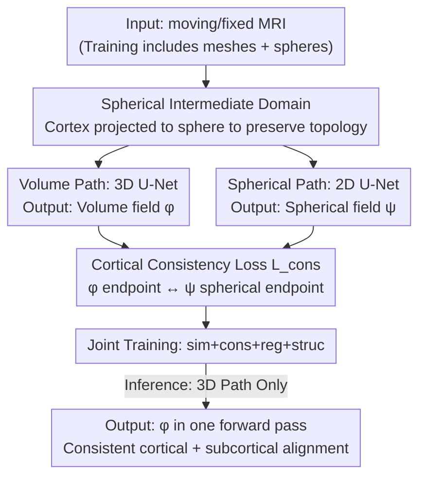

# Unified Brain Surface and Volume Registration

**Conference**: ICLR 2026  
**OpenReview**: [https://openreview.net/forum?id=7FvUJu63zq](https://openreview.net/forum?id=7FvUJu63zq)  
**Code**: https://github.com/mabulnaga/neuralign  
**Area**: Medical Image  
**Keywords**: Brain MRI registration, cortical surface registration, spherical registration, differentiable deformation, consistency loss

## TL;DR
NeurAlign trains a "volume registration network" and a "spherical registration network" simultaneously within a shared framework, coupled via a cortical consistency loss. This allows the cortical (surface) and subcortical (volume) structures of brain MRI to be aligned consistently in a single forward pass. At inference, it requires only a single MRI without the need for meshes or segmentations. Registration accuracy leads significantly (up to +7 cortical Dice points), and speed is orders of magnitude faster than the standard CVS method.

## Background & Motivation
**Background**: The foundation of cross-subject brain MRI analysis is registering two brains together. This requires simultaneous alignment of two types of structures: the thin, highly folded **cortical surface** (outer layer) and the **subcortical volume** (internal structures). Traditionally, these are handled by two disconnected methods: volume registration estimates a dense 3D displacement field in Euclidean space based on image intensity similarity, while cortical registration projects the cortex onto a sphere and aligns it using pre-calculated geometric descriptors (sulcal depth, mean curvature) because spherical mapping naturally preserves topology.

**Limitations of Prior Work**: While volume registration excels at aligning subcortical structures and global anatomy, it often fails on the cortex—the cortex is extremely thin, and folding patterns vary significantly across subjects. Optimization in Euclidean space easily falls into local minima, misassigning voxels of one gyrus to an adjacent one. Conversely, spherical registration can align the cortex but cannot handle volumetric structures at all. Consequently, neuroscience researchers are forced to solve "volume" and "surface" as two separate problems and then combine them using ad-hoc methods.

**Key Challenge**: The standard joint method, CVS, is **serial**: it first performs cortical registration on a sphere and then uses an elastic partial differential equation (PDE) to "extrapolate" the surface deformation to the internal volume. The problem is that this interpolated internal deformation is **not guaranteed** to be consistent with the original volume registration, introducing errors at the cortical-subcortical boundary and undermining whole-brain analysis. Furthermore, CVS takes approximately 2.5 hours per image pair and requires pre-extracted cortical meshes and segmentations. Fundamentally, the serial formulation **decouples** the surface and volume objectives, preventing the calculation of a coherent registration that satisfies both.

**Goal**: To use a unified learning framework that aligns cortical and subcortical structures consistently in the **same forward pass**, without relying on expensive mesh/segmentation preprocessing during inference.

**Key Insight**: The authors' key observation is that cortical registration must occur on a sphere (to preserve topology) and volume registration must occur in 3D (to manage subcortical areas). Rather than serial concatenation, it is better to **optimize the deformation fields of both domains simultaneously and explicitly constrain them to be mutually consistent at the cortex**. Consistency is geometric: the location of a cortical mesh vertex transformed by the volume deformation field should equal its location after being mapped to the sphere, registered via the spherical path, and mapped back to 3D.

**Core Idea**: Use a **spherical intermediate domain** to bridge surface topology and volume anatomy. Coupling the volume network and spherical network during training via a "cortical consistency loss" achieves both topologically correct cortical alignment and accurate subcortical alignment.

## Method

### Overall Architecture
NeurAlign is an unsupervised learning framework that decomposes brain registration into two parallel, coupled paths. The input is a pair of brain MRIs (moving/fixed). During training, their respective cortical meshes and "inflated" spherical representations are also included. The output consists of two differentiable deformation fields: a 3D volume displacement field $\varphi$ and a spherical (2D angular space) displacement field $\psi$. The **volume path** uses a 3D U-Net $F_v(I_1, I_2; \omega_v) = \varphi$ to process image intensities and align subcortical structures. The **spherical path** uses a 2D U-Net $F_s$ to process spherical meshes projected onto a plane, aligning the cortex via geometric descriptors. These two paths are tied together by a **cortical consistency loss $\mathcal{L}_{\text{cons}}$**, which penalizes the difference between the "endpoint of a cortical mesh vertex via $\varphi$" and its "endpoint via the spherical path $\psi$ mapped back to 3D." This forces geometric consistency between the two domains at the cortex. A key engineering value is that meshes and spheres are only used **during training** to provide consistency supervision; **at inference, only the 3D U-Net is executed**, taking an MRI in and outputting the displacement field without needing meshes, spheres, or segmentations.

### Key Designs

**1. Spherical Intermediate Domain: Turning "Topology Preservation" into Optimizable Geometric Coupling**

Directly solving for a bijection $\varphi: M_1 \to M_2$ that aligns both intensity and geometry is extremely difficult—the objective is non-convex and prone to degenerate solutions. Mandating that the cortex maps to the cortex ($\varphi(\partial M_1) \subseteq \partial M_2$) is particularly tricky because the cortex is thin, highly folded, and structurally variable; Euclidean voxel grids cannot capture fine-grained boundary correspondences. NeurAlign's solution is to introduce a fixed **spherical mapping** $\tau_i: \partial M_i \to S^2$ (obtained via cortical inflation, which is invertible), shifting cortical alignment from "brute-forcing in 3D" to "calculating a displacement $\psi: S^2 \to S^2$ on a sphere to align geometric descriptors." Since spherical mapping preserves topology, the constraint set is naturally satisfied. Ideally, the two domains should be strictly consistent, i.e., $\varphi(x) = \tau_2^{-1} \circ \psi \circ \tau_1(x)$. This equality holds only on the zero-measure cortical surface as a hard constraint; the authors **soften** it into a coupling energy:

$$E_{\text{cons}}(\varphi, \psi) = \int_{\partial M_1} f\big(\varphi(x), \tau_2^{-1}(\psi(\tau_1(x)))\big) \, dS(x),$$

where $f$ measures the squared error between the endpoints of the two paths. Thus, cortical alignment is offloaded to the naturally topology-preserving sphere, while the volume path handles subcortical areas. Consistency stitches them back together—avoiding Euclidean disadvantages for the cortex while retaining its advantages for subcortical structures.

**2. Dual Networks + Discrete Cortical Consistency Loss: Allowing Spherical Updates to "Permeate" the Volume**

The continuous formula is implemented as a pair of unsupervised CNNs. The **volume network** outputs a stationary velocity field (SVF), integrated to obtain a differentiable displacement field $\varphi(x) = x + u(x)$, ensuring invertibility. The **spherical network** uses stereographic projection $\pi: S^2 \to \mathbb{R}^2$ to flatten the spherical mesh and a standard 2D CNN to learn a differentiable displacement field in angular space $(\theta, \phi)$ as $\psi(\rho) = \rho + u_s(\rho)$. To handle non-uniform sampling at the poles due to spherical parametrization, all surface losses are weighted by $\sin(\theta)$ for distortion correction, with boundary discontinuities handled via circular padding and 180° cyclic shifts at the poles. The discrete consistency loss coupling the two is:

$$\mathcal{L}_{\text{cons}}(\varphi, \psi, C_1) = \frac{1}{N_v} \sum_{v \in C_1} f\big(\varphi(v), \pi^{-1}(\psi(\pi(v)))\big),$$

For each cortical mesh vertex $v$, it compares the displacement via the 3D field $\varphi$ with the displacement via the 2D spherical warp. $f$ is MSE, and $\pi^{-1}(\cdot)$ is implemented via trilinear interpolation. This loss seems to act only on the zero-measure cortex, but the discrete implementation resolves this: the consistency loss samples the volume deformation field at mesh vertices via trilinear interpolation, **distributing gradients to neighboring voxels**. Combined with the smoothness prior of the deformation field, surface-driven updates at the cortex naturally propagate into the volume—explaining why it can improve both cortical and subcortical alignment simultaneously.

**3. Joint Training Loss: Consistency Requires Structural Supervision**

The system is optimized end-to-end with a combined loss:

$$\mathcal{L}(\varphi, \psi) = \mathcal{L}_{\text{sim}}(\varphi, \psi) + \gamma \mathcal{L}_{\text{cons}}(\varphi, \psi) + \lambda \mathcal{L}_{\text{reg}}(\varphi, \psi) + \kappa \mathcal{L}_{\text{struc}}(\varphi, \psi).$$

Here, $\mathcal{L}_{\text{sim}}$ matches MRI intensities in the volume using local normalized cross-correlation and matching geometric descriptors (sulcal depth + mean curvature) on the sphere. $\mathcal{L}_{\text{reg}} = \|\nabla \varphi\|^2 + \|\nabla \psi\|^2$ constrains smoothness. $\mathcal{L}_{\text{struc}}$ is an auxiliary soft Dice loss used when segmentation labels are available for some image pairs. A notable finding from the ablation study is that **adding the consistency loss alone, or structural Dice supervision alone, does not significantly improve cortical Dice**. Only when "full structural Dice + spherical consistency" coexist does cortical Dice increase substantially while maintaining subcortical Dice. This indicates that consistency loss is not an isolated fix—it requires volume structural supervision to "anchor" subcortical areas so that sphere-driven cortical alignment can propagate consistently across the whole brain. Hyperparameters were set to $\lambda=1.0, \kappa=10.0, \gamma=0.05$ via grid search.

## Key Experimental Results

### Main Results
Evaluated on OASIS-1 + ADNI (training domain) and IXI, Mindboggle-101 (out-of-domain generalization). Metrics include Dice for 43 subcortical structures and 34 cortical regions per hemisphere, percentage of folding voxels (% folds), and deformation field smoothness (SD log det J).

| Dataset | Method | Cortical Dice ↑ | Subcortical Dice ↑ | % folds ↓ | SD logJ ↓ |
|--------|------|------|------|------|------|
| OASIS-1 & ADNI | CVS (Baseline Joint) | 0.681 | 0.715 | 1.73 | 8.737 |
| OASIS-1 & ADNI | uGradICON-seg | 0.583 | 0.701 | 0.688 | 0.41 |
| OASIS-1 & ADNI | VoxelMorph | 0.551 | **0.756** | 0.001 | 0.479 |
| OASIS-1 & ADNI | **NeurAlign** | **0.698** | 0.747 | 0.169 | 0.829 |
| IXI (Outil-of-domain) | CVS | 0.582 | 0.814 | 1.865 | 7.591 |
| IXI (OOD) | uGradICON-seg | 0.639 | **0.825** | 0.602 | 0.399 |
| IXI (OOD) | **NeurAlign** | **0.683** | 0.810 | 0.081 | 0.712 |
| Mindboggle-101 (OOD) | CVS | 0.535 | 0.766 | 2.164 | 7.429 |
| Mindboggle-101 (OOD) | **NeurAlign** | **0.703** | **0.823** | 0.174 | 0.831 |

NeurAlign achieved the highest cortical Dice across all three datasets (statistically significant $p < 0.01$), outperforming the second-best method by up to ~7.5 points. Subcortical Dice was also highest on two datasets, only slightly lower than the best on IXI (~1.5 points). Meanwhile, the folding percentage remained extremely low (0.08%~0.17%), with regular deformation fields—whereas CVS, despite decent subcortical results, had high folding rates and SD logJ up to 7-8, indicating far less smooth deformation fields than NeurAlign.

**Speed**: CVS takes approximately 2.5 ± 0.5 hours per pair (CPU), and uGradICON requires several minutes due to test-time optimization. NeurAlign and other baselines converge in the **millisecond range**—orders of magnitude faster than CVS, without requiring meshes/segments during inference.

### Ablation Study
Component ablation on IXI ($\kappa=1.0, \gamma=0.05$):

| Configuration | Cortical Dice | Subcortical Dice | Notes |
|------|---------|---------|------|
| Base (Pure VoxelMorph) | 0.582 | 0.789 | No additional supervision |
| Base + Dice(subcort) | 0.553 | 0.815 | Subcortical segmentation only |
| Base + Dice(all) | 0.562 | 0.812 | Full structure segmentation only |
| Base + Sphere | 0.560 | 0.736 | Spherical consistency only |
| Base + Dice(all) + Sphere | **0.633** | 0.799 | Full Model |

### Key Findings
- **Consistency loss and structural supervision have a "multiplicative" relationship, not "additive"**: Adding only full-structure Dice supervision moved cortical Dice from 0.582 to 0.562 (even a slight drop). Adding only spherical consistency resulted in only 0.560. Only when used together did it jump to 0.633. This proves the cortical-subcortical consistency constraint is key to fine-grained cortical alignment but depends on volumetric structural supervision.
- **Cortical improvement does not come at the expense of subcortical alignment**: The full model's subcortical Dice (0.799) is only slightly lower than pure Dice supervision (0.812-0.815), while cortical Dice increases significantly.
- **$\kappa$ (Dice weight) trade-off depends on the downstream task**: $\kappa > 1$ generally outperforms the baseline. However, larger $\kappa$ increases structural overlap but potentially degrades local deformation regularity—high $\kappa$ is preferred for atlas-based segmentation, while smaller $\kappa$ for smoother fields is better for longitudinal studies.

## Highlights & Insights
- **Translating "Hard Constraints" into "Optimizable Soft Coupling"**: Cortical mapping is a zero-measure constraint that is nearly impossible to optimize directly. The authors softened it using a spherical intermediate domain and consistency energy. Gradient diffusion via trilinear interpolation allows the constraint to act effectively on the volume. This translation from continuous theory to discrete implementation is an elegant paradigm for "propagating surface constraints into volume."
- **Asymmetric Design: Heavy Training, Light Inference**: Meshes, spheres, and segmentations serve as scaffolding for consistency supervision only during training. At inference, they are discarded, leaving only the 3D U-Net. This compresses a process that took 2.5 hours and relied on complex preprocessing into a millisecond-level step requiring only a single MRI—a qualitative shift in usability for large-scale population studies.
- **Unified Representation for Dual Geometries**: Spheres handle the high-curvature cortical shell, while 3D grids handle the volume. Stitched by a single loss, this avoids the structural "serial-to-boundary" inconsistency found in CVS.

## Limitations & Future Work
- **Authors' Admission**: The differentiable framework cannot handle lesions that change topology (e.g., tumors); this requires lesion masking during training. Generalization to low-quality clinical scans or pediatric brains is unclear. Validated only on T1w modality (as only T1w reliably reconstructs the cortex).
- **Reliance on Preprocessing for Training**: Cortical extraction and spherical inflation pipelines can fail on difficult scans; this can only be mitigated by discarding failed samples or using more robust learned extraction methods (no failures observed in this study's data).
- **Self-Observation**: The ablation table shows consistency loss requires structural supervision to work, implying limited gains in purely unlabeled scenarios. Subcortical Dice on IXI was slightly lower than uGradICON-seg, indicating room for improvement in volume performance on certain out-of-domain data.
- **Extensible Directions**: The consistency loss principle can be extended to any representation with a one-to-one mapping to the cortical mesh (not just spheres), or to other genus-0 topology structures like the hippocampus. It could also integrate with Deep Functional Maps for direct cortical registration on meshes.

## Related Work & Insights
- **vs CVS (Standard Joint Method)**: CVS performs spherical registration, extrapolates via elastic PDE, and then performs intensity refinement. This serial decoupling leads to boundary inconsistencies and takes 2.5 hours per pair. NeurAlign uses **joint training + consistency loss**, taking milliseconds, requiring no meshes at inference, and achieving much better cortical Dice (0.703 vs 0.535 on Mindboggle) and smoother fields.
- **vs Volume Learning (VoxelMorph / uGradICON / SynthMorph / FireANTs)**: These excel subcortically but struggle with the cortex (Euclidean space misassigns gyri). Even with segmentation supervision, cortical Dice remains low. NeurAlign addresses this via the spherical path, leading in cortical Dice while maintaining subcortical performance.
- **vs Spherical Registration (Zhao et al. 2D CNN / Icosahedral CNN)**: These only align the cortex and ignore volumetric structures. NeurAlign is the first to "embed" a spherical registration network into a unified volume-surface learning framework.

## Rating
- Novelty: ⭐⭐⭐⭐⭐ First to use a geometric consistency loss to jointly train spherical cortical registration and 3D volume registration, unifying two historically separate paradigms.
- Experimental Thoroughness: ⭐⭐⭐⭐ 4 clinical datasets including OOD generalization, dual ablation of components and hyperparameters, and comparisons against strong baselines; however, limited to T1w.
- Writing Quality: ⭐⭐⭐⭐⭐ Logical progression from continuous formulas to discrete implementation; clear explanation of the geometric intuition behind consistency loss.
- Value: ⭐⭐⭐⭐⭐ Compressing multi-hour, preprocessing-heavy joint registration into a millisecond process requiring only an MRI is highly practical for large-scale neuroimaging research.

<!-- RELATED:START -->

## Related Papers

- [\[ICLR 2026\] OmniCT: Towards a Unified Slice-Volume LVLM for Comprehensive CT Analysis](omnict_towards_a_unified_slice-volume_lvlm_for_comprehensive_ct_analysis.md)
- [\[ICLR 2026\] MedLesionVQA: A Multimodal Benchmark Emulating Clinical Visual Diagnosis for Body Surface Health](medlesionvqa_a_multimodal_benchmark_emulating_clinical_visual_diagnosis_for_body.md)
- [\[ECCV 2024\] UMBRAE: Unified Multimodal Brain Decoding](../../ECCV2024/medical_imaging/umbrae_unified_multimodal_brain_decoding.md)
- [\[ICLR 2026\] sleep2vec: Unified Cross-Modal Alignment for Heterogeneous Nocturnal Biosignals](sleep2vec_unified_cross-modal_alignment_for_heterogeneous_nocturnal_biosignals.md)
- [\[ICLR 2026\] Spike-based Digital Brain: A Novel Fundamental Model for Brain Activity Analysis](spike-based_digital_brain_a_novel_fundamental_model_for_brain_activity_analysis.md)

<!-- RELATED:END -->
