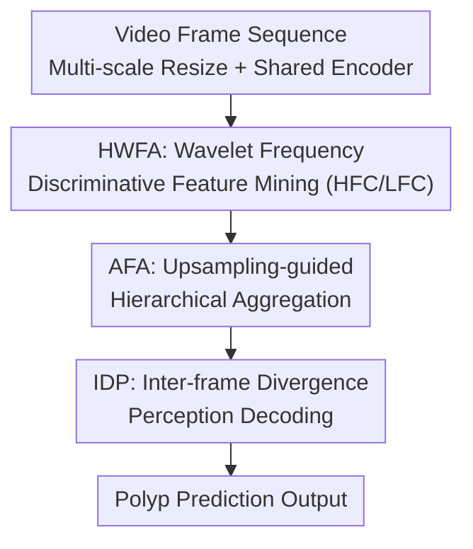

# WavePolyp: Video Polyp Segmentation via Hierarchical Wavelet-based Feature Aggregation and Inter-frame Divergence Perception

**Conference**: ICLR 2026  
**OpenReview**: [https://openreview.net/forum?id=Sm3Y0TMnDv](https://openreview.net/forum?id=Sm3Y0TMnDv)  
**Code**: https://github.com/FishballZhang/WavePolyp  
**Area**: Medical Imaging / Video Segmentation  
**Keywords**: Video polyp segmentation, wavelet transform, frequency domain features, inter-frame difference, temporal consistency

## TL;DR
WavePolyp employs wavelets to decompose per-frame features into high and low frequencies for separate enhancement and aggregation (HWFA). It also introduces a module that performs difference-based attention along the temporal dimension (IDP) to explicitly model polyp variations between adjacent frames. This enables the model to both extract highly camouflaged polyps and maintain stable cross-frame tracking in colonoscopy videos, outperforming previous SOTA on SUN-SEG and CVC-612 across all metrics while achieving near real-time performance (23 FPS).

## Background & Motivation
**Background**: Video Polyp Segmentation (VPS) is a critical technology for assisting early colorectal cancer screening. Early works were mostly Image-level Polyp Segmentation (IPS), relying on CNNs for local textures or Transformers for global context modeling; however, these process single frames and fail to learn temporal dependencies. Subsequent VPS methods (PNS+, SALI, VP-SAM, Diff-VPS, etc.) introduced 2D/3D hybrid convolutions, normalized attention, and long/short-term receptive fields to model inter-frame consistency.

**Limitations of Prior Work**: The paradigm of these VPS methods involves "using inter-frame temporal information to enhance intra-frame spatial representations," which overlooks two blind spots. First, they do not fully exploit discriminative features **within single frames**—polyps often reside in diseased tissue and appear highly similar to the background (i.e., "highly camouflaged"), making it difficult for conventional spatial-domain feature extractors to capture subtle differences. Second, when polyp motion is irregular, frame quality is low, or adjacent frames contain noise/misalignment, an over-reliance on inter-frame correlation can lead to model degradation and error accumulation.

**Key Challenge**: The difficulties of VPS are distributed across two distinct dimensions: **intra-frame**, where stronger discriminability is needed to combat high camouflage, and **inter-frame**, where the model must recognize sudden changes in shape, position, and size caused by intestinal peristalsis and camera shake (i.e., inter-frame divergence). Existing methods treat inter-frame information as a supplement to intra-frame representation, effectively using one tool to solve two fundamentally different problems, resulting in suboptimal performance for both.

**Goal**: To address these issues from two separate lines: frequency-domain analysis within each frame to uncover fine-grained discriminative clues masked by camouflage, and explicit modeling of differences between adjacent frames to stabilize tracking.

**Key Insight**: The authors observe that discriminative information for camouflaged polyps is simultaneously distributed in high-frequency components (textures, edges) and low-frequency components (color, lighting, overall structure). Discrete Wavelet Transform (DWT) is a parameter-free, computationally efficient tool that naturally decomposes features into different frequency bands, making it ideal for capturing subtle variations in visually similar lesion areas. For inter-frame dynamics, they argue that "divergence" itself should be explicitly calculated as a first-class citizen rather than implicitly learned through attention.

**Core Idea**: Use wavelet frequency-domain decomposition + Hierarchical Wavelet-based Feature Aggregation (HWFA) to strengthen intra-frame discriminability, and use Inter-frame Divergence Perception (IDP) along the temporal dimension to explicitly perceive inter-frame differences. These two components complement each other, addressing intra- and inter-frame challenges separately.

## Method

### Overall Architecture
WavePolyp is a VPS network that mimics a doctor's habit of "zooming in/out and comparing frames." It consists of three parts: a shared feature encoder, the HWFA module, and a decoder stacked with IDP blocks. Given a video sequence $I \in \mathbb{R}^{T\times 3\times H\times W}$ of $T$ frames, the model first follows ZoomNeXt to scale each frame to $0.75\times$ and $1.25\times$ auxiliary scales. These three scales are fed into a **shared encoder** to extract multi-layer features, which are then aligned to the $1.0\times$ scale via a Multi-Scale Merging (MSM) network, resulting in four layers of features $\{f_k \mid k=1,2,3,4\}$. These features enter the **HWFA**: DWT is applied to mid-to-high level features to separate high-frequency $f_k^{HF}$ and low-frequency $f_k^{LF}$ components, which are enhanced by HFC/LFC units. An AFA unit then performs upsampling-guided hierarchical aggregation from high to low layers, ultimately re-injecting the frequency clues into the main features to obtain enhanced features $x_1,\dots,x_4$. These enhanced features are sent to a coarse-to-fine cascaded decoder composed of 4 **IDP** blocks, which calculate adjacent frame differences along the temporal dimension and apply difference-based attention. Finally, a polyp prediction head outputs $P \in \mathbb{R}^{T\times 1\times H\times W}$.

### Key Designs

**1. HWFA: Decomposing frames into frequencies for separate enhancement to extract camouflaged clues**

Addressing the "high similarity between polyp and background" issue, HWFA avoids raw spatial-domain extraction. Instead, it uses DWT to decompose feature $f_k$ into high-frequency sub-bands $f_k^{HF}$ (textures, edges) and low-frequency sub-bands $f_k^{LF}$ (color, lighting, global structure), with specific enhancement units for each. The high-frequency path uses the **HFC unit**: features pass through $3\times3$ conv, BN, and a residual layer to preserve texture, followed by Channel and Spatial Attention (CSA) to highlight key areas: $W_k^{HF} = \mathrm{CSA}(\mathrm{BN}(\mathrm{conv}_3(f_k^{HF})) + f_k^{HF})$. The low-frequency path uses the **LFC unit**: since low frequencies contain more global info but also redundancy, BN is replaced with Instance Normalization (IN), and a pair of symmetric Position Normalization (PN) / Inverse Position Normalization (IPN) is added: $W_k^{LF} = \mathrm{CSA}(\mathrm{IPN}(\mathrm{IN}(\mathrm{conv}_3(\mathrm{PN}(f_k^{LF})) + f_k^{LF})))$. This normalization allows the attention to focus on cleaner global information. This separation ensures that high frequencies manage "where edges and textures are," while low frequencies manage "where the overall lesion is," preventing subtle differences from being averaged out.

**2. AFA: Hierarchical aggregation using high-level guidance matrices and window linear transforms**

While HFC/LFC sharpen frequency components, simply concatenating different scales after upsampling can amplify inherent spatial misalignments, introducing noise. The AFA unit addresses this cross-layer alignment. It takes low-level feature $f_k^{HF}$, high-level feature $f_{k+1}^{HF}$, and a high-level guidance matrix $W_{k+1}^{HF}$ as inputs. Using a linear model within a local window $s_w$, the low-level features are transformed: $(f_k^{dh})_i = \sigma_w \mathrm{Down}(f_k^{HF})_i + \mu_w$. The linear coefficients are obtained by minimizing:

$$\min_{\sigma_w,\mu_w} \sum_{i\in s_w}\left[(W_{k+1}^{HF})_i^2\big((f_k^{dh})_i - (f_{k+1}^{HF})_i\big)^2 + \epsilon\sigma_w^2\right]$$

Each pixel is covered by multiple windows; the averaged coefficients $\{\sigma_i,\mu_i\}$ are upsampled to $\{\sigma_h,\mu_h\}$, yielding $f_k^h = \sigma_h \odot f_k^{HF} + \mu_h$. This recursive aggregation from high to low layers results in $f_1^{HF}$ and $f_1^{LF}$ which have absorbed multi-layer discriminative info. When re-injecting, $f_1^{LF}$ is concatenated into high-level $f_3$ (supplementing global semantics), and $f_1^{HF}$ is concatenated into shallow $f_1$ (supplementing small targets and edges). Ablations show that removing AFA causes performance to drop below the baseline, proving that window-based alignment is crucial.

**3. IDP: Explicit inter-frame divergence calculation and temporal difference attention**

To address non-rigid deformations caused by peristalsis and camera shake, the IDP block models "inter-frame divergence" as an explicit signal. Given $Q$, $K$, $V$ flattened from $x_k$, a temporal **Shift** is performed (moving the first frame's feature map to the end), yielding the divergence $\mathrm{Diff} = \mathrm{Shift}(V) - V$. Modulated by a learnable projection $W_V$, the network focuses on regions with significant temporal changes. Crucially, attention is calculated along the **temporal dimension**:

$$O = \mathrm{Conv}\!\left(W_V(\mathrm{Shift}(V)-V)\,\mathrm{Softmax}\!\Big(\tfrac{K^TQ}{\sqrt{HW}}\Big) + Q\right)$$

The resulting $T\times T$ weight matrix characterizes the interaction between all time steps. Multiplying this with $\mathrm{Diff}$ highlights the most significant divergence info for tracking. Since $T$ is small (here $T=5$), the complexity remains low. Finally, two layers of $T\times3\times3$ convolutions (Inter-frame Divergence Diffusion, IDD) spread this info before adding it back to $Q$. The decoder cascades 4 IDP blocks: starting from $x_4$, each IDP enhances temporal features, upsamples, and fuses them with the next scale.

### Loss & Training
The total loss is Binary Cross-Entropy combined with Uncertainty-aware Loss: $L_{total} = L_{bce}(P_t, G_t) + \lambda L_{ual}(P_t, G_t)$. $L_{ual}$ (from ZoomNeXt) penalizes ambiguous predictions to increase confidence. Frames are resized to $352\times352$, clip length $T=5$, and channel count $C=64$. The model is trained for 30 epochs with a batch size of 2 on an RTX 3090 using Adam. The default backbone is ImageNet-pretrained PVTv2-b5, with backbone and head learning rates initialized at 1e-5 and 2e-5, respectively.

## Key Experimental Results

### Main Results
On SUN-SEG (49,136 frames) and CVC-612 (612 frames), WavePolyp outperforms SOTA methods including SLT-Net, ZoomNeXt, AutoSAM, PNS+, and VP-SAM across $S_\alpha$, $E_\phi^{mn}$, $F_\beta^w$, and Dice.

| Dataset | Metric (Dice) | WavePolyp | Prev. SOTA (VP-SAM) | SALI |
|--------|------|------|----------|------|
| SUN-SEG-Easy | Dice | **88.96** | 88.19 | 86.07 |
| SUN-SEG-Hard | Dice | **87.55** | 86.94 | 85.54 |
| CVC-612 | Dice | **94.36** | 93.45 | 93.01 |

While VP-SAM is competitive, it requires a point prompt for every frame, which is impractical in clinical settings; WavePolyp outperforms it without any prompts.

### Performance-Efficiency Comparison (SUN-SEG-Hard, RTX 3090, batch=1)

| Method | Dice | Params | GFLOPs | FPS |
|------|------|--------|--------|-----|
| VP-SAM | 86.94 | 140.27M | 156.86 | 12.74 |
| SALI | 85.54 | 82.73M | 58.15 | 7.93 |
| ZoomNeXt | 85.22 | 84.78M | 102.32 | 22.48 |
| **WavePolyp** | **87.55** | 86.63M | 114.88 | **23.04** |

WavePolyp achieves SOTA accuracy while maintaining near real-time 23.04 FPS, nearly doubling the speed of VP-SAM with significantly fewer parameters.

### Ablation Study
Decomposition of the two major components and their internal units (HFC, LFC, Norm, AFA, Shift, etc.) on SUN-SEG.

| Configuration | Easy $S_\alpha$ | Easy Dice | Hard $S_\alpha$ | Hard Dice |
|------|------|------|------|------|
| Baseline | 89.12 | 87.51 | 88.84 | 86.12 |
| w/o AFA | 87.92 | 87.39 | 87.75 | 85.55 |
| Full model | **90.93** | **88.96** | **90.28** | **87.55** |

### Key Findings
- **HWFA and IDP are complementary**: Adding either component yields gains, but their combination provides the largest boost, especially on the Hard test set.
- **AFA is indispensable**: Removing AFA leads to performance worse than the baseline because the sharpened frequency features from HFC/LFC introduce artifacts if not properly aligned spatially.
- **Frequency decoupling is effective**: Visualizations show $f_1^{HF}$ highlights edges and surface textures, while $f_1^{LF}$ captures overall structure and context.
- **Optimal $T=5$**: If too short, divergence cannot be captured; if too long, distant frames introduce excessive noise that interferes with decision-making.

## Highlights & Insights
- **Divergence as a first-class citizen**: IDP explicitly calculates $\mathrm{Shift}(V)-V$ and uses temporal attention. Since $T$ is small, the overhead of temporal-dimension attention is minimal, enabling both stability and speed.
- **Differentiated normalization by frequency**: HFC uses BN for texture, while LFC uses IN+PN/IPN for context. This "different treatment for different signals" is a fine-grained design that could be transferred to other camouflaged object detection tasks.
- **Window-based linear guidance**: AFA uses high-level matrices $W_{k+1}$ to align semantics with details, essentially a form of "guided filtering with semantic priors" that is more robust than simple concatenation.

## Limitations & Future Work
- Experiments were restricted to colonoscopy videos; cross-domain validation is lacking.
- Failures still occur in cases of extreme occlusion, severe lighting distortion, or intestinal wall overlap.
- The fixed segment length ($T=5$) lacks adaptability to videos with varying motion speeds.
- The HWFA uses fixed DWT rather than learnable wavelets; whether the frequency bands are optimal remains to be explored.

## Related Work & Insights
- **vs SALI / PNS+**: They use temporal info to augment intra-frame representation. Ours treats intra-frame (frequency discriminability) and inter-frame (explicit difference) as two independent lines.
- **vs VP-SAM**: VP-SAM requires prompts; Ours is prompt-free, more accurate, and faster.
- **vs FEDER**: FEDER also uses wavelets for camouflaged segmentation but is designed for images. Ours adapts frequency decoupling for videos and pairs it with inter-frame perception.

## Rating
- Novelty: ⭐⭐⭐⭐ The combination of frequency-domain enhancement and explicit inter-frame divergence is relatively new in VPS.
- Experimental Thoroughness: ⭐⭐⭐⭐ SOTA on all metrics with detailed ablations and efficiency analysis, though limited to colonoscopy.
- Writing Quality: ⭐⭐⭐⭐ Clear structure; motivation aligns well with component design.
- Value: ⭐⭐⭐⭐ Near real-time and SOTA accuracy without requiring prompts, offering high clinical utility.

## Related Papers

- [\[ICLR 2026\] HFSTI-Net: Hierarchical Frequency-spatial-temporal Interactions for Video Polyp Segmentation](hfsti-net_hierarchical_frequency-spatial-temporal_interactions_for_video_polyp_s.md)
- [\[NeurIPS 2025\] A Unified Solution to Video Fusion: From Multi-Frame Learning to Benchmarking](../../NeurIPS2025/medical_imaging/a_unified_solution_to_video_fusion_from_multi-frame_learning_to_benchmarking.md)
- [\[ICLR 2026\] COMPASS: Robust Feature Conformal Prediction for Medical Segmentation Metrics](compass_robust_feature_conformal_prediction_for_medical_segmentation_metrics.md)
- [\[CVPR 2026\] EchoVDiff: Cardiac-Cycle Echocardiography Video Generation from Arbitrary Single Frame](../../CVPR2026/medical_imaging/echovdiff_cardiac-cycle_echocardiography_video_generation_from_arbitrary_single_.md)
- [\[ICLR 2026\] Improving 2D Diffusion Models for 3D Medical Imaging with Inter-Slice Consistent Stochasticity](improving_2d_diffusion_models_for_3d_medical_imaging_with_inter-slice_consistent.md)

<!-- RELATED:END -->

<!-- RELATED:START -->

## Related Papers

- [\[ICLR 2026\] Improving 2D Diffusion Models for 3D Medical Imaging with Inter-Slice Consistent Stochasticity](improving_2d_diffusion_models_for_3d_medical_imaging_with_inter-slice_consistent.md)
- [\[ICLR 2026\] MindMix: A Multimodal Foundation Model for Auditory Perception Decoding via Deep Neural-Acoustic Alignment](mindmix_a_multimodal_foundation_model_for_auditory_perception_decoding_via_deep_.md)
- [\[ICLR 2026\] Functional MRI Time Series Generation via Wavelet-Based Image Transform and Spectral Flow Matching for Brain Disorder Identification](functional_mri_time_series_generation_via_wavelet-based_image_transform_and_spec.md)
- [\[ICLR 2026\] DISCO: Densely-overlapping Cell Instance Segmentation via Adjacency-aware Collaborative Coloring](disco_densely-overlapping_cell_instance_segmentation_via_adjacency-aware_collabo.md)
- [\[ICLR 2026\] Rethinking Model Calibration through Spectral Entropy Regularization in Medical Image Segmentation](rethinking_model_calibration_through_spectral_entropy_regularization_in_medical_.md)

<!-- RELATED:END -->
