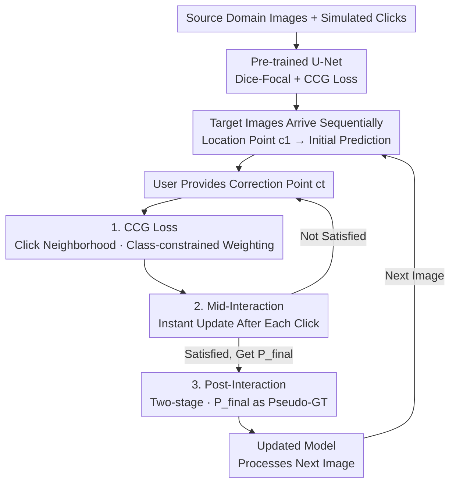

# You Point, I Learn: Online Adaptation of Interactive Segmentation Models for Handling Distribution Shifts in Medical Imaging

**Conference**: ICLR 2026  
**OpenReview**: [https://openreview.net/forum?id=n0vHjCiLD2](https://openreview.net/forum?id=n0vHjCiLD2)  
**Code**: https://github.com/WenTXuL/OAIMS (Available)  
**Area**: Medical Imaging / Interactive Segmentation / Online Adaptation  
**Keywords**: Interactive segmentation, distribution shift, online learning, pseudo-labels, medical imaging

## TL;DR
To address the inconsistency between training and testing distributions after deploying medical image models, this paper treats the "final user-corrected prediction" in interactive segmentation as a pseudo-ground truth. It designs a streamlined online adaptation framework, OAIMS (Post-Interaction + Mid-Interaction updates + Click-Centered Gaussian loss), which consistently outperforms existing methods across 5 fundus and 4 brain MRI datasets, achieving over 10% Dice improvement on brain MRI.

## Background & Motivation
**Background**: Automatic medical image segmentation models perform well on the training distribution, but clinical deployment often involves images from different scanners, pathologies, or modalities. These distribution shifts lead to severe performance degradation. Interactive segmentation (where users guide the model with clicks/scribbles/boxes) naturally leverages human priors. Clinicians can provide reliable annotations even when facing unseen distributions, making the interactive paradigm well-suited for counteracting distribution shifts. Models like SAM, MedSAM, and Med-SA encode clicks into Transformers, while DeepIGeoS and ICNN encode clicks as additional input channels.

**Limitations of Prior Work**: Existing interactive models only "use clicks to improve the current prediction" and **lack a mechanism to update model parameters based on user corrections**—the same error occurs when the next image arrives. A few works on online adaptation (IA+SA, TSCA) do update parameters, but they use sparse cross-entropy/focal loss **calculated only on the few clicked pixels**, ignoring the vast surrounding areas. To prevent overfitting on these few pixels, extra regularization terms are required, which increases hyperparameters and complexity.

**Key Challenge**: A click carries information far beyond a single pixel; it implies that "this entire region should belong to a certain class." Optimizing only on the clicked pixel wastes surrounding supervision signals and easily overfits to a tiny number of annotated points.

**Goal**: Design a practical, streamlined, low-latency online adaptation method that enhances click responsiveness during pre-deployment training and continuously adapts to new distributions using user corrections post-deployment.

**Key Insight**: The authors' key observation is that in a realistic interactive workflow, users continue clicking until they are satisfied. **The final segmentation mask quality is high enough to be treated as a pseudo-ground truth for that image.** With a pseudo-ground truth available, complex regularization is no longer necessary, and direct supervision can be applied.

**Core Idea**: Treat the "final prediction after user correction" as the pseudo-ground truth. Combined with a Click-Centered Gaussian (CCG) loss that acts only on the click neighborhood with class-constrained weighting, update model parameters at two time points: "after each click" and "after the entire image is refined."

## Method

### Overall Architecture
The method is named **OAIMS** (Online Adaptation for Interactive Medical-image Segmentation). The backbone is a modified U-Net where the input consists of the image $I$ concatenated with two guidance maps $G_{fg}, G_{bg}$ (foreground/background clicks represented as Gaussian-smoothed channels normalized to $[0,1]$). The workflow consists of three stages: **Pre-training** uses simulated clicks + Dice-Focal + CCG loss to make the model sensitive to clicks; during **Inference**, images $\{I_1, \dots, I_N\}$ arrive sequentially. For each image, the user provides a location point $c_1$ to trigger an initial prediction, followed by iterative correction points until satisfied, resulting in the final mask $P_{final}=P_T$. Two types of online adaptation are integrated: **Mid-Interaction (MI)** updates parameters immediately after each click, and **Post-Interaction (PI)** performs a two-stage update after the image refinement is complete. Both share the same CCG loss and treat the model's own predictions as pseudo-ground truth without requiring additional manual labeling.

### Key Designs

**1. Click-Centered Gaussian (CCG) Loss: Spreading Supervision to the Neighborhood without Overstepping**

This is the core of the paper, addressing the issue of "wasted signals and overfitting caused by calculating loss only at the clicked pixel." For a click $c$ at pixel $(i',j')$ with class $y_{i', j'} \in \{0, 1\}$, CCG applies supervision to a neighborhood around the click, with weights decaying according to a Gaussian distribution:

$$G_c(i,j)=\exp\!\Big(-\tfrac{(i-i')^2+(j-j')^2}{2\sigma^2}\Big),\quad |i-i'|\le 3\sigma,\ |j-j'|\le 3\sigma$$

Weights beyond $3\sigma$ are truncated to 0. A crucial second mechanism is **class-constrained weighting**: an indicator function $I_c(i,j)$ ensures loss is calculated only for neighborhood pixels that share the same class as the click in the ground truth—if a foreground point is given, only surrounding pixels that are ground-truth foreground are penalized. The full loss is:

$$\mathcal{L}_{CCG}=\frac{\sum_{c\in C}\sum_{i,j}G_c(i,j)\,I_c(i,j)\,\mathrm{CE}\big(\hat P(i,j),P(i,j)\big)}{|C|\,HW}$$

where $P$ is the ground truth (during pre-training) or pseudo-ground truth (during adaptation). Why not calculate for all neighborhood pixels? The authors explain that a click only implies "changing surrounding pixels to its own class"; it provides no information on how surrounding pixels of *other* classes should be segmented. Penalizing other classes causes the model to overfit to specific regions/images, leading to performance drops during distribution shift and online learning. This "Gaussian weighting + class-constrained" mechanism distinguishes CCG from previous sparse point losses and is reused across pre-training, MI, and PI stages.

**2. Post-Interaction Adaptation: Using the Final Mask as Pseudo-GT for Two-stage "Review"**

This targets the pain point that user corrections are typically discarded instead of being fed back into the model. The core hypothesis is that $P_{final}$ is of "sufficiently high" quality to serve as a pseudo-GT (in practice, adaptation is only performed on images the user confirms as satisfactory). Since interaction always begins with a location point, the authors split the update into two phases. **Phase 1** feeds only the location point $c_1$ to get $P_1 = f(I, c_1, \theta)$, and uses the Dice-Focal loss $\mathcal{L}_{DF}=(1-\alpha)\mathcal{L}_D+\alpha\mathcal{L}_F$ to pull $P_1$ toward $P_{final}$ with **a single gradient update**—aiming to improve the model's "first-glance" localization on new data. **Phase 2** aims to improve the model's ability to utilize correction points. To avoid using the user's original clicks $C_T$ (which would make the output identical to $P_{final}$ and zero out gradients), the authors **compare the Phase 1 output $P_1$ with $P_{final}$ and automatically generate one artificial correction point for each false positive/false negative connected component** (up to $T$ points, no manual effort). These points are fed in to obtain $\hat P$, and a joint CCG + Dice-Focal loss $\mathcal{L}_{total}=\mathcal{L}_{DF}+\beta\mathcal{L}_{CCG}$ is used to pull $\hat P$ toward $P_{final}$. This requires only two backpropagations but outperforms older methods requiring dozens.

**3. Mid-Interaction Adaptation: Learning on the Fly to Improve Pseudo-GT Accuracy**

While PI learns after the refinement is done, MI updates the parameters during interaction after every click. The benefit is that the updated parameters immediately influence the next prediction, **improving both subsequent images and the current image**—thereby increasing the quality of $P_T$, which in turn strengthens PI. The mechanism also uses "post-correction prediction as pseudo-GT": let $P_{t-1}=f(I,C_{t-1},\theta_{t-1})$; when a new click $c_t$ arrives, we get $P_t^{initial}=f(I,C_t,\theta_{t-1})$. Then, CCG + Dice-Focal is used to penalize the difference between $P_{t-1}$ and $P_t^{initial}$—**treating $P_t^{initial}$ as pseudo-GT and $P_{t-1}$ as prediction**. This effectively supervises the "old state" with the "new state after one additional click." After updating to $\theta_t$, $P_t=f(I,C_t,\theta_t)$ is calculated, shown to the user, and used for the next round. Since pseudo-GTs in early iterations are imperfect, CCG is vital here: it focuses learning on the clicked vicinity—the most credible and valuable region—preventing the model from learning errors from the rough edges of the pseudo-GT. Note that CCG here is applied only to the latest click $c_t$.

### Loss & Training
Pre-training uses Dice-Focal + CCG (Dice and Focal together handle high foreground/background pixel imbalance). Adaptation: PI Phase 1 uses only Dice-Focal, Phase 2 uses Dice-Focal + $\beta\mathcal{L}_{CCG}$; MI uses Dice-Focal + $\beta\mathcal{L}_{CCG}$. Hyperparameters: $\alpha=0.7, \beta=200, \sigma=3$. All model parameters are updated. Each image/click involves only one gradient update, resulting in extremely low latency (on A5000: MI 0.05s, PI 0.09s; even on CPU: MI 0.25s, PI 0.41s).

## Key Experimental Results

Datasets: 5 Fundus (REFUGE2, G1020, GS1-Drishti, GAMMA, PAPILA; Cup/Disc segmentation); 4 Brain MRI (BRATS-Glioma, ATLAS-Stroke, WMH, TBI; different modalities Flair/T1/T1c/T2 treated as shifts). Default $T=10$ clicks per image. Metrics: Average Dice after 1st/5th/10th click. Benchmarks: ICNN* (non-adaptive baseline pre-trained with CCG), Med-SA (frozen SAM-like), IA+SA, TSCA (online adaptation). PI is ours (Post-Interaction), PI+MI is the combined approach.

### Main Results

Fundus (Average Dice %, Disc/Cup, 10th click):

| Target (Shift) | Metric | ICNN* | TSCA | PI | PI+MI |
|--------|------|------|------|------|------|
| G1020 (Large Shift) | Cup | 88.0 | 90.7 | 92.2 | **92.7** |
| PAPILA (Large Shift) | Cup | 77.1 | 79.0 | 85.8 | **86.2** |
| GS1 (Small Shift) | Cup | 94.1 | 95.5 | 95.7 | **96.5** |

Brain MRI Modality Shift (Dice %, 1st/5th/10th click):

| Modality | ICNN* | TSCA | PI | PI+MI |
|------|------|------|------|------|
| BRATS T1 | 20.7/46.8/62.5 | 34.4/60.9/74.0 | 61.1/72.4/78.9 | **71.2/83.4/88.0** |
| BRATS T1c | 45.4/63.8/75.4 | 50.1/70.2/79.6 | 64.3/74.7/80.4 | **70.4/82.9/87.5** |

OAIMS's advantage is most evident when shifts are large and clicks are few: for BRATS-T1 at the 1st click, PI+MI is 36.8 points higher than TSCA (71.2 vs 34.4). PI alone (two backprops) already outperforms TSCA, which requires over a dozen.

### Ablation Study
Decomposing loss terms in PI/MI (Tab. 5, BRATS-T1 10th click):

| Configuration | BRATS T1 (10 clicks) | Description |
|------|------|------|
| Full (MI Dual Loss + PI Dual Loss + S1) | **88.0** | Full suite |
| MI w/o CCG (DF only) | 48.9 | Drops ~39 pts; DF fails when pseudo-GT is rough |
| w/o MI (PI only) | 78.9 | MI contributes significantly to large shifts |
| PI Phase 2 DF only (w/o CCG) | 76.8 | CCG is also beneficial in PI |
| PI Stage 1 (S1) only | 67.9 | Learning from correction points in Phase 2 is essential |

CCG design ablation (Tab. 7): Removing "class-constrained" (no class) or replacing Gaussian with a uniform kernel (no gaussian) leads to performance drops in most PI and PI+MI cases, proving both are necessary.

### Key Findings
- **CCG as a Stabilizer**: In cases like BRATS-T1 where tumor boundaries are blurred, MI using only Dice-Focal might learn incorrect information if the segmentation error exceeds the true boundary. CCG mitigates this by focusing learning on the click neighborhood.
- **PI and MI are Complementary**: MI adds value on top of PI. With a 5-click budget, PI improves results almost everywhere, but with a 10-click budget, PI's marginal gains are sometimes narrowed as MI addresses the errors (though still beneficial for WMH). Using both is recommended.
- **Robust to Few Clicks**: Even with only 3 or 5 corrections where pseudo-GTs are rougher, PI/PI+MI significantly outperforms frozen baselines (Tab. 4, ATLAS-T1 3 clicks: PI+MI 73.3 vs TSCA 51.4).
- Med-SA (frozen SAM variant) was often worse than the ICNN* baseline, thus was not the primary comparison focus.

## Highlights & Insights
- **The simplicity of "Final prediction as pseudo-GT"**: Interactive workflows naturally produce a high-quality mask validated by the user. Using this as supervision bypasses the "source of labels" bottleneck in online learning and avoids complex regularization.
- **Class-constrained CCG is counter-intuitive but key**: Conventional approaches might use the whole neighborhood. The authors demonstrate that calculating loss *only* for same-class pixels is what prevents overfitting—a detail particularly valuable under large distribution shifts.
- **Clever "automatic correction point generation" in PI**: By generating artificial points from FP/FN components between initial and final masks, the method avoids zero-gradient issues from reusing original clicks while simulating a realistic correction distribution, all with zero extra human effort.
- **Low latency + Model agnostic**: The backbone can be replaced with other architectures. It is nearly seamless even on a CPU, making it very friendly for real-world clinical workflows.

## Limitations & Future Work
- Adaptation focuses only on a single target distribution post-deployment and does not address catastrophic forgetting in Continual Learning—re-adaptation is needed for new distributions.
- Success is bounded by the quality of the pseudo-GT; if users provide poor corrections initially (though the method shows robustness), the effect might be compromised.
- MRI experiments were done on 2D slices; online adaptation for full 3D volumes is not yet validated.
- With a 10-click budget, PI's marginal utility decreases, indicating overlap between mechanisms. Adaptive allocation of PI/MI updates based on interaction budget could be optimized.

## Related Work & Insights
- **vs IA+SA / TSCA**: Also online adaptation for interactive segmentation, but they rely on sparse CE/focal loss on clicked pixels and need extra regularization. Ours uses "Final mask as pseudo-GT + class-constrained CCG" for neighborhood supervision, outperforming them with far fewer backpropagation steps.
- **vs Med-SA / MedSAM / SAM**: These encode prompt information with Transformers but are frozen during inference. Ours uses a lightweight U-Net but outperforms these frozen variants under distribution shifts due to online adaptation capability.
- **vs ICNN (Sakinis et al., 2019)**: Adopts its "clicks as foreground/background guidance channels" input method but adds CCG pre-training (ICNN*) and completes the framework with post-deployment adaptation.

## Rating
- Novelty: ⭐⭐⭐⭐ The combination of "Final prediction as pseudo-GT + class-constrained CCG + dual-timing updates" is clean; the class-constrained logic is insightful.
- Experimental Thoroughness: ⭐⭐⭐⭐⭐ Covers 9 datasets, multi-modal/multi-pathology, varying click budgets, latency, and comprehensive ablations.
- Writing Quality: ⭐⭐⭐⭐ Logical flow from motivation to method; equations are clear.
- Value: ⭐⭐⭐⭐ Low latency, model-agnostic, and directly applicable to medical interactive workflows.

<!-- RELATED:START -->

## Related Papers

- [\[ICLR 2026\] Improving 2D Diffusion Models for 3D Medical Imaging with Inter-Slice Consistent Stochasticity](improving_2d_diffusion_models_for_3d_medical_imaging_with_inter-slice_consistent.md)
- [\[ICCV 2025\] MultiverSeg: Scalable Interactive Segmentation of Biomedical Imaging Datasets with In-Context Guidance](../../ICCV2025/medical_imaging/multiverseg_scalable_interactive_segmentation_of_biomedical_imaging_datasets_wit.md)
- [\[ICLR 2026\] Bridging Radiology and Pathology Foundation Models via Concept-Based Multimodal Co-Adaptation](bridging_radiology_and_pathology_foundation_models_via_concept-based_multimodal_.md)
- [\[ICLR 2026\] Joint Adaptation of Uni-modal Foundation Models for Multi-modal Alzheimer's Disease Diagnosis](joint_adaptation_of_uni-modal_foundation_models_for_multi-modal_alzheimers_disea.md)
- [\[CVPR 2025\] OpenMIBOOD: Open Medical Imaging Benchmarks for Out-Of-Distribution Detection](../../CVPR2025/medical_imaging/openmibood_open_medical_imaging_benchmarks_for_out-of-distribution_detection.md)

<!-- RELATED:END -->
