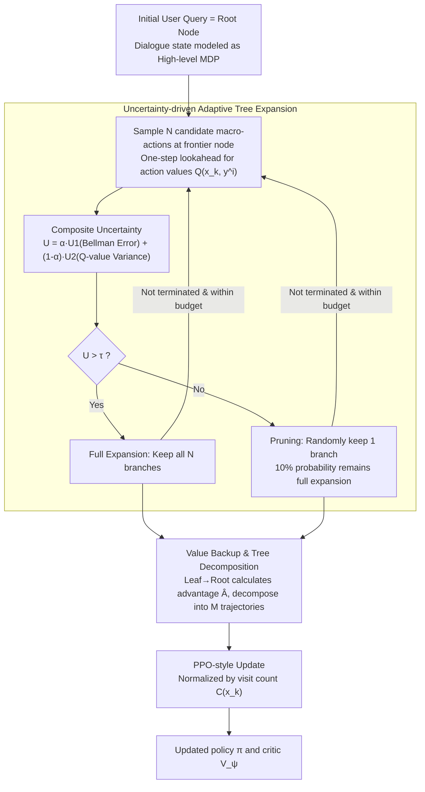

# ATPO: Adaptive Tree Policy Optimization for Multi-Turn Medical Dialogue

**Conference**: ICLR 2026  
**arXiv**: [2603.02216](https://arxiv.org/abs/2603.02216)  
**Code**: [https://github.com/Quark-Medical/ATPO](https://github.com/Quark-Medical/ATPO)  
**Area**: Medical NLP  
**Keywords**: Multi-turn medical dialogue, Tree search, Policy optimization, Uncertainty-guided, Hierarchical MDP, Value function estimation, LLM alignment  

## TL;DR
This paper proposes the ATPO (Adaptive Tree Policy Optimization) algorithm, which models multi-turn medical dialogues as a Hierarchical Markov Decision Process (H-MDP). It dynamically allocates rollout budgets through an uncertainty-aware adaptive tree expansion mechanism, guiding exploration via a composite uncertainty measure of Bellman error and action-value variance. Using Qwen3-8B, it outperforms GPT-4o on three medical dialogue benchmarks.

## Background & Motivation

**Background**: Medical Large Language Models (LLMs) have achieved SOTA performance in single-turn QA (e.g., medical exams, disease diagnosis). However, in real-world medical dialogues, initial user information is often incomplete, requiring the model to proactively ask follow-up questions to collect critical information.

**Limitations of Prior Work**:
- Prompt engineering methods (e.g., MEDIQ) often decrease accuracy when models are asked to be proactive.
- SFT methods merely mimic surface patterns of training data, leading to poor generalization.
- Trajectory-level preference optimization depends on expensive preference data and is sensitive to distribution shifts.
- GRPO struggles with effective credit assignment in long-horizon tasks.
- PPO's value function estimation is unstable in multi-turn dialogue scenarios.

**Key Challenge**: Multi-turn medical dialogue is essentially a long-horizon sequential decision-making problem. Existing RL methods either fail at credit assignment (GRPO shares the same advantage across the entire trajectory) or provide inaccurate value estimation (PPO's single-step critic accumulates error in long dialogues).

**Goal**: How to achieve efficient and accurate policy optimization in multi-turn medical dialogues—both estimating the value of each turn precisely and exploring the dialogue space efficiently.

**Key Insight**: Model the problem as an H-MDP and perform tree search at the dialogue turn level, using uncertainty metrics to adaptively allocate the computation budget.

**Core Idea**: Identify high-uncertainty dialogue states through a composite measure of Bellman error and Q-value variance to selectively expand tree nodes, simultaneously improving sampling diversity and critic accuracy.

## Method

### Overall Architecture
ATPO addresses the challenge of policy optimization in multi-turn medical dialogues: where GRPO uses a coarse credit assignment by sharing one advantage across a trajectory, and PPO suffers from inaccurate value estimation due to error accumulation in its single-step critic. ATPO's approach is to expand the entire dialogue process into a search tree and use uncertainty to spend the limited rollout budget on dialogue states truly worth exploring.

Specifically, the initial user query is the root node, and each node represents a dialogue state. At each non-terminal node, the assistant model first samples $N$ candidate macro-actions (a follow-up question or a final answer) and calculates a composite uncertainty score. If the score is high, it performs a full expansion (retaining all $N$ branches to explore deeper); if the score is low, it prunes the tree (retaining only 1 branch). This "sampling—uncertainty calculation—expansion decision" loop continues until all dialogues terminate or the number of leaf nodes reaches the budget. After the tree is built, target values and advantages for each node are calculated via backtracking from leaf nodes. The tree is then decomposed into root-to-leaf trajectories for PPO-style updates to the policy and critic.

### Key Designs

**1. Hierarchical MDP Modeling: Splitting turns and tokens into two levels for turn-level credit assignment**

ATPO decomposes the dialogue into high-level and low-level MDPs. In the high-level MDP, a macro-action $y_k$ is the complete token sequence output by the assistant in the $k$-th turn. The state $x_k$ contains the interaction history and the current user query $q_k$. In the low-level MDP, micro-actions $y_{k,t}$ correspond to individual tokens. Optimization and credit assignment are placed at the high level—all tokens within a turn share the same macro-action advantage. This addresses a core pain point: meaningful decisions are "what to ask this turn" or "whether to give an answer." Token-level advantages lead to extremely sparse rewards, while turn-level advantages map credit directly to the decision granularity.

**2. Uncertainty-driven Adaptive Tree Expansion: Using complementary signals to decide node importance**

This is the core of ATPO, answering where to spend the limited rollout budget. For a state $x_k$, $N$ candidate macro-actions $\{y_k^i\}_{i=1}^N$ are sampled. A one-step lookahead computes the action value for each candidate: $\hat{Q}(x_k, y_k^i) = r(x_k, y_k^i) + \gamma V_\psi(x_{k+1}^i)$. Two signals are refined: **Bellman Error** $U_1$ is the absolute difference between the current critic estimate and the empirical lookahead value, reflecting estimation accuracy. **Q-value Variance** $U_2$ is the variance of the $N$ candidate estimates (with Z-score normalization), reflecting policy hesitation and environment randomness. The composite score is:

$$U = \alpha U_1 + (1-\alpha) U_2, \quad \alpha = 0.3$$

When $U(x_k) > \tau$, all $N$ branches are kept for deeper exploration. When $U(x_k) \leq \tau$, only 1 branch is kept (with a 10% bypass probability). $U_1$ ensures more samples where the critic is inaccurate, while $U_2$ encourages exploration where the policy is uncertain. Unlike TreePO's fixed $N$-ary expansion which grows exponentially, ATPO's adaptive allocation shifts budget to necessary deep-layer states.

**3. Value Backup and Tree Decomposition: Recursive value calculation for low-variance advantages**

Once the tree is constructed, values are backed up from leaf nodes. The target value $\hat{V}$ of a leaf node equals its immediate reward. For non-leaf nodes, it is the average of the one-step TD targets of all children (where the number of children $B(x_k)$ is $N$ for full expansion and 1 for pruned nodes). The advantage uses the standard one-step TD formula:

$$\hat{A} = r + \gamma V_\psi(x_{k+1}) - V_\psi(x_k)$$

Using the critic estimate $V_\psi$ rather than the backed-up target value for advantage calculation ensures non-zero learning signals even for pruned nodes. This structure provides lower variance than pure Monte Carlo (GRPO) and higher accuracy than a single critic (PPO). Finally, the tree is decomposed into $M$ leaf-to-root trajectories.

**4. PPO-style Update with Visit Count Normalization: Preventing over-optimization of shared nodes**

Each trajectory is used to update the policy with a PPO-style objective, where the macro-action advantage is distributed to all tokens in that turn. A critical step is introducing visit count $C(x_k)$ for normalization. Nodes near the root are shared by many trajectories; without normalization, these high-frequency nodes would be over-optimized. Ablations show that removing this normalization leads to uncontrolled entropy growth and policy collapse, while normalizing the value loss as well leads to entropy collapse.

## Experimental Setup

### Environment
- **User Simulator**: Implemented via Qwen3-8B, strictly answering based on atomic facts. GPT-4o verified instruction following at 100% with only 1.2% hallucination.
- **Assistant Agent**: Must choose the correct answer from options, can iteratively query the user simulator.
- **Reward Function**: Based solely on final answer correctness: Correct +3, Incorrect 0, Invalid Format -1.

### Datasets
- **MedicalExam**: 150 samples from 5 sources (MedQA/MedMCQA/MMLU/SelfExam/QMAX).
- **MedQA**: 1,268 samples from the MEDIQ test set.
- **MedMCQA**: 536 samples constructed from the MedMCQA validation set.
- Training data: 14,256 samples (66% MEDIQ + 34% MedMCQA).

### Key Experimental Results

| Model | Method | MedicalExam | MedQA | MedMCQA |
|------|------|-------------|-------|---------|
| Qwen3-8B | GRPO | 60.93 | 57.92 | 51.12 |
| Qwen3-8B | TreePO | 65.33 | 61.81 | 54.74 |
| Qwen3-8B | ATPO ($U_1+U_2$) | **65.87** | **64.07** | 53.66 |
| GPT-4o | MEDIQ | 64.00 | 63.15 | 53.03 |

- ATPO ($U_1+U_2$) at 8B scale outperforms GPT-4o on MedQA by **+0.92%**.
- Compared to TreePO, ATPO shows absolute gains on MedQA: 1.7B (+0.82%), 4B (+1.73%), 8B (+2.26%).
- SFT (including distillation from GPT-4o) provides limited gains, making RL training essential.

### Ablation Study
- **Uncertainty Metrics**: $U_1+U_2$ improves sample return variance (comparable to GRPO), while the critic value loss is significantly lower than PPO. Using $U_1$ alone concentrates exploration in shallow layers; adding $U_2$ enables deeper, more uniform coverage.
- **Visit Count Normalization**: Removing it led to policy collapse. Normalizing value loss as well resulted in entropy collapse, where the model degraded to a sub-optimal single-turn strategy.
- **Simulator Generalization**: Replacing the test-time simulator with Llama-3.3-70B-Instruct resulted in almost no performance change, proving no overfitting to the specific simulator.

## Highlights & Insights

1.  **Adaptive Exploration**: The composite measure of Bellman error and Q-value variance balances exploration for better value estimation ($U_1$) and policy diversity ($U_2$).
2.  **Efficiency**: ATPO achieves PPO's best performance in the shortest time (2.22h vs PPO 3.02h vs GRPO 4.86h) due to higher quality training data despite higher rollout overhead (45% vs 25%).
3.  **Credit Assignment**: Turn-level advantages in H-MDP effectively address the sparse reward problem in multi-turn dialogues.

## Limitations & Future Work

1.  **Hyperparameters**: The expansion thresholds $\tau$ and $\alpha$ are manually set and may require tuning for different tasks.
2.  **Turn-level Distribution**: Macro-action advantages are distributed uniformly within a turn, without distinguishing critical tokens from redundant ones.
3.  **Simulator Realism**: The simulator is based on predefined facts, which may differ from the free-form expressions of real patients.
4.  **Task Scope**: Validated only on MCQ medical datasets; open-ended diagnostic scenarios remain to be explored.

## Related Papers

- [\[ACL 2026\] IndicMedDialog: A Parallel Multi-Turn Medical Dialogue Dataset for Accessible Healthcare in Indic Languages](../../ACL2026/medical_nlp/indicmeddialog_a_parallel_multi-turn_medical_dialogue_dataset_for_accessible_hea.md)
- [\[AAAI 2026\] A Principle-Driven Adaptive Policy for Group Cognitive Stimulation Dialogue for Elderly with Cognitive Impairment](../../AAAI2026/medical_nlp/a_principle-driven_adaptive_policy_for_group_cognitive_stimu.md)
- [\[NeurIPS 2025\] Shallow Robustness, Deep Vulnerabilities: Multi-Turn Evaluation of Medical LLMs](../../NeurIPS2025/medical_nlp/shallow_robustness_deep_vulnerabilities_multi-turn_evaluation_of_medical_llms.md)
- [\[ICLR 2026\] From Medical Records to Diagnostic Dialogues: A Clinical-Grounded Approach and Dataset for Psychiatric Comorbidity](from_medical_records_to_diagnostic_dialogues_a_clinical-grounded_approach_and_da.md)
- [\[ACL 2025\] Adaptive-VP: A Framework for LLM-Based Virtual Patients that Adapts to Trainees' Dialogue to Facilitate Nurse Communication Training](../../ACL2025/medical_nlp/adaptive-vp_a_framework_for_llm-based_virtual_patients_that_adapts_to_trainees_d.md)

<!-- RELATED:END -->

<!-- RELATED:START -->

## Related Papers

- [\[ICLR 2026\] KnowGuard: Knowledge-Driven Abstention for Multi-Round Clinical Reasoning](knowguard_knowledge-driven_abstention_for_multi-round_clinical_reasoning.md)
- [\[ICLR 2026\] Knowledgeable Language Models as Black-Box Optimizers for Personalized Medicine](knowledgeable_language_models_as_black-box_optimizers_for_personalized_medicine.md)
- [\[ICLR 2026\] Cancer-Myth: Evaluating Large Language Models on Patient Questions with False Presuppositions](cancer-myth_evaluating_large_language_models_on_patient_questions_with_false_pre.md)
- [\[ICLR 2026\] GALAX: Graph-Augmented Language Model for Explainable Reinforcement-Guided Subgraph Reasoning in Precision Medicine](galax_graph-augmented_language_model_for_explainable_reinforcement-guided_subgra.md)
- [\[ICLR 2026\] mCLM: A Modular Chemical Language Model that Generates Functional and Makeable Molecules](mclm_a_modular_chemical_language_model_that_generates_functional_and_makeable_mo.md)

<!-- RELATED:END -->
