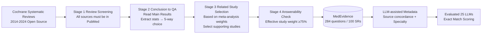

# Can Large Language Models Match the Conclusions of Systematic Reviews?

**Conference**: ICLR 2026  
**OpenReview**: [https://openreview.net/forum?id=uIJyYkOgAy](https://openreview.net/forum?id=uIJyYkOgAy)  
**Code/Data**: MedEvidence Benchmark (public release promised)  
**Area**: Medical NLP / LLM Evaluation Benchmark  
**Keywords**: Systematic Reviews, Evidence-based Medicine, LLM Evaluation, Evidence Synthesis, Scientific Skepticism, MedEvidence  

## TL;DR
The authors constructed the **MedEvidence** benchmark—rewriting conclusions from 100 Cochrane Systematic Reviews (SRs) into 284 closed-ended questions paired with their source studies. This allows LLMs to replicate expert conclusions under "same material" controlled conditions. Evaluating 25 LLMs revealed: reasoning models are not necessarily better, marginal gains diminish with model size, and medical fine-tuning often decreases performance. Models generally lack "scientific skepticism" regarding low-quality evidence, failing to match expert conclusions in at least 37% of cases.

## Background & Motivation
**Background**: Scientific literature is growing exponentially. Producing one systematic review takes an average of 67 weeks of intensive labor. Consequently, LLM-assisted tools like Deep Research, Elicit, and OpenEvidence are being rapidly deployed, with the U.S. FDA even launching an LLM-aided scientific review pilot in May 2025. LLMs appear poised to take over this cornerstone of evidence-based medicine.

**Limitations of Prior Work**: However, the actual capability of LLMs in systematic reviews is poorly understood. On one hand, past evaluations of medical LLMs mostly tested "static internal knowledge" (e.g., USMLE multiple-choice), focusing on knowledge recall. On the other hand, few works evaluating "summary generation" quality (Wallace, O'Doherty, etc.) lack verifiable ground truths and require sentence-by-sentence expert verification, which is slow and hard to scale, with sample sizes often $N < 10$. Existing fact-checking benchmarks (MedREQAL, HealthFC) either omit the original sources (reducing to knowledge recall) or provide only "pre-synthesized analyses" as evidence (reducing to information retrieval), failing to test the core challenge of "reasoning across multiple unsynthesized primary studies."

**Key Challenge**: The difficulty of systematic reviews lies in weighing evidence strength, maintaining skepticism toward low-quality results, and providing reliable recommendations across multiple primary papers with varying study types, sample sizes, and bias risks, or even conflicting conclusions. Current benchmarks fail to test this "cross-source synthesis + critical skepticism" capability.

**Goal**: Strip the problem to its cleanest form—**provided with exactly the same source studies as experts, can an LLM replicate the specific conclusions found in systematic reviews?** By removing interference variables like literature retrieval, screening, and long-form writing, the focus is placed on core evidence synthesis reasoning.

**Core Idea**: **[Controlled Closed QA]** Convert review conclusions into 5-option closed-ended questions (comparing intervention A vs. control B with outcomes as higher/lower/same/uncertain/insufficient). Ground truths come directly from Cochrane expert conclusions, transforming open-ended evaluation—which previously required expert auditing—into a large-scale, automated exact-match task.

## Method

### Overall Architecture
MedEvidence is essentially a four-stage manual curation pipeline: **"Expert Conclusion → Closed QA → Source Literature Matching → Answerability Check,"** supplemented by LLM-assisted metadata annotation (source concordance, medical specialty). The final output consists of 284 questions with rich metadata, paired with 329 cited studies (114 with full texts), upon which 25 LLMs were systematically evaluated.

### Key Designs

**1. Data Source Selection: Anchoring label credibility with Cochrane as the gold standard.** All data comes from Cochrane Systematic Reviews published via PubMed—a gold standard source maintained by over 30,000 volunteer clinical authors, highly standardized, and long-recognized in evidence-based medicine. This standardization allows for systematic "conclusion to QA" conversion. The **certainty of evidence** explicitly labeled by Cochrane using the GRADE framework (high/moderate/low/very low) serves as a natural dimension for analyzing model behavior. Full-text source documents were prioritized from the BIOMEDICA dataset (CC-BY 4.0), failing which abstracts were retrieved via the PubMed Entrez API.

**2. Manual Conversion of Conclusions to Closed QA: Scaling open evaluation.** Three annotators with 1–5 years of graduate education read the "Main Results" subsection of review abstracts to identify sentences comparing interventions and controls. These were rewritten into the uniform format: "Is [outcome] higher, lower, or the same when comparing [intervention] to [control]?" Answers fall into five fixed categories. Two boundary categories are specifically defined: **insufficient data** (reviewers state no studies or data suffice for analysis) and **uncertain effect** (analysis performed but no conclusion could be reached due to evidence issues). These "admissions of uncertainty" serve as probes for LLM weaknesses.

**3. Related Study Selection + Answerability Check: Ensuring "materials suffice for conclusion replication."** This is the hardest design step—ensuring provided source studies are "enough" to derive the expert conclusion. Annotators selected studies based on the "weight" assigned in the review's meta-analysis. Answerability was then verified: a question is answerable if and only if **at least 75% of the total meta-analysis weight comes from "effective studies."** "Effective" means the study provides numerical values for both groups and statistical details (raw counts, p-values, CI, or risk ratios). The most common reason for exclusion was the source abstract failing to clearly report statistics for an outcome summarized in the review. This step controls "label noise"—wrong answers cannot be attributed to insufficient materials.

**4. LLM-assisted Source Concordance Annotation: Quantifying "evidence conflict."** Using DeepSeek-V3, **one source study at a time** was provided to answer the question. If a single source's classification matched the final gold standard, it was deemed "in agreement." Source concordance is defined as the proportion of agreeing source documents: $$\text{concordance} = \frac{\#\{\text{Single-source answer} = \text{SR ground truth}\}}{\#\text{Related source studies}}$$. This indicator directly characterizes "conflict depth," and LLM performance varies monotonically with it, revealing model collapse under conflicting evidence.

## Key Experimental Results

### Main Results (25 LLMs, Zero-shot Exact Match)

| Model | Average Accuracy (95% CI) | Note |
|------|------------------|------|
| DeepSeek-V3 | **62.40%** (56.35, 68.45) | Strongest |
| GPT-4.1 | 60.40% (54.30, 66.50) | Frontier model |
| Human Clinical Experts (Time-constrained) | **< 75% (Best, still higher than all models)** | Pink dashed reference |
| Other 23 Models | Significantly lower than above | Includes reasoning/medical/various scales |

Point: **No model reached or exceeded the best human experts**, even though experts worked under time constraints without the depth of analysis performed by the original review authors. Frontier models fail to match expert conclusions on approximately **37%** of tasks.

### Ablation Study

| Dimension | Finding |
|----------|------|
| Reasoning vs. Non-reasoning | DeepSeek-V3 > DeepSeek-R1; reasoning **does not necessarily** improve performance |
| Token Length | Accuracy **significantly decreases** as input tokens increase (even within context windows) |
| Outcome Recall | higher/lower best → no difference/insufficient middle → **uncertain effect worst** (models dislike uncertainty) |
| Evidence Certainty | Accuracy **rises monotonically** with GRADE quality levels |
| Source Concordance | Monotonic rise: DeepSeek-V3 reaches 92.45% at 100% concordance, but only 41.21% at 0% |
| Medical Fine-tuning | Nearly all **decreased accuracy**, knowledge-based tuning hurts generalization |
| Model Size | Significant gains from 7B→70B; **returns diminish sharply after 70B** |
| Robustness | Shuffling source order or removing CoT had no significant impact; few-shot provided minor gains |

### Key Findings
Models differ from human experts: they collapse when facing **conflicting evidence** (accuracy halved at low concordance), lack skepticism with **low-quality evidence**, and tend to be overconfident when faced with **uncertain conclusions**. This "cross-source synthesis + critical skepticism" evades the current scaling paradigm—test-time compute, parameter scale, and domain fine-tuning all failed to bridge the gap.

## Highlights & Insights
- **Clean Problem Isolation**: Turning the complex task of "performing a systematic review" (retrieval, screening, writing) into a closed-ended reproduction task preserves the core difficulty (synthesis + skepticism) while enabling large-scale automated scoring.
- **Source Concordance as a Masterstroke**: Quantifying "evidence conflict" via single-source LLM agreement transforms abstract "critical reasoning" into a measurable, stratified, and highly explanatory variable.
- **Counter-intuitive Conclusions & Deployment Warnings**: Improved reasoning, scale, and medical tuning are not silver bullets. This pierces the optimism of existing clinical deployments as "bigger and more specialized" isn't enough.
- **Uncertain/Insufficient Categories as Probes**: Including "admitted ignorance" as an answer category precisely identifies the deep behavioral flaw of LLM overconfidence and lack of scientific skepticism.

## Limitations & Future Work
- **Selection Bias**: Only reviews with available sources (full text or abstract) were included, possibly biasing toward certain research types.
- **Not a Full SR Workflow**: Explicitly isolates retrieval, screening, and risk-of-bias assessment—a trade-off for control that also sets a performance ceiling.
- **Labels from Single Review Conclusions**: Future work could introduce multi-expert consensus or updated conclusions to improve benchmark reliability.
- **Judge LLM for Concordance**: Source concordance depends on DeepSeek-V3, which may introduce its own model bias.

## Related Work & Insights
- **vs. MedREQAL / HealthFC**: Both either omit original sources or provide synthesized analysis. MedEvidence mandates "reasoning across multiple unsynthesized primary studies," which is closer to real SRs.
- **vs. ConflictingQA / ClashEval / ConflictBank / KNOT**: These generic conflict benchmarks use Wikipedia-style factoids; Ours uses peer-reviewed medical literature and authentic evidence conflicts.
- **Insight**: Long context $\neq$ Synthesis (reconfirmed that performance drops as tokens increase). RLHF amplifies linguistic overconfidence. When designing evaluations for evidence-based AI, "admitting uncertainty" and "skepticism of low quality" should be first-class metrics, not just accuracy.

## Rating
- **Novelty**: ⭐⭐⭐⭐ — The "controlled reproduction of expert conclusions" and source concordance quantification are very fresh, turning evidence synthesis into an automated probe.
- **Experimental Thoroughness**: ⭐⭐⭐⭐⭐ — 25 models from 7B to 671B, reasoning vs. non-reasoning, medical tuning, and multi-dimensional stratification across token length, quality, and concordance.
- **Writing Quality**: ⭐⭐⭐⭐ — Motivation is logically progressive, boundaries with related work are clear, and Figures 4–7 provide strong support.
- **Value**: ⭐⭐⭐⭐⭐ — Directly challenges the readiness of LLM tools for systematic reviews already being deployed, providing a gold standard benchmark for evidence-based AI.

<!-- RELATED:START -->

## Related Papers

- [\[ICLR 2026\] Cancer-Myth: Evaluating Large Language Models on Patient Questions with False Presuppositions](cancer-myth_evaluating_large_language_models_on_patient_questions_with_false_pre.md)
- [\[ICLR 2026\] CounselBench: A Large-Scale Expert Evaluation and Adversarial Benchmarking of Large Language Models in Mental Health Question Answering](counselbench_a_large-scale_expert_evaluation_and_adversarial_benchmarking_of_lar.md)
- [\[ACL 2026\] Beyond the Leaderboard: Rethinking Medical Benchmarks for Large Language Models](../../ACL2026/medical_nlp/beyond_the_leaderboard_rethinking_medical_benchmarks_for_large_language_models.md)
- [\[ACL 2026\] Can Continual Pre-training Bridge the Performance Gap between General-purpose and Specialized Language Models in the Medical Domain?](../../ACL2026/medical_nlp/can_continual_pre-training_bridge_the_performance_gap_between_general-purpose_an.md)
- [\[ICLR 2026\] Knowledgeable Language Models as Black-Box Optimizers for Personalized Medicine](knowledgeable_language_models_as_black-box_optimizers_for_personalized_medicine.md)

<!-- RELATED:END -->
