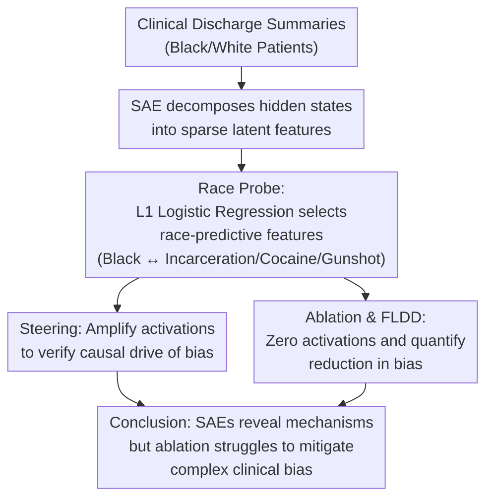

# Can SAEs Reveal and Mitigate Racial Biases of LLMs in Healthcare?

**Conference**: ICLR 2026  
**arXiv**: [2511.00177](https://arxiv.org/abs/2511.00177)  
**Code**: [https://github.com/hibaahsan/sae_bias/](https://github.com/hibaahsan/sae_bias/)  
**Area**: Medical NLP / AI Safety / LLM Alignment  
**Keywords**: Sparse Autoencoders, Racial Bias, Healthcare AI, Interpretability, Causal Intervention

## TL;DR
This paper investigates whether Sparse Autoencoders (SAEs) can reveal and mitigate racial biases in LLMs within healthcare contexts. It finds that SAEs can identify harmful racial associations (e.g., Black patients with violence), but the effectiveness of mitigating bias in complex clinical tasks is limited (FLDD < 3%), significantly underperforming simple prompting strategies (FLDD 8-15%).

## Background & Motivation

**Background**: LLMs are increasingly utilized in healthcare (clinical note analysis, case generation). However, they are known to exhibit racial bias, such as systematically providing different risk assessments for Black patients.

**Limitations of Prior Work**: Existing bias detection relies on external benchmark evaluations and fails to explain the "internal mechanisms"—how the model represents racial information internally. Furthermore, CoT (Chain of Thought) explanations are often unfaithful (models claim not to use racial information while actually doing so).

**Key Challenge**: While SAEs provide fine-grained tools for analyzing internal LLM representations, it remains unclear whether "detection" can be effectively translated into "mitigation."

**Goal**: (a) Can SAEs identify race-related features in LLMs? (b) Does ablating these features effectively reduce bias?

**Key Insight**: Train race probes on SAE activations using L1-regularized logistic regression to identify latent features predictive of race, followed by causal verification via steering and ablation.

**Core Idea**: SAEs reveal the mechanisms of bias (co-activation of Black-related latent features with stigmatized terms like incarceration, cocaine, and gunshot wounds), but ablating these features is insufficient to mitigate bias in complex clinical tasks.

## Method

### Overall Architecture
The study aims to clarify how racial bias against Black patients in healthcare scenarios is encoded within LLMs and whether it can be eliminated by manipulating internal features. The workflow centers on SAEs (Sparse Autoencoders) in three steps: first, decompose hidden states of a specific layer into tens of thousands of sparse latent features; second, train a race classification probe on clinical discharge summaries to identify features most predictive of patient race and manually inspect their semantics; third, use steering (amplifying activations) to verify if these features causally drive bias; finally, use ablation (zeroing activations) combined with the FLDD metric to test if bias is mitigated. The first step involves "revealing mechanisms," while the subsequent steps involve "causal detection + mitigation attempts."

### Key Designs

**1. Race Probes: Identifying "Where Race Information is Hidden" in SAE Features**

SAEs decompose hidden states into thousands of sparse, interpretable latent features, but identifying race-related ones is difficult. The authors apply max-aggregation across tokens for each discharge summary's SAE activation vector (taking the maximum activation of each feature across the text) and use L1-regularized logistic regression to predict patient race. The sparsity of L1 regularization pushes weights of irrelevant features to zero, leaving high-weight features as candidates for manual semantic inspection. This transforms the internal representation of race from a black-box problem into a readable feature list.

**2. Steering: Amplifying Feature Activations to Verify Causal Relationship with Bias**

Identifying correlation between a feature and race is insufficient; it must be proven that the feature alters clinical judgment. The authors perform directional amplification of race-related features at layer $l$, modifying the hidden state to:

$$z'_i = z_i + \alpha \cdot z_{\max}$$

where $z_{\max}$ is the maximum activation of the feature and $\alpha$ is an amplification coefficient (from 0.01 to 5). If the model's assessment of violence risk increases after amplifying "Black-related features," it demonstrates that the feature is a causal participant in biased judgment rather than just an observer.

**3. Ablation and FLDD: Eliminating Feature Activations to Quantify Bias Reduction**

The mitigation approach involves zeroing out activations of race-related features to observe the reduction in bias. The authors use FLDD (Fraction of Logit-Difference Decrease) to measure effectiveness:

$$\text{FLDD} = 1 - \frac{\text{logitdiff}_{\text{ablated}}}{\text{logitdiff}_{\text{clean}}}$$

Here, logitdiff refers to the difference in logits output by the model for the same case under "Black vs. White" settings, reflecting bias intensity. An FLDD closer to 1 indicates a more effective intervention. Using this as a uniform metric allows direct comparison with other strategies like prompt-based debiasing, eventually highlighting the weakness of SAE ablation in complex clinical tasks (FLDD < 3%).

## Key Experimental Results

### Bias Findings
- Latent features associated with Black patients co-activate with terms such as: incarceration, cocaine, and gunshot wounds.
- After steering Black-related features, violence risk assessment scores increased by 0.51-0.80 (causal verification).

### Main Results

| Clinical Task | SAE Ablation FLDD | Prompting Strategy FLDD |
|---------|-------------------|-------------|
| Cocaine Diagnosis | 0.8% | **15.2%** |
| Preeclampsia | 1.1% | **12.8%** |
| Pain Assessment | 0.01% | **8.1%** |
| Uterine Leiomyoma | 2.9% | 3.2% |

### Key Findings
- SAEs successfully identify the mechanisms of racial bias (co-activation with stigmatized terms).
- CoT explanations are unfaithful—the model claims not to use race, yet SAE analysis proves otherwise.
- SAE ablation performs poorly in complex clinical tasks (FLDD < 3%), faring much worse than simple prompting.
- Racial information may be distributed across too many features; single-feature ablation is insufficient to impact overall output.
- In case generation tasks, SAE ablation reduced the proportion of Black cases by approximately 30% (effective but potentially over-corrective).

## Highlights & Insights
- **Honest Negative Results**: Candidly reporting the poor mitigation performance of SAEs is more valuable than claiming success, as it reveals the gap between mechanistic interpretability and practical mitigation.
- **Evidence of CoT Unfaithfulness**: SAE analysis provides quantitative evidence of the model "saying one thing and doing another"—internal representations clearly encode race despite claims to the contrary.
- **Discovery of Stigmatized Associations**: Precise localization of harmful associations (Black-Violence, Black-Cocaine) has direct implications for the auditing of medical AI.

## Limitations & Future Work
- The failure of SAE mitigation strategies may be due to the highly distributed nature of racial information, requiring more fine-grained interventions.
- Results were only validated on the Gemma-2 series; other architectures may behave differently.
- Limited labeled data for clinical tasks may affect the statistical power of bias evaluation.

## Related Work & Insights
- **vs Prompting**: Simple prompts (e.g., "do not consider race") are more effective, suggesting that surface-level interventions can sometimes be more practical than deep-level ones.
- **vs Traditional Fairness Auditing**: SAEs provide a bias analysis at the internal mechanism level, going deeper than just observing output metrics.

## Rating
- Novelty: ⭐⭐⭐⭐⭐ First systematic study of SAEs in medical bias; negative results are highly valuable.
- Experimental Thoroughness: ⭐⭐⭐⭐ Covering the full pipeline of detection, steering, and ablation across multiple clinical tasks.
- Writing Quality: ⭐⭐⭐⭐⭐ Clear reporting of negative results with in-depth analysis.
- Value: ⭐⭐⭐⭐ Provides a significant reference for research on fairness in medical AI.

<!-- RELATED:START -->

## Related Papers

- [\[ICLR 2026\] Can Large Language Models Match the Conclusions of Systematic Reviews?](can_large_language_models_match_the_conclusions_of_systematic_reviews.md)
- [\[ACL 2025\] LLMs Can Simulate Standardized Patients via Agent Coevolution](../../ACL2025/medical_nlp/evopatient_standardized_patient.md)
- [\[ICLR 2026\] SimpleToM: Exposing the Gap between Explicit ToM Inference and Implicit ToM Application in LLMs](simpletom_exposing_the_gap_between_explicit_tom_inference_and_implicit_tom_appli.md)
- [\[ICML 2026\] Exploring Accurate and Transparent Domain Adaptation in Predictive Healthcare via Concept-Grounded Orthogonal Inference](../../ICML2026/medical_nlp/exploring_accurate_and_transparent_domain_adaptation_in_predictive_healthcare_vi.md)
- [\[ICLR 2026\] CounselBench: A Large-Scale Expert Evaluation and Adversarial Benchmarking of LLMs in Mental Health QA](counselbench_llm_mental_health_qa.md)

<!-- RELATED:END -->
