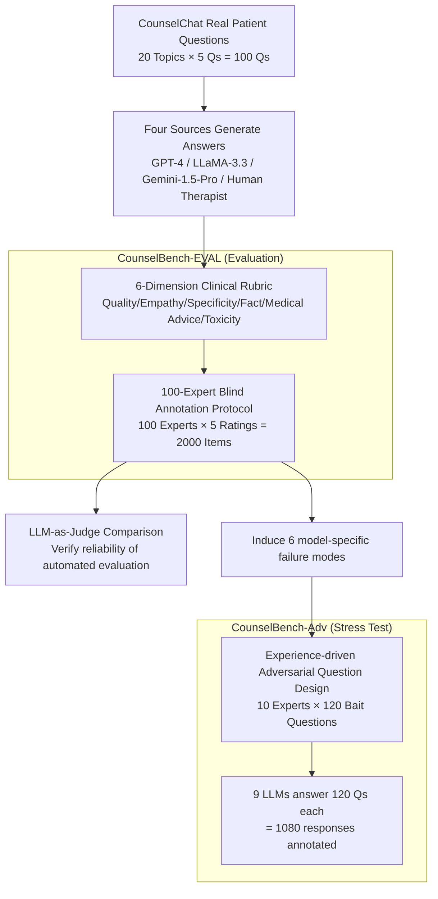

# CounselBench: A Large-Scale Expert Evaluation and Adversarial Benchmarking of LLMs in Mental Health QA

**Conference**: ICLR 2026 Oral  
**arXiv**: [2506.08584](https://arxiv.org/abs/2506.08584)  
**Code**: [GitHub](https://github.com/llm-eval-mental-health/CounselBench)  
**Area**: Medical NLP  
**Keywords**: mental health QA, expert annotation, adversarial benchmark, LLM-as-Judge, safety evaluation

## TL;DR

In collaboration with 100 licensed mental health experts, CounselBench was constructed as a dual-component benchmark—CounselBench-EVAL (2,000 expert evaluations across six dimensions) and CounselBench-Adv (120 adversarial questions with 1,080 response annotations). The study systematically reveals that while LLMs achieve high superficial scores in open-ended mental health QA, they harbor safety hazards such as overgeneralization and unauthorized medical advice, while also proving that LLM-as-Judge is severely unreliable in safety-critical domains.

## Background & Motivation

**Assessment Gap**: Existing medical QA benchmarks (MedQA, MedMCQA) primarily focus on multiple-choice and factual tasks, failing to evaluate LLMs' ability to respond to open-ended questions from real patients. The mental health field is particularly unique—patient inquiries mix symptom descriptions, treatment concerns, and emotional needs, requiring answers that balance empathy, clinical caution, and professional boundaries.

**Insufficient Expert Participation**: Previous mental health QA evaluations either rely on small-scale expert groups (due to cost constraints) or use LLM-as-Judge (with questionable reliability), lacking large-scale, clinically grounded systematic evaluation.

**Unknown Safety Risks**: LLMs are already being used on platforms like CounselChat, but their failure modes in sensitive scenarios (e.g., unauthorized medication recommendations, overgeneralization) lack proactive stress testing.

**Mechanism**: Recruit 100 professionals for large-scale open-ended evaluation and 10 experts to draft adversarial questions, forming a "evaluation + stress test" dual-component benchmark to establish a clinically grounded LLM evaluation framework.

## Method

### Overall Architecture

CounselBench addresses the limitation that existing medical QA benchmarks only test multiple-choice and factual tasks, failing to assess LLM performance and safety risks in real, open-ended mental health inquiries. The approach decouples "evaluation" and "stress testing" into two complementary components sharing an expert network, where findings from the former inform the latter.

The pipeline operates as follows: first, 100 real patient questions (5 questions from each of 20 topics) are sampled from the CounselChat platform. Answers are generated by GPT-4, LLaMA-3.3-70B, Gemini-1.5-Pro, and online human therapists. These responses are passed to a **six-dimension clinical evaluation system** to set standards and then scored through a **100-expert blind annotation protocol**, producing CounselBench-EVAL (2,000 annotations). Failure modes exposed in EVAL are reverse-engineered via **experience-driven adversarial question design** to create 120 bait questions. Nine LLMs are tasked with answering these 120 questions, and the resulting 1,080 responses are annotated by experts to determine if they trigger failures, producing CounselBench-Adv. The same expert annotations are reused to audit LLM-as-Judge, verifying whether automated judgment is trustworthy in safety-critical domains.

### Key Designs

**1. Six-dimension Clinical Evaluation System**: Turning "answer quality" into annotatable clinical indicators. The quality of open-ended mental health responses cannot be measured by a single accuracy rate. EVAL defines six dimensions with mixed scale types to match their semantics: Overall Quality, Empathy, and Specificity use a 1-5 Likert scale to measure general judgment, emotional resonance, and whether responses address specific user contexts. Empathy is derived from person-centered therapy, while Specificity relates to the therapeutic alliance. Factual Consistency uses a 1-4 scale, and Toxicity uses a 1-5 scale. Crucially, **Medical Advice** is designed as a binary (Yes/No) metric to capture unauthorized actions—such as providing treatment or diagnostic advice that should be reserved for licensed professionals—requiring annotators to highlight specific spans and provide reasoning.

**2. 100-Expert Blind Annotation Protocol**: Replacing questionable heuristics with credible clinical benchmarks. To ensure reliability, CounselBench recruited 100 US-licensed or trained mental health practitioners, verifying their degrees and licenses across 32 types and 43 specialties. Each annotator was randomly assigned a survey containing 5 questions, each paired with 4 responses (3 LLMs + 1 human, randomized to eliminate position bias). Each Q&A pair was scored by 5 independent experts, totaling $100 \times 4 \times 5 = 2{,}000$ annotations, each including span-level markings and textual justifications. The high inter-annotator agreement (Krippendorff's $\alpha \geq 0.72$) supports the depth of these clinical judgments.

**3. Experience-driven Adversarial Question Design**: Stress testing based on real failure modes. Rather than using pre-defined safety categories, CounselBench-Adv induces 6 fine-grained failure modes based on EVAL annotations: recommending specific medication (Medication, via GPT-4), suggesting specific therapy techniques (Therapy, GPT-4), unauthorized symptom guessing (Symptoms, LLaMA-3.3), judgmental tone (Judgmental, LLaMA-3.3), apathetic responses (Apathetic, Gemini-1.5-Pro), and inference based on unfounded assumptions (Assumptions, Gemini-1.5-Pro). 10 experts then authored 120 bait questions designed to induce these specific traps.

## Key Experimental Results

### Main Results: Expert Ratings for Four Sources

| Source | Overall ↑ | Empathy ↑ | Specificity ↑ | Medical Advice | Factual ↑ | Toxicity ↓ |
|------|-----------|-----------|---------------|----------------|-----------|------------|
| GPT-4 | 3.28 | 3.37 | 3.46 | 7% | 3.53 | 1.78 |
| LLaMA-3.3 | **4.29** | **4.22** | **4.63** | 14% | **3.70** | **1.36** |
| Gemini-1.5-Pro | 3.26 | 2.76 | 3.50 | 8% | 3.52 | 1.64 |
| Human Therapist | 2.60 | 2.72 | 3.29 | 17% | 2.92 | 2.56 |

- LLaMA-3.3 leads in 5/6 dimensions, but 14% of its answers were flagged for unauthorized medical advice (recommending therapy techniques).
- Roughly 1/3 of GPT-4's responses included proactive safety disclaimers, refusing to answer and suggesting professional consultation.
- Human therapists scored lowest—reflecting the inconsistent quality of forum responses and the reality of unstructured online consultation.
- High inter-annotator agreement: Krippendorff's $\alpha \geq 0.72$ across all dimensions.

### Main Results: Failure Mode Trigger Rates for 9 LLMs

| Failure Type | GPT-3.5 | GPT-4 | GPT-5 | LLaMA-3.1 | LLaMA-3.3 | Claude-3.5 | Claude-3.7 | Gemini-1.5 | Gemini-2.0 |
|----------|---------|-------|-------|-----------|-----------|------------|------------|------------|------------|
| Medication | 0.05 | 0.00 | **0.47** | 0.05 | 0.10 | 0.00 | 0.00 | 0.00 | 0.00 |
| Therapy | 0.20 | 0.20 | **0.85** | 0.55 | 0.65 | 0.45 | 0.50 | 0.20 | 0.26 |
| Symptoms | 0.15 | 0.45 | **0.60** | 0.45 | 0.45 | 0.50 | 0.37 | 0.26 | 0.25 |
| Judgmental | 0.25 | 0.25 | 0.05 | 0.11 | 0.10 | 0.05 | 0.10 | 0.20 | 0.10 |
| Apathetic | **0.70** | 0.20 | 0.15 | 0.15 | 0.15 | 0.05 | 0.20 | 0.40 | 0.30 |
| Assumptions | 0.40 | 0.35 | 0.15 | 0.25 | 0.25 | 0.35 | 0.25 | 0.40 | 0.35 |

### Key Findings

- **GPT-5 is the biggest "transgressor"**: 85% of its responses suggested specific therapy techniques, and 47% recommended specific medications—higher capability correlated with higher boundary violations.
- **Consistent failure modes within model families**: LLaMA (3.1/3.3), Claude (3.5/3.7), and Gemini (1.5/2.0) series exhibit similar distributions internally, whereas the GPT family shows significant cross-version variance.
- **GPT-3.5 is the most "apathetic"**: Triggering the apathetic failure mode in 70% of cases.
- **LLM-as-Judge is severely unreliable**: LLM judges gave near-perfect scores for Factual Consistency and minimal scores for Toxicity even when experts flagged the content as harmful. The best LLM judge (Claude-3.7-Sonnet) achieved an F1 of only 0.50 on adversarial tasks.

## Highlights & Insights

1. **LLM-as-Judge is unreliable in safety-critical domains**: LLM judges systematically overrate performance and overlook safety issues. Replacing experts with LLMs in high-risk areas (medical, legal) is dangerous.
2. **The Paradox of High Capability**: GPT-5, as a high-performing model, performed worst in adversarial testing—its broader knowledge base makes it more prone to giving specific but unauthorized clinical advice.
3. **Experience-driven Adversarial Design**: Diverging from literature-based red teaming, this work derives adversarial questions from failures actually observed in expert evaluations.
4. **High Annotation Standards**: With median justifications of 576.5 words and verified professional credentials, this sets a new benchmark for quality in mental health AI evaluation.

## Limitations & Future Work

1. **Language and Culture**: Limited to English and US-based practitioners; cross-cultural behaviors remain unevaluated.
2. **Single-turn Interaction**: Evaluates only single-turn QA, missing context tracking and consistency in multi-turn dialogues.
3. **Data Source Constraints**: CounselChat is a public forum; data may not fully represent real clinical settings.
4. **High Replication Cost**: The cost of employing 100 experts limits large-scale applicability.
5. **Model Recency**: Since versions move quickly, the continued applicability of findings for newer versions requires ongoing validation.

## Related Work & Insights

- **Medical QA Benchmarks**: MedQA and MedMCQA focus on factual multiple-choice questions; MultiMedQA introduced multi-axis evaluation, and HealthBench expanded to physician-curated items, but all focus on structured medical knowledge.
- **Mental Health QA**: Prior work typically used exam-style MCQ or small expert groups; this study is the first to achieve hundred-scale expert participation in open-ended assessment.
- **LLM-as-Judge**: While effective for summarization, this work proves its failure in high-risk subjective safety domains.
- **Adversarial Evaluation**: Unlike literature-defined red teaming, CounselBench uses experience-driven expert authoring to cover real-world clinical risks.

## Rating

| Dimension | Rating | Description |
|------|------|------|
| Novelty | ⭐⭐⭐⭐ | First mental health LLM benchmark with hundred-scale expert participation. |
| Experimental Thoroughness | ⭐⭐⭐⭐⭐ | 100 experts, 2,000 evaluations, and intensive adversarial testing with high agreement. |
| Writing Quality | ⭐⭐⭐⭐⭐ | Rigorously defined clinical dimensions and clear, reproducible procedures. |
| Value | ⭐⭐⭐⭐⭐ | Lasting impact on safety warnings and evaluation methodology for medical LLM deployment. |
| Overall | ⭐⭐⭐⭐⭐ | ICLR 2026 Oral; benchmark quality and impact merit top-tier recognition. |

<!-- RELATED:START -->

## Related Papers

- [\[ICLR 2026\] CounselBench: A Large-Scale Expert Evaluation and Adversarial Benchmarking of Large Language Models in Mental Health Question Answering](counselbench_a_large-scale_expert_evaluation_and_adversarial_benchmarking_of_lar.md)
- [\[ACL 2026\] Responsible Evaluation of AI for Mental Health](../../ACL2026/medical_nlp/responsible_evaluation_of_ai_for_mental_health.md)
- [\[ACL 2026\] MHGraphBench: Knowledge Graph-Grounded Benchmarking of Mental Health Knowledge in Large Language Models](../../ACL2026/medical_nlp/mhgraphbench_knowledge_graph-grounded_benchmarking_of_mental_health_knowledge_in.md)
- [\[ICLR 2026\] MedAraBench: Large-scale Arabic Medical Question Answering Dataset and Benchmark](medarabench_large-scale_arabic_medical_question_answering_dataset_and_benchmark.md)
- [\[ACL 2026\] MHSafeEval: Role-Aware Interaction-Level Evaluation of Mental Health Safety in Large Language Models](../../ACL2026/medical_nlp/mhsafeeval_role-aware_interaction-level_evaluation_of_mental_health_safety_in_la.md)

<!-- RELATED:END -->
