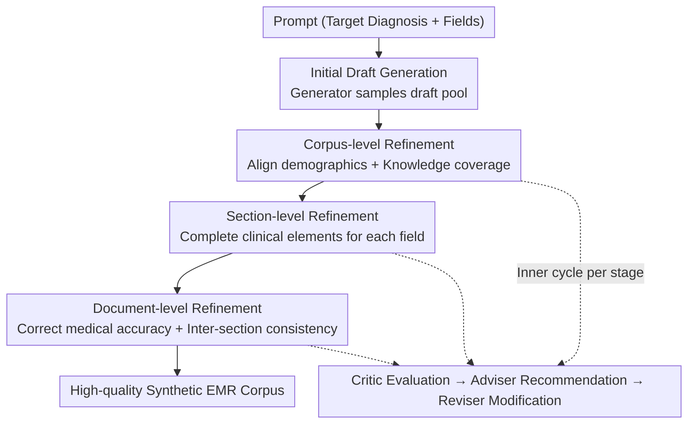

# Critic-Adviser-Reviser Cyclic Refinement: Towards High-Quality EMR Corpus Generation with LLMs

**Conference**: ICLR 2026  
**OpenReview**: [https://openreview.net/forum?id=7y11BdJIOp](https://openreview.net/forum?id=7y11BdJIOp)  
**Code**: None  
**Area**: Medical NLP / LLM Multi-Agent / Synthetic Data Generation  
**Keywords**: EMR Synthesis, Cyclic Refinement, Multi-Agent, Clinical Quality, Privacy Protection

## TL;DR
Addressing the issues where LLMs directly generating Electronic Medical Records (EMR) "only imitate, suffer from distribution distortion, and lack quality constraints," this paper proposes LLM-CARe. This framework employs a "corpus → section → document" three-level granularity, with each level refined by a Critic/Adviser/Reviser agent cycle. Without accessing any real EMR text, it significantly pushes the quality of synthetic records and downstream clinical task performance beyond the SOTA.

## Background & Motivation
**Background**: Electronic Medical Records are valuable resources for medical research, but patient privacy restricts the open sharing of real records. Consequently, "synthetic EMR" has become a popular alternative. Early approaches included GANs (generating from noise or diagnosis codes) and autoregressive models (RNN/Transformer modeling records as token sequences), while recent trends favor direct prompting of LLMs to write records.

**Limitations of Prior Work**: Almost all existing methods focus on one thing—**imitation of real records**. GANs and autoregressive models fit records as distributions or sequences, while LLM methods use real records as in-context examples to "copy." However, real records themselves may contain errors and omissions, which imitation strategies inherit into synthetic data. Furthermore, direct LLM generation exhibits other flaws: preliminary experiments by the authors found **distribution bias** in LLM outputs (e.g., unrealistic gender ratios) and a tendency to write only the "most typical" manifestations of a disease, lacking coverage of rare or diverse clinical scenarios.

**Key Challenge**: EMRs are not ordinary free text; they are professional medical documents whose reliability depends on satisfying rigid quality requirements such as integrity, consistency, and distribution alignment. The "imitation" paradigm inherently **fails to explicitly model and enforce these quality standards**—it pursues "similarity" rather than "correctness." Consequently, synthetic records may appear realistic but are useless or even misleading for downstream clinical or research applications.

**Goal**: To generate high-quality synthetic records that simultaneously satisfy corpus-level, section-level, and document-level quality principles without accessing any real EMR text (for training or prompting), and to demonstrate their utility in real downstream clinical tasks.

**Key Insight**: The authors decompose "high-quality EMR" into explicit, checkable principles—five principles across three levels: Demographic Typicality, Knowledge Coverage (corpus-level), Content Integrity (section-level), Medical Correctness, and Contextual Consistency (document-level). Since quality can be evaluated principle-by-principle, it can be refined principle-by-principle.

**Core Idea**: Replace "one-shot imitation generation" with a "Critic-Adviser-Reviser" cyclic refinement process. This refinement is performed in stages by granularity, starting from the loosest corpus-level distribution alignment and gradually tightening to the strictest document-level logical consistency.

## Method

### Overall Architecture
The input to LLM-CARe is a prompt specifying a target primary diagnosis and required EMR fields (Chief Complaint, History of Present Illness, etc.), and the output is a batch of synthetic EMRs satisfying multi-level quality principles. The process follows two steps: first, a generator agent samples multiple initial drafts for each prompt to form a draft pool $D^{(0)}=\{E^{(0)}_1,\dots,E^{(0)}_n\}$; these drafts often contain omissions, contradictions, or clinical improprieties but serve as the starting point for refinement.

Subsequently, the drafts flow through **three refinement stages**: Corpus, Section, and Document. Each stage employs the same "three-agent cycle": the Critic evaluates the draft based on the stage's goals, the Adviser identifies issues and provides specific improvement strategies, and the Reviser updates the draft accordingly. This iterates until the quality for that granularity is met, after which the draft proceeds to the next stage. The **order of stages is intentionally designed**: from the "softest" (corpus-level distribution alignment, not requiring precision matching) to the "hardest" (document-level logical consistency, where errors introduce severe contradictions). This coarse-to-fine progression allows each level to build on the previous one while minimizing mutual interference.

### Key Designs

**1. Five Quality Principles: Decomposing "Good EMR" into Checkable Standards**

Rather than discussing "quality" abstractly, this work codifies clinical document specifications into five explicitly verifiable principles distributed across three granularities. At the corpus level: **Demographic Typicality** (variables like age and gender must match real population distributions) and **Knowledge Coverage** (the corpus must include both common and rare clinical scenarios). At the section level: **Content Integrity** (each field must contain the core clinical elements relevant to its type). At the document level: **Medical Correctness** (clinical statements must be valid for the given diagnosis) and **Contextual Consistency** (sections must not contradict each other). Each principle is further refined into itemized criteria (derived from clinical guidelines). This step is the foundation of the framework—because quality is broken into discrete, determinative standards, the Critic has clear grounds for evaluation, and the Adviser can provide targeted directions for improvement.

**2. Three-Agent Cycle: Replacing One-Shot Generation with "Evaluate-Advise-Revise"**

Within each stage, the Critic, Adviser, and Reviser collaborate iteratively. The Critic is responsible for evaluation: at the corpus level, it measures the deviation $\delta^{(t)}_{corpus,k}=M^{corpus}_{critic}(D^{(t)},T_d,c_{corpus,k})$ of the current corpus $D^{(t)}$ relative to a reference distribution $T_d$ (aggregated from training stats, e.g., age/gender distributions, clinical concept frequencies) for a given attribute $c_{corpus,k}$. At the section and document levels, it outputs binary judgments (whether a criterion is met, $\delta\in\{0,1\}$). The Adviser handles diagnosis and prescription: it interprets the Critic's feedback. At the corpus level, it selects a subset of records $S^{(t)}_k$ where modifications would best reduce distribution mismatch and generates actionable feedback $F^{(t)}_{corpus,k}$. At the section/document levels, it provides specific instructions on "which clinical elements to add and which sections to modify" for unmet criteria. The Reviser executes the instructions by updating the selected records or sections, e.g., $S^{(t+1)}_k=M^{corpus}_{reviser}(S^{(t)}_k,F^{(t)}_{corpus,k})$, adding or correcting content while maintaining coherence. Ablation studies show all three are indispensable—removing the Critic (Adviser gives feedback for all criteria indiscriminately) or the Reviser (degrading to the generator re-generating based on all criteria) results in the largest performance drops.

**3. Coarse-to-Fine Staged Ordering: Protecting Refinement Progress**

The stages follow the fixed order of "Corpus → Section → Document." This is because modifications at different granularities can conflict. Corpus-level refinement is "soft," seeking approximate distribution alignment without requiring exact matches, and is thus performed first. Document-level refinement is "hard," enforcing strict logical consistency across sections; errors here lead to severe clinical contradictions. By proceeding from soft to hard, each level polishes the work of the previous stage without destroying established consistency through looser adjustments later on. Stage-wise analysis (Figure 7) confirms that quality dimensions improve most significantly during their respective stages (e.g., Integrity jumps during the Section stage), and ultimately all dimensions significantly exceed direct generation.

### Mechanism
Consider generating a "Pneumonia" record: the generator samples initial drafts based on the prompt (Diagnosis=Pneumonia, Fields=Chief Complaint/HPI/Hospital Course/Discharge Instructions). These drafts might have skewed gender ratios and only describe typical cough/fever. **Corpus Stage**: The Critic calculates deviations in gender distribution and symptom coverage. The Adviser identifies records that, if modified, would best correct the distribution and suggests adding rare presentations. The Reviser rewrites these records to align the global distribution with real statistics. **Section Stage**: The Critic checks each field and finds the "Hospital Course" lacks the essential element of treatment response ($\delta=0$). The Adviser specifies what to add, and the Reviser completes it while maintaining flow. **Document Stage**: The Critic finds a contradiction where the "HPI" mentions no fever but the "Hospital Course" mentions antipyretic treatment. The Adviser suggests modifying the section with less impact to restore consistency, and the Reviser harmonizes them. The result is a distributionally sound, complete, and logically consistent synthetic record.

## Key Experimental Results

The dataset is a real-world EMR containing 192k records across 302 diseases, stratified 8:2 by category after de-identification. All LLM methods use Qwen2.5-7B-Instruct as the backbone, Qwen2.5-32B-Instruct for quality evaluation, and Qwen2.5-0.5B-Instruct for downstream task fine-tuning.

### Main Results

Scores for the five quality principles (%, higher is better). Key observation: **Ours does not rely on real EMR text** (the "Rely on EMR Text" column is ✗) yet leads in every category:

| Method | Rely on EMR Text | Content Integrity | Medical Correctness | Contextual Consistency | Demographic Typicality | Knowledge Coverage |
|------|:---:|:---:|:---:|:---:|:---:|:---:|
| LSTM | ✓ | 70.8 | 65.0 | 21.7 | 93.3 | 70.4 |
| mtGAN | ✓ | 55.8 | 51.8 | 21.4 | 93.6 | 76.3 |
| MedSyn | ✓ | 84.8 | 95.3 | 91.9 | 84.1 | 84.5 |
| LLM Direct | ✗ | 77.1 | 90.7 | 87.9 | 77.7 | 73.9 |
| Self-Refine | ✗ | 78.3 | 90.9 | 88.5 | 77.7 | 78.0 |
| **LLM-CARe (Ours)** | ✗ | **91.2** | **98.6** | **93.8** | **96.8** | **94.1** |

Accuracy for downstream clinical tasks (%), involving Diagnosis Prediction, Lab Recommendation, and Treatment Recommendation:

| Method | Rely on EMR Text | Diag Micro | Diag Macro | Lab Micro | Lab Macro | Treat Micro | Treat Macro |
|------|:---:|:---:|:---:|:---:|:---:|:---:|:---:|
| mtGAN | ✓ | 81.9 | 80.9 | 72.4 | 73.4 | 58.6 | 52.9 |
| MedSyn | ✓ | 81.7 | 81.7 | 82.9 | 82.2 | 74.5 | 71.3 |
| LLM Direct | ✗ | 81.8 | 81.8 | 64.4 | 65.4 | 60.9 | 59.0 |
| Self-Refine | ✗ | 81.9 | 81.8 | 64.9 | 65.7 | 63.1 | 61.3 |
| **LLM-CARe (Ours)** | ✗ | **82.6** | **82.4** | **85.3** | **85.2** | **76.9** | **74.1** |

### Ablation Study

Removing each agent individually (Figure 8) and observing the impact on quality and downstream tasks:

| Configuration | Impact | Description |
|------|------|------|
| Full (LLM-CARe) | — | Complete three-agent cycle |
| w/o Critic | Most significant drop | Adviser provides feedback indiscriminately, losing precise evaluation |
| w/o Reviser | Most significant drop | Degrates to generator re-generating with all criteria; unable to iterate on drafts |
| w/o Adviser | Notable drop | Reviser only receives high-level "unmet" info without actionable suggestions |

### Key Findings
- **Critic and Reviser are critical**: Removing these two causes the largest performance drops, proving that "accurate assessment of current drafts" + "iterative modification of existing drafts" are the sources of quality. LLMs cannot satisfy all constraints in a single step.
- **Specific feedback outperforms abstract standards**: Removing the Adviser also leads to drops, proving that actionable suggestions (e.g., "add specific clinical elements") guide effective modification better than abstract criterion labels.
- **Imitation paradigm inherits defects**: MedSyn actually performs worse than LLM Direct in "Hospital Course Integrity"—by using real EMRs as in-context examples, omissions in real data are propagated.
- **Backbone independence**: LLM-CARe improves quality scores from ~50 to 76–80 regardless of whether LLaMA3.1-8B, Meditron3-8B (medically pre-trained), or R1-Distill-Llama-8B (reasoning-heavy) is used.
- **No reliance on real text**: A variant that provides the initial generator with a real EMR as reference performed nearly identically to the original (Figure 9), indicating that success stems from structural refinement rather than data leakage.

## Highlights & Insights
- **Engineering Quality**: Decomposing "high-quality EMR" into five cross-granularity, itemized clinical principles is the prerequisite for a closed-loop framework. This "define principles, iterate to fix" approach is transferable to any task with rigid output specifications (contracts, code, structured reports).
- **Clever Coarse-to-Fine Scheduling**: Starting with soft alignment and ending with strict consistency prevents subsequent loose adjustments from breaking previously established hard constraints.
- **Privacy-Friendly Zero-Text Approach**: By neither training on nor prompting with real records, the framework outperforms baselines that do, offering a significant advantage for privacy-sensitive medical scenarios.
- **The "Intermediary" Adviser**: Adding an agent to translate "what is wrong" into "how to fix" is highly effective. Evaluation and execution benefit from a "prescription" phase.

## Limitations & Future Work
- Evaluation relies heavily on LLM-as-judge (Qwen2.5-32B) and manually defined criteria; judge bias and criteria coverage may affect reliability.
- Experiments focused on one Chinese EMR dataset (302 diseases); generalization across languages, hospital systems, and more complex structures requires further validation.
- The multi-stage, multi-agent process incurs significant computational cost per record; cost-benefit and scalability weren't fully explored.
- Criteria were derived from clinical guidelines and manually refined; automating this for new departments or diseases remains a challenge.

## Related Work & Insights
- **vs. GAN/Autoregressive (mtGAN, LSTM)**: These methods model records as distributions or sequences. They capture statistical patterns but disregard clinical quality, leading to very low consistency scores (~21). Ours pulls consistency to 93.8.
- **vs. MedSyn (Imitation LLM)**: MedSyn uses real records as in-context examples, which risks privacy and propagates omissions from real data. Ours outperforms it without touching real text.
- **vs. Self-Refine (General Self-Refinement)**: Self-Refine attempts to evaluate and revise all quality requirements once per round. It shows only marginal improvements over LLM Direct, proving that "one-size-fits-all" revision cannot handle the multi-level requirements of EMR.

## Rating
- Novelty: ⭐⭐⭐⭐ Applying "principle-driven staged refinement" to EMR synthesis is the primary innovation.
- Experimental Thoroughness: ⭐⭐⭐⭐⭐ Comprehensive coverage includes five quality dimensions, three downstream tasks, multiple backbones, and detailed ablation.
- Writing Quality: ⭐⭐⭐⭐ Clear logic connecting motivation to method; well-defined principles and formulas.
- Value: ⭐⭐⭐⭐⭐ High practical utility for addressing data scarcity and privacy in medical NLP.

<!-- RELATED:START -->

## Related Papers

- [\[ACL 2025\] Evaluation of LLMs in Medical Text Summarization: The Role of Vocabulary Adaptation in High OOV Settings](../../ACL2025/medical_nlp/evaluation_of_llms_in_medical_text_summarization_the_role_of_vocabulary_adaptati.md)
- [\[ACL 2025\] Enhancing Medical Dialogue Generation through Knowledge Refinement and Dynamic Prompt Adjustment](../../ACL2025/medical_nlp/enhancing_medical_dialogue_generation_through_knowledge_refinement_and_dynamic_p.md)
- [\[ICLR 2026\] Can SAEs Reveal and Mitigate Racial Biases of LLMs in Healthcare?](can_saes_reveal_and_mitigate_racial_biases_of_llms_in_healthcare.md)
- [\[ICLR 2026\] SimpleToM: Exposing the Gap between Explicit ToM Inference and Implicit ToM Application in LLMs](simpletom_exposing_the_gap_between_explicit_tom_inference_and_implicit_tom_appli.md)
- [\[NeurIPS 2025\] Demo: Guide-RAG: Evidence-Driven Corpus Curation for Retrieval-Augmented Generation in Long COVID](../../NeurIPS2025/medical_nlp/demo_guide-rag_evidence-driven_corpus_curation_for_retrieval-augmented_generatio.md)

<!-- RELATED:END -->
