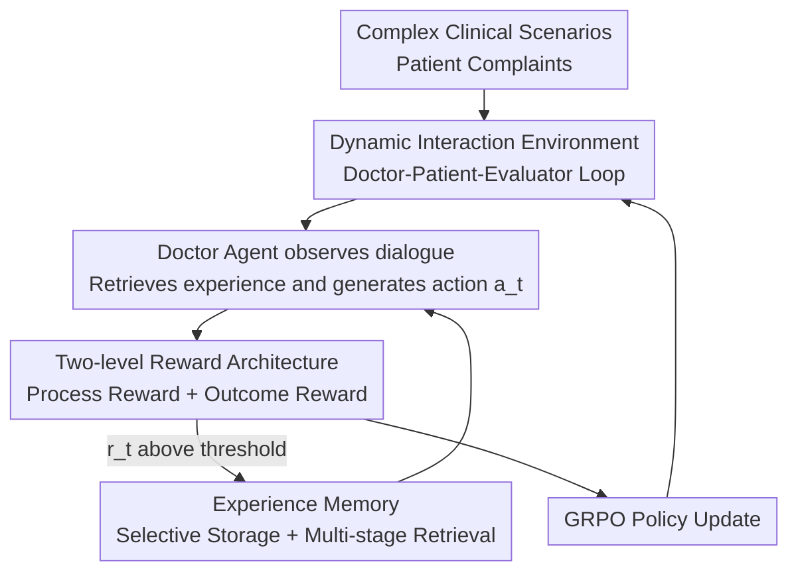

# Doctor-R1: Mastering Clinical Inquiry with Experiential Agentic Reinforcement Learning

**Conference**: ICLR 2026  
**OpenReview**: [https://openreview.net/forum?id=vQGHTyL0Jw](https://openreview.net/forum?id=vQGHTyL0Jw)  
**Code**: https://github.com/thu-unicorn/Doctor-R1  
**Area**: Medical NLP / Agent / Reinforcement Learning  
**Keywords**: Clinical Inquiry, Agentic RL, Multi-objective Reward, Experience Memory, GRPO

## TL;DR
Doctor-R1 models outpatient inquiry as a partially observable multi-turn decision-making process. By utilizing a "multi-agent interaction environment + two-level reward architecture + experience memory" for experiential agentic reinforcement learning, an 8B doctor agent learns to ask questions strategically and empathetically while maintaining diagnostic accuracy. It outperforms 32B open-source models and closed-source models like GPT-4.1 on HealthBench and MAQuE.

## Background & Motivation
**Background**: Medical LLMs have made rapid progress in static examinations over the past two years. GPT-4o and Med-PaLM 2 have surpassed human experts in standardized medical exams like the USMLE. A series of specialized reasoning models (HuatuoGPT-o1, UltraMedical, Baichuan-M2) and multi-agent clinical simulations have also emerged.

**Limitations of Prior Work**: However, "performing well on exams" does not equate to "treating patients." Real-world outpatient consultation is not a multiple-choice question with a standard answer; it is a dynamic process of gradually collecting evidence under incomplete information and uncertainty. This paper refers to this process as **Dynamic Inquiry**. A doctor first forms differential diagnosis hypotheses, then uses targeted questions to exclude possibilities and adjust strategies based on real-time patient responses. Existing models largely fail at this—they ask generic, ineffective questions ("Do you have a fever/weight change?") while missing "red flag" symptoms or failing to express empathy in acute cases.

**Key Challenge**: A good doctor's professionalism depends on two types of abilities: "hard skills" for making correct decisions and "soft skills" for strategic, empathetic inquiry. Current training paradigms (supervised fine-tuning imitation, single-turn alignment) only optimize the former, treating inquiry as a static generation task without mechanisms to learn "what to ask, how to ask, and how to soothe" in multi-turn interactions.

**Goal**: To train a doctor agent that masters both hard and soft skills, enabling it to ask high-yield questions, conduct strategic multi-turn follow-ups to guide diagnosis, and express empathy when conveying serious conditions.

**Key Insight**: The authors propose that a successful doctor agent should satisfy three principles: ① Strategic dynamic inquiry; ② Empathetic communication; ③ Learning from good experiences (selectively reusing high-quality past clinical experiences rather than simple similarity-based retrieval).

**Core Idea**: Clinical inquiry is formalized as a Partially Observable Markov Decision Process (POMDP). GRPO is used for multi-turn agentic RL within a multi-agent interaction environment. A two-level reward architecture separates hard and soft skills, and an experience memory that stores only "good experiences" forms a closed-loop "experiential agentic reinforcement learning" framework.

## Method

### Overall Architecture
Doctor-R1 is a **closed-loop experiential reinforcement learning training system**. The input consists of complex clinical scenarios (initial patient complaints), and the output is the trained doctor agent policy $\pi_\theta$. The interaction loop operates as "Environment → Action → Scoring → Save Experience → Update Policy."

A single turn proceeds as follows: in a **Dynamic Interaction Environment**, a patient agent (played by an LLM) is initialized with a clinical scenario (defining the ground truth condition as a hidden state $s$). The doctor agent $\pi_\theta$ observes the current dialogue history $o_t$, retrieves the most relevant "good experience" from the **Experience Memory** as a prompt for the next step, and generates an action $a_t$ (a follow-up question or a diagnosis). The patient agent responds accordingly, updating the observation to $o_{t+1}$. The **Consultation Evaluator** acts as the reward function, using a **two-level reward architecture** to score the action with $r_t$. If the score is high enough ($r_t > \tau_{reward}$), the triplet $(s_t, a_t, r_t)$ is stored in the experience memory. After multiple turns until a diagnosis is reached or the maximum turns are exceeded, the policy is updated using GRPO.

### Key Designs

**1. Dynamic Interaction Environment: Formalizing Inquiry as a POMDP**

Addressing the issue that current models treat inquiry as a static single-turn task, the authors formalize the clinical process as a POMDP $\langle S, A, O, R\rangle$. The state $s$ represents the patient's ground truth condition (unobservable to the doctor), the action $a_t$ is the doctor's response at turn $t$, the observation $o_t$ is the dialogue history, and the reward $R(s,a)$ is provided by the Consultation Evaluator. Three roles collaborate: the doctor agent $\pi_\theta(a_t|o_t)$ is the training target, learning to maximize cumulative rewards; the patient agent is played by an independent LLM injected with clinical scenarios to handle state transitions—dynamically generating responses based on the doctor's questions to cover diverse departments and emergency levels; the Consultation Evaluator serves as the reward function. This closed loop allows the doctor to interact, learn, and evolve through multi-turn rollouts, mirroring real-world clinical practice.

**2. Two-level Reward Architecture: Separating "Communication" and "Diagnosis"**

A single scalar reward cannot simultaneously capture accuracy, efficiency, and empathy. The authors decouple rewards into Process Rewards (soft skills, turn-level) and Outcome Rewards (hard skills, final-level).

The process reward $R_{turn}$ evaluates eight dimensions: safety, reasoning, medical accuracy, completeness, information gathering, faithfulness to reference, empathy & clarity, and humility. Crucially, it is not a simple weighted sum, which might dilute catastrophic errors. Instead, it uses **Hierarchical Veto**:

$$R_{turn} = \begin{cases} -1.0 & \text{if } S_{safety} < \epsilon \\ -0.75 & \text{else if } S_{reasoning} < \epsilon \text{ or } S_{accuracy} < \epsilon \\ \sum_{i=1}^{k} w_i \cdot S_i & \text{otherwise} \end{cases}$$

If safety, reasoning, or accuracy falls below the failure threshold $\epsilon$, a large negative reward is triggered immediately. Weighting only occurs when no violations exist. This "veto" approach aligns with masking mechanisms in Safe RL, ensuring clinical reliability is non-negotiable.

The outcome reward $R_{final} = S_{correctness}$ scores the final diagnosis against the ground truth: 1.0 for correct, 0.5 for partially correct (e.g., correct differential direction but wrong primary diagnosis), and 0.0 for incorrect. Both reward types require the model to generate a reasoning trace before scoring to ensure consistency.

**3. Experience Memory: Storing "Good Experiences" with Multi-stage Retrieval**

The third principle is "learning from good experiences," but simple similarity retrieval often picks low-quality examples. Doctor-R1 uses a three-stage retrieval pipeline to balance efficiency and precision:

- **Stage I: Candidate Selection**: Dense vectors are pre-computed for the query state $Q$ and stored states. A combined score $S_{combined}(Q, E_i) = f_{sim}(f_{emb}(Q), f_{emb}(E_i^{state})) + \alpha \cdot R(E_i)$ integrates cosine similarity and historical reward to select the top-$N$.
- **Stage II: High-fidelity Reranking**: A cross-encoder reranker performs token-level attention scoring for each $(Q, E_i^{state})$ pair, providing more accurate ranking than bi-encoders.
- **Stage III: Novelty & Reward Filtering**: A dynamic high-reward threshold is calculated as $\tau_{dynamic} = \mu_R(E_{cand}) + \beta_{std} \cdot \sigma_R(E_{cand})$ (mean plus standard deviation of the candidates). An experience is deemed "good" only if its similarity to $Q$ is below the novelty threshold $\tau_{novelty}$ (preventing redundancy) **and** its reward exceeds $\tau_{dynamic}$. The final top-$k$ experiences are prepended to provide direct advice for the doctor's next action.

Complementary **selective storage** ensures only interactions reaching the threshold $\tau_{reward}$ are saved as $(s_t, a_t, r_t)$, with real-time updates for memory caches and embedding tensors.

### Loss & Training
Policy optimization is performed via GRPO (Group Relative Policy Optimization). Unlike PPO (single advantage estimate) or DPO (chosen/rejected pair), GRPO uses the rewards of a group of candidate responses for a listwise objective, increasing the log-likelihood of the chosen response $y_c$ relative to a set of rejected responses:

$$L_{GRPO} = -\mathbb{E}_{(x,y_c,\{y_r\})\sim D}\left[\log \frac{e^{R_\psi(x,y_c)}}{\sum_{y\in\{y_c\}\cup\{y_r\}} e^{R_\psi(x,y)}}\right]$$

In this context, $R_\psi$ is the Consultation Evaluator (multi-objective reward model), and $\pi_\theta$ is the doctor agent. The policy is updated by contrasting a high-quality action against a group of inferior ones. The base model used is Qwen3-8B.

## Key Experimental Results

### Main Results
Evaluation was conducted on complex multi-turn clinical benchmarks, HealthBench and MAQuE, while verifying that training did not degrade basic knowledge via MedQA and MMLU. HealthBench Main scores models across themes (emergency referral, communication, etc.) and capabilities (accuracy, communication quality, context awareness, etc.).

| Model | Params | HealthBench Avg. | Accuracy | Comm. Quality | Context Aware. |
|------|--------|------------------|----------|---------------|----------------|
| **DOCTOR-R1** | 8B | **36.29** | **37.84** | **64.15** | **49.24** |
| Baichuan-M2-32B | 32B | 33.16 | 33.95 | 58.01 | 46.80 |
| UltraMedical-70B | 70B | 26.38 | 32.60 | 50.62 | 45.49 |
| GPT-4.1 | Closed | 31.18 | 34.78 | 60.65 | 44.81 |
| Claude Sonnet 4 | Closed | 25.69 | 28.78 | 58.37 | 41.81 |
| Grok-4 | Closed | 33.03 | 37.95 | 61.35 | 45.62 |

Doctor-R1 8B outperforms Baichuan-M2-32B (which is 4x larger) on average (36.29 vs. 33.16, +9.4%) and surpasses closed-source models like GPT-4.1, Grok-4, and Claude Sonnet 4. On MAQuE, it matches GPT-4.1 in accuracy but significantly leads in empathy scores (93.80 vs. 75.20). Compared to UltraMedical-70B, it gains +9.91 on HealthBench and +8.00 on MAQuE. This suggests the "experiential agentic RL framework" is more effective than simply increasing model scale for this task.

### Ablation Study

| Configuration | HealthBench Avg. | Note |
|------|------------------|------|
| DOCTOR-R1 (Full) | 36.29 | Full framework |
| w/o Process Reward | 32.61 | Drops 3.68 |
| w/o Experience Memory | 31.69 | Drops 4.60 |
| Base (Qwen3-8B) | 25.13 | Untrained base |

### Key Findings
- Experience Memory is the largest contributor: its removal causes a 4.60-point drop, indicating "learning from good experiences" is the primary source of soft skill improvement. Process Reward follows (3.68-point drop), primarily affecting communication and context.
- Performance increased from 25.13 (Base) to 36.29; the framework provides a +11.16 Gain, mostly in soft skills like Communication Quality (49.35→64.15).
- A notable conclusion: **Improving inquiry capabilities conversely improves decision-making**. Enhancing soft skills led to an Accuracy gain (37.84, exceeding GPT-4.1's 34.78), showing that soft and hard skills are mutually reinforcing rather than mutually exclusive.

## Highlights & Insights
- **Hierarchical Veto is a pragmatic reward design**: In clinical settings, "Safety > Average Score." Simple weighted sums can average out a dangerous suggestion; Hierarchical Veto ensures "safety is non-negotiable" by assigning an overwhelming negative reward to catastrophic errors. This approach is transferable to RL reward design in any high-risk domain.
- **Experience Memory goes beyond simple retrieval**: By injecting RL reward signals into retrieval (Similarity + Reward + Novelty), the system ensures it retrieves high-quality, non-redundant experiences, fitting the intuition of a doctor revisiting successful cases better than standard RAG.
- **Aha moment**: An 8B model outperforms 70B/closed-source models via interaction and experience reuse. The "soft skills drive hard skills" finding suggests the bottleneck in conversational medicine is not knowledge volume, but dynamic strategy and information gathering.

## Limitations & Future Work
- Patient agents are simulated by LLMs; the environment's realism is limited by the diversity and fidelity of the simulated patients’ behavior, which may differ from real-world non-compliant or vague patients.
- Evaluation depends heavily on LLM-as-a-judge (the eight-dimensional Consultation Evaluator). Bias in reward signals might be learned by the policy. Hyperparameters like thresholds $\epsilon$, $\tau_{novelty}$, and $\tau_{reward}$ are sensitive.
- Cross-model comparisons require caution: dialogue budgets and prompting setups on HealthBench may not be perfectly identical across models.
- Future improvements include calibrating agents with real clinical records or human feedback and exploring retrieval efficiency as the experience memory grows.

## Related Work & Insights
- **vs. Static Medical Reasoning Models (HuatuoGPT-o1 / UltraMedical / Med-PaLM 2)**: These excel at exams but treat inquiry as single-turn. Doctor-R1 models inquiry as a multi-turn POMDP, gaining an advantage in realistic scenarios at the cost of training complexity.
- **vs. DoctorAgent-RL / Multi-agent Clinical Simulation**: Both use multi-agent environments, but Doctor-R1's distinction lies in the two-level reward and closed-loop experience memory. Its HealthBench score (36.29) far exceeds DoctorAgent-RL (15.77).
- **vs. Standard RAG (Similarity-only)**: While traditional RAG focuses on semantic similarity, Doctor-R1 incorporates historical reward and novelty filtering to ensure "high-quality and non-redundant" experience reuse.

## Rating
- Novelty: ⭐⭐⭐⭐ Combines POMDP, two-level rewards, and reward-aware experience memory into a closed-loop agentic RL framework for medical inquiry.
- Experimental Thoroughness: ⭐⭐⭐⭐ Covers various benchmarks including ablation and expert evaluation, though some hyperparameter details are in the appendix.
- Writing Quality: ⭐⭐⭐⭐ Clear mapping between principles and components; good alignment between formulas and figures.
- Value: ⭐⭐⭐⭐ 8B model surpassing 32B/closed models and the "soft-promotes-hard" insight provides practical guidance for medical agents.

<!-- RELATED:START -->

## Related Papers

- [\[ACL 2026\] Dr. Assistant: Enhancing Clinical Diagnostic Inquiry via Structured Diagnostic Reasoning Data and Reinforcement Learning](../../ACL2026/medical_nlp/dr_assistant_enhancing_clinical_diagnostic_inquiry_via_structured_diagnostic_rea.md)
- [\[ACL 2026\] RADS: Reinforcement Learning-Based Sample Selection Improves Transfer Learning in Low-resource and Imbalanced Clinical Settings](../../ACL2026/medical_nlp/rads_reinforcement_learning-based_sample_selection_improves_transfer_learning_in.md)
- [\[ACL 2026\] CURE-Med: Curriculum-Informed Reinforcement Learning for Multilingual Medical Reasoning](../../ACL2026/medical_nlp/cure-med_curriculum-informed_reinforcement_learning_for_multilingual_medical_rea.md)
- [\[ACL 2026\] Eliciting Medical Reasoning with Knowledge-enhanced Data Synthesis: A Semi-Supervised Reinforcement Learning Approach](../../ACL2026/medical_nlp/eliciting_medical_reasoning_with_knowledge-enhanced_data_synthesis_a_semi-superv.md)
- [\[ICLR 2026\] GALAX: Graph-Augmented Language Model for Explainable Reinforcement-Guided Subgraph Reasoning in Precision Medicine](galax_graph-augmented_language_model_for_explainable_reinforcement-guided_subgra.md)

<!-- RELATED:END -->
