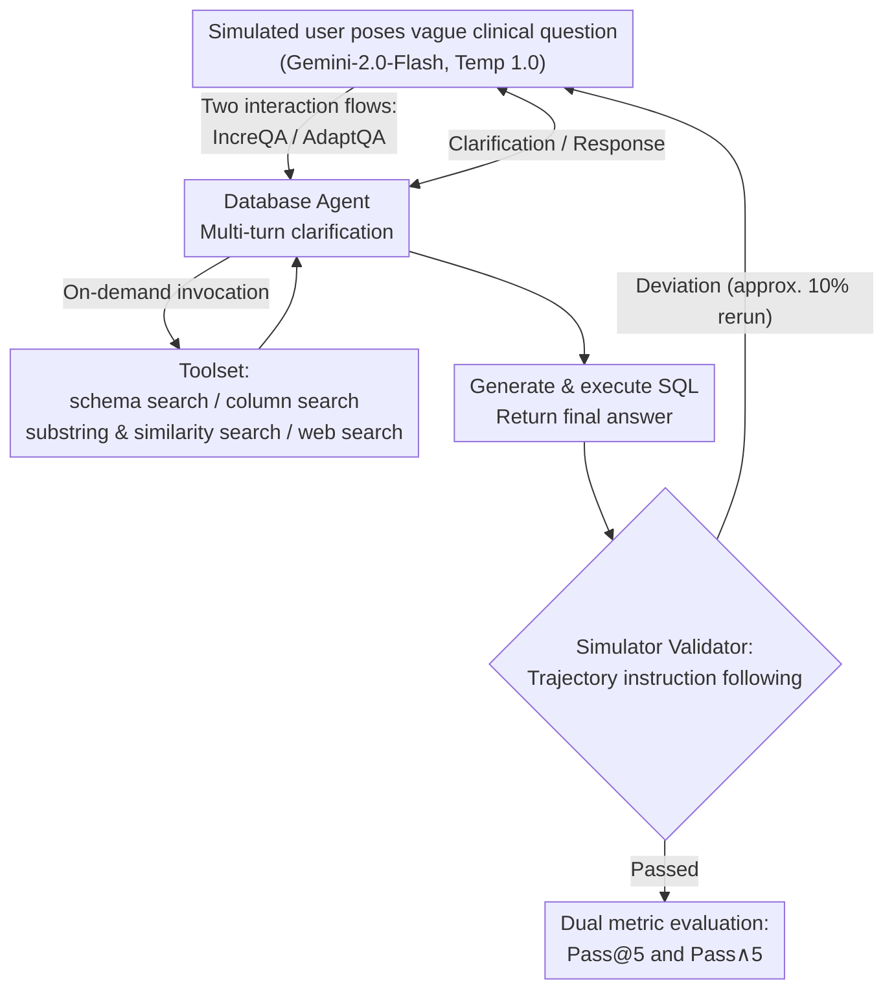

# From Conversation to Query Execution: Benchmarking User and Tool Interactions for EHR Database Agents

**Conference**: ICLR 2026  
**arXiv**: [2509.23415](https://arxiv.org/abs/2509.23415)  
**Code**: [GitHub](https://github.com/glee4810/EHR-ChatQA)  
**Area**: Medical NLP  
**Keywords**: EHR, Database Agent, Interactive QA, Query Ambiguity, Value Mismatch

## TL;DR
Proposes the EHR-ChatQA benchmark to evaluate end-to-end interaction workflows of database agents in EHR scenarios (clarifying vague queries → resolving term mismatches → generating SQL → returning answers). Findings reveal that while the strongest model (o4-mini) achieves over 90% Pass@5, its Pass∧5 (all successful) drops significantly (gap up to 60%), exposing robustness defects in safety-critical domains.

## Background & Motivation

**Background**: LLM Agents are increasingly utilized to interact with structured databases. Text-to-SQL benchmarks (Spider, BIRD, etc.) evaluate single-turn natural language to SQL translation but do not involve interactive scenarios.

**Limitations of Prior Work**: (1) **Query Ambiguity**: Clinical users often pose vague questions (e.g., "show me recent labs") lacking specific constraints; (2) **Value Mismatch**: Clinical terminology is often inconsistent with database entries (e.g., "Lopressor" vs. "metoprolol tartrate"); (3) Existing benchmarks do not assess the end-to-end capability of agents to clarify intent, invoke tools to resolve mismatches, and generate correct SQL across multi-turn interactions.

**Key Challenge**: Single-turn SQL generation is no longer sufficient—real clinical scenarios require agents to proactively ask questions, search for database values, and invoke external knowledge to bridge the gap between user intent and database content.

**Key Insight**: Building a complete interaction environment (LLM-simulated user + toolset + validator) to evaluate the full agent pipeline from conversation to query execution.

## Method

### Overall Architecture

EHR-ChatQA encapsulates the entire "dialogue to query execution" chain into a reproducible interaction environment, formalized as a Partially Observable Markov Decision Process (POMDP). The user's true intent is a hidden state that the agent approximates via "dialogue with user" and "tool invocation." A simulated LLM user poses a vague clinical question. The agent undergoes multi-turn dialogue to clarify intent, uses a toolset to retrieve schema and specific values, and finally generates and executes SQL. Post-dialogue, a simulator validator checks if the trajectory adheres to task instructions. Only validated trajectories undergo rule-based scoring, quantified by Pass@5 and Pass∧5 metrics. The benchmark is built on MIMIC-IV and eICU, containing 366 task instances covering query ambiguity and value mismatch. Notably, to prevent SOTA models from memorizing schemas, all table/column names are renamed (MIMIC-IV⋆ and eICU⋆), forcing agents to use schema exploration tools.

### Key Designs

**1. Two Interaction Flows: Stress-testing context retention and dynamic adaptation**

Clinical data access varies, so the benchmark designs two complementary trajectories. **IncreQA** (Incremental Query Refinement) requires the simulated user to gradually add constraints to the initial question, testing the agent's ability to maintain context. **AdaptQA** (Adaptive Query Refinement) lets the user change search directions based on intermediate results, testing the agent's ability to discard old hypotheses and re-plan. AdaptQA proves significantly more challenging.

**2. Toolset: Actions to bridge user terms and database content**

Focused on "resolving value mismatch," the toolset includes: schema exploration (`table_search`, `column_search`), value exploration (`value_substring_search`, `value_similarity_search` using `text-embedding-3-large`), external knowledge retrieval (`web_search`), and query execution (`sql_execute`). Decision-making regarding tool selection and frequency adds an interactive burden beyond standard Text-to-SQL.

**3. Simulated User & Simulator Validator: Controllable and realistic dialogue**

The simulated user is driven by Gemini-2.0-Flash (Temp 1.0) for diversity. To prevent deviation from instructions, a nested validation-reflection mechanism is used, complemented by an external simulator validator that reruns trajectories (approx. 10%) failing to stay faithful to task instructions.

**4. Dual Metric Evaluation: Separating capability from stability**

In safety-critical EHR scenarios, occasional accuracy is insufficient. Each task is run 5 times: $\text{Pass@5}$ (success in at least one of 5 runs) represents the optimistic upper bound of the agent's capability, while $\text{Pass}^{\wedge}5$ (success in all 5 runs) reflects stability. The gap $\text{Pass@5} - \text{Pass}^{\wedge}5$ quantifies instability. Gaps as high as 60% indicate behavior close to random for some tasks.

## Key Experimental Results

### Main Results

| Model | IncreQA Pass@5 | IncreQA Pass∧5 | AdaptQA Pass@5 | AdaptQA Pass∧5 |
|------|---------------|----------------|----------------|----------------|
| o4-mini | >90% | ~50% | 60-70% | ~20% |
| Gemini-2.5-Flash | >85% | ~45% | 55-65% | ~20% |

### Pass@5 vs Pass∧5 Gap

| Setting | Max Gap | Description |
|------|---------|------|
| IncreQA | >38% | Optimistic vs. Robust |
| AdaptQA | >36% | Higher instability |
| Overall Max | **~60%** | Highly unreliable |

### Key Findings
- High Pass@5 suggests capability, but low Pass∧5 highlights the inability to solve tasks consistently.
- AdaptQA is harder than IncreQA, requiring flexible strategy adjustments based on intermediate results.
- Value mismatch is the primary failure mode; agents struggle to map user terms to database entries reliably.
- LLM simulated users occasionally deviate, which the validator effectively identifies (~10% rate).

## Highlights & Insights
- **Pass@5 vs Pass∧5 Insight**: This dual evaluation reveals a critical safety issue—in EHR, "doing it right once" is not enough; "doing it right every time" is mandatory. A 60% gap implies near-random performance.
- **Importance of Value Mismatch**: Previous Text-to-SQL benchmarks ignored this, yet in EHR, failing to equate "Lopressor" with "metoprolol tartrate" results in catastrophic query failures.
- **Interaction Flow Design**: IncreQA and AdaptQA align with real-world clinical data exploration patterns (refinement vs. adjustment).

## Limitations & Future Work
- LLM-simulated users introduce uncontrollable randomness.
- Only two EHR databases are used; more diverse data sources may present different challenges.
- Predefined toolset; real-world scenarios may require more flexible tool calling.
- Evaluation is offline; online latency and user experience are not considered.

## Related Work & Insights
- **vs EHRSQL**: EHRSQL is single-turn Text-to-SQL; EHR-ChatQA is multi-turn and interactive.
- **vs Tau-Bench**: Tau-Bench measures general agents; EHR-ChatQA focuses on EHR-specific challenges.
- **vs MedAgentBench**: MedAgentBench uses clear instructions, whereas EHR-ChatQA requires interaction for clarification.

## Rating
- Novelty: ⭐⭐⭐⭐ First EHR QA benchmark combining user interaction, tool use, and value mismatch.
- Experimental Thoroughness: ⭐⭐⭐⭐ Evals of SOTA models, 5x repeats, and diagnostic analysis.
- Writing Quality: ⭐⭐⭐⭐ Clear POMDP formalization and task design.
- Value: ⭐⭐⭐⭐⭐ Direct implications for the safety and reliability of EHR agent deployment.

<!-- RELATED:START -->

## Related Papers

- [\[ACL 2025\] ReflecTool: Towards Reflection-Aware Tool-Augmented Clinical Agents](../../ACL2025/medical_nlp/reflectool_clinical_agent.md)
- [\[ICML 2026\] MedCase-Structured: A Text-to-FHIR Dataset for Benchmarking Diagnostic Reasoning in Clinically Realistic EHR Settings](../../ICML2026/medical_nlp/medcase-structured_a_text-to-fhir_dataset_for_benchmarking_diagnostic_reasoning_.md)
- [\[ACL 2026\] Measuring What Matters!! Assessing Therapeutic Principles in Mental-Health Conversation](../../ACL2026/medical_nlp/measuring_what_matters_assessing_therapeutic_principles_in_mental-health_convers.md)
- [\[ACL 2026\] Query Pipeline Optimization for Cancer Patient Question Answering Systems](../../ACL2026/medical_nlp/query_pipeline_optimization_for_cancer_patient_question_answering_systems.md)
- [\[ICLR 2026\] CounselBench: A Large-Scale Expert Evaluation and Adversarial Benchmarking of LLMs in Mental Health QA](counselbench_llm_mental_health_qa.md)

<!-- RELATED:END -->
