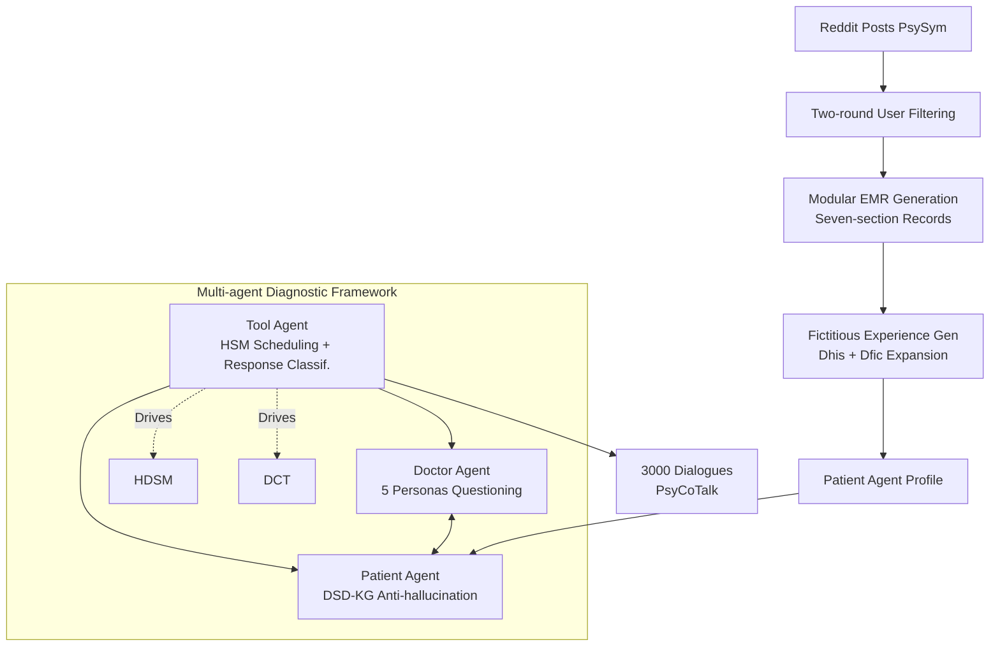

# From Medical Records to Diagnostic Dialogues: A Clinical-Grounded Approach and Dataset for Psychiatric Comorbidity

**Conference**: ICLR 2026  
**OpenReview**: [https://openreview.net/forum?id=sWWAZVHtke](https://openreview.net/forum?id=sWWAZVHtke)  
**Code**: To be confirmed  
**Area**: Medical NLP / Psychiatric Diagnostic Dialogue / Dataset  
**Keywords**: Psychiatric comorbidity, diagnostic dialogue generation, multi-agent, synthetic EMR, SCID-5, hierarchical state machine  

## TL;DR
This paper proposes a two-stage pipeline of "social media posts $\rightarrow$ structured electronic medical records (EMR) $\rightarrow$ multi-agent diagnostic dialogues." By adapting the SCID-5 clinical interview protocol into a Hierarchical Diagnostic State Machine (HDSM) and a Diagnostic Context Tree (DCT), the authors construct PsyCoTalk—the first large-scale psychiatric comorbidity diagnostic dialogue dataset (3,000 multi-turn dialogues)—validated by practicing psychiatrists for clinical authenticity.

## Background & Motivation
**Background**: Mental disorders contribute to over 125 million disability-adjusted life years globally. Psychiatric comorbidity (the co-occurrence of multiple disorders) is extremely common; a Dutch study showed that 67% of patients with depression have a concurrent anxiety disorder, and 75% have a lifetime history of it. Comorbidity significantly increases the complexity of diagnosis and treatment, requiring physicians to follow DSM-5 standards to perform step-by-step reasoning and multi-disorder screening within a single interview.

**Limitations of Prior Work**: Most existing mental health dialogue datasets focus on a single disorder (e.g., D4 covers only depression; PsyQA consists of Q&A pairs). Multi-disorder corpora (e.g., MDD-5k) treat each disease in isolation and lack fine-grained annotations, failing to capture symptom co-occurrence and evolution during diagnosis. Consequently, LLMs have not been systematically evaluated on "multi-disorder diagnosis," and reliable screening systems cannot be trained.

**Key Challenge**: Training a dialogue model capable of comorbidity diagnosis requires both **large-scale, realistic patient profiles** (profiles alone are too thin, and EMRs alone cannot capture dynamic interactions) and **structured, clinically compliant dialogue flows** to ensure authentic and valid reasoning. Both are essential, yet real clinical comorbidity data is extremely scarce.

**Goal**: Construct a large-scale comorbidity dialogue dataset that drives data modeling and enables systematic evaluation of diagnostic reasoning, while providing a reproducible, scalable, and clinically credible generation pipeline.

**Core Idea**: Use a two-stage "synthetic EMR + multi-agent dialogue" approach to decouple the data scarcity problem. First, **transform Reddit self-disclosure posts into 502 structured EMRs** using a seven-section clinical record template. Then, use EMRs as patient agent profiles in a **three-agent system (Doctor/Patient/Tool) that formalizes the SCID-5-RV protocol into a hierarchical state machine** to generate clinically compliant multi-turn diagnostic dialogues.

## Method

### Overall Architecture
The system is a two-stage pipeline: Stage 1 converts social media posts into structured EMRs (PsyCoProfile, 502 records). Stage 2 feeds each EMR into a three-agent diagnostic system (Doctor Agent, Patient Agent, Tool Agent). Under a symbolic SCID-5 interview framework, it generates multi-turn dialogues, resulting in 3,000 dialogues across six comorbidity combinations for PsyCoTalk. The dialogue flow is driven by the Tool Agent using a "LLM + rules" hybrid, ensuring both structural clinical process and natural language flexibility.

### Key Designs

**1. Modular Synthetic EMR Generation: Consolidating fragmented posts into clinical standards.** Working with psychiatrists, each record is defined by seven standard components (Demographics, Chief Complaint, History of Present Illness, Past History, Personal History, Family History, Preliminary Diagnosis). Generation uses **modular divide-and-conquer** rather than "one-step aggregation," as this improves information recall, classification accuracy, and reasoning coherence. Different strategies are used for different fields: binary symptom/life-event vectors for Chief Complaint and Present Illness; keyword classification followed by segmented LLM reasoning for histories; and keyword retrieval or rule-based extraction for demographics. The base data is PsySym (5,624 Reddit users); filtering ensures users have $ \ge 10$ symptom posts across $ \ge 20$ symptom types, with DSM-5 alignment checks to remove symptom-label inconsistencies.

**2. Fictitious Patient Experience Generation: Breaking the "one-record-one-dialogue" monotony.** EMRs provide facts but lack narrative richness. The authors propose personalized fictitious experiences: unlike random templates in MDD-5k, attributes match the EMR to avoid semantic conflict. For each EMR input $x_{\text{EMR}}$, an LLM generates a personal history dictionary $D_{\text{his}}$ and a fictitious experience dictionary $D_{\text{fic}}$, combined into a narrative $\tilde{e}$:

$$D_{\text{fic}}, D_{\text{his}} = \text{LLM}(\text{Prompt}(x_{\text{EMR}})), \quad \tilde{e} = \text{LLM}(\text{Prompt}(h, e)), \quad h \in D_{\text{his}},\ e \in D_{\text{fic}}$$

This allows each EMR to derive up to 50 unique fictitious experiences, increasing dialogue diversity while maintaining diagnostic validity.

**3. HDSM (Hierarchical Diagnostic State Machine): Turning SCID-5 into an executable diagnostic graph.** This is the core of protocol formalization. HDSM follows SCID-5-RV, assigning a sub-state machine to each target disorder (MDD/AD/BD/ADHD). It consists of three levels: High-Level States (HLS, global modules), Intermediate-Level States (ILS, symptom groups), and Base-Level States (BLS, individual question terminal nodes). Engineering details include: (i) **Natural language cues**—only the first question in a group uses precise time phrases (e.g., "past two weeks"), while subsequent questions use "recently" to avoid redundancy; (ii) **Binary symptom scale + Flow control**—the SCID-5 four-point scale is simplified to "present/absent." This ensures stability and auditability, avoiding contradictions often produced by LLMs maintaining fine-grained scores.

**4. DCT (Diagnostic Context Tree) + Multi-agent Execution: Background completion and hallucination suppression.** DCT is a tree-based semantic controller running parallel to HDSM with branches for Family History, Personal History, and Experience Inquiry. The three agents have clear roles: **Patient Agent** responds based on EMR + fictitious experiences; to suppress "yea-saying" bias, a Disease-Symptom Description Knowledge Graph (DSD-KG) is used to verify symptoms. **Doctor Agent** features five personas (varying in expertise, empathy, and speed). **Tool Agent** acts as the central controller, managing tree traversal, response classification, and state transitions.

## Key Experimental Results

### Dataset Comparison (Structural Fidelity)

| Dataset | Avg. words/Doctor | Avg. words/Patient | Avg. rounds | Disorders | Comorbidity | Dial. Count |
|---|---|---|---|---|---|---|
| Real-World Dial | 28.3 | 35.8 | – | – | ✗ | – |
| D4 | 20.4 | 14.9 | 21.6 | Depression | ✗ | 1,339 |
| MDD-5k | 91.1 | 162.8 | 26.8 | >25 | ✗ | 5,000 |
| **PsyCoTalk** | **34.0** | **43.5** | **45.9** | 4 | **✓** | 3,000 |

PsyCoTalk is the only dataset supporting comorbidity, with rounds nearly double other corpora. Its utterance lengths are closest to real-world clinical data.

### Diagnostic Accuracy (Exact-match across five disorders)

| Model/System | Subset Accuracy |
|---|---|
| Qwen2.5-72B Zero-shot | 0.22 |
| **Ours (HDSM System)** | **0.31** (McNemar p=7e-6) |
| GPT-4o-mini / Deepseek-v3 | <0.1 |
| Qwen3-32B | <0.02 |
| Qwen3-8B | <0.04 |

Per-label F1: MDD 0.92, AD 0.81, ADHD 0.64, BD 0.40—consistent with clinical difficulty trends.

### Expert Evaluation (6-dimension, 10-point scale) + AB Truthfulness Test

| Prof. | Comm.(i) | Comm.(ii) | Flu.(i) | Flu.(ii) | Sim. |
|---|---|---|---|---|---|
| 7.72 | 8.14 | 8.24 | 7.42 | 6.79 | 6.67 |

In AB Truthfulness tests (judging "Real vs. AI"), PsyCoTalk (5/10) ranked second only to Real-World data (6/10), while MDD-5k (1/10) scored lowest due to templated repetitions.

### Key Findings
- Modular EMR generation outperforms one-step aggregation in information recall and diagnostic coherence.
- Binary symptom scales are more stable and auditable than four-point scales, avoiding diagnostic infinite loops in LLMs.
- The DSD-KG knowledge graph effectively suppresses the "yea-saying" hallucination bias in the Patient Agent.
- HDSM guidance improves diagnostic accuracy from 0.22 to 0.31, significantly exceeding zero-shot performance of general LLMs.

## Highlights & Insights
- **Protocol Symbolic Paradigm**: Deconstructing SCID-5-RV into HDSM+DCT allows LLM diagnostic flows to be both controllable and clinically compliant, an elegant way to inject expert knowledge.
- **Addressing Comorbidity**: While previous works treat diseases in isolation, this work captures symptom co-occurrence and multi-disorder screening, filling a significant research gap.
- **Pragmatic Binary Trade-off**: The authors prioritize auditability over high-fidelity scales, ensuring stability while keeping severity information within state transition conditions.
- **Systemic Realism**: The combination of DSD-KG for anti-hallucination and fictitious experiences for diversity demonstrates a systematic approach to synthetic data quality.

## Limitations & Future Work
- **Narrow Disorder Coverage**: Limited to four common disorders due to the scarcity of reliable clinical comorbidity data for rare diseases.
- **Language Mono-linguality**: The primary dataset is Chinese; English generation was only tested on a small scale.
- **Data Source Bias**: Reddit posts may introduce demographic skews (e.g., age peaks at 20-24), although the EMR template and SCID-5 framework are culturally transferable.
- **Downstream Impact**: The gain in training LLMs for diagnostic reasoning using this dataset remains to be fully quantified.

## Related Work & Insights
- **Single-disorder Corpora**: D4 (Depression), PsyQA/SMILECHAT (Q&A), EFAQA (Counseling).
- **Multi-disorder Corpora**: CED-BS (Bipolar+Schizophrenia), MDD-5k (Large scale, but treats disorders in isolation).
- **LLM-driven Simulation**: Patient-$\Psi$ (CBT simulation), CPsyCoun (Notes to dialogue), AMC framework (Three-agent + memory). Ours differs by being the first to align with authoritative interview standards (SCID-5) via HDSM+DCT to generate comorbidity-focused dialogues.

## Rating
- **Novelty**: ⭐⭐⭐⭐ — First large-scale psychiatric comorbidity dataset; original HDSM+DCT symbolic design.
- **Experimental Thoroughness**: ⭐⭐⭐ — Solid structural comparisons and expert evaluations; however, downstream training gains are not yet quantified.
- **Writing Quality**: ⭐⭐⭐⭐ — Clear motivation and highly transparent documentation of engineering trade-offs.
- **Value**: ⭐⭐⭐⭐ — Fills a critical gap in comorbidity data and provides a scalable clinical generation pipeline.

<!-- RELATED:START -->

## Related Papers

- [\[ACL 2026\] PrinciplismQA: A Philosophy-Grounded Approach to Assessing LLM-Human Clinical Medical Ethics Alignment](../../ACL2026/medical_nlp/principlismqa_a_philosophy-grounded_approach_to_assessing_llm-human_clinical_med.md)
- [\[ACL 2026\] Region-Grounded Report Generation for 3D Medical Imaging: A Fine-Grained Dataset and Graph-Enhanced Framework](../../ACL2026/medical_nlp/region-grounded_report_generation_for_3d_medical_imaging_a_fine-grained_dataset_.md)
- [\[ICML 2026\] A Machine-Learned Comorbidity Index](../../ICML2026/medical_nlp/a_machine-learned_comorbidity_index.md)
- [\[ICLR 2026\] MedAraBench: Large-scale Arabic Medical Question Answering Dataset and Benchmark](medarabench_large-scale_arabic_medical_question_answering_dataset_and_benchmark.md)
- [\[ACL 2026\] Dr. Assistant: Enhancing Clinical Diagnostic Inquiry via Structured Diagnostic Reasoning Data and Reinforcement Learning](../../ACL2026/medical_nlp/dr_assistant_enhancing_clinical_diagnostic_inquiry_via_structured_diagnostic_rea.md)

<!-- RELATED:END -->
## Related Papers

- [\[ACL 2026\] PrinciplismQA: A Philosophy-Grounded Approach to Assessing LLM-Human Clinical Medical Ethics Alignment](../../ACL2026/medical_nlp/principlismqa_a_philosophy-grounded_approach_to_assessing_llm-human_clinical_med.md)
- [\[ICML 2026\] A Machine-Learned Comorbidity Index](../../ICML2026/medical_nlp/a_machine-learned_comorbidity_index.md)
- [\[ICLR 2026\] MedAraBench: Large-scale Arabic Medical Question Answering Dataset and Benchmark](medarabench_large-scale_arabic_medical_question_answering_dataset_and_benchmark.md)
- [\[ACL 2026\] Region-Grounded Report Generation for 3D Medical Imaging: A Fine-Grained Dataset and Graph-Enhanced Framework](../../ACL2026/medical_nlp/region-grounded_report_generation_for_3d_medical_imaging_a_fine-grained_dataset_.md)
- [\[ACL 2026\] Dr. Assistant: Enhancing Clinical Diagnostic Inquiry via Structured Diagnostic Reasoning Data and Reinforcement Learning](../../ACL2026/medical_nlp/dr_assistant_enhancing_clinical_diagnostic_inquiry_via_structured_diagnostic_rea.md)

<!-- RELATED:END -->
